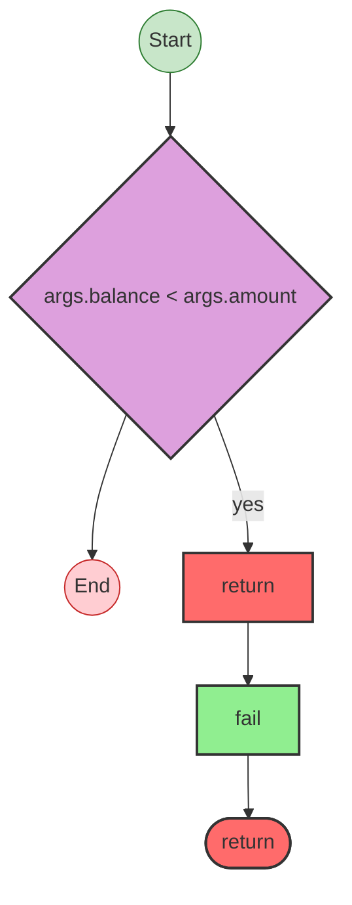

# Effect Analysis: convert-currency.ts

## Metadata

- **File**: `/Users/jreehal/dev/node-examples/effect-analyzer/apps/docs/samples/observability-transfer/convert-currency.ts`
- **Analyzed**: 2026-04-01T19:18:07.995Z
- **Source Type**: generator

## Effect Flow



## Statistics

- **Total Effects**: 1

## Explanation

```
convertCurrency (generator):
  1. If args.balance < args.amount:
    Returns:
      Calls fail — constructor

  Error paths: InsufficientFundsError
  Concurrency: sequential (no parallelism)
```

## Error Types

- `InsufficientFundsError`
