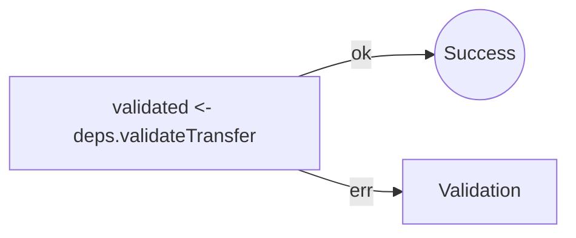
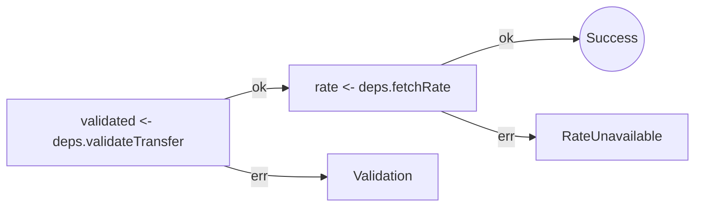
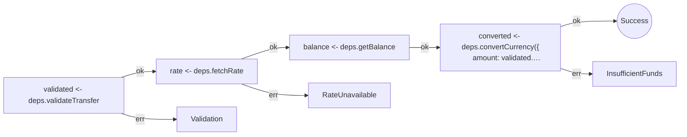
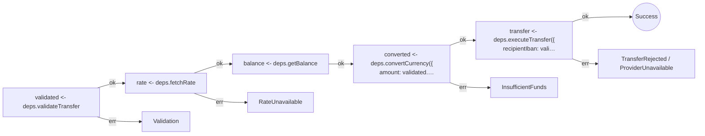
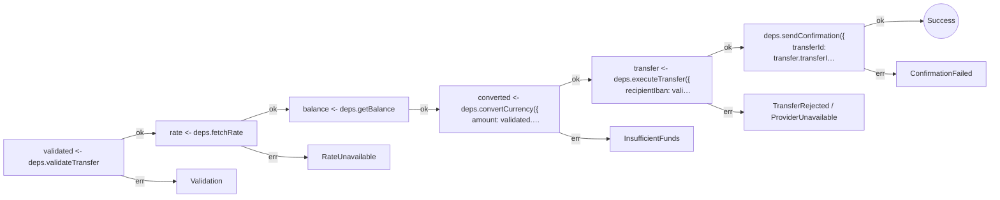

# Send Money Workflow: Railway Diagram Evolution

Each step adds one more operation to the pipeline.
The railway diagram shows the happy path (ok) and every error branch.

Generated by the local `effect-analyzer` source in this repository. Static analysis only, no code executed.

## Step 1: Validate input



<details><summary>Analysis</summary>

```
createSendMoneyWorkflow (generator):
  1. validated = Effect.pipe — service-call

  Services required: Effect
  Error paths: ValidationError
  Concurrency: sequential (no parallelism)
```

```json
[
  {
    "program": "createSendMoneyWorkflow",
    "stats": {
      "totalEffects": 1,
      "parallelCount": 0,
      "raceCount": 0,
      "errorHandlerCount": 0,
      "retryCount": 0,
      "timeoutCount": 0,
      "resourceCount": 0,
      "loopCount": 0,
      "conditionalCount": 0,
      "layerCount": 0,
      "interruptionCount": 0,
      "unknownCount": 0,
      "decisionCount": 0,
      "switchCount": 0,
      "tryCatchCount": 0,
      "terminalCount": 0,
      "opaqueCount": 0
    }
  }
]
```

</details>

## Step 2: + Fetch exchange rate



<details><summary>Analysis</summary>

```
createSendMoneyWorkflow (generator):
  1. validated = Effect.pipe — service-call
  2. rate = Effect.pipe — service-call

  Services required: Effect
  Error paths: RateUnavailableError, ValidationError
  Concurrency: sequential (no parallelism)
```

```json
[
  {
    "program": "createSendMoneyWorkflow",
    "stats": {
      "totalEffects": 2,
      "parallelCount": 0,
      "raceCount": 0,
      "errorHandlerCount": 0,
      "retryCount": 0,
      "timeoutCount": 0,
      "resourceCount": 0,
      "loopCount": 0,
      "conditionalCount": 0,
      "layerCount": 0,
      "interruptionCount": 0,
      "unknownCount": 0,
      "decisionCount": 0,
      "switchCount": 0,
      "tryCatchCount": 0,
      "terminalCount": 0,
      "opaqueCount": 0
    }
  }
]
```

</details>

## Step 3: + Check balance & convert



<details><summary>Analysis</summary>

```
createSendMoneyWorkflow (generator):
  1. validated = Effect.pipe — service-call
  2. rate = Effect.pipe — service-call
  3. balance = Effect.pipe — service-call
  4. converted = Effect.pipe — service-call

  Services required: Effect
  Error paths: InsufficientFundsError, RateUnavailableError, ValidationError
  Concurrency: sequential (no parallelism)
```

```json
[
  {
    "program": "createSendMoneyWorkflow",
    "stats": {
      "totalEffects": 4,
      "parallelCount": 0,
      "raceCount": 0,
      "errorHandlerCount": 0,
      "retryCount": 0,
      "timeoutCount": 0,
      "resourceCount": 0,
      "loopCount": 0,
      "conditionalCount": 0,
      "layerCount": 0,
      "interruptionCount": 0,
      "unknownCount": 0,
      "decisionCount": 0,
      "switchCount": 0,
      "tryCatchCount": 0,
      "terminalCount": 0,
      "opaqueCount": 0
    }
  }
]
```

</details>

## Step 4: + Execute transfer



<details><summary>Analysis</summary>

```
createSendMoneyWorkflow (generator):
  1. validated = Effect.pipe — service-call
  2. rate = Effect.pipe — service-call
  3. balance = Effect.pipe — service-call
  4. converted = Effect.pipe — service-call
  5. transfer = Effect.pipe — service-call

  Services required: Effect
  Error paths: InsufficientFundsError, ProviderUnavailableError, RateUnavailableError, TransferRejectedError, ValidationError
  Concurrency: sequential (no parallelism)
```

```json
[
  {
    "program": "createSendMoneyWorkflow",
    "stats": {
      "totalEffects": 5,
      "parallelCount": 0,
      "raceCount": 0,
      "errorHandlerCount": 0,
      "retryCount": 0,
      "timeoutCount": 0,
      "resourceCount": 0,
      "loopCount": 0,
      "conditionalCount": 0,
      "layerCount": 0,
      "interruptionCount": 0,
      "unknownCount": 0,
      "decisionCount": 0,
      "switchCount": 0,
      "tryCatchCount": 0,
      "terminalCount": 0,
      "opaqueCount": 0
    }
  }
]
```

</details>

## Step 5: + Send confirmation (complete)



<details><summary>Analysis</summary>

```
createSendMoneyWorkflow (generator):
  1. validated = Effect.pipe — service-call
  2. rate = Effect.pipe — service-call
  3. balance = Effect.pipe — service-call
  4. converted = Effect.pipe — service-call
  5. transfer = Effect.pipe — service-call
  6. Calls Effect.pipe — service-call

  Services required: Effect
  Error paths: ConfirmationFailedError, InsufficientFundsError, ProviderUnavailableError, RateUnavailableError, TransferRejectedError, ValidationError
  Concurrency: sequential (no parallelism)
```

```json
[
  {
    "program": "createSendMoneyWorkflow",
    "stats": {
      "totalEffects": 6,
      "parallelCount": 0,
      "raceCount": 0,
      "errorHandlerCount": 0,
      "retryCount": 0,
      "timeoutCount": 0,
      "resourceCount": 0,
      "loopCount": 0,
      "conditionalCount": 0,
      "layerCount": 0,
      "interruptionCount": 0,
      "unknownCount": 0,
      "decisionCount": 0,
      "switchCount": 0,
      "tryCatchCount": 0,
      "terminalCount": 0,
      "opaqueCount": 0
    }
  }
]
```

</details>

