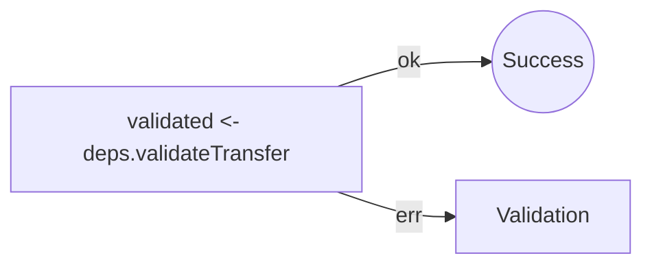
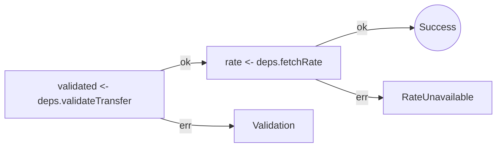
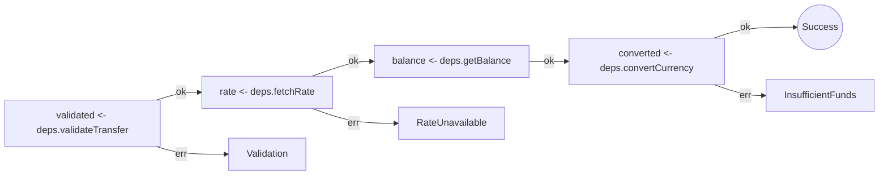
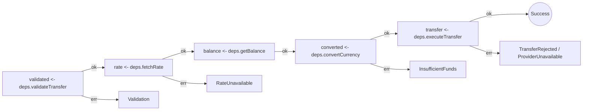
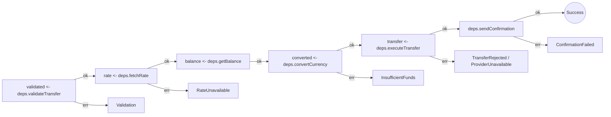

# Send Money Workflow: Railway Diagram Evolution

Each step adds one more operation to the pipeline.
The railway diagram shows the happy path (ok) and every error branch.

Generated by the local `effect-analyzer` source in this repository. Static analysis only, no code executed.

## Step 1: Validate input


```mermaid
flowchart LR
  A["validated #lt;- deps.validateTransfer"] -->|ok| Done((Success))
  A -->|err| AE["Validation"]
```

<details><summary>Analysis</summary>

```
createSendMoneyWorkflow (generator):
  1. Yields validated <- deps.validateTransfer

  Error paths: ValidationError
  Concurrency: sequential (no parallelism)
```

```json
[
  {
    "program": "createSendMoneyWorkflow",
    "stats": {
      "totalEffects": 3,
      "parallelCount": 0,
      "raceCount": 0,
      "errorHandlerCount": 0,
      "retryCount": 0,
      "timeoutCount": 0,
      "resourceCount": 0,
      "loopCount": 0,
      "conditionalCount": 0,
      "layerCount": 0,
      "interruptionCount": 0,
      "unknownCount": 0,
      "decisionCount": 0,
      "switchCount": 0,
      "tryCatchCount": 0,
      "terminalCount": 0,
      "opaqueCount": 0
    }
  }
]
```

</details>

## Step 2: + Fetch exchange rate


```mermaid
flowchart LR
  A["validated #lt;- deps.validateTransfer"] -->|ok| B["rate #lt;- deps.fetchRate"]
  B -->|ok| Done((Success))
  A -->|err| AE["Validation"]
  B -->|err| BE["RateUnavailable"]
```

<details><summary>Analysis</summary>

```
createSendMoneyWorkflow (generator):
  1. Yields validated <- deps.validateTransfer
  2. Yields rate <- deps.fetchRate

  Error paths: RateUnavailableError, ValidationError
  Concurrency: sequential (no parallelism)
```

```json
[
  {
    "program": "createSendMoneyWorkflow",
    "stats": {
      "totalEffects": 5,
      "parallelCount": 0,
      "raceCount": 0,
      "errorHandlerCount": 0,
      "retryCount": 0,
      "timeoutCount": 0,
      "resourceCount": 0,
      "loopCount": 0,
      "conditionalCount": 0,
      "layerCount": 0,
      "interruptionCount": 0,
      "unknownCount": 0,
      "decisionCount": 0,
      "switchCount": 0,
      "tryCatchCount": 0,
      "terminalCount": 0,
      "opaqueCount": 0
    }
  }
]
```

</details>

## Step 3: + Check balance & convert


```mermaid
flowchart LR
  A["validated #lt;- deps.validateTransfer"] -->|ok| B["rate #lt;- deps.fetchRate"]
  B -->|ok| C["balance #lt;- deps.getBalance"]
  C -->|ok| D["converted #lt;- deps.convertCurrency"]
  D -->|ok| Done((Success))
  A -->|err| AE["Validation"]
  B -->|err| BE["RateUnavailable"]
  D -->|err| DE["InsufficientFunds"]
```

<details><summary>Analysis</summary>

```
createSendMoneyWorkflow (generator):
  1. Yields validated <- deps.validateTransfer
  2. Yields rate <- deps.fetchRate
  3. Yields balance <- deps.getBalance
  4. Yields converted <- deps.convertCurrency

  Error paths: InsufficientFundsError, RateUnavailableError, ValidationError
  Concurrency: sequential (no parallelism)
```

```json
[
  {
    "program": "createSendMoneyWorkflow",
    "stats": {
      "totalEffects": 9,
      "parallelCount": 0,
      "raceCount": 0,
      "errorHandlerCount": 0,
      "retryCount": 0,
      "timeoutCount": 0,
      "resourceCount": 0,
      "loopCount": 0,
      "conditionalCount": 0,
      "layerCount": 0,
      "interruptionCount": 0,
      "unknownCount": 0,
      "decisionCount": 0,
      "switchCount": 0,
      "tryCatchCount": 0,
      "terminalCount": 0,
      "opaqueCount": 0
    }
  }
]
```

</details>

## Step 4: + Execute transfer


```mermaid
flowchart LR
  A["validated #lt;- deps.validateTransfer"] -->|ok| B["rate #lt;- deps.fetchRate"]
  B -->|ok| C["balance #lt;- deps.getBalance"]
  C -->|ok| D["converted #lt;- deps.convertCurrency"]
  D -->|ok| E["transfer #lt;- deps.executeTransfer"]
  E -->|ok| Done((Success))
  A -->|err| AE["Validation"]
  B -->|err| BE["RateUnavailable"]
  D -->|err| DE["InsufficientFunds"]
  E -->|err| EE["TransferRejected / ProviderUnavailable"]
```

<details><summary>Analysis</summary>

```
createSendMoneyWorkflow (generator):
  1. Yields validated <- deps.validateTransfer
  2. Yields rate <- deps.fetchRate
  3. Yields balance <- deps.getBalance
  4. Yields converted <- deps.convertCurrency
  5. Yields transfer <- deps.executeTransfer

  Error paths: InsufficientFundsError, ProviderUnavailableError, RateUnavailableError, TransferRejectedError, ValidationError
  Concurrency: sequential (no parallelism)
```

```json
[
  {
    "program": "createSendMoneyWorkflow",
    "stats": {
      "totalEffects": 11,
      "parallelCount": 0,
      "raceCount": 0,
      "errorHandlerCount": 0,
      "retryCount": 0,
      "timeoutCount": 0,
      "resourceCount": 0,
      "loopCount": 0,
      "conditionalCount": 0,
      "layerCount": 0,
      "interruptionCount": 0,
      "unknownCount": 0,
      "decisionCount": 0,
      "switchCount": 0,
      "tryCatchCount": 0,
      "terminalCount": 0,
      "opaqueCount": 0
    }
  }
]
```

</details>

## Step 5: + Send confirmation (complete)


```mermaid
flowchart LR
  A["validated #lt;- deps.validateTransfer"] -->|ok| B["rate #lt;- deps.fetchRate"]
  B -->|ok| C["balance #lt;- deps.getBalance"]
  C -->|ok| D["converted #lt;- deps.convertCurrency"]
  D -->|ok| E["transfer #lt;- deps.executeTransfer"]
  E -->|ok| F["deps.sendConfirmation"]
  F -->|ok| Done((Success))
  A -->|err| AE["Validation"]
  B -->|err| BE["RateUnavailable"]
  D -->|err| DE["InsufficientFunds"]
  E -->|err| EE["TransferRejected / ProviderUnavailable"]
  F -->|err| FE["ConfirmationFailed"]
```

<details><summary>Analysis</summary>

```
createSendMoneyWorkflow (generator):
  1. Yields validated <- deps.validateTransfer
  2. Yields rate <- deps.fetchRate
  3. Yields balance <- deps.getBalance
  4. Yields converted <- deps.convertCurrency
  5. Yields transfer <- deps.executeTransfer
  6. Calls deps.sendConfirmation

  Error paths: ConfirmationFailedError, InsufficientFundsError, ProviderUnavailableError, RateUnavailableError, TransferRejectedError, ValidationError
  Concurrency: sequential (no parallelism)
```

```json
[
  {
    "program": "createSendMoneyWorkflow",
    "stats": {
      "totalEffects": 13,
      "parallelCount": 0,
      "raceCount": 0,
      "errorHandlerCount": 0,
      "retryCount": 0,
      "timeoutCount": 0,
      "resourceCount": 0,
      "loopCount": 0,
      "conditionalCount": 0,
      "layerCount": 0,
      "interruptionCount": 0,
      "unknownCount": 0,
      "decisionCount": 0,
      "switchCount": 0,
      "tryCatchCount": 0,
      "terminalCount": 0,
      "opaqueCount": 0
    }
  }
]
```

</details>

