# Effect Analysis: execute-transfer.ts

## Metadata

- **File**: `/Users/jreehal/dev/node-examples/effect-analyzer/apps/docs/samples/observability-transfer/execute-transfer.ts`
- **Analyzed**: 2026-04-01T19:13:22.134Z
- **Source Type**: direct

## Effect Flow

```mermaid
flowchart TB

  %% Program: executeTransfer

  start((Start))
  end_node((End))

  n1["deps.postTransfer <( transferId: string; ), TransferRejectedError &#124; ProviderUnavailableError, never> (side-effect)"]

  %% Edges
  start --> n1
  n1 --> end_node

  %% Styles
  classDef startStyle fill:#c8e6c9,stroke:#2e7d32
  classDef endStyle fill:#ffcdd2,stroke:#c62828
  classDef effectStyle fill:#90EE90,stroke:#333,stroke-width:2px
  class start startStyle
  class end_node endStyle
  class n1 effectStyle
```



## Statistics

- **Total Effects**: 1

## Explanation

```
executeTransfer (direct):
  1. Calls deps.postTransfer

  Error paths: ProviderUnavailableError, TransferRejectedError
  Concurrency: sequential (no parallelism)
```

## Error Types

- `ProviderUnavailableError`
- `TransferRejectedError`
