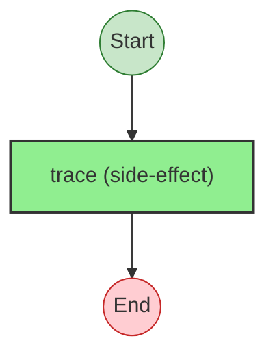

# Effect Analysis: external-client.ts

## Program 1: fetchRatesFromApi

## Metadata

- **File**: `/Users/jreehal/dev/node-examples/effect-analyzer/apps/docs/samples/observability-transfer/external-client.ts`
- **Analyzed**: 2026-04-01T19:18:08.635Z
- **Source Type**: direct

## Effect Flow



## Statistics

- **Total Effects**: 1

## Explanation

```
fetchRatesFromApi (direct):
  1. Calls trace

  Concurrency: sequential (no parallelism)
```

## Program 2: postTransferToProvider

## Metadata

- **File**: `/Users/jreehal/dev/node-examples/effect-analyzer/apps/docs/samples/observability-transfer/external-client.ts`
- **Analyzed**: 2026-04-01T19:18:08.635Z
- **Source Type**: direct

## Effect Flow


## Statistics

- **Total Effects**: 1

## Explanation

```
postTransferToProvider (direct):
  1. Calls trace

  Concurrency: sequential (no parallelism)
```

## Program 3: sendNotification

## Metadata

- **File**: `/Users/jreehal/dev/node-examples/effect-analyzer/apps/docs/samples/observability-transfer/external-client.ts`
- **Analyzed**: 2026-04-01T19:18:08.636Z
- **Source Type**: direct

## Effect Flow


## Statistics

- **Total Effects**: 1

## Explanation

```
sendNotification (direct):
  1. Calls trace

  Concurrency: sequential (no parallelism)
```
