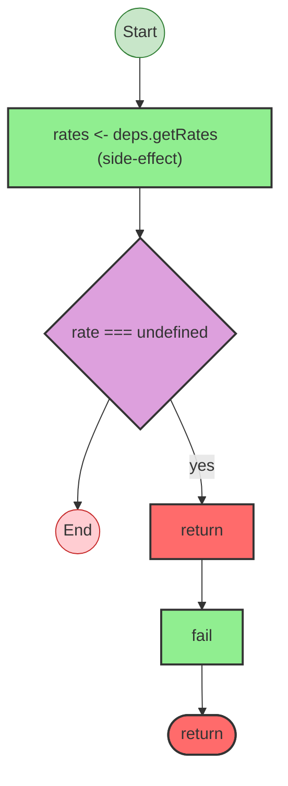

# Effect Analysis: fetch-rate.ts

## Metadata

- **File**: `/Users/jreehal/dev/node-examples/effect-analyzer/apps/docs/samples/observability-transfer/fetch-rate.ts`
- **Analyzed**: 2026-04-01T19:18:08.954Z
- **Source Type**: generator

## Effect Flow



## Statistics

- **Total Effects**: 2

## Explanation

```
fetchRate (generator):
  1. Yields rates <- deps.getRates
  2. If rate === undefined:
    Returns:
      Calls fail — constructor

  Error paths: RateUnavailableError
  Concurrency: sequential (no parallelism)
```

## Error Types

- `RateUnavailableError`
