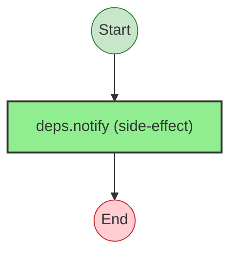

# Effect Analysis: send-confirmation.ts

## Metadata

- **File**: `/Users/jreehal/dev/node-examples/effect-analyzer/apps/docs/samples/observability-transfer/send-confirmation.ts`
- **Analyzed**: 2026-04-01T19:13:23.055Z
- **Source Type**: direct

## Effect Flow



## Statistics

- **Total Effects**: 1

## Explanation

```
sendConfirmation (direct):
  1. Calls deps.notify

  Error paths: ConfirmationFailedError
  Concurrency: sequential (no parallelism)
```

## Error Types

- `ConfirmationFailedError`
