# Effect Analysis: send-money-workflow.ts

## Metadata

- **File**: `/Users/jreehal/dev/node-examples/effect-analyzer/apps/docs/samples/observability-transfer/send-money-workflow.ts`
- **Analyzed**: 2026-04-01T19:13:23.423Z
- **Source Type**: generator

## Effect Flow

```mermaid
flowchart TB

  %% Program: createSendMoneyWorkflow

  start((Start))
  end_node((End))

  n2["validated <- deps.validateTransfer <ValidatedTransfer, ValidationError, never> (service-call)"]
  n3["rate <- deps       .fetchRate(( from: validated.fromCurrency… <ExchangeRate, RateUnavailableError, never> (service-call)"]
  n4["balance <- deps.getBalance <number, never, never> (service-call)"]
  n5["converted <- deps       .convertCurrency((         amount: v… <ConvertedAmount, InsufficientFundsError, never> (service-call)"]
  n6["transfer <- deps       .executeTransfer((         recipientI… <( transferId: string; ), TransferRejectedError &#124; ProviderUnavailableError, never> (service-call)"]
  n7["deps       .sendConfirmation((         transferId: transfer.… <void, ConfirmationFailedError, never> (service-call)"]

  %% Edges
  n2 --> n3
  n3 --> n4
  n4 --> n5
  n5 --> n6
  n6 --> n7
  start --> n2
  n7 --> end_node

  %% Styles
  classDef startStyle fill:#c8e6c9,stroke:#2e7d32
  classDef endStyle fill:#ffcdd2,stroke:#c62828
  classDef effectStyle fill:#90EE90,stroke:#333,stroke-width:2px
  class start startStyle
  class end_node endStyle
  class n2 effectStyle
  class n3 effectStyle
  class n4 effectStyle
  class n5 effectStyle
  class n6 effectStyle
  class n7 effectStyle
```



## Statistics

- **Total Effects**: 6

## Explanation

```
createSendMoneyWorkflow (generator):
  1. validated = Effect.pipe — service-call
  2. rate = Effect.pipe — service-call
  3. balance = Effect.pipe — service-call
  4. converted = Effect.pipe — service-call
  5. transfer = Effect.pipe — service-call
  6. Calls Effect.pipe — service-call

  Services required: Effect
  Error paths: ConfirmationFailedError, InsufficientFundsError, ProviderUnavailableError, RateUnavailableError, TransferRejectedError, ValidationError
  Concurrency: sequential (no parallelism)
```

## Error Types

- `ConfirmationFailedError`
- `InsufficientFundsError`
- `ProviderUnavailableError`
- `RateUnavailableError`
- `TransferRejectedError`
- `ValidationError`
