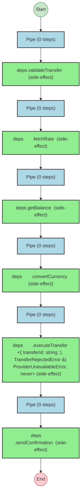

# Effect Analysis: send-money-workflow.ts

## Metadata

- **File**: `/Users/jreehal/dev/node-examples/effect-analyzer/apps/docs/samples/observability-transfer/send-money-workflow.ts`
- **Analyzed**: 2026-08-26T06:24:25.559Z
- **Source Type**: generator

## Effect Flow


```mermaid
flowchart TB

  %% Program: createSendMoneyWorkflow

  start((Start))
  end_node((End))

  n2["Pipe (0 steps)"]
  n3["deps.validateTransfer <never, ValidationError, never> (side-effect)"]
  n4["Pipe (0 steps)"]
  n5["deps       .fetchRate <ExchangeRate, RateUnavailableError, never> (side-effect)"]
  n6["Pipe (0 steps)"]
  n7["deps.getBalance <number, never, never> (side-effect)"]
  n8["Pipe (0 steps)"]
  n9["deps       .convertCurrency <ConvertedAmount, InsufficientFundsError, never> (side-effect)"]
  n10["Pipe (0 steps)"]
  n11["deps       .executeTransfer <( transferId: string; ), TransferRejectedError &#124; ProviderUnavailableError, never> (side-effect)"]
  n12["Pipe (0 steps)"]
  n13["deps       .sendConfirmation <void, ConfirmationFailedError, never> (side-effect)"]

  %% Edges
  n2 --> n3
  n4 --> n5
  n3 --> n4
  n6 --> n7
  n5 --> n6
  n8 --> n9
  n7 --> n8
  n10 --> n11
  n9 --> n10
  n12 --> n13
  n11 --> n12
  start --> n2
  n13 --> end_node

  %% Styles
  classDef startStyle fill:#c8e6c9,stroke:#2e7d32
  classDef endStyle fill:#ffcdd2,stroke:#c62828
  classDef effectStyle fill:#90EE90,stroke:#333,stroke-width:2px
  classDef pipeStyle fill:#ADD8E6,stroke:#333,stroke-width:2px
  class start startStyle
  class end_node endStyle
  class n2 pipeStyle
  class n3 effectStyle
  class n4 pipeStyle
  class n5 effectStyle
  class n6 pipeStyle
  class n7 effectStyle
  class n8 pipeStyle
  class n9 effectStyle
  class n10 pipeStyle
  class n11 effectStyle
  class n12 pipeStyle
  class n13 effectStyle
```

## Statistics

- **Total Effects**: 13

## Explanation

```
createSendMoneyWorkflow (generator):
  1. validated = Pipes deps.validateTransfer through:
    Calls deps.validateTransfer — collection
  2. rate = Pipes deps
      .fetchRate through:
    Calls deps
      .fetchRate
  3. balance = Pipes deps.getBalance through:
    Calls deps.getBalance
  4. converted = Pipes deps
      .convertCurrency through:
    Calls deps
      .convertCurrency
  5. transfer = Pipes deps
      .executeTransfer through:
    Calls deps
      .executeTransfer
  6. Pipes deps
      .sendConfirmation through:
    Calls deps
      .sendConfirmation

  Error paths: ConfirmationFailedError, InsufficientFundsError, ProviderUnavailableError, RateUnavailableError, TransferRejectedError, ValidationError
  Concurrency: sequential (no parallelism)
```

## Error Types

- `ConfirmationFailedError`
- `InsufficientFundsError`
- `ProviderUnavailableError`
- `RateUnavailableError`
- `TransferRejectedError`
- `ValidationError`
