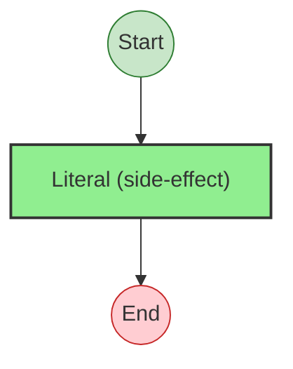
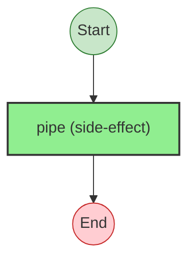
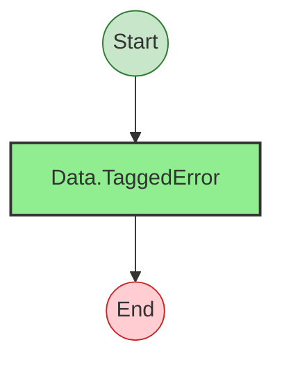

# Effect Analysis: types.ts

## Program 1: CurrencySchema

## Metadata

- **File**: `/Users/jreehal/dev/node-examples/effect-analyzer/apps/docs/samples/observability-transfer/types.ts`
- **Analyzed**: 2026-04-01T19:13:23.847Z
- **Source Type**: direct

## Effect Flow



## Statistics

- **Total Effects**: 1

## Explanation

```
CurrencySchema (direct):
  1. Calls Literal — schema

  Concurrency: sequential (no parallelism)
```

## Program 2: TransferInputSchema

## Metadata

- **File**: `/Users/jreehal/dev/node-examples/effect-analyzer/apps/docs/samples/observability-transfer/types.ts`
- **Analyzed**: 2026-04-01T19:13:23.897Z
- **Source Type**: direct

## Effect Flow



## Statistics

- **Total Effects**: 1

## Explanation

```
TransferInputSchema (direct):
  1. Calls pipe — schema

  Concurrency: sequential (no parallelism)
```

## Program 3: ValidationError

## Metadata

- **File**: `/Users/jreehal/dev/node-examples/effect-analyzer/apps/docs/samples/observability-transfer/types.ts`
- **Analyzed**: 2026-04-01T19:13:23.898Z
- **Source Type**: class

## Effect Flow



## Statistics

- **Total Effects**: 1

## Explanation

```
ValidationError (class):
  1. Calls Data.TaggedError — error-type

  Concurrency: sequential (no parallelism)
```

## Program 4: RateUnavailableError

## Metadata

- **File**: `/Users/jreehal/dev/node-examples/effect-analyzer/apps/docs/samples/observability-transfer/types.ts`
- **Analyzed**: 2026-04-01T19:13:23.898Z
- **Source Type**: class

## Effect Flow


## Statistics

- **Total Effects**: 1

## Explanation

```
RateUnavailableError (class):
  1. Calls Data.TaggedError — error-type

  Concurrency: sequential (no parallelism)
```

## Program 5: InsufficientFundsError

## Metadata

- **File**: `/Users/jreehal/dev/node-examples/effect-analyzer/apps/docs/samples/observability-transfer/types.ts`
- **Analyzed**: 2026-04-01T19:13:23.899Z
- **Source Type**: class

## Effect Flow


## Statistics

- **Total Effects**: 1

## Explanation

```
InsufficientFundsError (class):
  1. Calls Data.TaggedError — error-type

  Concurrency: sequential (no parallelism)
```

## Program 6: TransferRejectedError

## Metadata

- **File**: `/Users/jreehal/dev/node-examples/effect-analyzer/apps/docs/samples/observability-transfer/types.ts`
- **Analyzed**: 2026-04-01T19:13:23.899Z
- **Source Type**: class

## Effect Flow


## Statistics

- **Total Effects**: 1

## Explanation

```
TransferRejectedError (class):
  1. Calls Data.TaggedError — error-type

  Concurrency: sequential (no parallelism)
```

## Program 7: ProviderUnavailableError

## Metadata

- **File**: `/Users/jreehal/dev/node-examples/effect-analyzer/apps/docs/samples/observability-transfer/types.ts`
- **Analyzed**: 2026-04-01T19:13:23.899Z
- **Source Type**: class

## Effect Flow


## Statistics

- **Total Effects**: 1

## Explanation

```
ProviderUnavailableError (class):
  1. Calls Data.TaggedError — error-type

  Concurrency: sequential (no parallelism)
```

## Program 8: ConfirmationFailedError

## Metadata

- **File**: `/Users/jreehal/dev/node-examples/effect-analyzer/apps/docs/samples/observability-transfer/types.ts`
- **Analyzed**: 2026-04-01T19:13:23.900Z
- **Source Type**: class

## Effect Flow


## Statistics

- **Total Effects**: 1

## Explanation

```
ConfirmationFailedError (class):
  1. Calls Data.TaggedError — error-type

  Concurrency: sequential (no parallelism)
```
