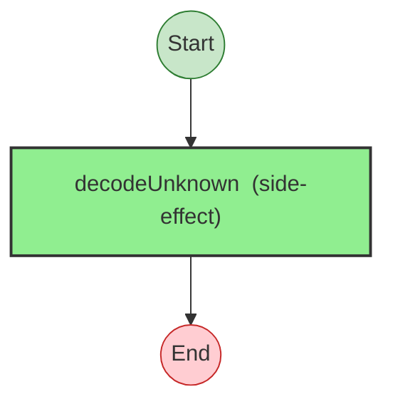

# Effect Analysis: validate-transfer.ts

## Metadata

- **File**: `/Users/jreehal/dev/node-examples/effect-analyzer/apps/docs/samples/observability-transfer/validate-transfer.ts`
- **Analyzed**: 2026-04-01T19:13:24.242Z
- **Source Type**: direct

## Effect Flow



## Statistics

- **Total Effects**: 1

## Explanation

```
validateTransfer (direct):
  1. Calls decodeUnknown — schema

  Error paths: ValidationError
  Concurrency: sequential (no parallelism)
```

## Error Types

- `ValidationError`
