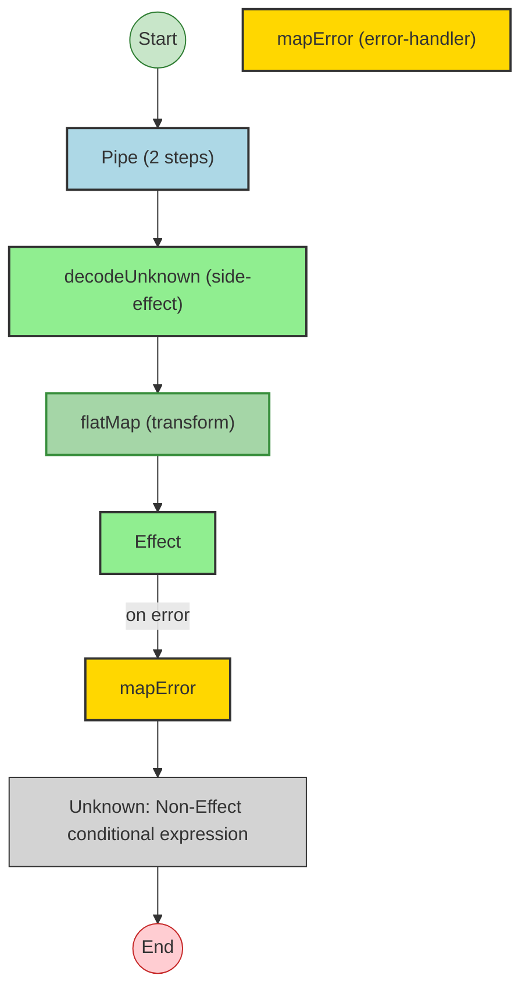

# Effect Analysis: validate-transfer.ts

## Metadata

- **File**: `/Users/jreehal/dev/node-examples/effect-analyzer/apps/docs/samples/observability-transfer/validate-transfer.ts`
- **Analyzed**: 2026-08-26T06:24:26.121Z
- **Source Type**: direct

## Effect Flow


```mermaid
flowchart TB

  %% Program: validateTransfer

  start((Start))
  end_node((End))

  n1["Pipe (2 steps)"]
  n2["decodeUnknown (side-effect)"]
  n3["flatMap (transform)"]
  n4["mapError (error-handler)"]
  n5["Effect"]
  err_handler_6["mapError"]
  n7["Unknown: Non-Effect conditional expression"]

  %% Edges
  n2 --> n3
  n5 -->|on error| err_handler_6
  err_handler_6 --> n7
  n3 --> n5
  n1 --> n2
  start --> n1
  n7 --> end_node

  %% Styles
  classDef startStyle fill:#c8e6c9,stroke:#2e7d32
  classDef endStyle fill:#ffcdd2,stroke:#c62828
  classDef effectStyle fill:#90EE90,stroke:#333,stroke-width:2px
  classDef pipeStyle fill:#ADD8E6,stroke:#333,stroke-width:2px
  classDef errorHandlerStyle fill:#FFD700,stroke:#333,stroke-width:2px
  classDef unknownStyle fill:#D3D3D3,stroke:#333,stroke-width:1px
  classDef transformStyle fill:#A5D6A7,stroke:#388E3C,stroke-width:2px
  class start startStyle
  class end_node endStyle
  class n1 pipeStyle
  class n2 effectStyle
  class n3 transformStyle
  class n4 errorHandlerStyle
  class n5 effectStyle
  class err_handler_6 errorHandlerStyle
  class n7 unknownStyle
```

## Statistics

- **Total Effects**: 3

## Explanation

```
validateTransfer (direct):
  1. Pipes decodeUnknown through:
    Calls decodeUnknown — schema
    Transforms via flatMap
    Maps error on:
      Calls Effect
      Handler:
        (unknown: Non-Effect conditional expression)

  Concurrency: sequential (no parallelism)
```
