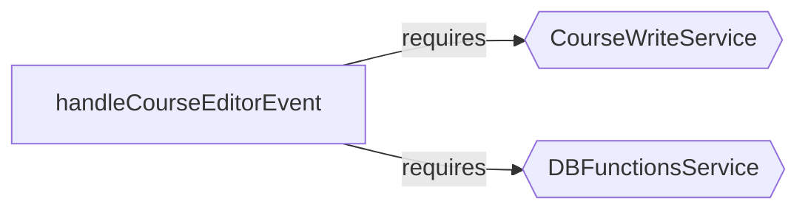
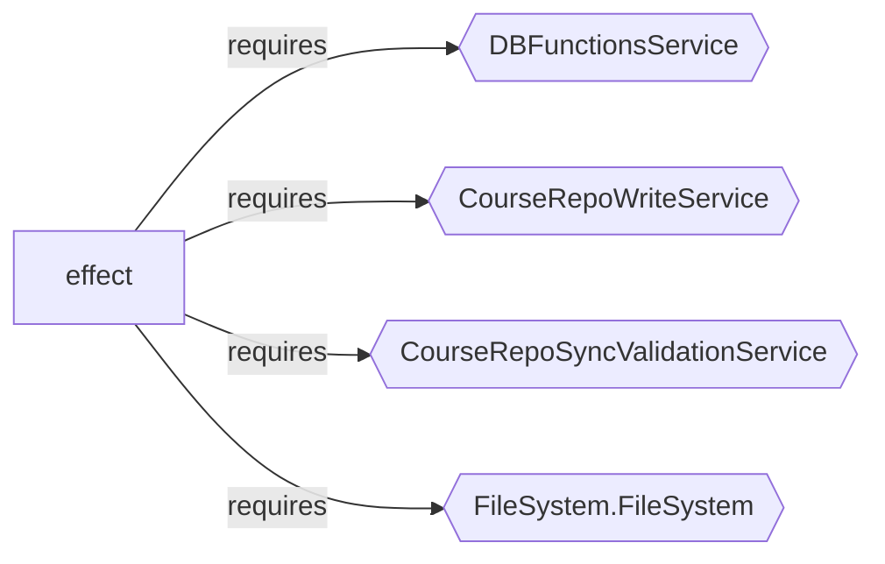
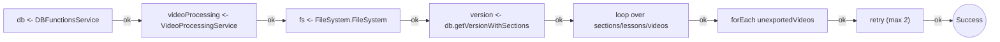

import { Aside } from '@astrojs/starlight/components';

`course-video-manager` is a desktop app for managing video courses: publishing, export, upload, validation, thumbnails, filesystem coordination, and media processing. It uses Effect throughout.

This walkthrough follows the path a new contributor or reviewer would take: start with the audit to find where the interesting code lives, then drill into specific files to understand how they work.

## Step 1: Where does the interesting code live?

A new contributor's first question on any repo is which directories matter.

```bash
npx effect-analyze ./app/services --coverage-audit --show-by-folder --tsconfig ./tsconfig.json
```

```text
Discovered: 94
Analyzed:   68
Zero programs: 26
Failed:     0
Coverage:   72.3%
Analyzable coverage: 100.0%
Unknown node rate: 3.32%
```

```bash
npx effect-analyze ./app/routes --coverage-audit --show-by-folder --tsconfig ./tsconfig.json
```

```text
Discovered: 106
Analyzed:   98
Zero programs: 8
Failed:     0
Coverage:   92.5%
Analyzable coverage: 100.0%
Unknown node rate: 11.76%
```

The service layer has a low unknown rate (3.32%). The route layer has high coverage but is structurally noisier (11.76% unknown), reflecting the mix of framework glue and Effect logic in route handlers. Zero files failed to parse in either directory.

**Without the analyzer**, you would need to open dozens of files to figure out where the business logic concentrates. The audit narrows that search immediately.

## Step 2: How does the editor work?

The next question is practical: how do I add a new editor operation, and what pattern should I follow?

Reading `course-editor-service-handler.ts` directly means scrolling through hundreds of lines of switch cases, service calls, and DB queries. The analyzer extracts the structure:

```bash
npx effect-analyze ./app/services/course-editor-service-handler.ts --format explain --tsconfig ./tsconfig.json
```

```text
handleCourseEditorEvent (direct):
  1. Yields service <- CourseWriteService
  2. Yields db <- DBFunctionsService
  3. Switch on event.type:
    Case "create-section":
      Returns: Calls service.addGhostSection
    Case "update-section-name":
      Yields section <- db.getSectionWithHierarchyById
      If parsed:
        Returns: Calls service.renameSection
      Calls db.updateSectionPath
    Case "update-section-description":
      Calls db.getSectionWithHierarchyById
      Calls db.updateSectionDescription
    Case "archive-section":
      Returns: Calls service.archiveSection
    Case "reorder-sections":
      Returns: Calls service.reorderSections
    Case "add-ghost-lesson":
      Returns: Calls service.addGhostLesson
    Case "create-real-lesson":
      Returns: Calls service.createRealLesson
    Case "update-lesson-name":
      Returns: Calls service.renameLesson
    Case "update-lesson-title":
      Yields lesson <- db.getLessonWithHierarchyById
      Calls db.updateLesson
    Case "update-lesson-description":
      Calls db.getLessonWithHierarchyById
      Calls db.updateLesson
    Case "update-lesson-icon":
      Calls db.getLessonWithHierarchyById
      Calls db.updateLesson
    Case "update-lesson-priority":
      Calls db.getLessonWithHierarchyById
      Calls db.updateLesson
    Case "update-lesson-dependencies":
      Calls db.getLessonWithHierarchyById
      Calls db.updateLesson
    Case "delete-lesson":
      Returns: Calls service.deleteLesson
    Case "reorder-lessons":
      Returns: Calls service.reorderLessons
    Case "move-lesson-to-section":
      Returns: Calls service.moveToSection
    Case "convert-to-ghost":
      Returns: Calls service.convertToGhost
    Case "create-on-disk":
      Returns: Calls service.materializeGhost

  Services required: CourseWriteService, DBFunctionsService
```

Now a contributor adding a new operation can see:

- all 18 existing operations and the pattern each follows
- which operations go through `CourseWriteService` vs. hitting the DB directly
- that `update-section-name` has special logic (read, check, conditionally rename) while most other updates are straightforward
- where to add their new case and which pattern to follow



**Without the analyzer**, understanding the dispatch table means reading the entire file and mentally tracking which cases delegate to which service. The explain output gives you the complete map in one command.

## Step 3: What happens when I write data?

A reviewer looking at a write-path bug needs to know: what does the write service depend on, and is there validation?

```bash
npx effect-analyze ./app/services/course-write-service.ts --format mermaid-services --tsconfig ./tsconfig.json
```



Four services. The presence of `CourseRepoSyncValidationService` in the dependency graph raises a question: when does validation run? The explain output answers it:

```text
withPostValidation (generator):
  1. Yields result <- effect
  2. Calls runValidation
```

A main write path passes through post-validation. The analyzer surfaces this design decision without inspecting the implementation details.

## Step 4: How does video export work?

A contributor debugging a failed export needs to understand the pipeline. The source file has nested loops, retry logic, and service calls interleaved with filesystem operations:

```bash
npx effect-analyze ./app/services/batch-export.server.ts --format explain --tsconfig ./tsconfig.json
```

```text
batchExportProgram (generator):
  1. Yields db <- DBFunctionsService
  2. Yields videoProcessing <- VideoProcessingService
  3. Yields fs <- FileSystem.FileSystem
  4. Yields FINISHED_VIDEOS_DIRECTORY <- string
  5. Yields version <- db.getVersionWithSections
  6. Iterates (forOf) over version.sections:
    Iterates (forOf) over section.lessons:
      Iterates (forOf) over lesson.videos:
        If video.clips.length > 0:
          Iterates (exists) over exportedVideoPath
  7. Iterates (forEach) over unexportedVideos:
    Calls videoProcessing.exportVideoClips(...)
  8. Retries (max 2, custom)

  Services required: DBFunctionsService, VideoProcessingService, FileSystem.FileSystem
```

The railway diagram shows the same flow linearly:



Walk the course tree, detect missing exports, process remaining videos, retry failures. That recovers the skeleton of the export pipeline statically.

**Without the analyzer**, a contributor would need to trace through the nested loops and service calls manually to understand the export flow. With it, they see the pipeline shape in seconds and know exactly where retry logic applies.

## Step 5: How does YouTube upload handle resources?

`youtube-upload-service.ts` uses a resumable upload pattern. The source mixes Promise wrappers, resource management, and chunked iteration:

```bash
npx effect-analyze ./app/services/youtube-upload-service.ts --format explain --tsconfig ./tsconfig.json
```

```text
uploadVideoToYouTube (generator):
  1. Yields fileSize <- try
  2. Yields uploadUri <- initiateResumableUpload
  3. Calls logInfo
  4. result = Acquires resource:
    Calls tryPromise
    Uses:
      Calls gen
    Then releases:
      Calls promise
  5. Calls logInfo

result (generator):
  1. Iterates (while) over offset < fileSize:
    Calls tryPromise
    Yields response <- tryPromise
```

The recovered shape is: initiate a resumable upload session, stream chunks until completion, and manage the upload resource with explicit acquire/use/release structure.

## Step 6: How does FFmpeg encoding handle concurrency?

Before touching any media infrastructure code, a reviewer needs to know what concurrency controls exist:

```bash
npx effect-analyze ./app/services/ffmpeg-commands.ts --format explain --tsconfig ./tsconfig.json
```

```text
effect (generator):
  1. Yields fs <- FileSystem.FileSystem
  2. Yields gpuSemaphore <- makeSemaphore
  3. Yields cpuSemaphore <- makeSemaphore
  ...

program-2 (generator):
  1. Yields process <- Command.start
  2. [stdout, stderr] = Runs 2 effects in sequential (concurrency: 2)

  Concurrency: uses parallelism / racing
```

The GPU and CPU semaphores indicate explicit throttling of encoding work to avoid saturating hardware resources. Separate stdout/stderr effect handling is also visible in the subprocess path.

## What the analyzer recovers (and what it does not)

Across this walkthrough, the analyzer recovered:

- workflow shape (editor dispatch, batch export, upload sequence)
- service boundaries (write, validation, DB, video processing)
- concurrency primitives (semaphores, paired subprocess handling)
- resource structure (upload acquire/use/release)
- event vocabulary (18 editor operations)

It does not by itself prove business correctness, media output correctness, or external side-effect success. Some route-layer analysis has higher unknown-node noise than the service layer, reflecting the mix of framework glue and Effect logic in route handlers.
