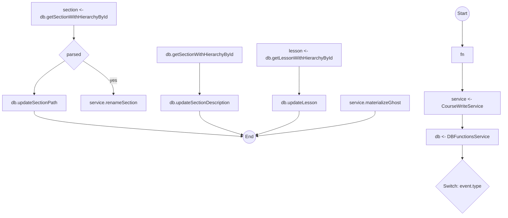
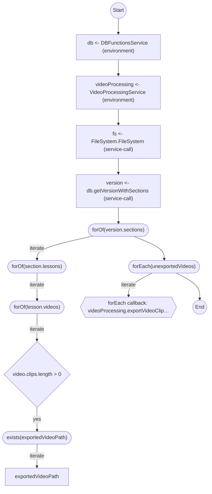
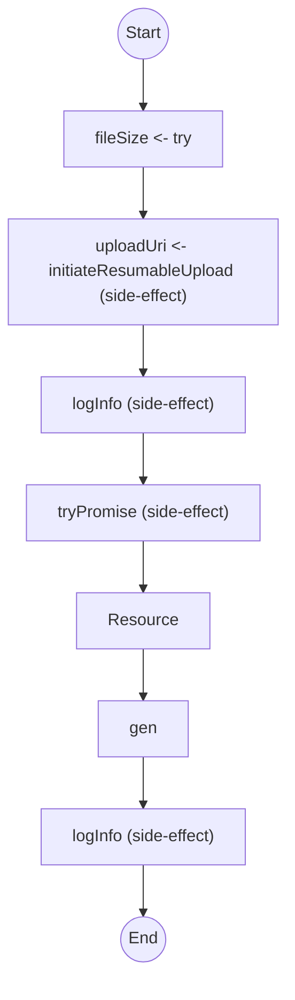

`course-video-manager` is a desktop app for editing course structure, exporting lessons, uploading media, and coordinating a fairly large set of Effect services. This repo does not look like `foldkit`: there is no central runtime loop. The useful output is in service handlers, write pipelines, resource lifecycles, and layer composition.

Current repo-wide output:

```bash
npx effect-analyze . --project --no-colocate --quiet
```

```text
Found 16 service(s), 5 unresolved.
Analyzed 178 file(s), 784 program(s).
```

The project-wide architecture view is mostly about layer composition:

```bash
npx effect-analyze . --format architecture --no-colocate --quiet
```

```text
Found 16 service(s), 5 unresolved.

Project architecture (0 runtimes, 38 layer assemblies)
...
Analyzed 178 file(s), 784 program(s).
```

## Editor event dispatcher

The strongest single file is the course editor event handler:

```bash
npx effect-analyze ./app/services/course-editor-service-handler.ts \
  --format explain \
  --tsconfig ./tsconfig.json
```

```text
handleCourseEditorEvent (direct):
  1. Yields service <- CourseWriteService
  2. Yields db <- DBFunctionsService
  3. Switch on event.type:
    Case "create-section":
      Returns:
        Calls service.addGhostSection
    Case "update-section-name":
      Yields section <- db.getSectionWithHierarchyById
      If parsed:
        Returns:
          Calls service.renameSection
      Calls db.updateSectionPath
    Case "update-section-description":
      Calls db.getSectionWithHierarchyById
      Calls db.updateSectionDescription
    ...
    Case "create-on-disk":
      Returns:
        Calls service.materializeGhost

  Services required: CourseWriteService, DBFunctionsService
```

This is exactly the kind of summary that helps when the file is a wide event switch: you can see which branches are pure write-service dispatch, which branches touch the DB directly, and which ones have extra control flow.

The Mermaid output is still useful here because the switch shape is big enough to benefit from a visual:

```bash
npx effect-analyze ./app/services/course-editor-service-handler.ts \
  --format mermaid \
  --tsconfig ./tsconfig.json
```



## Write path and post-validation

The write service is less polished than the editor handler, but it still surfaces the important architectural fact: writes run through DB, repo write, sync validation, and filesystem.

```bash
npx effect-analyze ./app/services/course-write-service.ts \
  --format explain \
  --tsconfig ./tsconfig.json
```

```text
effect (generator):
  1. Yields db <- DBFunctionsService
  2. Yields repoWrite <- CourseRepoWriteService
  3. Yields syncService <- CourseRepoSyncValidationService
  4. fileSystem = FileSystem.FileSystem — service-call
  5. Returns:
    Calls withPostValidation
    Calls materializeGhost
    Calls createRealLesson
    Calls materializeCourseWithLesson
    Calls convertToGhost
    Calls reorderLessons
    Calls reorderSections
    Calls renameSection
  6. Catches all errors on:
    Calls Effect
    Handler:
      Calls fail — constructor

  Services required: DBFunctionsService, CourseRepoWriteService, CourseRepoSyncValidationService, FileSystem

---

withPostValidation (generator):
  1. Yields result <- effect
  2. Calls runValidation
```

The analyzer exposes the named write operations and shows that validation is part of the post-write pipeline rather than a separate phase.

## Batch export traversal

The export flow is a good example of where the analyzer explains the shape of the work even when some callback detail is still opaque:

```bash
npx effect-analyze ./app/services/batch-export.server.ts \
  --format explain \
  --tsconfig ./tsconfig.json
```

```text
batchExportProgram (generator):
  1. Yields db <- DBFunctionsService
  2. Yields videoProcessing <- VideoProcessingService
  3. fs = FileSystem.FileSystem — service-call
  4. Yields FINISHED_VIDEOS_DIRECTORY <- string
  5. Yields version <- db.getVersionWithSections
  6. Iterates (forOf) over version.sections:
    Iterates (forOf) over section.lessons:
      Iterates (forOf) over lesson.videos:
        If video.clips.length > 0:
          Iterates (exists) over exportedVideoPath:
            exportedVideoPath
  7. Iterates (forEach) over unexportedVideos:
    forEach callback: videoProcessing.exportVideoClips -> video.clips.map -> sendEvent -> retry -> ...
    Callback:
      Calls videoProcessing.exportVideoClips — callback-call
      Calls sendEvent — callback-call
      Calls retry — callback-call
      Calls catchAll — callback-call

  Services required: DBFunctionsService, VideoProcessingService, FileSystem
```

That is enough to understand the export architecture: load the version tree, discover missing outputs, then export remaining videos through `VideoProcessingService`. The callback summary is now good enough to show that the per-video workflow includes export, progress events, and retry handling instead of collapsing to a generic opaque callback.

The Mermaid diagram keeps the nested traversal obvious:

```bash
npx effect-analyze ./app/services/batch-export.server.ts \
  --format mermaid \
  --tsconfig ./tsconfig.json
```



## Resumable YouTube upload

This repo also shows the analyzer's resource lifecycle output well:

```bash
npx effect-analyze ./app/services/youtube-upload-service.ts \
  --format explain \
  --tsconfig ./tsconfig.json
```

```text
uploadVideoToYouTube (generator):
  1. Yields fileSize <- try
  2. Yields uploadUri <- initiateResumableUpload
  3. Calls logInfo
  4. result = Acquires resource:
    Calls tryPromise — constructor
    Uses:
      Calls gen
    Then releases:
      Calls promise — constructor
  5. Calls logInfo

---

result (generator):
  1. Iterates (while) over offset < fileSize:
    Calls tryPromise — constructor
    Yields response <- tryPromise
```

This is the useful part of the story: initiate a resumable upload, enter an acquire/use/release region, then stream chunks until completion.

```bash
npx effect-analyze ./app/services/youtube-upload-service.ts \
  --format mermaid \
  --tsconfig ./tsconfig.json
```



## Live layer assembly

For project architecture, the best single file is the live service layer:

```bash
npx effect-analyze ./app/services/layer.server.ts \
  --format architecture \
  --tsconfig ./tsconfig.json \
  --no-colocate
```

```text
Project architecture (0 runtimes, 2 layer assemblies)

Layer assemblies:
  coreLayer (layer.server.ts)
    Ops: mergeAll(
  CourseRepoParserService.Default,
  DatabaseDumpService.Default,
  VideoProcessingService.Default,
  DBFunctionsService.Default,
  BackgroundRemovalService.Default,
  VideoEditorLoggerService.Default,
  FeatureFlagService.Default,
  OpenFolderService.Default,
  CloudinaryService.Default,
  CloudinaryMarkdownLayer,
  CourseRepoWriteService.Default,
  CourseWriteService.Default,
  CourseRepoSyncValidationService.Default,
  FFmpegCommandsService.Default,
  NodeContext.layer
).pipe -> provideMerge
    References: DrizzleService.Default
  layerLive (layer.server.ts)
    Ops: merge
    References: coreLayer, publishLayer
```

On the full repo, architecture mode now separates production and test layer assemblies instead of dumping them into one list. That makes `layer.server.ts` stand out much more clearly as the real app composition root.

## Coverage audit

The whole repo mixes Effect-heavy server code with a lot of UI and type-only files, so the repo-wide percentage looks lower than the services-only percentage:

```bash
npx effect-analyze . --coverage-audit --show-by-folder --quiet
```

```text
Discovered: 489
Analyzed:   178
Zero programs: 311
Suspicious zeros: 0
Failed:     0
Coverage:   36.4%
Analyzable coverage: 100.0%
Unknown node rate: 4.92%
```

If you narrow to the actual server/service layer, the picture is much cleaner:

```bash
npx effect-analyze ./app/services --coverage-audit --show-by-folder \
  --tsconfig ./tsconfig.json --quiet
```

```text
Discovered: 98
Analyzed:   72
Zero programs: 26
Suspicious zeros: 0
Failed:     0
Coverage:   73.5%
Analyzable coverage: 100.0%
Unknown node rate: 2.26%
```

That is the right reading of this repo. The analyzer is strong on the service layer and correctly ignores a large amount of React/UI/type-only code that is not meaningful Effect program analysis.

## Best workflow for this repo

Use `--format explain` on individual service files when you want control-flow and service boundaries.

Use `--format mermaid` on dispatcher-style files like `course-editor-service-handler.ts` and traversal-heavy files like `batch-export.server.ts`.

Use `--format architecture` on `./app/services/layer.server.ts` or the repo root when you want the layer composition view.

Use `--coverage-audit` on `./app/services` instead of the whole repo if your goal is to measure analyzer quality on actual Effect code.
