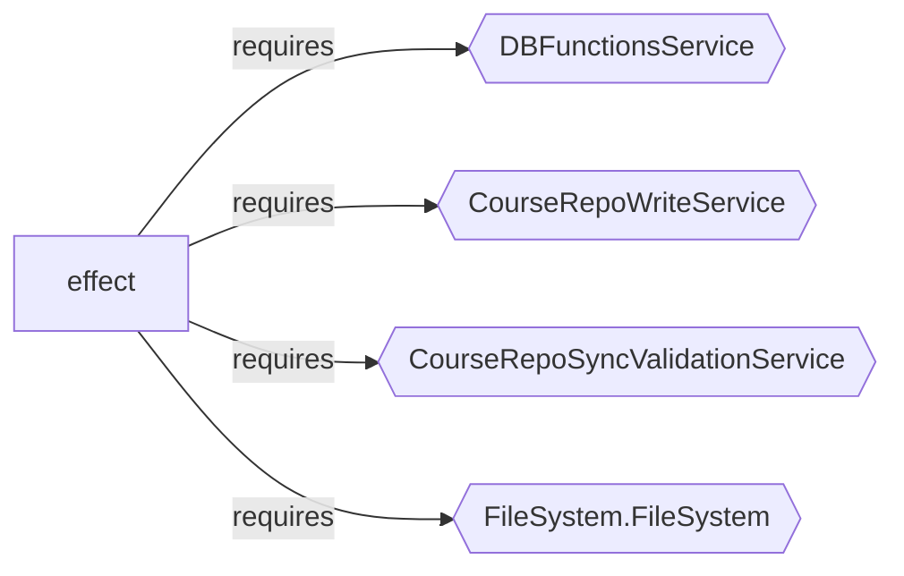

import { Aside } from '@astrojs/starlight/components';

`course-video-manager` is a better case study than a generic sample app because the repository has a clear product shape: publishing, export, upload, validation, thumbnails, filesystem coordination, and media processing. If effect-analyzer is useful here, it is useful on real operational software.

## Audit Signal

The first result worth sharing is how cleanly the analyzer separates the operational backend from the rest of the app.

### `app/services`

```bash
npx effect-analyze ./app/services --coverage-audit --show-by-folder --tsconfig ./tsconfig.json
```

```text
Discovered: 93
Analyzed:   67
Zero programs: 26
Failed:     0
Coverage:   72.0%
Analyzable coverage: 100.0%
Unknown node rate: 3.37%
```

### `app/routes`

```bash
npx effect-analyze ./app/routes --coverage-audit --show-by-folder --tsconfig ./tsconfig.json
```

```text
Discovered: 106
Analyzed:   98
Zero programs: 8
Failed:     0
Coverage:   92.5%
Analyzable coverage: 100.0%
Unknown node rate: 11.76%
```

That already tells a useful story:

- the service layer is heavily Effect-shaped
- the route layer is also highly analyzable
- the repo’s operational workflow is not hidden behind framework glue

This is a good promotional angle because it shows effect-analyzer working on a mixed production repository, not on a toy fixture.

## Example 1: Post-Write Validation Is an Architectural Invariant

The best single "sell" in this repo is [course-write-service.ts](/Users/jreehal/dev/temp/course-video-manager/app/services/course-write-service.ts).

```bash
npx effect-analyze ./app/services/course-write-service.ts --format mermaid-services --tsconfig ./tsconfig.json
```



That output is worth sharing because it exposes a real design decision: writes are coupled to sync validation as part of the runtime boundary.

The explain output makes that explicit:

```text
withPostValidation (generator):
  1. Yields result <- effect
  2. Calls runValidation
```

This is exactly the sort of example the current page should lead with. It is not just "here is a service map." It shows an invariant the repo author actually cares about.

## Example 2: The Upload Route Is Thin on Purpose

The route-level example that best represents the app is [api.videos.$videoId.upload.ts](/Users/jreehal/dev/temp/course-video-manager/app/routes/api.videos.$videoId.upload.ts).

```bash
npx effect-analyze './app/routes/api.videos.$videoId.upload.ts' --format mermaid-railway --tsconfig ./tsconfig.json
```


This is a strong example because a maintainer can point to it and say:

- the route is a thin orchestration boundary
- the publish path is explicit
- the heavy lifting is delegated into services

That is a much better advertisement for the analyzer than a screenshot of a dense CLI dump.

## Example 3: Batch Export Really Is a Workflow

[batch-export.server.ts](/Users/jreehal/dev/temp/course-video-manager/app/services/batch-export.server.ts) is one of the best examples of structural recovery in the repo.

```bash
npx effect-analyze ./app/services/batch-export.server.ts --format explain --tsconfig ./tsconfig.json
```

```text
batchExportProgram (generator):
  1. Yields db <- DBFunctionsService
  2. Yields videoProcessing <- VideoProcessingService
  3. Yields fs <- FileSystem.FileSystem
  4. Yields FINISHED_VIDEOS_DIRECTORY <- string
  5. Yields version <- db.getVersionWithSections
  6. Iterates (forOf) over version.sections:
    Iterates (forOf) over section.lessons:
      Iterates (forOf) over lesson.videos:
        If video.clips.length > 0:
          Iterates (exists) over exportedVideoPath:
            (unknown: Could not determine loop body)
  7. Iterates (forEach) over unexportedVideos:
    Calls videoProcessing.exportVideoClips(...)
  8. Retries (max 2, custom)
```

This is compelling because it captures the real workflow shape:

- walk the course tree
- detect missing exports
- process remaining videos
- retry failures

The stats reinforce that this is not trivial glue code:

```json
{
  "program": "batchExportProgram",
  "stats": {
    "totalEffects": 11,
    "loopCount": 5,
    "retryCount": 1,
    "decisionCount": 1,
    "unknownCount": 0
  }
}
```

For a repo author, this is shareable because it shows the analyzer recovering the shape of a real export pipeline, not just counting nodes.

## Example 4: Resource Control Around FFmpeg

The repo also has a strong infrastructure story in [ffmpeg-commands.ts](/Users/jreehal/dev/temp/course-video-manager/app/services/ffmpeg-commands.ts).

```bash
npx effect-analyze ./app/services/ffmpeg-commands.ts --format explain --tsconfig ./tsconfig.json
```

```text
effect (generator):
  1. Yields fs <- FileSystem.FileSystem
  2. Yields gpuSemaphore <- makeSemaphore
  3. Yields cpuSemaphore <- makeSemaphore
  ...

program-2 (generator):
  1. Yields process <- Command.start
  2. [stdout, stderr] = Runs 2 effects in sequential (concurrency: 2)
```

This is a better supporting example than several of the current ones because it proves the analyzer can surface resource and concurrency structure in media-processing code, which is a core part of what this application does.

## Why These Examples Sell The Analyzer Better

The strongest pitch for effect-analyzer on `course-video-manager` is:

- it reveals runtime invariants like post-write validation
- it shows route handlers as thin orchestration boundaries
- it recovers genuine workflows like batch export
- it surfaces resource control patterns in FFmpeg/media infrastructure

That is materially stronger than pages full of generic narration and screenshots. These examples tell a maintainer something worth reposting: "the analyzer recovered the shape of our publishing system from source alone."

<Aside type="note">
The current weak spot in this repo is still label quality around some nested helpers, loop bodies, and stream internals. The case study is strongest when it emphasizes workflow shape and dependency boundaries, where the analyzer is already persuasive.
</Aside>
