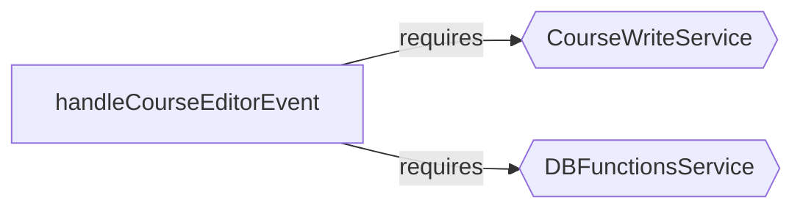
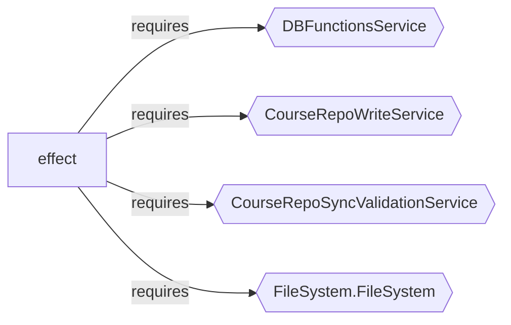
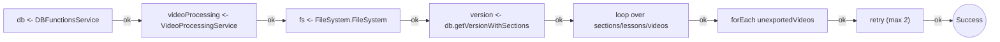

import { Aside } from '@astrojs/starlight/components';

`course-video-manager` is a desktop app for managing video courses: publishing, export, upload, validation, thumbnails, filesystem coordination, and media processing. It uses Effect throughout. If effect-analyzer is useful here, it is useful on real operational software.

## Audit Signal

Coverage audit on the two main directories:

### `app/services`

```bash
npx effect-analyze ./app/services --coverage-audit --show-by-folder --tsconfig ./tsconfig.json
```

```text
Discovered: 94
Analyzed:   68
Zero programs: 26
Failed:     0
Coverage:   72.3%
Analyzable coverage: 100.0%
Unknown node rate: 3.32%
```

### `app/routes`

```bash
npx effect-analyze ./app/routes --coverage-audit --show-by-folder --tsconfig ./tsconfig.json
```

```text
Discovered: 106
Analyzed:   98
Zero programs: 8
Failed:     0
Coverage:   92.5%
Analyzable coverage: 100.0%
Unknown node rate: 11.76%
```

The service layer has a low unknown rate (3.32%). The route layer has high coverage but is structurally noisier (11.76% unknown). Zero files failed to parse in either directory.

## Example 1: The Course Editor Dispatch Table

`course-editor-service-handler.ts` contains the event dispatch table that drives the course editing UI:

```bash
npx effect-analyze ./app/services/course-editor-service-handler.ts --format explain --tsconfig ./tsconfig.json
```

```text
handleCourseEditorEvent (direct):
  1. Yields service <- CourseWriteService
  2. Yields db <- DBFunctionsService
  3. Switch on event.type:
    Case "create-section":
      Returns: Calls service.addGhostSection
    Case "update-section-name":
      Yields section <- db.getSectionWithHierarchyById
      If parsed:
        Returns: Calls service.renameSection
      Calls db.updateSectionPath
    Case "update-section-description":
      Calls db.getSectionWithHierarchyById
      Calls db.updateSectionDescription
    Case "archive-section":
      Returns: Calls service.archiveSection
    Case "reorder-sections":
      Returns: Calls service.reorderSections
    Case "add-ghost-lesson":
      Returns: Calls service.addGhostLesson
    Case "create-real-lesson":
      Returns: Calls service.createRealLesson
    Case "update-lesson-name":
      Returns: Calls service.renameLesson
    Case "update-lesson-title":
      Yields lesson <- db.getLessonWithHierarchyById
      Calls db.updateLesson
    Case "update-lesson-description":
      Calls db.getLessonWithHierarchyById
      Calls db.updateLesson
    Case "update-lesson-icon":
      Calls db.getLessonWithHierarchyById
      Calls db.updateLesson
    Case "update-lesson-priority":
      Calls db.getLessonWithHierarchyById
      Calls db.updateLesson
    Case "update-lesson-dependencies":
      Calls db.getLessonWithHierarchyById
      Calls db.updateLesson
    Case "delete-lesson":
      Returns: Calls service.deleteLesson
    Case "reorder-lessons":
      Returns: Calls service.reorderLessons
    Case "move-lesson-to-section":
      Returns: Calls service.moveToSection
    Case "convert-to-ghost":
      Returns: Calls service.convertToGhost
    Case "create-on-disk":
      Returns: Calls service.materializeGhost

  Services required: CourseWriteService, DBFunctionsService
```

In one glance a reviewer sees:

- the complete event vocabulary (18 operations)
- which operations delegate to the write service vs. hitting the DB directly
- the split between higher-level write operations (via `CourseWriteService`) and direct DB updates
- `update-section-name` has special logic (read, check, conditionally rename)

The service map makes the boundary explicit:



## Example 2: Post-Write Validation Is an Architectural Invariant

`course-write-service.ts` exposes a design decision that matters: writes are coupled to sync validation as part of the runtime boundary.

```bash
npx effect-analyze ./app/services/course-write-service.ts --format mermaid-services --tsconfig ./tsconfig.json
```



The explain output makes the invariant explicit:

```text
withPostValidation (generator):
  1. Yields result <- effect
  2. Calls runValidation
```

The main write path passes through post-validation. The analyzer surfaces this design decision without inspecting the implementation details.

## Example 3: Batch Export Is a Real Workflow

`batch-export.server.ts` demonstrates structural recovery of a genuine production pipeline:

```bash
npx effect-analyze ./app/services/batch-export.server.ts --format explain --tsconfig ./tsconfig.json
```

```text
batchExportProgram (generator):
  1. Yields db <- DBFunctionsService
  2. Yields videoProcessing <- VideoProcessingService
  3. Yields fs <- FileSystem.FileSystem
  4. Yields FINISHED_VIDEOS_DIRECTORY <- string
  5. Yields version <- db.getVersionWithSections
  6. Iterates (forOf) over version.sections:
    Iterates (forOf) over section.lessons:
      Iterates (forOf) over lesson.videos:
        If video.clips.length > 0:
          Iterates (exists) over exportedVideoPath
  7. Iterates (forEach) over unexportedVideos:
    Calls videoProcessing.exportVideoClips(...)
  8. Retries (max 2, custom)

  Services required: DBFunctionsService, VideoProcessingService, FileSystem.FileSystem
```

The railway diagram captures the same workflow in a different visual:



The shape is immediately readable: walk the course tree, detect missing exports, process remaining videos, retry failures. That recovers the skeleton of the export pipeline statically.

## Example 4: YouTube Upload with Resource Control

`youtube-upload-service.ts` demonstrates that the analyzer can recover resource acquisition patterns:

```bash
npx effect-analyze ./app/services/youtube-upload-service.ts --format explain --tsconfig ./tsconfig.json
```

```text
uploadVideoToYouTube (generator):
  1. Yields fileSize <- try
  2. Yields uploadUri <- initiateResumableUpload
  3. Calls logInfo
  4. result = Acquires resource:
    Calls tryPromise
    Uses:
      Calls gen
    Then releases:
      Calls promise
  5. Calls logInfo

result (generator):
  1. Iterates (while) over offset < fileSize:
    Calls tryPromise
    Yields response <- tryPromise
```

The analyzer surfaces the acquire/use/release pattern and the chunked upload loop. A reviewer unfamiliar with the code immediately sees: open a resumable upload session, stream chunks until completion, and manage the upload resource with explicit acquire/use/release structure.

## Example 5: FFmpeg Resource Control with Semaphores

`ffmpeg-commands.ts` shows the analyzer recovering concurrency primitives in media processing infrastructure:

```bash
npx effect-analyze ./app/services/ffmpeg-commands.ts --format explain --tsconfig ./tsconfig.json
```

```text
effect (generator):
  1. Yields fs <- FileSystem.FileSystem
  2. Yields gpuSemaphore <- makeSemaphore
  3. Yields cpuSemaphore <- makeSemaphore
  ...

program-2 (generator):
  1. Yields process <- Command.start
  2. [stdout, stderr] = Runs 2 effects in sequential (concurrency: 2)

  Concurrency: uses parallelism / racing
```

The GPU and CPU semaphores indicate explicit throttling of encoding work to avoid saturating hardware resources. Separate stdout/stderr effect handling is also visible in the subprocess path.

## What the Analyzer Recovers (and What It Does Not)

The examples above show that the analyzer recovers:

- workflow shape (editor dispatch, batch export, upload sequence)
- service boundaries (write, validation, DB, video processing)
- concurrency primitives (semaphores, paired subprocess handling)
- resource structure (upload acquire/use/release)
- event vocabulary (editor operations)

It does not by itself prove business correctness, media output correctness, or external side-effect success. Some route-layer analysis has higher unknown-node noise than the service layer, reflecting the mix of framework glue and Effect logic in route handlers.
