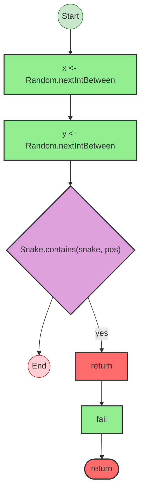

import { Aside } from '@astrojs/starlight/components';

`foldkit` is a frontend framework for TypeScript built on Effect-TS, implementing The Elm Architecture. This case study shows what the analyzer produces on a real codebase — no special flags needed.

## runtime.ts — just run it

The foldkit runtime is a 1,287-line orchestration file. Run the analyzer with no format flag:

```bash
npx effect-analyze ./packages/foldkit/src/runtime/runtime.ts \
  --tsconfig ./packages/foldkit/tsconfig.json
```

The analyzer detects 12 non-trivial programs in the file and picks the best output for each one automatically:

```text
%% explain [program-2]
program-2 (generator):
  1. maybeResourceLayer = If resources:
    Provides layer:
      Calls resources
  2. managedResourceRefs = Iterates (forEach) over managedResourceEntries:
    Calls Ref.make<Option.Option<unknown>>
  3. Yields flags <- resolveFlags
  4. messageQueue = queue.create
  5. modelSubscriptionRef = subscriptionRef.create
  6. Iterates (forEach) over initCommands:
    Fiber forkDaemon (daemon):
      Calls command.effect.pipe
  7. Yields modelRef <- Ref.make
  ...
  14. If Option.isSome(resolvedDevtools):
    Yields devtoolsStore <- createDevtoolsStore
    ...
  15. Calls render
  16. If subscriptions:
    Pipes subscriptions through ...
  17. Iterates (forEach) over managedResourceRefs:
    Calls forkManagedResourceLifecycle
  18. Pipes forever through:
    Calls forever
    Handles errors (catchAllCause)

%% mermaid [program-2]
flowchart TB
  ... (compact detail auto-selected)

%% mermaid-errors [program-2]
...

%% mermaid-railway [render]
flowchart LR
  ...

%% mermaid-railway [acquire]
flowchart LR
  ...
```

The 138-step main program (`program-2`) gets a plain-English explain first, then a compact mermaid diagram. Smaller programs like `render`, `acquire`, and `release` get clean railway diagrams. No flags required — the analyzer measures each program's size and picks accordingly:

- **&lt;30 nodes:** mermaid or railway diagram
- **30–80 nodes:** explain + standard mermaid
- **&gt;80 nodes:** explain + compact mermaid

You can always override with `--format explain`, `--format mermaid`, or `--detail compact|standard|verbose`.

## Small files produce great diagrams

### generatePosition (snake example)

```bash
npx effect-analyze ./examples/snake/src/domain/apple.ts \
  --tsconfig ./examples/snake/tsconfig.json
```

One small program, auto-selects mermaid:



Generate a random position, check if it collides with the snake, fail if so. The caller wraps this in a retry (up to 100 attempts) — a creative use of Effect's retry combinator for constraint satisfaction.

### fetchWeather (weather example)

```bash
npx effect-analyze ./examples/weather/src/main.ts \
  --tsconfig ./examples/weather/tsconfig.json
```

Auto-selects railway for the linear happy path:

```mermaid
flowchart LR
  A[decision] -->|ok| B[client <- HttpClient.HttpClient]
  B -->|ok| C[geocodeResponse <- client.execute]
  C -->|ok| D[decision]
  D -->|ok| E[geocodeData <- S.decodeUnknown]
  E -->|ok| F[geoResult <- geocodeData.results.pipe]
  F -->|ok| G[weatherResponse <- client.execute]
  G -->|ok| H[decision]
  H -->|ok| I[weatherData <- S.decodeUnknown]
  I -->|ok| J[isEmpty]
  J -->|ok| K[HttpClientRequest.get]
  K -->|ok| L[flatMap]
  L -->|ok| M[fail]
  M -->|ok| N[HttpClientRequest.get]
  N -->|ok| O[getOrElse]
  O -->|ok| Done((Success))
```



Validate input, geocode, fetch weather, decode. Three decision points correspond to three `if status !== 200` guards. The only detected service dependency: `HttpClient.HttpClient`.

## Deeper examples

### devtools store — time-travel debugging

```bash
npx effect-analyze ./packages/foldkit/src/devtools/store.ts \
  --tsconfig ./packages/foldkit/tsconfig.json
```

```text
createDevtoolsStore (generator):
  1. stateRef = subscriptionRef.create
  2. Calls has — immutable-collection
  3. Calls get — immutable-collection
  4. Calls map — option
  5. Calls drop
  6. Calls take
  7. Iterates (reduce) over keyframeModel
  8. Calls set — immutable-collection
  9. Calls drop
  10. Calls remove — immutable-collection
  11. subscriptionRef.update
  ...
  30 steps total

jumpTo (generator):
  1. state = subscriptionRef.get
  2. Calls bridge.render
  3. subscriptionRef.set

resume (generator):
  1. currentModel = (unknown)
  2. Calls bridge.render
  3. subscriptionRef.update
```

Keyframe snapshots in a HashMap, intermediate states replayed via `Array.reduce`, circular buffer eviction with `Array.drop` and `HashMap.remove`. `jumpTo` and `resume` are 3-step programs.

### route parser — bidirectional combinators

```bash
npx effect-analyze ./packages/foldkit/src/route/parser.ts \
  --tsconfig ./packages/foldkit/tsconfig.json
```

```text
slash.parse (pipe):
  1. Pipes parserA.parse through:
    Calls parserA.parse
    Transforms via flatMap

slash.print (pipe):
  1. Pipes parserA.print through:
    Calls parserA.print
    Transforms via flatMap

  Error paths: ParseError

parseUrlWithFallback (pipe):
  1. Pipes url through:
    Calls url
    Calls parseUrl
    Falls back (orElse) on error
    Calls Effect.runSync
```

Every parser is a pair of Effect pipelines: parse URL → value, print value → URL. `parseUrlWithFallback` is where Effects meet the synchronous world: `Effect.runSync` at the top, with `orElse` for fallback.

### typing game — service wiring

```bash
npx effect-analyze ./packages/typing-game/client/src \
  --tsconfig ./packages/typing-game/client/tsconfig.json
```

```text
Found 2 service(s).

createRoom (generator):
  1. Yields client <- RoomsClient
  2. Yields { player, room } <- client.createRoom

  Services required: RoomsClient

ProtocolLive (generator):
  1. Yields { VITE_SERVER_URL } <- ViteEnvConfig
  2. Calls RpcClient.layerProtocolHttp — rpc

  Services required: ViteEnvConfig, RpcClient.layerProtocolHttp
```

2 services detected across 31 analyzed files. Only real services appear — `RoomsClient`, `ViteEnvConfig`, `KeyValueStore.KeyValueStore`. Import aliases like `M` for `Match` and `Str` for `String` are resolved automatically, so they don't show up as false service dependencies.

## Finding what to analyze

```bash
npx effect-analyze ./packages/foldkit/src --coverage-audit --show-by-folder \
  --tsconfig ./packages/foldkit/tsconfig.json
```

```text
Discovered: 118
Analyzed:   59
Zero programs: 59
Failed:     0
Coverage:   50.0%
Analyzable coverage: 100.0%
Unknown node rate: 6.91%

By top-level folder:
  ui: ok=30 zero=27
  task: ok=9 zero=2
  devtools: ok=3 zero=0
  route: ok=2 zero=2
  runtime: ok=2 zero=6
  ...
```

## Quick reference

| What you want | Command |
|---------------|---------|
| Best output automatically | just run `npx effect-analyze <path>` |
| Force text summary | `--format explain` |
| Force flowchart | `--format mermaid` |
| Force compact flowchart | `--format mermaid --detail compact` |
| Happy-path linear diagram | `--format mermaid-railway` |
| Service dependency map | `--format mermaid-services` |
| Find which files have Effect code | `--coverage-audit --show-by-folder` |
| Compare two versions of a file | `--diff old.ts new.ts` |
