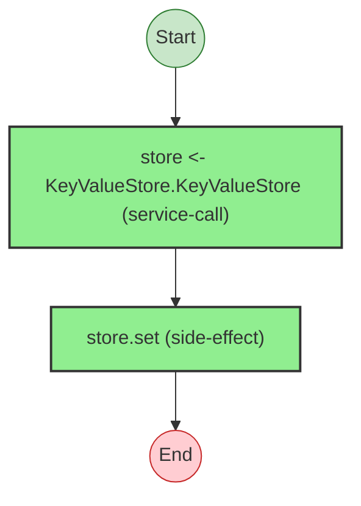
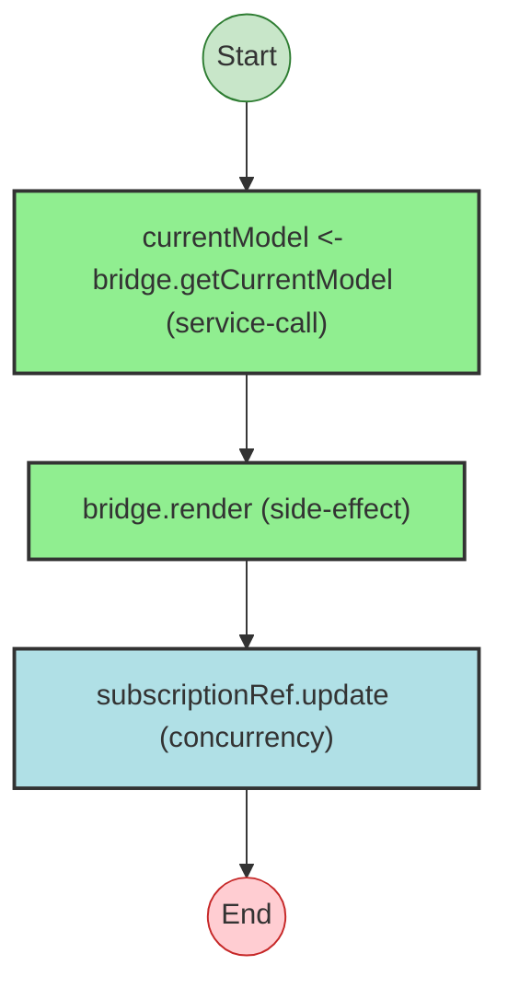

import { Aside } from '@astrojs/starlight/components';

`foldkit` is a frontend framework for TypeScript built on Effect-TS, implementing The Elm Architecture. It is a good stress test for the analyzer because it mixes small example apps, framework internals, long runtime orchestration files, subscriptions, managed resources, routing, and devtools.

This case study is based on the current analyzer output against the real `foldkit` repository.

## Project-level architecture is the strongest view now

Run the analyzer at the repository root with the architecture format:

```bash
npx effect-analyze ./ \
  --format architecture \
  --no-colocate
```

Current output:

```text
Found 9 service(s), 33 unresolved.

Project architecture (30 runtimes, 6 layer assemblies)
...
program (examples/todo/src/main.ts)
  Constructor: Runtime.makeProgram
  Loop: Flags -> init -> Model + Commands
  Loop: Message -> update -> Model + Commands
  Loop: Model -> view -> Html
  Commands in file: GenerateTodo, SaveTodos
  Capabilities: flags
...
overlayRuntime (packages/foldkit/src/devtools/overlay.ts)
  Constructor: makeProgram
  Loop: Flags -> init -> Model + Commands
  Loop: Message -> update -> Model + Commands
  Loop: Model -> view -> Html
  Subscriptions: makeOverlaySubscriptions(store) -> Message stream
  Devtools: false
  Commands in file: JumpTo, InspectState, InspectLatest, Resume, Clear, LockScroll, UnlockScroll, ScrollToTop
  Capabilities: flags, subscriptions, devtools
...
program (packages/website/src/main.ts)
  Constructor: Runtime.makeProgram
  Loop: Flags -> init -> Model + Commands
  Loop: Message -> update -> Model + Commands
  Loop: Model -> view -> Html
  Subscriptions: subscriptions -> Message stream
  Resources: Layer.mergeAll(...)
  Routing: { onUrlRequest: ..., onUrlChange: ... } (onUrlRequest, onUrlChange)
  Title: ({ route }) => routeTitle(route)
  Devtools: { show: 'Always', mode: 'Inspect', ... }
  Commands in file: InjectAnalytics, InjectSpeedInsights, CopySnippet, ...
  Capabilities: flags, routing, subscriptions, resources, title, devtools
```

This is where the analyzer is most useful on `foldkit` today. It does not just find Effect programs. It reconstructs the application shape:

- `Flags -> init -> Model + Commands`
- `Message -> update -> Model + Commands`
- `Model -> view -> Html`
- optional capabilities like `routing`, `subscriptions`, `resources`, `managedResources`, `crash`, `slowView`, `title`, and `devtools`
- command definitions per file

For `foldkit`, that architecture summary is more valuable than a raw per-call diagram of every file.

## Example app output is clean

Running architecture mode on a single example app gives a compact Elm-style summary:

```bash
npx effect-analyze ./examples/todo/src \
  --format architecture \
  --no-colocate
```

```text
Project architecture (1 runtime, 0 layer assemblies)

program (main.ts)
  Constructor: Runtime.makeProgram
  Loop: Flags -> init -> Model + Commands
  Loop: Message -> update -> Model + Commands
  Loop: Model -> view -> Html
  Commands in file: GenerateTodo, SaveTodos
  Capabilities: flags

Command definitions:
  main.ts: GenerateTodo, SaveTodos
```

That is the level of summary most users want first when they open a `foldkit` app.

The same example also produces small Mermaid diagrams well:

```bash
npx effect-analyze ./examples/todo/src/main.ts --format mermaid
```



That is still an important part of the tool. The analyzer works best on `foldkit` when you use architecture mode first, then drop to Mermaid for small, self-contained programs.

## The large runtime file is still analyzable

The main runtime file is still large and noisy, but the analyzer now gets enough structure out of it to be useful:

```bash
npx effect-analyze ./packages/foldkit/src/runtime/runtime.ts \
  --format explain
```

Excerpt from the current output:

```text
program-2 (generator):
  1. maybeResourceLayer = If resources:
    Provides layer:
      Calls resources
  2. managedResourceRefs = Iterates (forEach) over managedResourceEntries:
    (opaque: callback-body)
  3. Yields flags <- resolveFlags
  4. messageQueue = queue.create
  5. modelSubscriptionRef = subscriptionRef.create
  6. Iterates (forEach) over initCommands:
    (opaque: callback-body)
  7. Yields modelRef <- make
  ...
  14. If Option.isSome(resolvedDevtools):
    Yields devtoolsStore <- createDevtoolsStore
    Calls set
    Calls devtoolsStore.recordInit
    Calls createOverlay
  15. Calls render
  16. If subscriptions:
    Pipes subscriptions through:
      Calls subscriptions
      Calls Record.toEntries
      Iterates (forEach) ...
  17. Iterates (forEach) over managedResourceRefs:
    Calls forkManagedResourceLifecycle
  18. Pipes forever through:
    Calls forever
    Handles errors (catchAllCause)
```

The important part is not perfect prettiness. It is that the analyzer now recovers the runtime shape:

- resource layer setup
- managed resource reference creation
- flag resolution
- message queue and subscription reference setup
- init command forking
- devtools bootstrapping
- render loop
- subscription wiring
- managed resource lifecycle forking
- forever-processing loop

That is enough to orient a reader in a file that is otherwise hard to scan.

## Devtools store is now concise

The current analyzer output for the devtools store is concise:

```bash
npx effect-analyze ./packages/foldkit/src/devtools/store.ts \
  --format explain
```

```text
createDevtoolsStore (generator):
  1. stateRef = subscriptionRef.create
  2. Calls gen
  3. subscriptionRef.update

jumpTo (generator):
  1. state = subscriptionRef.get
  2. Calls bridge.render
  3. subscriptionRef.set

resume (generator):
  1. currentModel = Bridge.getCurrentModel — service-call
  2. Calls bridge.render
  3. subscriptionRef.update

  Services required: Bridge
```

And for this file, Mermaid is still useful for the smaller programs:

```bash
npx effect-analyze ./packages/foldkit/src/devtools/store.ts --format mermaid
```



This is a better fit for real review. The analyzer now avoids inventing fake service dependencies for stateful primitives like `SubscriptionRef`, and it can recognize service-backed calls like `Bridge.getCurrentModel`.

## What the analyzer is good at on foldkit

- detecting `Runtime.makeProgram` style app loops across many apps
- extracting command definitions at project scale
- surfacing capabilities like routing, subscriptions, resources, managed resources, crash handlers, slow view hooks, title hooks, and devtools
- recognizing service-backed calls in smaller generators
- keeping large runtime files readable enough to navigate

## What still compresses poorly

Some framework internals are still only partially summarized:

- callback-heavy `forEach` bodies in the runtime still show as `(opaque: callback-body)` in a few places
- some helper-heavy pipes still collapse to generic calls like `Calls gen`
- architecture extraction is stronger than low-level flow rendering on the largest internal files

That is an acceptable tradeoff for now. On `foldkit`, the analyzer is already more useful as an architecture and orientation tool than as a perfect instruction-by-instruction renderer.

## Coverage snapshot

Project mode currently reports:

```bash
npx effect-analyze ./ \
  --project \
  --no-colocate
```

```text
Found 9 service(s), 33 unresolved.
Analyzed 284 file(s), 1399 program(s).
```

The analyzer is recovering the structure of the framework and its example applications at repository scale.

<Aside type="note" title="Recommended workflow">
For `foldkit`, start with `--format architecture` at the project or app level, then drill into individual files with `--format explain` only when you need implementation detail.
</Aside>
