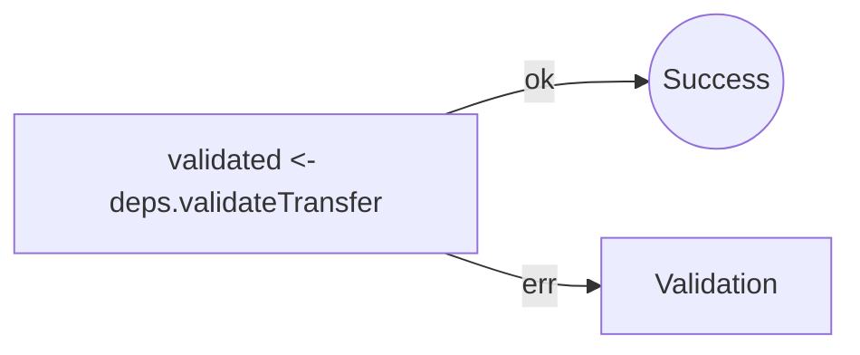
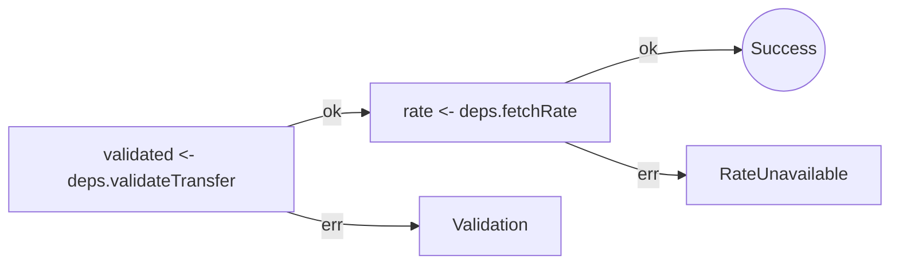
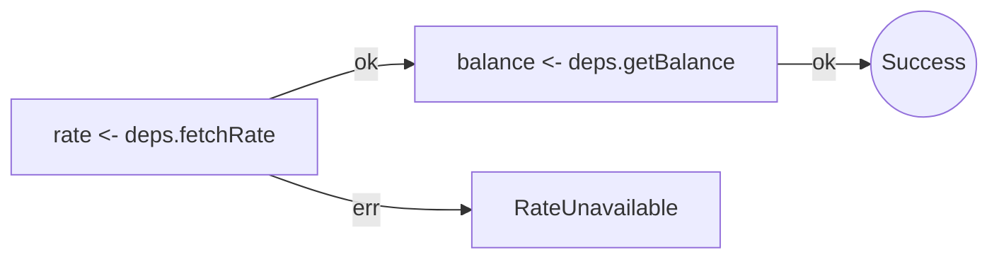
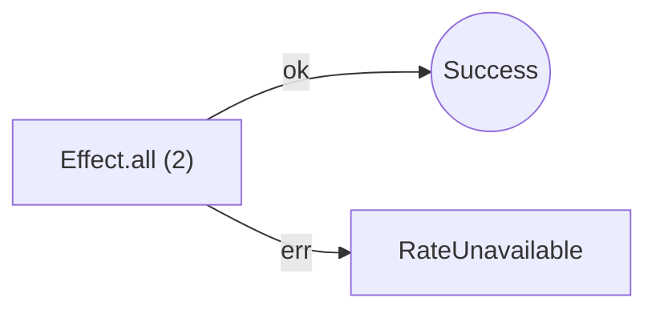
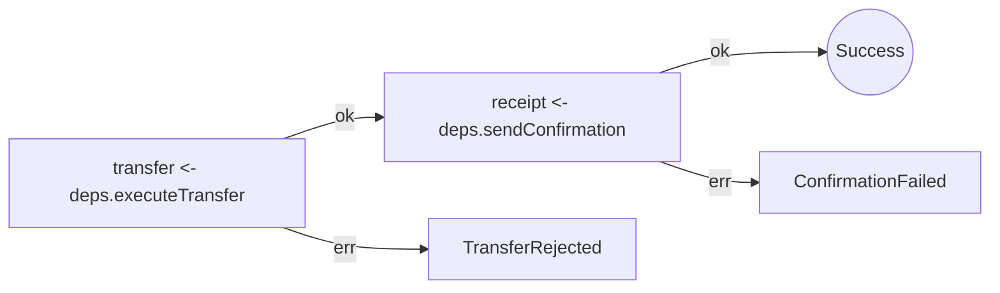
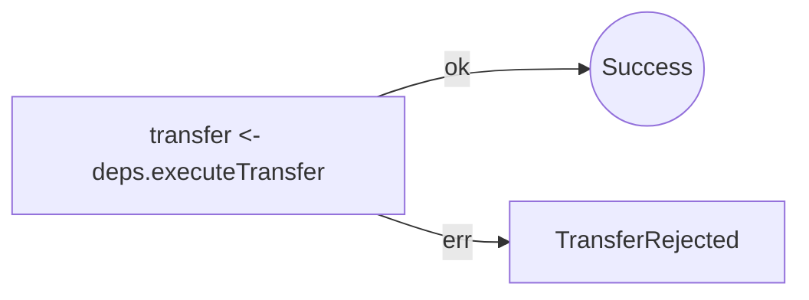
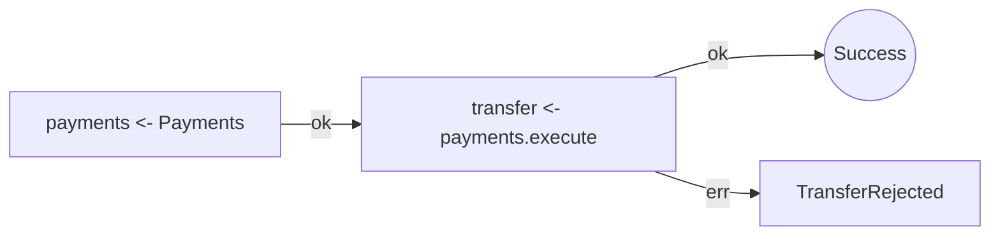
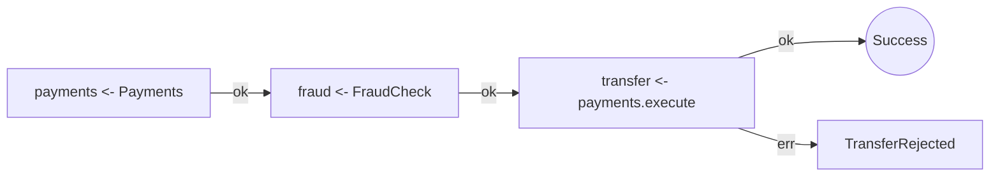
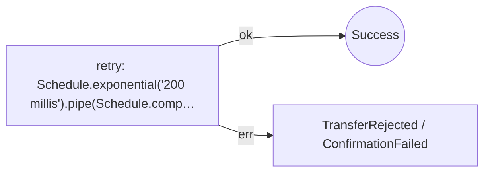

import { Aside } from '@astrojs/starlight/components';

Every section on this page is generated from real TypeScript files in `apps/docs/samples/review-scenarios` by running `effect-analyzer` against them. No hand-written output — if the analyzer changes, rerun `pnpm --dir apps/docs run generate:review-scenarios` and this page will update.

The setup: the transfer team is iterating on a send-money workflow. Here are five pull requests from a single sprint. Each one has a plausible motivation. Each one hides a change that a line-by-line diff does not communicate.

<Aside type="tip" title="Why this page exists">
Teams do not really review lines — they review behavior. Text diff is a proxy for behavior that breaks down the moment a refactor is larger than a variable rename. Structural diff is the version that actually answers "what did this PR change about how the program runs?"
</Aside>

## PR #1 — Add exchange rate fetch

_Two new lines. A whole new failure mode. Is there a test?_

The team is building up the transfer workflow. This PR adds an exchange-rate lookup after input validation.

### What GitHub shows you

It looks like a small addition — import a dep, call it, return the extra field.

```diff
--- before.ts
+++ after.ts
@@ -1,19 +1,29 @@
-// PR #1 — before: validation only
+// PR #1 — after: now fetches exchange rate
 import { Effect } from 'effect';
 
 type TransferInput = { amount: number; from: string; to: string };
 type ValidatedTransfer = TransferInput & { validatedAt: Date };
 type ValidationError = { _tag: 'ValidationError'; reason: string };
+type ExchangeRate = { rate: number };
+type RateUnavailableError = { _tag: 'RateUnavailableError' };
 
 type Deps = {
   readonly validateTransfer: (
     input: TransferInput,
   ) => Effect.Effect<ValidatedTransfer, ValidationError>;
+  readonly fetchRate: (args: {
+    from: string;
+    to: string;
+  }) => Effect.Effect<ExchangeRate, RateUnavailableError>;
 };
 
 export const createSendMoneyWorkflow =
   (deps: Deps) => (input: TransferInput) =>
     Effect.gen(function* () {
       const validated = yield* deps.validateTransfer(input);
-      return { validated };
+      const rate = yield* deps.fetchRate({
+        from: validated.from,
+        to: validated.to,
+      });
+      return { validated, rate };
     });
```

### What the analyzer shows you

The structural diff names the new step. More importantly, the workflow's error channel just doubled: `ValidationError` → `ValidationError | RateUnavailableError`. Every call site of this workflow is now a new potential failure surface.

**Structural diff:**

#### Effect Program Diff: createSendMoneyWorkflow → createSendMoneyWorkflow

##### Summary

| Metric | Count |
|--------|-------|
| Added | 1 |
| Removed | 0 |
| Renamed | 0 |
| Moved | 0 |
| Unchanged | 1 |
| Structural changes | 0 |

##### Step Changes

```diff
+ **deps.fetchRate** (added, id: `effect-5`)
```

**Before → After railway:**





**Declared error union:** **+** `RateUnavailableError`

**Effect count:** 1 → 2

### The question this unlocks

**Is there a test for `RateUnavailableError`?** In production, rate providers have outages. A sequential retry would have been a different PR. Silently propagating is a choice — not necessarily the wrong one, but a choice the team should make deliberately.

<details>
<summary>Raw analyzer explain (before / after)</summary>

```text
createSendMoneyWorkflow (generator):
  1. Yields validated <- deps.validateTransfer

  Error paths: ValidationError
  Concurrency: sequential (no parallelism)
```

```text
createSendMoneyWorkflow (generator):
  1. Yields validated <- deps.validateTransfer
  2. Yields rate <- deps.fetchRate

  Error paths: RateUnavailableError, ValidationError
  Concurrency: sequential (no parallelism)
```

</details>

## PR #2 — Parallelize for latency

_A performance refactor that changes failure semantics._

Rate fetch and balance lookup were sequential. The PR parallelizes them with `Effect.all({ concurrency: "unbounded" })`.

### What GitHub shows you

Looks like a clean refactor — two `yield*` lines collapsed into one destructured `Effect.all`.

```diff
--- before.ts
+++ after.ts
@@ -1,4 +1,4 @@
-// PR #2 — before: sequential rate + balance lookup
+// PR #2 — after: parallelized for speed
 import { Effect } from 'effect';
 
 type Currency = 'USD' | 'EUR' | 'GBP';
@@ -15,7 +15,9 @@
 
 export const prepareTransfer = (deps: Deps) => (from: Currency, to: Currency) =>
   Effect.gen(function* () {
-    const rate = yield* deps.fetchRate({ from, to });
-    const balance = yield* deps.getBalance();
+    const [rate, balance] = yield* Effect.all(
+      [deps.fetchRate({ from, to }), deps.getBalance()],
+      { concurrency: 'unbounded' },
+    );
     return { rate, balance };
   });
```

### What the analyzer shows you

The structural diff flags `+ parallel block added`. The railway diagram restructures. When two operations run concurrently, a failure in one interrupts the other — that is not what the sequential code did. If `fetchRate` is observably slow or has side effects (telemetry, rate-limiter entries), the semantics have changed.

**Structural diff:**

#### Effect Program Diff: prepareTransfer → prepareTransfer

##### Summary

| Metric | Count |
|--------|-------|
| Added | 0 |
| Removed | 0 |
| Renamed | 2 |
| Moved | 0 |
| Unchanged | 0 |
| Structural changes | 1 |

##### Step Changes

```diff
~ **deps.fetchRate** (renamed from `effect-1` → `effect-5`)
~ **deps.getBalance** (renamed from `effect-2` → `effect-6`)
```

##### Structural Changes

- + parallel block added

**Before → After railway:**





**Declared error union:** _declared error union unchanged (only the structural diff catches the behavior change)_

**Effect count:** 2 → 2

### The question this unlocks

**Is either branch doing work you cannot cancel?** Parallel is not a free speed win when one operation has observable side effects and the other can fail first.

<details>
<summary>Raw analyzer explain (before / after)</summary>

```text
prepareTransfer (generator):
  1. Yields rate <- deps.fetchRate
  2. Yields balance <- deps.getBalance

  Error paths: RateUnavailableError
  Concurrency: sequential (no parallelism)
```

```text
prepareTransfer (generator):
  1. [rate, balance] = Runs 2 effects in sequential (concurrency: unbounded):
    Calls deps.fetchRate
    Calls deps.getBalance

  Error paths: RateUnavailableError
  Concurrency: uses parallelism / racing
```

</details>

## PR #3 — Make confirmation best-effort

_One wrapper call. Confirmation is no longer required for success._

Someone wrapped `sendConfirmation` in `Effect.orElseSucceed` so confirmation failures stop failing the workflow.

### What GitHub shows you

The body of the generator changed slightly — a single line grew an outer call. Easy to skim past.

```diff
--- before.ts
+++ after.ts
@@ -1,4 +1,4 @@
-// PR #3 — before: confirmation failure fails the workflow
+// PR #3 — after: confirmation is best-effort
 import { Effect } from 'effect';
 
 type TransferId = { id: string };
@@ -19,6 +19,9 @@
 export const completeTransfer = (deps: Deps) => () =>
   Effect.gen(function* () {
     const transfer = yield* deps.executeTransfer();
-    const receipt = yield* deps.sendConfirmation(transfer.id);
+    const receipt = yield* Effect.orElseSucceed(
+      deps.sendConfirmation(transfer.id),
+      () => null as ConfirmationReceipt | null,
+    );
     return { transfer, receipt };
   });
```

### What the analyzer shows you

The structural diff is unambiguous: `sendConfirmation` **moved from `generator` → `error-handler`** and a new `error-handler` block was added. The after-state railway no longer has a `ConfirmationFailedError` branch — the diagram itself tells the story.

**Structural diff:**

#### Effect Program Diff: completeTransfer → completeTransfer

##### Summary

| Metric | Count |
|--------|-------|
| Added | 1 |
| Removed | 0 |
| Renamed | 1 |
| Moved | 0 |
| Unchanged | 1 |
| Structural changes | 1 |

##### Step Changes

```diff
~ **deps.sendConfirmation** (renamed from `effect-2` → `effect-7`)
+ **Effect** (added, id: `effect-6`)
```

##### Structural Changes

- + error-handler block added

**Before → After railway:**





**Declared error union:** _declared error union unchanged (only the structural diff catches the behavior change)_

**Effect count:** 2 → 3

### The question this unlocks

**Did the PR author intend to swallow confirmation failures?** If yes: is there a dead-letter queue, reconciliation job, or alert? If no: this is a bug the reviewer just caught by reading the diagram instead of the source.

<details>
<summary>Raw analyzer explain (before / after)</summary>

```text
completeTransfer (generator):
  1. Yields transfer <- deps.executeTransfer
  2. Yields receipt <- deps.sendConfirmation

  Error paths: ConfirmationFailedError, TransferRejectedError
  Concurrency: sequential (no parallelism)
```

```text
completeTransfer (generator):
  1. Yields transfer <- deps.executeTransfer
  2. receipt = Handles errors (orElseSucceed):
    Calls Effect
    Handler:
      Calls deps.sendConfirmation

  Error paths: ConfirmationFailedError, TransferRejectedError
  Concurrency: sequential (no parallelism)
```

</details>

## PR #4 — Add a fraud check

_A new service requirement quietly enters the workflow._

The PR introduces a `FraudCheck` service and verifies each transfer before execution.

### What GitHub shows you

Looks like a standard "add dependency, call it" change. The interesting detail — a new service in the R channel — is easy to miss when the `Context.Tag` class definition takes more visual space than the call.

```diff
--- before.ts
+++ after.ts
@@ -1,8 +1,9 @@
-// PR #4 — before: execute transfer directly
+// PR #4 — after: adds a fraud check before execution
 import { Context, Effect } from 'effect';
 
 type TransferId = { id: string };
 type TransferRejectedError = { _tag: 'TransferRejectedError' };
+type FraudDeniedError = { _tag: 'FraudDeniedError' };
 
 export class Payments extends Context.Tag('Payments')<
   Payments,
@@ -13,9 +14,18 @@
   }
 >() {}
 
+export class FraudCheck extends Context.Tag('FraudCheck')<
+  FraudCheck,
+  {
+    readonly verify: (amount: number) => Effect.Effect<void, FraudDeniedError>;
+  }
+>() {}
+
 export const initiateTransfer = (amount: number) =>
   Effect.gen(function* () {
     const payments = yield* Payments;
+    const fraud = yield* FraudCheck;
+    yield* fraud.verify(amount);
     const transfer = yield* payments.execute(amount);
     return transfer;
   });
```

### What the analyzer shows you

The structural diff lists both the new service yield and the new verify call as added steps. The services map for this workflow now has an extra node; anyone wiring this program up for tests or production needs to provide a `FraudCheck` implementation.

**Structural diff:**

#### Effect Program Diff: initiateTransfer → initiateTransfer

##### Summary

| Metric | Count |
|--------|-------|
| Added | 2 |
| Removed | 0 |
| Renamed | 0 |
| Moved | 0 |
| Unchanged | 2 |
| Structural changes | 0 |

##### Step Changes

```diff
+ **FraudCheck** (added, id: `effect-8`)
+ **fraud.verify** (added, id: `effect-9`)
```

**Before → After railway:**





**Declared error union:** **+** `FraudDeniedError`

**Effect count:** 2 → 4

### The question this unlocks

**What is the failure story if `FraudCheck` is down?** A hard dependency means outages cascade. A soft dependency means fraud policies have gaps. Either is a product decision, not a reviewer decision.

<details>
<summary>Raw analyzer explain (before / after)</summary>

```text
initiateTransfer (generator):
  1. Yields payments <- Payments
  2. Yields transfer <- payments.execute

  Services required: Payments
  Error paths: TransferRejectedError
  Concurrency: sequential (no parallelism)
```

```text
initiateTransfer (generator):
  1. Yields payments <- Payments
  2. Yields fraud <- FraudCheck
  3. Calls fraud.verify
  4. Yields transfer <- payments.execute

  Services required: Payments, FraudCheck
  Error paths: FraudDeniedError, TransferRejectedError
  Concurrency: sequential (no parallelism)
```

</details>

## PR #5 — Clean up the retry logic

_A resilience regression disguised as a cleanup._

Someone removed the `Effect.retry(Schedule.exponential(...))` wrapper around the whole transfer, with a commit message like "simplify workflow — provider handles retries now".

### What GitHub shows you

The diff is a single deleted line: `.pipe(Effect.retry(...))`. This is the kind of change that passes review in 30 seconds because the reviewer reads "cleanup" and "simpler" and moves on.

```diff
--- before.ts
+++ after.ts
@@ -1,5 +1,5 @@
-// PR #5 — before: confirmation call retried on transient failure
-import { Effect, Schedule } from 'effect';
+// PR #5 — after: retry removed during "cleanup" refactor
+import { Effect } from 'effect';
 
 type TransferId = { id: string };
 type TransferRejectedError = { _tag: 'TransferRejectedError' };
@@ -20,4 +20,4 @@
     const transfer = yield* deps.executeTransfer();
     yield* deps.sendConfirmation(transfer.id);
     return transfer;
-  }).pipe(Effect.retry(Schedule.exponential('200 millis').pipe(Schedule.compose(Schedule.recurs(3)))));
+  });
```

### What the analyzer shows you

The structural diff flags it immediately: `- retry block removed`. All runtime tests still pass — retries only matter under transient failure, and unit tests rarely simulate the exact timing that made the retry useful. The tool catches what tests cannot.

**Structural diff:**

#### Effect Program Diff: completeTransfer → completeTransfer

##### Summary

| Metric | Count |
|--------|-------|
| Added | 0 |
| Removed | 1 |
| Renamed | 0 |
| Moved | 0 |
| Unchanged | 2 |
| Structural changes | 1 |

##### Step Changes

```diff
- **Schedule.exponential('200 millis').pipe** (removed, id: `effect-4`)
```

##### Structural Changes

- - retry block removed

**Before → After railway:**




**Declared error union:** _declared error union unchanged (only the structural diff catches the behavior change)_

**Effect count:** 3 → 2

### The question this unlocks

**Is there actually upstream retry, or does the team assume there is?** "The provider handles it" is often aspirational. The answer determines whether this PR is a safe simplification or a resilience regression. The diff turns an implicit assumption into an explicit review question.

<details>
<summary>Raw analyzer explain (before / after)</summary>

```text
completeTransfer (generator):
  1. Retries with Schedule.exponential('200 millis').pipe(Schedule.compose(Schedule.recurs(3))):
    Yields transfer <- deps.executeTransfer
    Calls deps.sendConfirmation

  Error paths: ConfirmationFailedError, TransferRejectedError
  Concurrency: sequential (no parallelism)
```

```text
completeTransfer (generator):
  1. Yields transfer <- deps.executeTransfer
  2. Calls deps.sendConfirmation

  Error paths: ConfirmationFailedError, TransferRejectedError
  Concurrency: sequential (no parallelism)
```

</details>

## What to take from this

Every scenario above is a shape of PR that teams ship. None of them are contrived. The common thread is that **the source diff is a faithful record of the text change, and a lossy record of the behavior change**.

- PR #1 adds a failure mode. The source diff tells you a line was added.
- PR #2 changes concurrency semantics. The source diff tells you some lines were restructured.
- PR #3 silences a failure. The source diff tells you an outer call was added.
- PR #4 adds a dependency. The source diff tells you a new import and a new yield appeared.
- PR #5 removes a resilience primitive. The source diff tells you a wrapper call was deleted.

The analyzer's output, structural diff, error surface, railway diagram, answers a different question: _what about the behavior of this program is different now?_ That is the question every reviewer is trying to answer in their head while scrolling a diff. The tool just does it more reliably.

## Related

- [Semantic Diff](/effect-analyzer/project/diff/) — the feature powering every "Structural diff" block on this page.
- [Transfer Observability](/effect-analyzer/diagrams/transfer-observability/) — the narrative around why the transfer example is worth analyzing at all.
- [Transfer Evolution](/effect-analyzer/diagrams/transfer-evolution/) — the five-step build-up of the same workflow, showing the error channel grow step by step.

