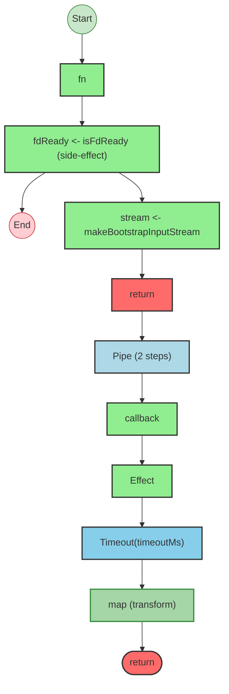
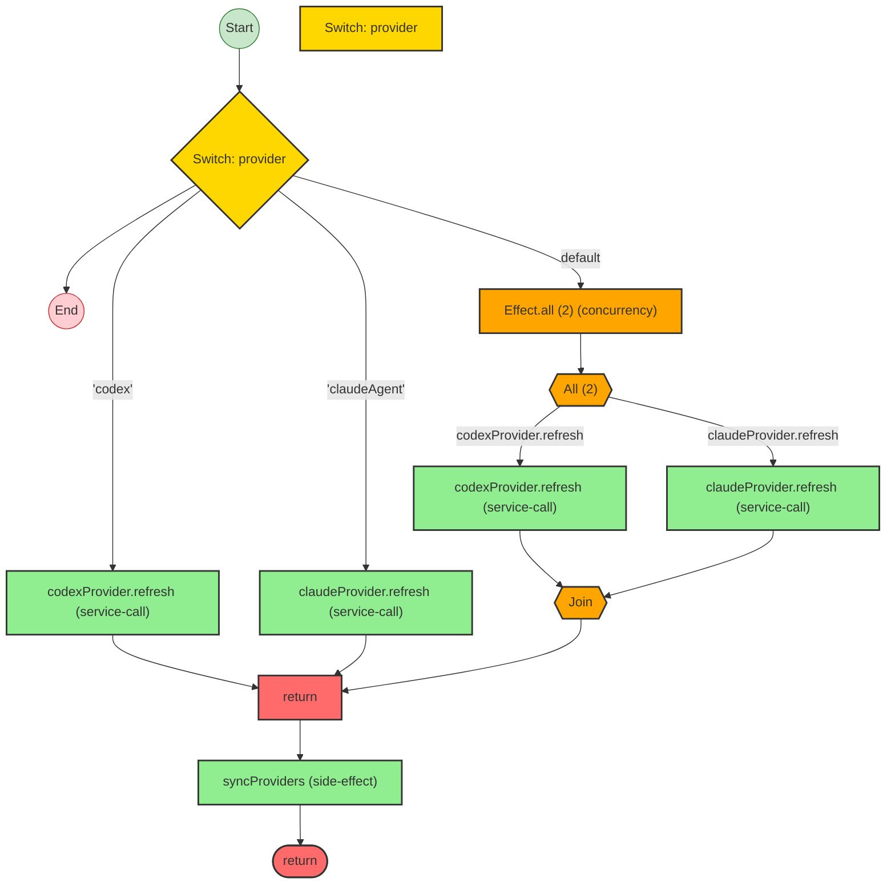

import { Aside } from '@astrojs/starlight/components';

`t3code` is a web GUI for coding agents. Its backend is not CRUD-shaped. It is built from Effect layers, evented reactors, provider registries, callback bridges, orchestration services, and projection pipelines.

That makes it a good case study for the analyzer, because the hard part is not finding isolated Effects. It is recovering architecture from a large backend that is composed through layers and higher-order services.

This walkthrough is based on the current analyzer output against the real `t3code` repository.

## Start with coverage, not a single file

Running the coverage audit on the server source gives a good top-level picture:

```bash
npx effect-analyze ./apps/server/src \
  --coverage-audit \
  --show-by-folder \
  --quiet
```

Current output:

```text
Discovered: 189
Analyzed:   142
Zero programs: 47
Suspicious zeros: 0
Failed:     0
Coverage:   75.1%
Analyzable coverage: 100.0%
Unknown node rate: 1.46%

Top unknown node reasons (by count):
  71  Could not determine effect type
  16  Could not determine loop body
```

The most important signals here are:

- `142` analyzable programs in the server source
- `0` failures
- `0` suspicious zeros
- `1.46%` unknown-node rate

That is already enough to trust the analyzer as a repo navigation tool. The remaining misses are concentrated, not random.

## Layer architecture is the strongest repo-wide view

`t3code` server code is heavily layer-driven, so architecture mode is more useful than a raw per-file flowchart:

```bash
npx effect-analyze ./apps/server/src \
  --format architecture \
  --no-colocate \
  --quiet
```

Current output starts like this:

```text
Project architecture (0 runtimes, 76 layer assemblies)

Layer assemblies:
  OrchestrationEngineLive (orchestration/Layers/OrchestrationEngine.ts)
    Ops: effect
    References: OrchestrationEngineService, makeOrchestrationEngine

  OrchestrationProjectionPipelineLive (orchestration/Layers/ProjectionPipeline.ts)
    Ops: effect(...).pipe -> provideMerge -> provideMerge -> provideMerge ...
    References: NodeServices.layer, ProjectionProjectRepositoryLive, ProjectionThreadRepositoryLive, ...

  ProviderRegistryLive (provider/Layers/ProviderRegistry.ts)
    Ops: effect(...).pipe -> provideMerge -> provideMerge
    References: CodexProviderLive, ClaudeProviderLive

  RuntimeLayer (index.ts)
    Ops: empty.pipe -> provideMerge -> provideMerge -> provideMerge -> ...
    References: CliConfig.layer, ServerLive, OpenLive, NetService.layer, NodeServices.layer, FetchHttpClient.layer
```

For this codebase, that is the right starting point. The analyzer shows how the server is assembled:

- orchestration services
- persistence repositories
- provider adapters and registries
- runtime receipt bus
- terminal integration
- top-level runtime composition

This is much closer to how a contributor actually needs to read the backend.

## Small architecture files are very readable

`serverLayers.ts` is a good example of where architecture mode is already concise:

```bash
npx effect-analyze ./apps/server/src/serverLayers.ts \
  --format architecture \
  --tsconfig ./apps/server/tsconfig.json \
  --no-colocate \
  --quiet
```

```text
Project architecture (0 runtimes, 2 layer assemblies)

Layer assemblies:
  runtimeServicesLayer (serverLayers.ts)
    Ops: mergeAll
    References: orchestrationLayer, OrchestrationProjectionSnapshotQueryLive, checkpointStoreLayer, checkpointDiffQueryLayer, RuntimeReceiptBusLive

  serverLayers-layer-2 (serverLayers.ts)
    Ops: mergeAll(
    orchestrationReactorLayer,
    GitCoreLive,
    gitManagerLayer,
    terminalLayer,
    KeybindingsLive,
  ).pipe -> provideMerge
    References: NodeServices.layer
```

This is exactly the kind of file where the analyzer helps immediately: it shows which layer groups exist and what they depend on, without making you read every import and `provideMerge` manually.

## Callback bridges are now much clearer

Callback-heavy code is one of the places where the analyzer is useful in `t3code`.

Take the bootstrap reader:

```bash
npx effect-analyze ./apps/server/src/bootstrap.ts \
  --format explain \
  --tsconfig ./apps/server/tsconfig.json \
  --quiet
```

Current output:

```text
readBootstrapEnvelope (direct):
  1. Yields fdReady <- isFdReady
  2. Yields stream <- makeBootstrapInputStream
  3. Returns:
    Pipes callback through:
      Registers callback bridge: callback
        Callback: 5 resume calls
        Inner effects:
          Calls cleanup — callback-handler
          Calls handleError — callback-handler
            Callback:
              Calls resume -> Effect.succeedNone — callback-resume
              Calls resume -> Effect.fail(...) — callback-resume
              Calls isUnavailableBootstrapFdError — callback-call
          Calls handleLine — callback-handler
            Callback:
              Calls resume -> Effect.succeedSome(parsed.success) — callback-resume
              Calls resume -> Effect.fail(...) — callback-resume
              Calls decodeJsonResult — callback-call
              Calls Result.isSuccess — callback-call
          Calls handleClose — callback-handler
            Callback:
              Calls resume -> Effect.succeedNone — callback-resume
      Times out after timeoutMs
      Transforms via map
```

This is much better than a flat `Calls fn` or generic `Effect.callback` entry. The analyzer now shows:

- that this is a callback bridge
- how many resume paths exist
- the named handlers inside the bridge
- the important resume payloads
- the timeout and transform wrappers around it

For `t3code`, that is exactly the kind of explanation that makes async boundary code readable.

The Mermaid output is still useful when you want the condensed shape instead of the handler detail:

```bash
npx effect-analyze ./apps/server/src/bootstrap.ts \
  --format mermaid \
  --tsconfig ./apps/server/tsconfig.json \
  --quiet
```



## Reactor streams are now recognizable

Provider registry code is another place where the analyzer now recovers useful stream structure:

```bash
npx effect-analyze ./apps/server/src/provider/Layers/ProviderRegistry.ts \
  --format explain \
  --tsconfig ./apps/server/tsconfig.json \
  --quiet
```

```text
ProviderRegistryLive (generator):
  1. Yields codexProvider <- CodexProvider
  2. Yields claudeProvider <- ClaudeProvider
  3. changesPubSub = Acquires resource:
    pubsub.create
    Then releases:
      Calls PubSub.shutdown
  4. Yields providersRef <- make
  5. Background stream reactor (CodexProvider.streamChanges): runForEach -> runForEach
    Calls CodexProvider.streamChanges — service-call
    runForEach callback:
      Calls syncProviders — callback-call
  6. Background stream reactor (ClaudeProvider.streamChanges): runForEach -> runForEach
    Calls ClaudeProvider.streamChanges — service-call
    runForEach callback:
      Calls syncProviders — callback-call
```

That is a real semantic improvement. The analyzer now understands that these are background reactors driven by provider change streams, not just anonymous stream pipelines.

The nested refresh program is also clearer now:

```text
ProviderRegistryLive.refresh (generator):
  1. Switch on provider:
    Case "codex":
      Calls CodexProvider.refresh — service-call
    Case "claudeAgent":
      Calls ClaudeProvider.refresh — service-call
    Case default:
      Runs 2 effects in sequential (concurrency: unbounded):
        Calls CodexProvider.refresh — service-call
        Calls ClaudeProvider.refresh — service-call
  2. Returns:
    Calls syncProviders
```

Earlier versions of the analyzer lost these service-property calls entirely.

For this file, Mermaid now captures the reactor and refresh structure reasonably well:

```bash
npx effect-analyze ./apps/server/src/provider/Layers/ProviderRegistry.ts \
  --format mermaid \
  --tsconfig ./apps/server/tsconfig.json \
  --quiet
```



## What the analyzer is good at on t3code

- recovering large-scale layer composition across the backend
- identifying repository/service live layers and their references
- explaining callback bridges like `Effect.callback(...)`
- recognizing service-backed property effects such as `provider.refresh`
- recognizing background stream reactors such as `runForEach(...).pipe(Effect.forkScoped)`
- producing repo-level coverage metrics that are low-noise enough to guide further work

## What still needs more work

The remaining misses are visible in the coverage report:

- `Could not determine effect type` is still the top unknown reason
- some higher-order callback bodies still compress to generic loop or callback summaries
- many zero-program files are legitimate service contracts, schema files, or test helpers rather than missed programs

That means the next wins are mostly semantic depth, not broad discovery:

- better callback-body inference
- richer loop-body summaries
- better handling of service-contract and schema-only files in coverage reporting

## Recommended workflow for t3code

For this repository, the best workflow is:

1. run `--coverage-audit --show-by-folder` on the server source
2. run `--format architecture` on the server source or on layer-heavy directories
3. drill into individual files like `bootstrap.ts` or `ProviderRegistry.ts` with `--format explain`

That matches the current analyzer well. `t3code` is not primarily a “show me one pretty flowchart” codebase. It is a “help me understand the architecture, then zoom in” codebase.

<Aside type="note" title="Why this case study matters">
`t3code` is a useful benchmark because it stresses exactly the parts of Effect code that are hardest to analyze well: layers, service properties, callback interop, reactors, and long-lived orchestration services.
</Aside>
