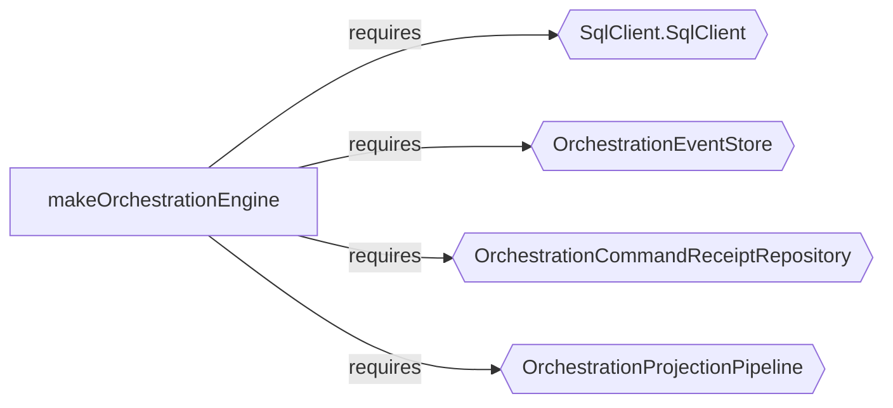

import { Aside } from '@astrojs/starlight/components';

`t3code` is a web GUI for coding agents. Its backend is evented rather than CRUD-shaped, with explicit orchestration via a command queue, event store, and projection pipeline. This walkthrough shows what the analyzer produces on the key architectural files — no special flags needed.

## OrchestrationEngine — just run it

The orchestration engine is the core of the agent runtime. Run the analyzer with no format flag:

```bash
npx effect-analyze ./apps/server/src/orchestration/Layers/OrchestrationEngine.ts \
  --tsconfig ./apps/server/tsconfig.json
```

The analyzer detects 7 non-trivial programs and picks the best output for each:

```text
%% explain [makeOrchestrationEngine]
makeOrchestrationEngine (generator):
  1. Yields sql <- SqlClient.SqlClient
  2. Yields eventStore <- OrchestrationEventStore
  3. Yields commandReceiptRepository <- OrchestrationCommandReceiptRepository
  4. Yields projectionPipeline <- OrchestrationProjectionPipeline
  5. commandQueue = queue.create
  6. eventPubSub = pubsub.create
  ...
  8. Stream: runForEach
    Calls eventStore.readAll
  9. Fiber forkScoped (scoped):
    Calls worker

  Services required: SqlClient.SqlClient, OrchestrationEventStore,
    OrchestrationCommandReceiptRepository, OrchestrationProjectionPipeline

%% mermaid-services [makeOrchestrationEngine]
...

%% mermaid [committedCommand]
...

%% mermaid [processDomainEvent]
...
```

The 38-step main program gets explain automatically (too large for a readable diagram). Smaller programs like `committedCommand`, `reconcileReadModelAfterDispatchFailure`, and `dispatch` get mermaid flowcharts. The service map appears as a bonus diagram.



A contributor now sees the runtime shape: a command queue and an event pub/sub for communication, an event store for replay (`eventStore.readAll`), a projection pipeline for read models, and a scoped worker.

The `dispatch` helper shows the Queue + Deferred pattern:

```text
dispatch (generator):
  1. result = deferred.create
  2. queue.offer
  3. Returns:
    deferred.await
```

Create a delivery receipt, enqueue work, await confirmation.

## What events does the agent runtime handle?

```bash
npx effect-analyze ./apps/server/src/orchestration/Layers/ProviderCommandReactor.ts \
  --tsconfig ./apps/server/tsconfig.json
```

```text
%% explain [make]
make (generator):
  1. Yields orchestrationEngine <- OrchestrationEngineService
  2. Yields providerService <- ProviderService
  3. Yields git <- GitCore
  4. Yields textGeneration <- TextGeneration
  5. Yields serverSettingsService <- ServerSettingsService
  6. handledTurnStartKeys = cache.create
  7. Yields worker <- makeDrainableWorker
  ...

  Services required: OrchestrationEngineService, ProviderService,
    GitCore, TextGeneration, ServerSettingsService

%% mermaid [processDomainEvent]
...
```

The `processDomainEvent` handler routes six event types:

```text
processDomainEvent (generator):
  1. Switch on event.type:
    Case "thread.runtime-mode-set":
      Yields thread <- resolveThread
      Calls ensureSessionForThread
    Case "thread.turn-start-requested":
      Calls processTurnStartRequested
    Case "thread.turn-interrupt-requested":
      Calls processTurnInterruptRequested
    Case "thread.approval-response-requested":
      Calls processApprovalResponseRequested
    Case "thread.user-input-response-requested":
      Calls processUserInputResponseRequested
    Case "thread.session-stop-requested":
      Calls processSessionStopRequested
```

A contributor adding a seventh event type knows exactly where to add it and what pattern to follow.

## Is the concurrency pattern consistent?

The push bus uses the same Queue + Deferred dispatch pattern as the orchestration engine:

```bash
npx effect-analyze ./apps/server/src/wsServer/pushBus.ts \
  --tsconfig ./apps/server/tsconfig.json
```

```text
makeServerPushBus (generator):
  1. Yields nextSequence <- make
  2. queue = queue.create
  3. Fiber forkScoped (scoped):
    Calls forever
  ...
  10. Calls forever
  11. queue.take
  ...
  17. queue.offer

makeServerPushBus.publishClient (generator):
  1. delivered = deferred.create
  2. queue.offer
  3. Returns:
    deferred.await
```

Same shape as `dispatch`: create a deferred, offer to a queue, await the result. The push bus and the orchestration engine both use this pattern, showing architectural consistency.

## Finding what to analyze

```bash
npx effect-analyze ./apps/server --coverage-audit --show-by-folder \
  --tsconfig ./apps/server/tsconfig.json
```

```text
Discovered: 197
Analyzed:   147
Zero programs: 50
Failed:     0
Coverage:   74.6%
Analyzable coverage: 100.0%
Unknown node rate: 3.87%
```

147 analyzable programs in the server, zero failures, 3.87% unknown node rate.

```bash
npx effect-analyze ./packages/shared --coverage-audit --show-by-folder \
  --tsconfig ./packages/shared/tsconfig.json
```

```text
Discovered: 12
Analyzed:   6
Zero programs: 6
Failed:     0
Coverage:   50.0%
Analyzable coverage: 100.0%
Unknown node rate: 2.22%
```

## Quick reference

| What you want | Command |
|---------------|---------|
| Best output automatically | just run `npx effect-analyze <path>` |
| Force text summary | `--format explain` |
| Force flowchart | `--format mermaid` |
| Service dependency map | `--format mermaid-services` |
| Find where the architecture lives | `--coverage-audit --show-by-folder` |
| Compare two versions of a file | `--diff old.ts new.ts` |
