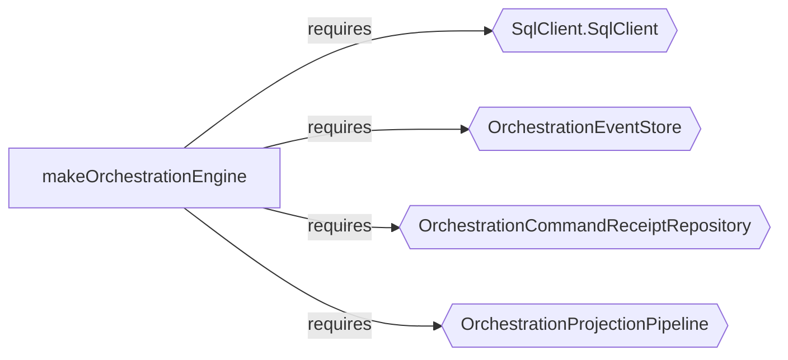

import { Aside } from '@astrojs/starlight/components';

`t3code` is a minimal web GUI for coding agents. Its backend is evented rather than CRUD-shaped, with explicit orchestration via a command queue, event store, and projection pipeline.

Shared concurrency primitives are factored into reusable layers, while the frontend sits mostly outside the workflow model.

## Audit Signal

```bash
npx effect-analyze ./apps/server --coverage-audit --show-by-folder --tsconfig ./apps/server/tsconfig.json
```

```text
Discovered: 197
Analyzed:   147
Zero programs: 50
Failed:     0
Coverage:   74.6%
Analyzable coverage: 100.0%
Unknown node rate: 3.87%
```

```bash
npx effect-analyze ./packages/shared --coverage-audit --show-by-folder --tsconfig ./packages/shared/tsconfig.json
```

```text
Discovered: 12
Analyzed:   6
Zero programs: 6
Failed:     0
Coverage:   50.0%
Analyzable coverage: 100.0%
Unknown node rate: 2.22%
```

- the backend has 147 analyzable programs with zero failures
- the shared package also contains analyzable effectful code
- 3.87% unknown node rate across the server

## Example 1: The Orchestration Engine

`OrchestrationEngine.ts` is the core of the agent runtime:

```bash
npx effect-analyze ./apps/server/src/orchestration/Layers/OrchestrationEngine.ts \
  --format explain --tsconfig ./apps/server/tsconfig.json
```

```text
makeOrchestrationEngine (generator):
  1. Yields sql <- SqlClient.SqlClient
  2. Yields eventStore <- OrchestrationEventStore
  3. Yields commandReceiptRepository <- OrchestrationCommandReceiptRepository
  4. Yields projectionPipeline <- OrchestrationProjectionPipeline
  5. commandQueue = queue.create
  6. eventPubSub = pubsub.create
  8. Stream: runForEach
    Calls eventStore.readAll
  9. Fiber forkScoped (scoped):
    Calls worker

  Services required: SqlClient.SqlClient, OrchestrationEventStore,
    OrchestrationCommandReceiptRepository, OrchestrationProjectionPipeline
```

The output shows:

- a command queue and an event pub/sub
- an event store used for replay (`eventStore.readAll`)
- a projection pipeline for read models
- a scoped worker consuming the system

The service map makes the boundary explicit:



The same file also contains the `dispatch` helper, which reveals the Queue + Deferred delivery pattern used throughout the system:

```text
dispatch (generator):
  1. result = deferred.create
  2. queue.offer
  3. Returns:
    deferred.await
```

Create a delivery receipt, enqueue work, await confirmation. This pattern recurs across the codebase.

## Example 2: The Event Dispatch Table

If the orchestration engine shows the system boundary, `ProviderCommandReactor.ts` shows the domain routing logic:

```bash
npx effect-analyze ./apps/server/src/orchestration/Layers/ProviderCommandReactor.ts \
  --format explain --tsconfig ./apps/server/tsconfig.json
```

```text
processDomainEvent (generator):
  1. Switch on event.type:
    Case "thread.runtime-mode-set":
      Yields thread <- resolveThread
      Calls ensureSessionForThread
    Case "thread.turn-start-requested":
      Calls processTurnStartRequested
    Case "thread.turn-interrupt-requested":
      Calls processTurnInterruptRequested
    Case "thread.approval-response-requested":
      Calls processApprovalResponseRequested
    Case "thread.user-input-response-requested":
      Calls processUserInputResponseRequested
    Case "thread.session-stop-requested":
      Calls processSessionStopRequested
```

This recovers the event vocabulary of the runtime and the handler each event routes to.

The `make` function reveals the full service boundary:

```text
make (generator):
  1. Yields orchestrationEngine <- OrchestrationEngineService
  2. Yields providerService <- ProviderService
  3. Yields git <- GitCore
  4. Yields textGeneration <- TextGeneration
  5. Yields serverSettingsService <- ServerSettingsService
  6. handledTurnStartKeys = cache.create
  7. Yields worker <- makeDrainableWorker

  Services required: OrchestrationEngineService, ProviderService,
    GitCore, TextGeneration, ServerSettingsService
```

## Example 3: Semantic Diff on Runtime Capability

Commit `12edc345` added plan interaction mode and user-input response handling to the provider reactor.

```bash
npx effect-analyze \
  12edc345^:apps/server/src/orchestration/Layers/ProviderCommandReactor.ts \
  12edc345:apps/server/src/orchestration/Layers/ProviderCommandReactor.ts \
  --diff --tsconfig ./apps/server/tsconfig.json
```

The diff output for `processDomainEvent`:

```text
# Effect Program Diff: processDomainEvent -> processDomainEvent

## Summary

| Metric | Count |
|--------|-------|
| Added | 1 |
| Removed | 0 |
| Unchanged | 6 |
| Structural changes | 0 |

## Step Changes

+ processUserInputResponseRequested (added)
```

And for the `make` function, which gained infrastructure to support the new capability:

```text
# Effect Program Diff: make -> make

## Summary

| Metric | Count |
|--------|-------|
| Added | 3 |
| Removed | 0 |
| Unchanged | 28 |
| Structural changes | 0 |

## Added program: program-3

Steps: Generator (2 yields)
```

The "Added program: program-3" means the constructor gained a small new effectful setup path alongside the new handler.

At a glance:

- the reactor gained a new routed capability (`processUserInputResponseRequested`)
- the rest of the event surface (6 handlers) stayed stable
- the `make` function gained 3 supporting steps and a new sub-program
- no structural changes

## Example 4: The Queue + Deferred Delivery Pattern

`pushBus.ts` uses the same concurrency idiom seen in the orchestration engine:

```bash
npx effect-analyze ./apps/server/src/wsServer/pushBus.ts \
  --format explain --tsconfig ./apps/server/tsconfig.json
```

```text
makeServerPushBus (generator):
  1. Yields nextSequence <- Ref.make
  2. queue = queue.create
  3. Fiber forkScoped (scoped):
    Calls forever
  ...
  10. Calls forever
  11. queue.take
  ...
  17. queue.offer

makeServerPushBus.publishClient (generator):
  1. delivered = deferred.create
  2. queue.offer
  3. Returns:
    deferred.await
```

The same Queue + Deferred shape appears in the orchestration engine's `dispatch` path, showing architectural consistency across the codebase.
