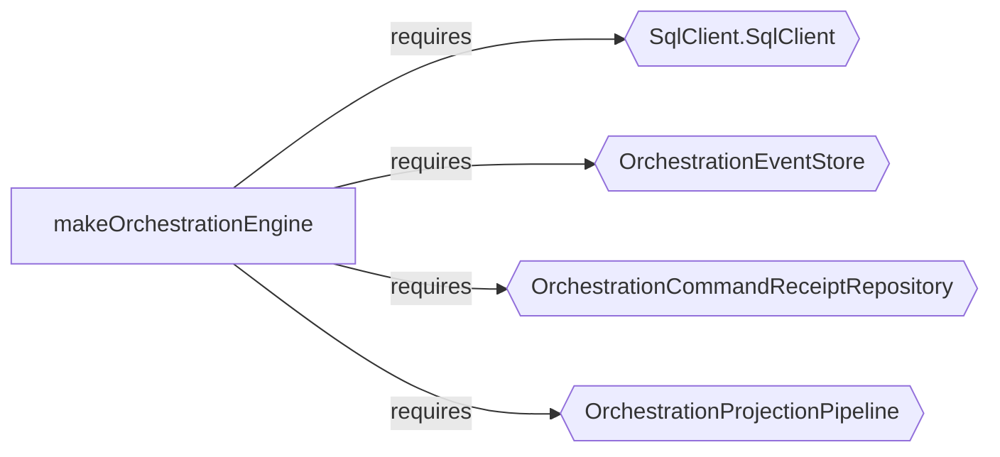
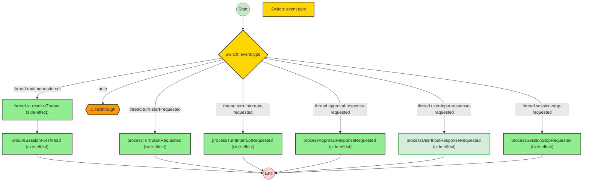

import { Aside } from '@astrojs/starlight/components';

`t3code` describes itself as a minimal web GUI for coding agents. That makes it a strong case study for effect-analyzer because the interesting question is not "does this repo use Effect?" but "can static analysis recover the actual runtime architecture that makes agent orchestration work?"

For this repository, the answer is yes.

## Why This Study Works

The best repositories for effect-analyzer are not the ones that merely contain Effect syntax. They are the ones where the operational core is expressed through queues, workers, streams, services, event stores, and orchestration loops.

`t3code` fits that shape unusually well:

- the backend is evented, not CRUD-shaped
- orchestration is explicit
- shared concurrency primitives are factored into reusable layers
- the frontend is mostly outside the workflow model, which makes the architectural boundary visible

That is exactly the kind of result a repo author can share: "here is our runtime architecture, recovered statically."

## Audit Signal

The first useful result is simply where the analyzable operational code lives.

### `apps/server`

```bash
npx effect-analyze ./apps/server --coverage-audit --show-by-folder --tsconfig ./apps/server/tsconfig.json
```

```text
Discovered: 179
Analyzed:   133
Zero programs: 46
Failed:     0
Coverage:   74.3%
Analyzable coverage: 100.0%
Unknown node rate: 3.58%
```

### `packages/shared`

```bash
npx effect-analyze ./packages/shared --coverage-audit --show-by-folder --tsconfig ./packages/shared/tsconfig.json
```

```text
Discovered: 11
Analyzed:   6
Zero programs: 5
Failed:     0
Coverage:   54.5%
Analyzable coverage: 100.0%
Unknown node rate: 2.06%
```

That is already a useful architectural read:

- the backend is heavily analyzable
- the shared package contains real operational primitives
- the interesting parts of the repo are not buried in UI code

## Example 1: The Orchestration Engine

The strongest single example in the repo is [OrchestrationEngine.ts](/Users/jreehal/dev/temp/t3code/apps/server/src/orchestration/Layers/OrchestrationEngine.ts).

```bash
npx effect-analyze ./apps/server/src/orchestration/Layers/OrchestrationEngine.ts --format explain --tsconfig ./apps/server/tsconfig.json
```

```text
makeOrchestrationEngine (generator):
  1. Yields sql <- SqlClient.SqlClient
  2. Yields eventStore <- OrchestrationEventStore
  3. Yields commandReceiptRepository <- OrchestrationCommandReceiptRepository
  4. Yields projectionPipeline <- OrchestrationProjectionPipeline
  5. commandQueue = queue.create
  6. eventPubSub = pubsub.create
  8. Stream: runForEach
    Calls eventStore.readAll
  9. Fiber forkScoped (scoped):
    Calls worker
  12. Stream: runCollect
    Calls eventStore.readFromSequence

  Services required: SqlClient.SqlClient, OrchestrationEventStore,
    OrchestrationCommandReceiptRepository, OrchestrationProjectionPipeline
```

This is the kind of output that sells the library because it tells a reviewer something non-trivial immediately:

- there is a command queue
- there is an event store
- there is a projection pipeline
- there is a scoped worker consuming the system

That is not generic "Effect code". That is the skeleton of the runtime.

The service map makes the boundary even clearer:



And the stats show that the analyzer is recovering a genuinely central subsystem rather than a toy example:

```json
{
  "program": "makeOrchestrationEngine",
  "stats": {
    "totalEffects": 36,
    "errorHandlerCount": 1,
    "unknownCount": 2
  }
}
```

## Example 2: The Event Dispatch Table

If the orchestration engine shows the system boundary, [ProviderCommandReactor.ts](/Users/jreehal/dev/temp/t3code/apps/server/src/orchestration/Layers/ProviderCommandReactor.ts) shows the domain routing logic.

```bash
npx effect-analyze ./apps/server/src/orchestration/Layers/ProviderCommandReactor.ts --format explain --tsconfig ./apps/server/tsconfig.json
```

```text
processDomainEvent (generator):
  1. Switch on event.type:
    Case "thread.runtime-mode-set":
      Yields thread <- resolveThread
      Calls ensureSessionForThread
    Case "thread.turn-start-requested":
      Calls processTurnStartRequested
    Case "thread.turn-interrupt-requested":
      Calls processTurnInterruptRequested
    Case "thread.approval-response-requested":
      Calls processApprovalResponseRequested
    Case "thread.user-input-response-requested":
      Calls processUserInputResponseRequested
    Case "thread.session-stop-requested":
      Calls processSessionStopRequested
```

This is much stronger than a generic complexity screenshot. The analyzer has recovered the public event vocabulary of the agent runtime and the handler each event routes to.

That is exactly the kind of artifact a maintainer can share:

- it helps new contributors understand the runtime model
- it shows the repo has a coherent event contract
- it demonstrates that the analyzer is useful on code with real domain meaning

## Example 3: Semantic Diff on Runtime Capability

The strongest diff example in this repo is commit `12edc345`, which added plan interaction mode and user-input response handling to the provider reactor.

This is a good sales demo because the change is not cosmetic. The runtime gained a new event path:

```bash
npx effect-analyze \
  12edc345^:apps/server/src/orchestration/Layers/ProviderCommandReactor.ts \
  12edc345:apps/server/src/orchestration/Layers/ProviderCommandReactor.ts \
  --diff \
  --format mermaid
```



This is what a maintainer wants from a semantic diff at a glance:

- the reactor gained a new routed capability
- the rest of the event surface stayed stable
- the added node is visually obvious without reading the whole file

The text diff backs that picture up:

```text
Added: 1
Removed: 0
Unchanged: 6

+ processUserInputResponseRequested
```

This is a much better showcase for the diff feature than a generic before/after snippet. It proves the analyzer can report new runtime behavior in the same visual language people use to explain systems.

## Example 4: The Queue + Deferred Delivery Pattern

[pushBus.ts](/Users/jreehal/dev/temp/t3code/apps/server/src/wsServer/pushBus.ts) is smaller, but it proves a different point: the analyzer can consistently recover the same concurrency idiom across the repo.

```bash
npx effect-analyze ./apps/server/src/wsServer/pushBus.ts --format explain --tsconfig ./apps/server/tsconfig.json
```

```text
makeServerPushBus.publishClient (generator):
  1. delivered = deferred.create
  2. queue.offer
  3. Returns:
    deferred.await
```

This is compact and highly legible. A reader who has never seen the file now understands the pattern in seconds:

1. create a delivery receipt
2. enqueue work
3. await confirmation

That same Queue + Deferred shape also appears in the orchestration engine's `dispatch` path. The fact that effect-analyzer surfaces that repeated pattern is one of the strongest arguments for using it on real codebases.

## Why This Page Is More Shareable

The current best pitch for effect-analyzer on `t3code` is not "it found lots of Effect files." It is:

- it identified the backend as the operational center
- it recovered the orchestration engine boundary statically
- it extracted the event dispatch table that defines the agent runtime
- it showed the same concurrency idiom recurring across subsystems

That is concrete enough for the repo authors to share without overselling. It reflects the architecture they actually built.

<Aside type="note">
The main limitation in this repo is still label quality around some nested Effect helpers and stream internals. The case study is strongest when it leans on orchestration boundaries, dispatch tables, and recurring concurrency patterns rather than on the noisiest low-level labels.
</Aside>
