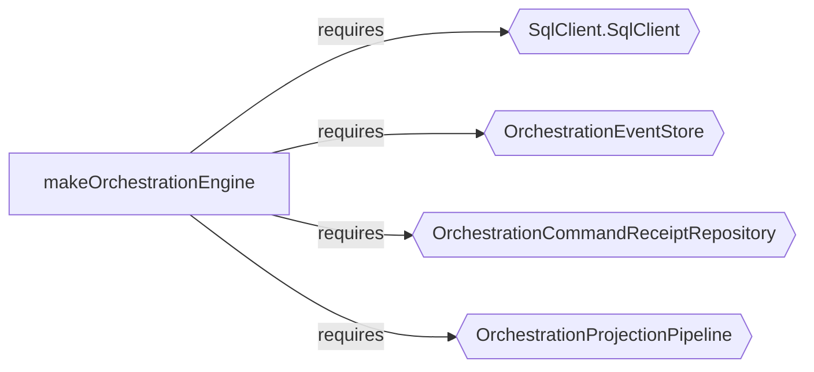

import { Aside } from '@astrojs/starlight/components';

`t3code` is a minimal web GUI for coding agents. Its backend is evented rather than CRUD-shaped, with explicit orchestration via a command queue, event store, and projection pipeline.

This walkthrough follows the path a new contributor would take: audit to find where the architecture lives, explain to understand individual components, then diff to review a real commit.

## Step 1: Where does the architecture live?

```bash
npx effect-analyze ./apps/server --coverage-audit --show-by-folder --tsconfig ./apps/server/tsconfig.json
```

```text
Discovered: 197
Analyzed:   147
Zero programs: 50
Failed:     0
Coverage:   74.6%
Analyzable coverage: 100.0%
Unknown node rate: 3.87%
```

```bash
npx effect-analyze ./packages/shared --coverage-audit --show-by-folder --tsconfig ./packages/shared/tsconfig.json
```

```text
Discovered: 12
Analyzed:   6
Zero programs: 6
Failed:     0
Coverage:   50.0%
Analyzable coverage: 100.0%
Unknown node rate: 2.22%
```

147 analyzable programs in the server, zero failures, 3.87% unknown node rate.

**Without the analyzer**, a new contributor would need to browse the directory tree and open files to figure out which parts of the server contain the orchestration logic vs. utility code. The audit points directly to the operational core.

## Step 2: How does the orchestration engine work?

`OrchestrationEngine.ts` is the core of the agent runtime. Reading it directly means working through 200+ lines of queue setup, stream processing, worker management, and error handling. The analyzer extracts the structure:

```bash
npx effect-analyze ./apps/server/src/orchestration/Layers/OrchestrationEngine.ts \
  --format explain --tsconfig ./apps/server/tsconfig.json
```

```text
makeOrchestrationEngine (generator):
  1. Yields sql <- SqlClient.SqlClient
  2. Yields eventStore <- OrchestrationEventStore
  3. Yields commandReceiptRepository <- OrchestrationCommandReceiptRepository
  4. Yields projectionPipeline <- OrchestrationProjectionPipeline
  5. commandQueue = queue.create
  6. eventPubSub = pubsub.create
  8. Stream: runForEach
    Calls eventStore.readAll
  9. Fiber forkScoped (scoped):
    Calls worker

  Services required: SqlClient.SqlClient, OrchestrationEventStore,
    OrchestrationCommandReceiptRepository, OrchestrationProjectionPipeline
```

Now a contributor understands the runtime shape:

- a command queue and an event pub/sub for communication
- an event store used for replay (`eventStore.readAll`)
- a projection pipeline for read models
- a scoped worker running within the orchestration scope



The same file also contains the `dispatch` helper:

```text
dispatch (generator):
  1. result = deferred.create
  2. queue.offer
  3. Returns:
    deferred.await
```

Create a delivery receipt, enqueue work, await confirmation. This Queue + Deferred pattern recurs across the codebase (see Step 5).

## Step 3: What events does the agent runtime handle?

A contributor adding a new agent capability needs to know: what events exist, and what handles each one?

```bash
npx effect-analyze ./apps/server/src/orchestration/Layers/ProviderCommandReactor.ts \
  --format explain --tsconfig ./apps/server/tsconfig.json
```

```text
processDomainEvent (generator):
  1. Switch on event.type:
    Case "thread.runtime-mode-set":
      Yields thread <- resolveThread
      Calls ensureSessionForThread
    Case "thread.turn-start-requested":
      Calls processTurnStartRequested
    Case "thread.turn-interrupt-requested":
      Calls processTurnInterruptRequested
    Case "thread.approval-response-requested":
      Calls processApprovalResponseRequested
    Case "thread.user-input-response-requested":
      Calls processUserInputResponseRequested
    Case "thread.session-stop-requested":
      Calls processSessionStopRequested
```

Six event types, each mapped to a clear handling path. A contributor adding a seventh now knows exactly where to add it and what the pattern looks like.

The `make` function shows what services the reactor depends on:

```text
make (generator):
  1. Yields orchestrationEngine <- OrchestrationEngineService
  2. Yields providerService <- ProviderService
  3. Yields git <- GitCore
  4. Yields textGeneration <- TextGeneration
  5. Yields serverSettingsService <- ServerSettingsService
  6. handledTurnStartKeys = cache.create
  7. Yields worker <- makeDrainableWorker

  Services required: OrchestrationEngineService, ProviderService,
    GitCore, TextGeneration, ServerSettingsService
```

## Step 4: Reviewing a commit that adds a new capability

Commit `12edc345` added plan interaction mode and user-input response handling. The text diff touches dozens of lines across error handling, cache logic, and the reactor constructor. The semantic diff shows what actually changed structurally:

```bash
npx effect-analyze \
  12edc345^:apps/server/src/orchestration/Layers/ProviderCommandReactor.ts \
  12edc345:apps/server/src/orchestration/Layers/ProviderCommandReactor.ts \
  --diff --tsconfig ./apps/server/tsconfig.json
```

```text
# Effect Program Diff: processDomainEvent -> processDomainEvent

## Summary

| Metric | Count |
|--------|-------|
| Added | 1 |
| Removed | 0 |
| Unchanged | 6 |
| Structural changes | 0 |

## Step Changes

+ processUserInputResponseRequested (added)
```

```text
# Effect Program Diff: make -> make

## Summary

| Metric | Count |
|--------|-------|
| Added | 3 |
| Removed | 0 |
| Unchanged | 28 |
| Structural changes | 0 |

## Added program: program-3

Steps: Generator (2 yields)
```

The `Added program: program-3` line means the constructor gained a small new setup path alongside the new handler.

A reviewer now knows:

- the reactor gained one new routed capability (`processUserInputResponseRequested`)
- the rest of the event surface (6 handlers) stayed stable
- the `make` function gained 3 supporting steps and a new sub-program
- no structural churn beyond the added capability

**Without the analyzer**, a reviewer would need to read the full text diff and mentally separate the new event handler from the surrounding refactoring noise. The semantic diff isolates the structural change: one new event, everything else unchanged.

## Step 5: Is the concurrency pattern consistent?

The orchestration engine uses Queue + Deferred for dispatch (Step 2). Does the rest of the codebase follow the same pattern?

```bash
npx effect-analyze ./apps/server/src/wsServer/pushBus.ts \
  --format explain --tsconfig ./apps/server/tsconfig.json
```

```text
makeServerPushBus (generator):
  1. Yields nextSequence <- Ref.make
  2. queue = queue.create
  3. Fiber forkScoped (scoped):
    Calls forever
  ...
  10. Calls forever
  11. queue.take
  ...
  17. queue.offer

makeServerPushBus.publishClient (generator):
  1. delivered = deferred.create
  2. queue.offer
  3. Returns:
    deferred.await
```

Same shape: create a deferred, offer to a queue, await the result. The push bus and the orchestration engine both use this pattern, showing architectural consistency across the codebase.

**Without the analyzer**, you would only discover this by reading both files and recognizing the pattern yourself. With the analyzer, the structural similarity is visible at a glance.
