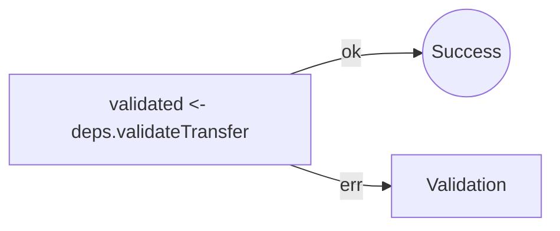
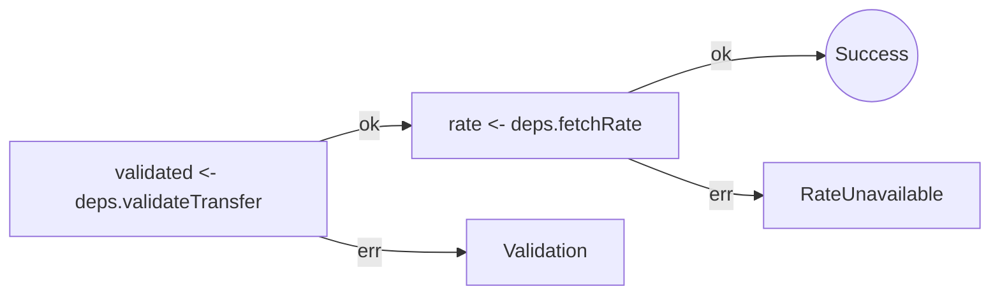
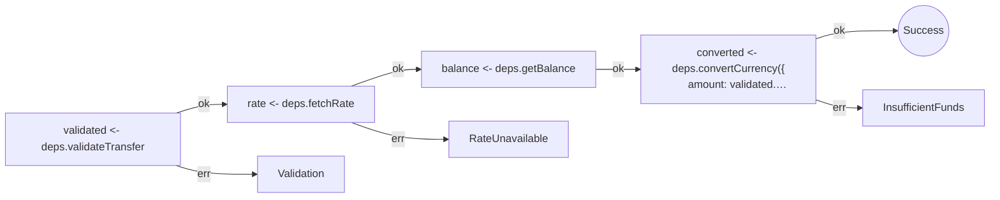
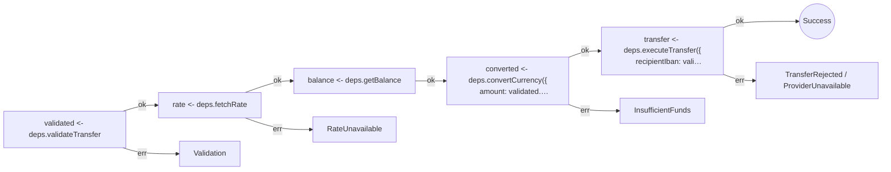
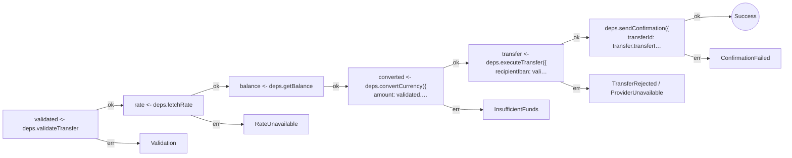

This page is generated from the local transfer fixture and the current `effect-analyzer` implementation.

Every Mermaid block below comes from static analysis of the TypeScript source in `apps/docs/samples/observability-transfer/evolution`.

No code is executed. If the analyzer changes, rerun `pnpm --dir apps/docs run generate:transfer-observability` and this page will update.

## Step 1: Validate input

One operation. One possible failure. The type system already knows what can go wrong.



- **Effects**: 1
- **Error paths**: ValidationError

### Raw effect-analyze output

```
createSendMoneyWorkflow (generator):
  1. validated = Effect.pipe — service-call

  Services required: Effect
  Error paths: ValidationError
  Concurrency: sequential (no parallelism)
```

```json
[
  {
    "program": "createSendMoneyWorkflow",
    "stats": {
      "totalEffects": 1,
      "parallelCount": 0,
      "raceCount": 0,
      "errorHandlerCount": 0,
      "retryCount": 0,
      "timeoutCount": 0,
      "resourceCount": 0,
      "loopCount": 0,
      "conditionalCount": 0,
      "layerCount": 0,
      "interruptionCount": 0,
      "unknownCount": 0,
      "decisionCount": 0,
      "switchCount": 0,
      "tryCatchCount": 0,
      "terminalCount": 0,
      "opaqueCount": 0
    }
  }
]
```

## Step 2: + Fetch exchange rate

A second step, a second way to fail. The error channel grows automatically.



- **Effects**: 2
- **Error paths**: RateUnavailableError, ValidationError

### Raw effect-analyze output

```
createSendMoneyWorkflow (generator):
  1. validated = Effect.pipe — service-call
  2. rate = Effect.pipe — service-call

  Services required: Effect
  Error paths: RateUnavailableError, ValidationError
  Concurrency: sequential (no parallelism)
```

```json
[
  {
    "program": "createSendMoneyWorkflow",
    "stats": {
      "totalEffects": 2,
      "parallelCount": 0,
      "raceCount": 0,
      "errorHandlerCount": 0,
      "retryCount": 0,
      "timeoutCount": 0,
      "resourceCount": 0,
      "loopCount": 0,
      "conditionalCount": 0,
      "layerCount": 0,
      "interruptionCount": 0,
      "unknownCount": 0,
      "decisionCount": 0,
      "switchCount": 0,
      "tryCatchCount": 0,
      "terminalCount": 0,
      "opaqueCount": 0
    }
  }
]
```

## Step 3: + Check balance & convert

Balance check introduces a new failure mode. The compiler tracks it, you don't have to.



- **Effects**: 4
- **Error paths**: InsufficientFundsError, RateUnavailableError, ValidationError

### Raw effect-analyze output

```
createSendMoneyWorkflow (generator):
  1. validated = Effect.pipe — service-call
  2. rate = Effect.pipe — service-call
  3. balance = Effect.pipe — service-call
  4. converted = Effect.pipe — service-call

  Services required: Effect
  Error paths: InsufficientFundsError, RateUnavailableError, ValidationError
  Concurrency: sequential (no parallelism)
```

```json
[
  {
    "program": "createSendMoneyWorkflow",
    "stats": {
      "totalEffects": 4,
      "parallelCount": 0,
      "raceCount": 0,
      "errorHandlerCount": 0,
      "retryCount": 0,
      "timeoutCount": 0,
      "resourceCount": 0,
      "loopCount": 0,
      "conditionalCount": 0,
      "layerCount": 0,
      "interruptionCount": 0,
      "unknownCount": 0,
      "decisionCount": 0,
      "switchCount": 0,
      "tryCatchCount": 0,
      "terminalCount": 0,
      "opaqueCount": 0
    }
  }
]
```

## Step 4: + Execute transfer

The money moves. Two new failure modes from the external provider. Still zero runtime needed to see them.



- **Effects**: 5
- **Error paths**: InsufficientFundsError, ProviderUnavailableError, RateUnavailableError, TransferRejectedError, ValidationError

### Raw effect-analyze output

```
createSendMoneyWorkflow (generator):
  1. validated = Effect.pipe — service-call
  2. rate = Effect.pipe — service-call
  3. balance = Effect.pipe — service-call
  4. converted = Effect.pipe — service-call
  5. transfer = Effect.pipe — service-call

  Services required: Effect
  Error paths: InsufficientFundsError, ProviderUnavailableError, RateUnavailableError, TransferRejectedError, ValidationError
  Concurrency: sequential (no parallelism)
```

```json
[
  {
    "program": "createSendMoneyWorkflow",
    "stats": {
      "totalEffects": 5,
      "parallelCount": 0,
      "raceCount": 0,
      "errorHandlerCount": 0,
      "retryCount": 0,
      "timeoutCount": 0,
      "resourceCount": 0,
      "loopCount": 0,
      "conditionalCount": 0,
      "layerCount": 0,
      "interruptionCount": 0,
      "unknownCount": 0,
      "decisionCount": 0,
      "switchCount": 0,
      "tryCatchCount": 0,
      "terminalCount": 0,
      "opaqueCount": 0
    }
  }
]
```

## Step 5: + Send confirmation (complete)

The complete workflow. Six effects, six error channels, zero ambiguity. Every path is visible before a single line runs.



- **Effects**: 6
- **Error paths**: ConfirmationFailedError, InsufficientFundsError, ProviderUnavailableError, RateUnavailableError, TransferRejectedError, ValidationError

### Raw effect-analyze output

```
createSendMoneyWorkflow (generator):
  1. validated = Effect.pipe — service-call
  2. rate = Effect.pipe — service-call
  3. balance = Effect.pipe — service-call
  4. converted = Effect.pipe — service-call
  5. transfer = Effect.pipe — service-call
  6. Calls Effect.pipe — service-call

  Services required: Effect
  Error paths: ConfirmationFailedError, InsufficientFundsError, ProviderUnavailableError, RateUnavailableError, TransferRejectedError, ValidationError
  Concurrency: sequential (no parallelism)
```

```json
[
  {
    "program": "createSendMoneyWorkflow",
    "stats": {
      "totalEffects": 6,
      "parallelCount": 0,
      "raceCount": 0,
      "errorHandlerCount": 0,
      "retryCount": 0,
      "timeoutCount": 0,
      "resourceCount": 0,
      "loopCount": 0,
      "conditionalCount": 0,
      "layerCount": 0,
      "interruptionCount": 0,
      "unknownCount": 0,
      "decisionCount": 0,
      "switchCount": 0,
      "tryCatchCount": 0,
      "terminalCount": 0,
      "opaqueCount": 0
    }
  }
]
```

## Related

- [Transfer Observability](/effect-analyzer/case-studies/transfer-observability/) for the narrative around implementation, review, testing, and communication.

