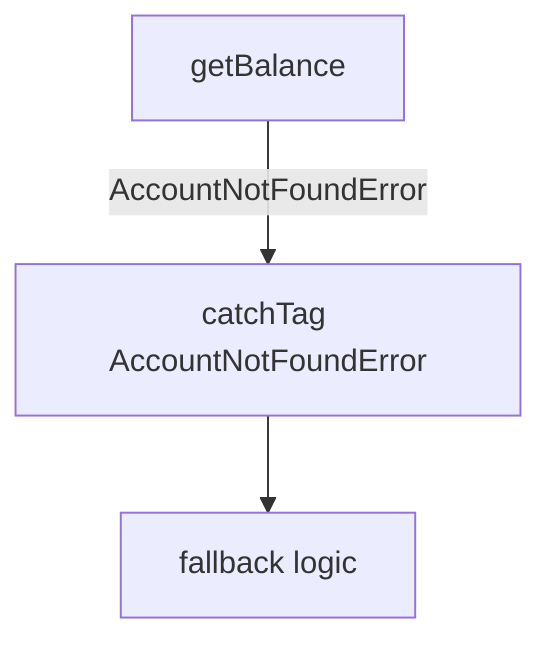

import { Aside } from '@astrojs/starlight/components';
import DiagramSource from '../../../components/DiagramSource.astro';

The **error flow diagram** visualizes how errors propagate through your Effect program - which steps produce errors, which handlers catch them, and which errors remain unhandled at the program boundary.

## Generating an Error Flow Diagram

```bash
npx effect-analyze ./src/transfer.ts --format mermaid-errors
```

The diagram shows:

- **Error producers** - steps that can fail, annotated with their error types
- **Error handlers** - `catch`, `catchTag`, `catchTags` nodes that intercept errors
- **Unhandled errors** - errors that propagate out of the program without being caught

For a program with `AccountNotFoundError` and `InsufficientFundsError`:

<DiagramSource
  sourcePath="packages/effect-analyzer/src/__fixtures__/docs/transfer-workflow.ts"
  title="transfer-workflow.ts"
  mermaid={`graph TB
  getBalance -->|AccountNotFoundError| ERR1[AccountNotFoundError]
  decision -->|InsufficientFundsError| ERR2[InsufficientFundsError]
  debit -->|AccountNotFoundError| ERR1
  credit -->|AccountNotFoundError| ERR1
  ERR1 -.->|unhandled| BOUNDARY[Program Boundary]
  ERR2 -.->|unhandled| BOUNDARY`}
/>

If the program includes a `catchTag` handler, the diagram shows the error being intercepted:



## When Auto Mode Selects Error Flow

Auto mode includes the error flow view when your program has:

- Multiple distinct error types
- One or more error handler nodes (`catch`, `catchTag`, `catchTags`)
- A mix of handled and unhandled errors

## Cause Diagrams

For programs that use `Cause.match` or `Exit.match`, the **causes** diagram shows the cause hierarchy:

```bash
npx effect-analyze ./src/program.ts --format mermaid-causes
```

This visualizes `Fail`, `Die`, `Interrupt`, and composite causes (`Sequential`, `Parallel`).

## Programmatic Usage

Generate error flow diagrams through the library API:

```ts
import { analyze } from "effect-analyzer/analysis"
import { renderErrorsMermaid } from "effect-analyzer/diagram"
import { Effect } from "effect"

const ir = await Effect.runPromise(analyze("./src/transfer.ts").single())
const diagram = renderErrorsMermaid(ir)

console.log(diagram)
```

<Aside type="note">
The error flow diagram shows the static error structure. For deeper analysis including error propagation tracking and validation, see [Error Analysis](/effect-analyzer/analysis/errors/).
</Aside>

## Related

- [Error Analysis](/effect-analyzer/analysis/errors/) - programmatic error flow analysis with `analyzeErrorFlow` and `analyzeErrorPropagation`
- [Railway Diagrams](/effect-analyzer/diagrams/railway/) - shows errors as branches off the happy path
- [Strict Diagnostics](/effect-analyzer/project/diagnostics/) - lint rules for missing error types
