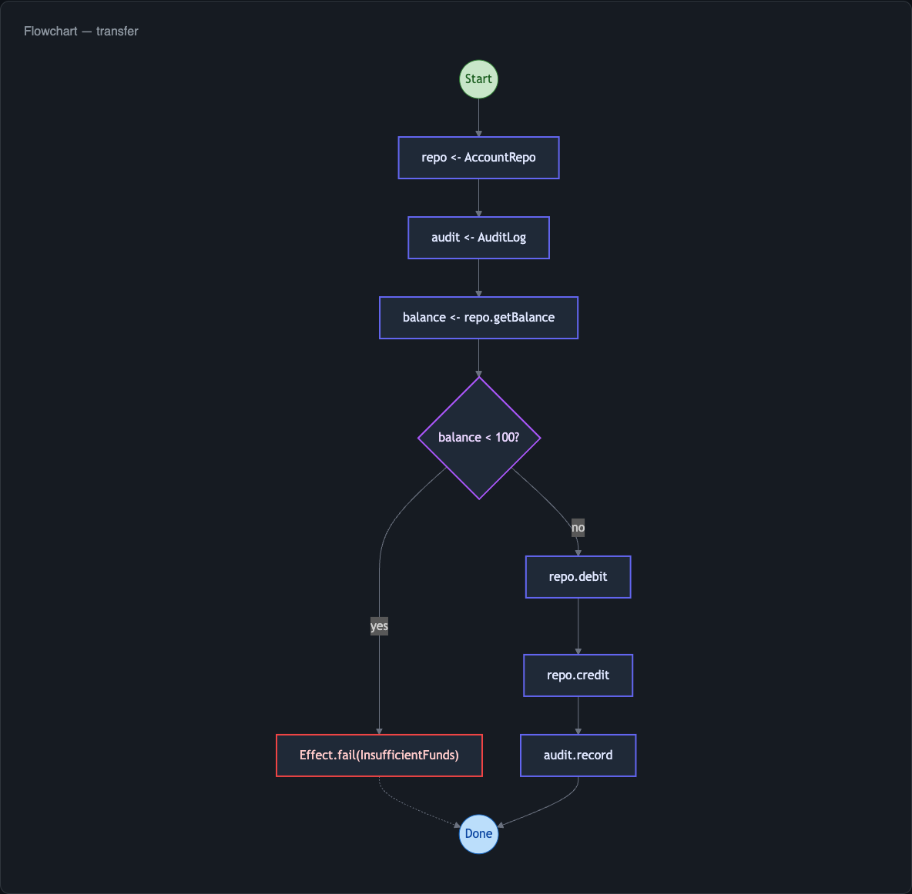

import { Aside } from '@astrojs/starlight/components';

effect-analyzer produces Mermaid diagrams that visualize the structure of your Effect programs. When you run the analyzer without specifying a format, **auto mode** examines your program and selects the most informative views.



## Auto Mode

Auto mode is the default behavior when you run:

```bash
npx effect-analyze ./src/program.ts
```

It always produces a **baseline diagram** - railway for simple programs, flowchart for complex ones - plus up to two specialized views based on what your program contains. The selection uses a combination of hard rules and soft heuristics.

### Hard Rules

Certain IR patterns always trigger a specific diagram type:

| Pattern Detected | Diagram Selected |
|---|---|
| `Effect.all` with concurrency, `Effect.race` | Concurrency view |
| Conditional branches, `Effect.if` | Decision tree |
| `Effect.loop`, `Effect.iterate` | Standard flowchart |
| Multiple services or layers | Service map |

### Soft Heuristics

When hard rules do not apply, the analyzer scores your program on several dimensions:

- **Complexity** - low cyclomatic complexity favors railway; high complexity favors flowchart
- **Error density** - many error types or handlers trigger the error flow view
- **Service count** - programs with several `Context.Tag` dependencies get a service map
- **Retry/timeout presence** - retry or timeout nodes trigger the retry timeline view
- **Layer composition** - programs with `Layer.provide` or `Layer.merge` get a layer graph

The `inferBestDiagramType` function implements the baseline selection:

```ts
import { inferBestDiagramType } from "effect-analyzer"

const type = inferBestDiagramType(ir)
// Returns 'railway' or 'mermaid'
```

### Overriding Auto Mode

Specify a format explicitly to bypass auto-detection:

```bash
npx effect-analyze ./src/program.ts --format mermaid-services
```

## Available Diagram Types

### Mermaid Diagrams

effect-analyzer includes 15 Mermaid diagram renderers, each optimized for a different aspect of your program:

| Format | Description |
|---|---|
| `mermaid` | Standard flowchart showing all control-flow paths |
| `mermaid-railway` | Linear happy path with error branches - best for sequential programs |
| `mermaid-paths` | All execution paths rendered as separate flows |
| `mermaid-enhanced` | Rich annotations per node (types, services, errors) |
| `mermaid-services` | Service dependency map showing which steps require which services |
| `mermaid-errors` | Error handling and propagation visualization |
| `mermaid-decisions` | Conditional branching tree |
| `mermaid-causes` | Cause and Exit error wrapping hierarchy |
| `mermaid-concurrency` | Parallel and race patterns with fork/join structure |
| `mermaid-timeline` | Step sequence displayed as a timeline |
| `mermaid-layers` | Layer composition and dependency graph |
| `mermaid-retry` | Retry and timeout strategy visualization |
| `mermaid-testability` | Which steps need mocking and what to test |
| `mermaid-dataflow` | Data dependencies between steps in a pipeline |

### Structured Output

| Format | Description |
|---|---|
| `json` | Full IR as JSON - use for tooling integration |
| `stats` | Complexity metrics and analysis statistics |
| `explain` | Plain-English narrative of what the program does |
| `summary` | One-line description per program |
| `matrix` | Program-by-service dependency table |
| `showcase` | Detailed step-by-step breakdown with annotations |

### API Documentation

| Format | Description |
|---|---|
| `api-docs` | Extract `HttpApi` structure to markdown |
| `openapi-paths` | Minimal OpenAPI paths for spec merging |
| `openapi-runtime` | Full OpenAPI spec via runtime `OpenApi.fromApi` |

## Diagram Direction

Control the flow direction of Mermaid diagrams with the `--direction` flag:

```bash
npx effect-analyze ./src/program.ts --direction LR
```

| Value | Direction |
|---|---|
| `TB` | Top to bottom (default for flowcharts) |
| `LR` | Left to right (default for railway) |
| `BT` | Bottom to top |
| `RL` | Right to left |

<Aside type="note">
Railway diagrams default to `LR` (left to right) because the linear flow reads naturally in that orientation. All other diagram types default to `TB` (top to bottom).
</Aside>

## Next Steps

- [Railway Diagrams](/effect-analyzer/diagrams/railway/) - the linear happy-path view in detail
- [Service Maps](/effect-analyzer/diagrams/services/) - visualizing service dependencies
- [All Formats](/effect-analyzer/diagrams/all-formats/) - complete reference for every format
