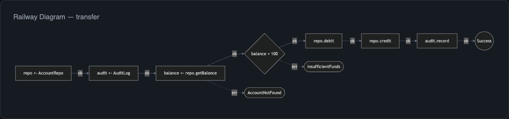
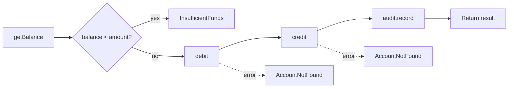

import { Aside } from '@astrojs/starlight/components';

The **railway diagram** is the signature visualization of effect-analyzer. Inspired by the railway-oriented programming pattern, it renders your Effect program as a straight-line happy path with error branches forking off at failure points.



## The Railway Pattern

In a railway diagram, the main track represents the success path - the sequence of operations that execute when everything goes right. At each point where a failure can occur, an error branch splits off to show what happens on failure.

This makes it immediately clear:

- What the program does when it succeeds
- Where failures can happen
- What error types are produced at each point

## Generating a Railway Diagram

```bash
npx effect-analyze ./src/transfer.ts --format mermaid-railway
```

For the transfer program from the [Quick Start](/effect-analyzer/quick-start/), this produces a Mermaid diagram like:



The solid arrows trace the happy path. Dashed arrows indicate error branches.

## When Auto Mode Selects Railway

Auto mode picks the railway diagram as the baseline when your program has:

- **Low cyclomatic complexity** - few branching points
- **Linear structure** - mostly sequential `yield*` steps in a generator
- **No parallel or race patterns** - those push auto mode toward the concurrency view

Programs with `Effect.gen` and a series of yields are the ideal fit for railway diagrams.

## Direction

Railway diagrams default to **left-to-right** (`LR`) flow, which reads naturally as a timeline. Override this with the `--direction` flag:

```bash
npx effect-analyze ./src/transfer.ts --format mermaid-railway --direction TB
```

| Direction | Best For |
|---|---|
| `LR` | Default - reads like a timeline |
| `TB` | Tall, narrow programs |
| `RL` | Right-to-left reading order |
| `BT` | Bottom-up flow |

## Programmatic Usage

Generate railway diagrams through the library API:

```ts
import { analyze } from "effect-analyzer"
import { renderRailwayMermaid } from "effect-analyzer"
import { Effect } from "effect"

const ir = await Effect.runPromise(analyze("./src/transfer.ts").single())
const diagram = renderRailwayMermaid(ir, { direction: "LR" })

console.log(diagram)
```

## Style Guide Mode

Enable `--style-guide` for cleaner diagrams that apply readability heuristics - collapsing trivial nodes, shortening labels, and reducing visual noise:

```bash
npx effect-analyze ./src/transfer.ts --format mermaid-railway --style-guide
```

<Aside type="note">
The style guide mode is especially useful for documentation. It produces diagrams that are easier to read at a glance, at the cost of some detail.
</Aside>

## When to Use Other Diagrams

Railway diagrams work best for linear, sequential programs. If your program has:

- **Heavy branching** - use `mermaid-decisions` or the standard `mermaid` flowchart
- **Parallel operations** - use `mermaid-concurrency`
- **Complex error handling** - use [Error Flows](/effect-analyzer/diagrams/errors/)
- **Many services** - use [Service Maps](/effect-analyzer/diagrams/services/)
