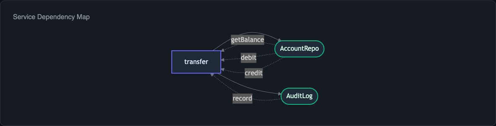
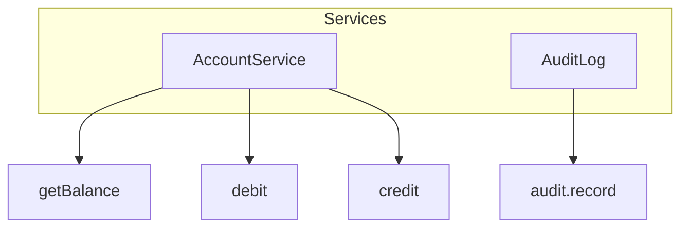

import { Aside } from '@astrojs/starlight/components';

The **service map** diagram shows which `Context.Tag` services your Effect program depends on and how steps in the program consume those services. For project-wide analysis, the `--service-map` flag produces a deduplicated registry of all services across your codebase.



## Generating a Service Map

```bash
npx effect-analyze ./src/transfer.ts --format mermaid-services
```

This produces a Mermaid diagram that groups steps by the services they require. Each service appears as a node, with edges connecting it to the steps that consume it.

For a program that depends on `AccountService` and `AuditLog`:



## When Auto Mode Selects Services

Auto mode includes a service map when your program has two or more distinct `Context.Tag` dependencies. Programs with a single service or no services skip this view in favor of more relevant diagrams.

## Project-Wide Service Map

When analyzing a directory, use `--service-map` to discover all services across the project and see which files consume them:

```bash
npx effect-analyze ./src --service-map
```

This deduplicates services that appear in multiple files and produces a consolidated registry showing:

- Every `Context.Tag` defined in the project
- Which files provide implementations (via `Layer`)
- Which files consume the service (via `yield*` or `Effect.provideService`)

<Aside type="note">
The project-wide service map is especially useful for understanding the dependency injection topology of a large Effect application. It answers questions like "who provides `DatabaseService`?" and "who depends on it?"
</Aside>

## Programmatic Usage

Generate service maps through the library API:

```ts
import { analyze, renderServiceGraphMermaid } from "effect-analyzer"
import { Effect } from "effect"

const ir = await Effect.runPromise(analyze("./src/transfer.ts").single())
const diagram = renderServiceGraphMermaid(ir)

console.log(diagram)
```

For project-wide analysis:

```ts
import { buildProjectServiceMap } from "effect-analyzer"

const serviceMap = buildProjectServiceMap(allIRs)
// serviceMap.services - Map of service name to ServiceArtifact
```

The `ServiceArtifact` type contains:

- `tagName` - the `Context.Tag` identifier
- `providers` - files and layers that provide an implementation
- `consumers` - files and steps that consume the service

## Colocated Output

When running in directory mode with `--colocate`, each generated `.effect-analysis.md` file includes the service dependencies for that file's programs:

```bash
npx effect-analyze ./src --colocate
```

This writes a `*.effect-analysis.md` file next to each source file, containing diagrams, complexity metrics, and the service dependency list.

## Related

- [Diagram Overview](/effect-analyzer/diagrams/overview/) - how auto-detection selects diagrams
- [Library API](/effect-analyzer/reference/api/) - `buildProjectServiceMap`, `renderServiceGraphMermaid`
- [Coverage Audit](/effect-analyzer/project/coverage-audit/) - project-wide analysis including service usage
