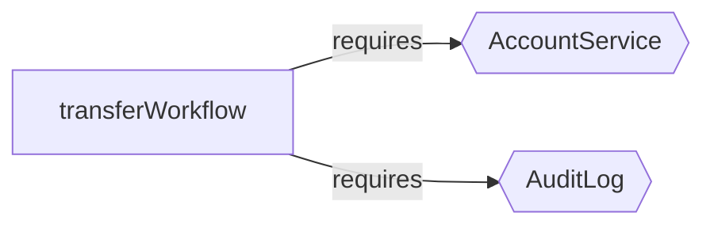

import { Card, CardGrid } from '@astrojs/starlight/components';

## The Standout Features

<CardGrid>
  <Card title="Live Browser Playground" icon="document">
    Paste Effect code into a static in-browser playground and get a rendered railway diagram immediately.

    [Open the playground](/effect-analyzer/playground/)
  </Card>
  <Card title="Interactive HTML Export" icon="pencil">
    Generate a shareable analysis page with search, filters, path explorer, themes, and embedded IR.

    [Open the HTML demo](/effect-analyzer/reference/html-viewer/)
  </Card>
</CardGrid>

These two features are what make the library easy to share: one lets people try it instantly, the other turns analysis into a linkable artifact.

## See It in Action

Example fixture: `packages/effect-analyzer/src/__fixtures__/docs/transfer-workflow.ts`

```ts
export const transferWorkflow = (
  fromAccountId: string,
  toAccountId: string,
  amount: number,
) =>
  Effect.gen(function* () {
    const accounts = yield* AccountService
    const audit = yield* AuditLog

    const balance = yield* accounts.getBalance(fromAccountId)
    if (balance < amount) {
      return yield* Effect.fail(new InsufficientFundsError(balance, amount))
    }

    yield* accounts.debit(fromAccountId, amount)
    yield* accounts.credit(toAccountId, amount)
    yield* audit.record(`Transferred ${amount} from ${fromAccountId} to ${toAccountId}`)
  })
```

```text
$ npx effect-analyze ./src/__fixtures__/docs/transfer-workflow.ts --format explain

transferWorkflow (generator):
  1. Yields accounts <- AccountService
  2. Yields audit <- AuditLog
  3. Yields balance <- accounts.getBalance
  4. If balance < amount:
    Returns:
      Calls fail - constructor
  5. Calls accounts.debit
  6. Calls accounts.credit
  7. Calls audit.record

  Services required: AccountService, AuditLog
  Error paths: AccountNotFoundError, InsufficientFundsError
  Concurrency: sequential (no parallelism)
```



## Features

<CardGrid>
  <Card title="Static Analysis" icon="magnifier">
    Analyze Effect programs without execution. Extracts generators, pipes, services, layers, error handlers, and control flow.
  </Card>
  <Card title="Mermaid Diagrams" icon="document">
    Auto-generate flowcharts, railway diagrams, service maps, error flows, concurrency views, and more.
  </Card>
  <Card title="Complexity Metrics" icon="warning">
    Calculate cyclomatic complexity, cognitive complexity, path counts, nesting depth, and parallel breadth.
  </Card>
  <Card title="Semantic Diff" icon="pencil">
    Compare two versions of an Effect program to see what changed - steps added, removed, or modified.
  </Card>
</CardGrid>

## Start With The Visuals

- [Try the live playground](/effect-analyzer/playground/) to paste code and see the railway diagram in the browser.
- [Open the interactive HTML demo](/effect-analyzer/reference/html-viewer/) to see the exported viewer embedded directly in the docs.
- [Read the `t3code` case study](/effect-analyzer/case-studies/t3code/) to see Mermaid diff output used on a real codebase.

## Quick Start

```bash
# Install
npm install effect-analyzer

# Analyze a file
npx effect-analyze ./src/my-program.ts

# Generate a railway diagram
npx effect-analyze ./src/my-program.ts --format mermaid-railway

# Compare versions
npx effect-analyze HEAD:program.ts program.ts --diff
```
