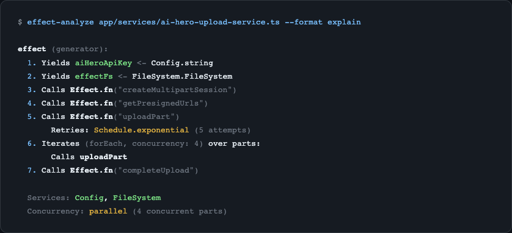

import { Card, CardGrid } from '@astrojs/starlight/components';

## See It in Action




## Features

<CardGrid>
  <Card title="Static Analysis" icon="magnifier">
    Analyze Effect programs without execution. Extracts generators, pipes, services, layers, error handlers, and control flow.
  </Card>
  <Card title="Mermaid Diagrams" icon="document">
    Auto-generate flowcharts, railway diagrams, service maps, error flows, concurrency views, and more.
  </Card>
  <Card title="Complexity Metrics" icon="warning">
    Calculate cyclomatic complexity, cognitive complexity, path counts, nesting depth, and parallel breadth.
  </Card>
  <Card title="Semantic Diff" icon="pencil">
    Compare two versions of an Effect program to see what changed - steps added, removed, or modified.
  </Card>
</CardGrid>

## Quick Start

```bash
# Install
npm install effect-analyzer

# Analyze a file
npx effect-analyze ./src/my-program.ts

# Generate a railway diagram
npx effect-analyze ./src/my-program.ts --format mermaid-railway

# Compare versions
npx effect-analyze HEAD:program.ts program.ts --diff
```
