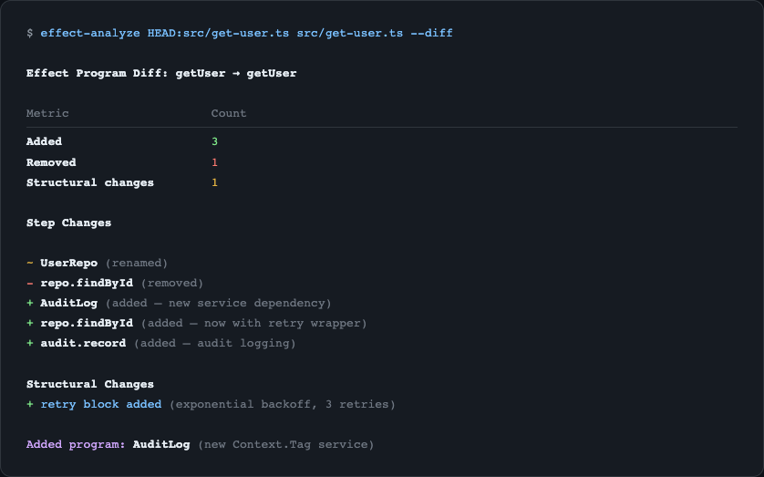

import { Aside } from '@astrojs/starlight/components';

**effect-analyzer** is a static analysis toolkit for [Effect](https://effect.website/) programs. It parses your TypeScript source code using [ts-morph](https://ts-morph.com/), extracts a typed **intermediate representation** (IR) of every Effect program it finds, and renders that IR into diagrams, metrics, reports, and structured data - all without executing your code.

Think of it as a compiler front-end for Effect workflows. Where a compiler turns source into machine code, effect-analyzer turns source into understanding.

## What It Detects

The analyzer recognizes a broad set of Effect patterns and control-flow constructs:

- **Generators** - `Effect.gen` functions with `yield*` bindings
- **Pipes** - `Effect.pipe` and `.pipe()` chains
- **Services** - `Context.Tag` dependencies and `Layer` providers
- **Layers** - `Layer.effect`, `Layer.provide`, `Layer.merge` compositions
- **Error handlers** - `Effect.catchAll`, `Effect.catchTag`, `Effect.catchTags`
- **Parallel & race** - `Effect.all` with concurrency, `Effect.race`
- **Retry & timeout** - `Effect.retry`, `Effect.timeout`, schedule-based policies
- **Streams** - `Stream` pipelines and operators
- **Fibers** - `Effect.fork`, `Fiber.join`, `Fiber.interrupt`
- **Conditionals & loops** - `Effect.if`, `Effect.loop`, `Effect.iterate`
- **Cause & Exit** - `Cause.match`, `Exit.match` patterns
- **Resources** - `Effect.acquireRelease`, `Scope`-managed lifecycles

## The Intermediate Representation

Every detected program is converted into a `StaticEffectIR` - a tree of typed nodes that captures the structure of your Effect code. Each node records its type (effect, generator, parallel, error-handler, etc.), its children, its service dependencies, its error types, and its source location.

This IR is the foundation for everything the tool produces. Renderers transform it into Mermaid diagrams. Analyzers compute complexity metrics from it. Diff tools compare two IRs to find structural changes.

```
TypeScript Source → ts-morph AST → Effect IR → Output
```

Because the IR is a plain data structure, you can also consume it directly in your own tooling via the library API.

## Who It Is For

- **Developers** exploring unfamiliar Effect codebases or reviewing pull requests
- **Teams** generating living documentation for complex workflows
- **CI/CD pipelines** tracking complexity regressions and structural changes over time
- **Tooling authors** building custom analysis, linting, or visualization on top of the structured IR

## What It Produces

effect-analyzer ships with over 25 output formats:

- **15 Mermaid diagram types** - railway, flowchart, service maps, error flows, concurrency views, layer graphs, retry timelines, and more
- **Structured data** - JSON IR, complexity stats, plain-English explanations, dependency matrices
- **Analysis reports** - execution paths, test coverage matrices, data-flow graphs, error propagation analysis
- **Project tools** - coverage audits, semantic diffs, migration assistant, strict diagnostics
- **Interactive HTML** - a self-contained viewer with search, filtering, path explorer, and 6 color themes

## Real-World Example

Here is effect-analyzer running against a production Effect codebase - a video course management system with 93 TypeScript files and 67 Effect programs:


One command scans the entire `services/` directory in under 2 seconds, reporting coverage, unknown node rates, and zero-program categories.

Running `--format explain` on a single service instantly produces a human-readable summary of a 500-line upload workflow with retry strategies and concurrent operations:


And `--diff` shows exactly what changed between two versions of a program - steps added, removed, and structural changes like new retry blocks:



## Next Steps

Install the package and run your first analysis in the [Quick Start](/effect-analyzer/quick-start/) guide.
