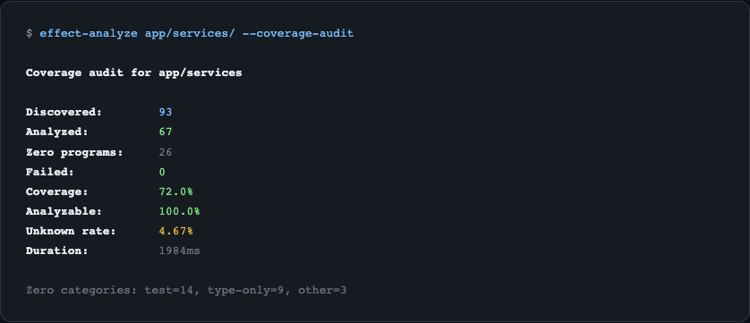

import { Aside } from '@astrojs/starlight/components';

The **coverage audit** scans an entire directory of TypeScript files and produces a comprehensive report of Effect usage across your project. Use it to understand how much of your codebase uses Effect, identify files the analyzer struggles with, and track analysis quality over time.



## Running a Coverage Audit

```bash
npx effect-analyze ./src --coverage-audit
```

This produces a report covering:

- **Discovery** - how many files were found, analyzed, and failed
- **Coverage** - percentage of files containing Effect programs
- **Zero-program files** - files with no Effect programs, classified by type
- **Top offenders** - files with highest complexity
- **Unknown node rates** - files where the analyzer encountered unrecognized patterns

## Audit Output

### Discovery and Coverage

```
Files discovered: 142
Files analyzed:   138
Files failed:       4
Coverage:         72% (99/138 files contain Effect programs)
```

### Zero-Program Classification

Files with no detected Effect programs are classified into categories:

| Classification | Description |
|---|---|
| Barrel | Re-export files (`index.ts` with only `export * from`) |
| Config | Configuration files (constants, env vars) |
| Test | Test files (`.test.ts`, `.spec.ts`) |
| Type-only | Files with only type definitions |
| Suspicious | Files that look like they should contain Effect but don't |

### Suspicious Zeros

Show files that appear to import Effect but have no detected programs:

```bash
npx effect-analyze ./src --coverage-audit --show-suspicious-zeros
```

### Unknown Node Rates

Show files with the highest percentage of unrecognized AST patterns:

```bash
npx effect-analyze ./src --coverage-audit --show-top-unknown
```

Add `--show-top-unknown-reasons` to include the specific patterns that weren't recognized:

```bash
npx effect-analyze ./src --coverage-audit --show-top-unknown --show-top-unknown-reasons
```

### By-Folder Breakdown

Aggregate results by folder to see which parts of your project have the highest Effect adoption:

```bash
npx effect-analyze ./src --coverage-audit --show-by-folder
```

## CI Mode

Output the audit as JSON for CI/CD integration:

```bash
npx effect-analyze ./src --coverage-audit --json-summary
```

This produces a machine-readable JSON object suitable for parsing in CI scripts, tracking metrics over time, or failing builds when quality thresholds are not met.

## Performance Timing

Include per-file timing data to identify slow files:

```bash
npx effect-analyze ./src --coverage-audit --per-file-timing
```

## Additional Options

| Flag | Description |
|---|---|
| `--min-meaningful-nodes <n>` | Minimum node count to consider a file meaningful |
| `--known-effect-internals-root <path>` | Treat local paths as Effect-like (reduces false suspicious zeros) |
| `--exclude-from-suspicious-zero <pattern>` | Exclude patterns from suspicious-zero reporting |

## Programmatic Usage

```ts
import { runCoverageAudit } from "effect-analyzer"

const audit = await runCoverageAudit("./src", {
  showSuspiciousZeros: true,
  showTopUnknown: true,
  jsonSummary: false,
})

console.log(audit.discovered)  // Total files found
console.log(audit.analyzed)    // Files successfully analyzed
console.log(audit.failed)      // Files that failed analysis
console.log(audit.coverage)    // Coverage percentage
```

<Aside type="note">
The coverage audit is designed to run on large codebases. It processes files in parallel and reports failures gracefully, so a single broken file does not stop the entire audit.
</Aside>

## Related

- [Semantic Diff](/effect-analyzer/project/diff/) - compare program versions
- [CLI Reference](/effect-analyzer/reference/cli/) - all coverage audit flags
- [Complexity Metrics](/effect-analyzer/analysis/complexity/) - per-program complexity
