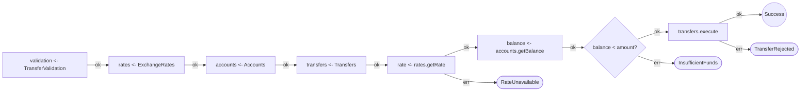
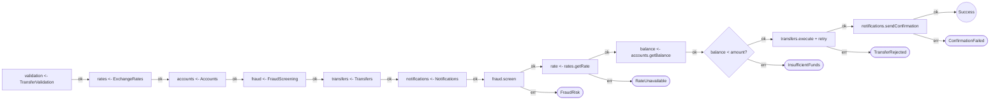

import { Aside, Tabs, TabItem } from '@astrojs/starlight/components';

The **semantic diff** compares two versions of an Effect program at the IR level, not the text level. It reports structural changes — steps added, removed, moved, or renamed — giving you a meaningful view of what changed in the program's behavior.

This is especially useful when **reviewing AI-generated code** where the text diff can be large and hard to follow, but the structural change may be quite targeted.

## Worked Example: Reviewing an AI Agent's PR

An AI coding agent was asked to "make the payment flow production-ready." The resulting PR touches 40+ lines across services, error types, and the main workflow. A text diff is noisy. The semantic diff tells you exactly what changed structurally.

### The before: a working MVP

```ts title="send-money-before.ts"
// Services: TransferValidation, ExchangeRates, Accounts, Transfers

export const sendMoney = (input: TransferRequest) =>
  Effect.gen(function* () {
    const validation = yield* TransferValidation;
    const rates = yield* ExchangeRates;
    const accounts = yield* Accounts;
    const transfers = yield* Transfers;

    const validated = yield* validation.validate(input);
    const rate = yield* rates.getRate(validated.fromCurrency, validated.toCurrency);
    const balance = yield* accounts.getBalance(validated.senderId);

    if (balance < validated.amount) {
      return yield* Effect.fail(
        new InsufficientFundsError(balance, validated.amount),
      );
    }

    const convertedAmount = Math.round(validated.amount * rate * 100) / 100;

    const transfer = yield* transfers.execute({
      recipientIban: validated.recipientIban,
      amount: convertedAmount,
      currency: validated.toCurrency,
    });

    return { transferId: transfer.transferId, convertedAmount, rate };
  });
```

**Railway diagram (before):**



### The after: AI-generated "production-ready" version

The AI agent added:
- **FraudScreening** service — screens every transfer before execution
- **Notifications** service — sends a confirmation after success
- **Retry with exponential backoff** on `transfers.execute`
- New error types: `FraudRiskError`, `ConfirmationFailedError`

```ts title="send-money-after.ts" {5-6,9,21-27,29-33}
export const sendMoney = (input: TransferRequest) =>
  Effect.gen(function* () {
    const validation = yield* TransferValidation;
    const rates = yield* ExchangeRates;
    const accounts = yield* Accounts;
    const fraud = yield* FraudScreening;        // NEW
    const transfers = yield* Transfers;
    const notifications = yield* Notifications;  // NEW

    const validated = yield* validation.validate(input);
    yield* fraud.screen(validated);              // NEW
    const rate = yield* rates.getRate(validated.fromCurrency, validated.toCurrency);
    const balance = yield* accounts.getBalance(validated.senderId);

    if (balance < validated.amount) {
      return yield* Effect.fail(
        new InsufficientFundsError(balance, validated.amount),
      );
    }

    const convertedAmount = Math.round(validated.amount * rate * 100) / 100;

    const transfer = yield* transfers.execute({  // CHANGED: now has retry
      recipientIban: validated.recipientIban,
      amount: convertedAmount,
      currency: validated.toCurrency,
    }).pipe(
      Effect.retry(
        Schedule.exponential('200 millis').pipe(
          Schedule.intersect(Schedule.recurs(2)),
        ),
      ),
    );

    yield* notifications.sendConfirmation({      // NEW
      transferId: transfer.transferId,
      amount: convertedAmount,
      currency: validated.toCurrency,
    });

    return { transferId: transfer.transferId, convertedAmount, rate };
  });
```

**Railway diagram (after):**



### Running the diff

The two fixture files live in the repo. Run the diff with:

```bash
npx effect-analyze \
  src/__fixtures__/docs/send-money-before.ts \
  src/__fixtures__/docs/send-money-after.ts \
  --diff
```

### Diff output (markdown)

```text
# Effect Program Diff: sendMoney → sendMoney

## Summary

| Metric | Count |
|--------|-------|
| Added | 8 |
| Removed | 1 |
| Renamed | 0 |
| Moved | 0 |
| Unchanged | 7 |
| Structural changes | 1 |

## Step Changes

- transfers.execute (removed)
+ FraudScreening (added)
+ Notifications (added)
+ fraud.screen (added)
+ transfers.execute(...).pipe (added)
+ notifications.sendConfirmation (added)
+ Effect.retry (added)
+ Schedule.exponential (added)

## Structural Changes

- + retry block added

## Added program: FraudScreening
## Added program: Notifications
```

### What a reviewer learns in 10 seconds

1. **7 unchanged steps** — the core flow (validate → get rate → check balance → fail path) is untouched
2. **1 removed step** (`transfers.execute`) — replaced by the `.pipe(Effect.retry(...))` variant
3. **2 new service dependencies** — `FraudScreening` and `Notifications` are new blast radius
4. **1 structural change** — a `retry` block was added (exponential backoff on the transfer)
5. **New error surface** — the railway diagram shows `FraudRisk` and `ConfirmationFailed` as new error branches

<Aside type="tip" title="Key reviewer question">
The AI added `notifications.sendConfirmation` **after** the transfer succeeds but **without** error handling on the notification itself. A `ConfirmationFailedError` would propagate up and fail the entire workflow even though the money was already sent. Is that intentional?

This is the kind of question the semantic diff makes obvious — the structural view shows the notification step sits on the happy path with no `catchTag` around it.
</Aside>

## Basic Usage

Compare the current file with the last commit:

```bash
npx effect-analyze HEAD:src/transfer.ts src/transfer.ts --diff
```

## Single-File Shorthand

With a single argument and `--diff`, the analyzer compares HEAD against the working copy:

```bash
npx effect-analyze src/transfer.ts --diff
```

This is equivalent to `HEAD:src/transfer.ts src/transfer.ts --diff`.

## Git Ref Syntax

Use any git ref with the `ref:path` syntax:

```bash
# Compare two branches
npx effect-analyze main:src/transfer.ts feature:src/transfer.ts --diff

# Compare specific commits
npx effect-analyze abc123:src/transfer.ts def456:src/transfer.ts --diff

# Compare a tag with the working copy
npx effect-analyze v1.0.0:src/transfer.ts src/transfer.ts --diff
```

## What the Diff Detects

The diff engine classifies every step in both versions:

| Change Type | Description | Example |
|---|---|---|
| **Unchanged** | Step exists in both versions with the same structure | `validation.validate` stayed the same |
| **Added** | Step exists only in the new version | `fraud.screen` is new |
| **Removed** | Step exists only in the old version | `transfers.execute` was replaced |
| **Moved** | Step exists in both but in a different structural container | A step moved from sequential into `Effect.all` |
| **Renamed** | Same callee but different binding name | `const result` → `const transfer` |

Beyond individual steps, the diff also reports:

- **Structural changes** — new or removed `retry`, `parallel`, `race`, `error-handler` blocks
- **Added programs** — entirely new Effect programs in the file
- **Removed programs** — Effect programs that no longer exist

## Output Formats

<Tabs>
  <TabItem label="Markdown (default)">
```bash
npx effect-analyze before.ts after.ts --diff
```

Produces a structured report with a summary table, step changes as a diff block, and structural changes. Best for human review and pasting into PR comments.
  </TabItem>
  <TabItem label="JSON">
```bash
npx effect-analyze before.ts after.ts --diff --format json
```

Machine-readable diff object for CI integration. Each step has a `kind` field (`added`, `removed`, `unchanged`, `moved`, `renamed`) and metadata like `callee`, `containerBefore`, `containerAfter`.

```json
{
  "beforeName": "sendMoney",
  "afterName": "sendMoney",
  "steps": [
    { "kind": "unchanged", "callee": "TransferValidation" },
    { "kind": "unchanged", "callee": "ExchangeRates" },
    { "kind": "unchanged", "callee": "Accounts" },
    { "kind": "added", "callee": "FraudScreening" },
    { "kind": "removed", "callee": "transfers.execute" },
    { "kind": "added", "callee": "fraud.screen" },
    { "kind": "added", "callee": "notifications.sendConfirmation" }
  ],
  "structuralChanges": [
    { "kind": "added", "nodeType": "retry" }
  ],
  "summary": {
    "added": 8, "removed": 1, "unchanged": 7,
    "structuralChanges": 1, "hasRegressions": false
  }
}
```
  </TabItem>
  <TabItem label="Mermaid">
```bash
npx effect-analyze before.ts after.ts --diff --format mermaid
```

Renders the "after" program as a flowchart with color-coded nodes: **green** for added, **yellow** for moved, **blue** for renamed, and **red dashed** for removed steps (with `--show-removed`).
  </TabItem>
</Tabs>

## Regression Mode

Flag removed steps as regressions — useful in CI to catch when an AI agent accidentally deletes error handling or removes a service call:

```bash
npx effect-analyze HEAD:src/transfer.ts src/transfer.ts --diff --regression
```

In regression mode, the summary includes a `hasRegressions` flag set to `true` if any step or structural block was removed. Combine with `--format json` to parse in CI:

```bash
# Fail the build if the AI removed any steps
DIFF=$(npx effect-analyze HEAD:src/transfer.ts src/transfer.ts --diff --regression --format json)
if echo "$DIFF" | jq -e '.[0].summary.hasRegressions' > /dev/null 2>&1; then
  echo "REGRESSION: Steps were removed from the Effect program"
  exit 1
fi
```

<Aside type="caution" title="Watch for AI agents removing error handling">
A common pattern with AI-generated refactors is simplifying code by removing `catchTag`, `retry`, or `timeout` wrappers. Regression mode catches this as a structural removal. Use it in CI to require human approval when structural blocks are deleted.
</Aside>

## Programmatic Usage

```ts
import { analyze, diffPrograms, renderDiffMarkdown } from "effect-analyzer"
import { Effect } from "effect"

const before = await Effect.runPromise(analyze("./old-version.ts").single())
const after = await Effect.runPromise(analyze("./new-version.ts").single())

const diff = diffPrograms(before, after)
const report = renderDiffMarkdown(diff)

console.log(report)
```

Additional rendering functions:

```ts
import { renderDiffJSON, renderDiffMermaid } from "effect-analyzer"

// JSON output for CI
const json = renderDiffJSON(diff)

// Mermaid diagram with change highlights
const mermaid = renderDiffMermaid(diff)
```

<Aside type="note">
The diff operates on the IR structure, not on raw text. Two programs with identical source but different `tsconfig` settings may produce unexpected diffs. In practice this is rare.
</Aside>

## Related

- [Coverage Audit](/effect-analyzer/project/coverage-audit/) — project-wide analysis
- [CLI Reference](/effect-analyzer/reference/cli/) — `--diff` and `--regression` flags
- [Complexity Metrics](/effect-analyzer/analysis/complexity/) — track complexity changes over time
- [Interactive HTML Viewer](/effect-analyzer/reference/html-viewer/) — explore the before/after programs visually
