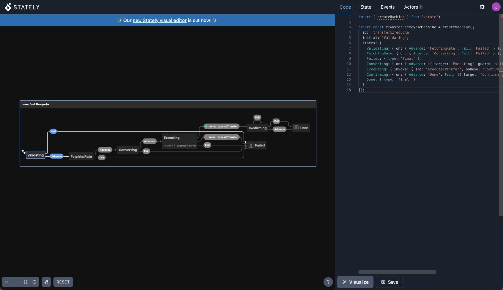

import { Aside, Steps } from '@astrojs/starlight/components';

Turn an ordinary Effect-shaped transition table into an interactive statechart
in [stately.ai/viz](https://stately.ai/viz) — without adopting XState as your
runtime. This walkthrough uses the send-money lifecycle sample that ships with
the docs.

For the full authoring contract (Match.when, nested Match.tags, MachineJSON,
coverage gate), see [State Machines](/effect-analyzer/reference/state-machines/).

## What you will do

<Steps>

1. **Start from the sample** — a transition table that mirrors the transfer workflow
2. **Export** an XState `createMachine` config with `effect-analyze`
3. **Paste** it into the Stately visualizer
4. **Read** the resulting diagram — Advance path, Fail sinks, invoke, finals

</Steps>

## Step 1 — Start from the sample

The machine lives next to the Effect pipeline it models:

[`apps/docs/samples/observability-transfer/transfer-lifecycle.ts`](https://github.com/jagreehal/effect-analyzer/blob/main/apps/docs/samples/observability-transfer/transfer-lifecycle.ts)

It is a declarative table: `@initial Validating`, dense `Advance` / `Fail`
events, a labeled guard, an `invoke`, and explicit finals:

```ts
/** @initial Validating */
export const transferLifecycle = {
  Validating: {
    Advance: 'FetchingRate',
    Fail: 'Failed',
  },
  FetchingRate: {
    Advance: 'Converting',
    Fail: 'Failed',
  },
  Converting: {
    Advance: { target: 'Executing', guard: 'sufficientFunds' },
    Fail: 'Failed',
  },
  Executing: {
    invoke: {
      src: 'executeTransfer',
      onDone: 'Confirming',
      onError: 'Failed',
    },
    Fail: 'Failed',
  },
  Confirming: {
    Advance: 'Done',
    Fail: [{ target: 'Confirming', guard: 'retryable' }, { target: 'Done' }],
  },
  Done: { type: 'final' },
  Failed: { type: 'final' },
} as const satisfies Record<TransferState['_tag'], /* … */>;
```

The Effect program in `send-money-workflow.ts` still does the real work. This
table is the model the analyzer diagrams and checks.

## Step 2 — Export the XState config

From the repo root (after installing / building the CLI):

```bash
npx effect-analyze \
  ./apps/docs/samples/observability-transfer/transfer-lifecycle.ts \
  --format xstate-config
```

You get a paste-ready module. The same config is also embedded in the local
visualizer page:

```bash
npx effect-analyze \
  ./apps/docs/samples/observability-transfer/transfer-lifecycle.ts \
  --format statechart-html --open
```

## Step 3 — Paste into Stately

1. Open [stately.ai/viz](https://stately.ai/viz)
2. Replace the editor contents with the generated config (below)
3. Click **Visualize**

```ts
import { createMachine } from 'xstate';

export const transferLifecycleMachine = createMachine({
  id: 'transferLifecycle',
  initial: 'Validating',
  states: {
    Validating: { on: { Advance: 'FetchingRate', Fail: 'Failed' } },
    FetchingRate: { on: { Advance: 'Converting', Fail: 'Failed' } },
    Failed: { type: 'final' },
    Converting: { on: { Advance: [{ target: 'Executing', guard: 'sufficientFunds' }], Fail: 'Failed' } },
    Executing: { invoke: { src: 'executeTransfer', onDone: 'Confirming', onError: 'Failed' }, on: { Fail: 'Failed' } },
    Confirming: { on: { Advance: 'Done', Fail: [{ target: 'Confirming', guard: 'retryable' }, { target: 'Done' }] } },
    Done: { type: 'final' }
  }
});
```

## Step 4 — What you should see



In the diagram:

- **Happy path** — `Validating` → `FetchingRate` → `Converting` → `Executing` → `Confirming` → `Done` via `Advance` (and `done: executeTransfer` after invoke)
- **Fail sinks** — `Fail` from active stages into the `Failed` final
- **Invoke** — `Executing` shows `INVOKE / executeTransfer` with green `done` and red `error` edges
- **Finals** — `Done` and `Failed` render as final states

<Aside type="note" title="Labels, not runtime">
Guards such as `sufficientFunds` and `retryable`, and the `executeTransfer`
invoke source, are **labels**. Stately draws them; your Effect code still runs
the real checks and side effects. The analyzer never executes the machine.
</Aside>

## Keep the machine honest in CI

After you change the table, gate structural completeness on the sample:

```bash
npx effect-analyze \
  ./apps/docs/samples/observability-transfer/transfer-lifecycle.ts \
  --format statechart-coverage --min-coverage 80
```

Next: authoring styles, hierarchy, and coverage semantics in
[State Machines](/effect-analyzer/reference/state-machines/).
