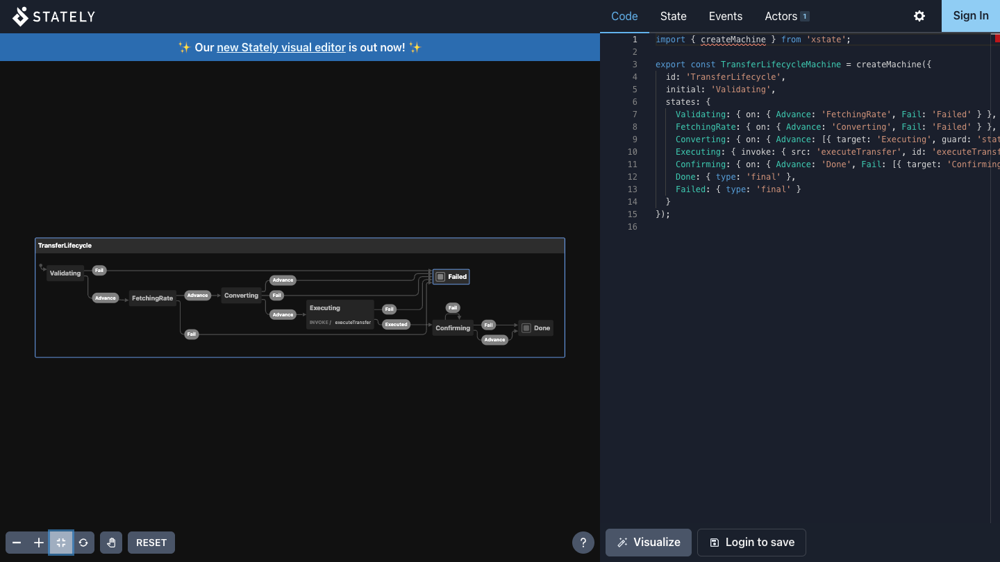

import { Aside, Steps } from '@astrojs/starlight/components';

Turn an `@typeonce/effect-machine` machine into an interactive statechart in
[stately.ai/viz](https://stately.ai/viz) — without adopting XState as your
runtime. This walkthrough uses the send-money lifecycle sample that ships with
the docs.

For the full reading contract (state trees, targets, MachineJSON, coverage
gate), see [State Machines](/effect-analyzer/reference/state-machines/).

## What you will do

<Steps>

1. **Start from the sample** — a machine that mirrors the transfer workflow
2. **Export** an XState `createMachine` config with `effect-analyze`
3. **Paste** it into the Stately visualizer
4. **Read** the resulting diagram — Advance path, Fail sinks, invoke, finals

</Steps>

## Step 1 — Start from the sample

The machine lives next to the Effect pipeline it models:

[`apps/docs/samples/observability-transfer/transfer-lifecycle.ts`](https://github.com/jagreehal/effect-analyzer/blob/main/apps/docs/samples/observability-transfer/transfer-lifecycle.ts)

Dense `Advance` / `Fail` events at every active stage, named branches the
analyzer reads as guards, state-owned work, and two explicit finals:

```ts
export const TransferStates = Machine.states({
  Validating: {},
  FetchingRate: {},
  Converting: TransferState.cases.Converting,
  Executing: {},
  Confirming: TransferState.cases.Confirming,
  Done: { type: 'final' },
  Failed: { type: 'final' },
})

export const TransferEvents = Machine.events(
  Schema.TaggedUnion({ Advance: {}, Fail: {} }),
)

export const TransferLifecycle = Machine.make({
  states: TransferStates.states,
  events: TransferEvents,
  initial: (to) => to.Validating(),
}).handle({
  // …
  Converting: {
    on: {
      Advance: (to) =>
        to
          .branches({
            sufficientFunds: { target: to.full.Executing() },
            insufficientFunds: { target: to.full.Failed() },
          })
          .resolve(({ state, select }) =>
            state.sufficientFunds
              ? select.sufficientFunds.from()
              : select.insufficientFunds.from(),
          ),
      Fail: (to) => to.full.Failed(),
    },
  },
  Executing: {
    invoke: (from) =>
      from
        .effect('executeTransfer', () => executeTransfer)
        .onDone((to) =>
          to.full.Confirming().resolve(({ target }) => target.from({ retryable: true })),
        )
        .onFailure((to) => to.full.Failed()),
    on: {
      Fail: (to) => to.full.Failed(),
    },
  },
  // …
})
```

The Effect program in `send-money-workflow.ts` still does the real work. This
machine is the model the analyzer diagrams and checks.

## Step 2 — Export the XState config

From the repo root (after installing / building the CLI):

```bash
npx effect-analyze \
  ./apps/docs/samples/observability-transfer/transfer-lifecycle.ts \
  --format xstate-config
```

You get a paste-ready module. The same config is also embedded in the local
visualizer page:

```bash
npx effect-analyze \
  ./apps/docs/samples/observability-transfer/transfer-lifecycle.ts \
  --format statechart-html --open
```

## Step 3 — Paste into Stately

1. Open [stately.ai/viz](https://stately.ai/viz)
2. Replace the editor contents with the generated config (below)
3. Click **Visualize**

```ts
import { createMachine } from 'xstate';

export const TransferLifecycleMachine = createMachine({
  id: 'TransferLifecycle',
  initial: 'Validating',
  states: {
    Validating: { on: { Advance: 'FetchingRate', Fail: 'Failed' } },
    FetchingRate: { on: { Advance: 'Converting', Fail: 'Failed' } },
    Converting: { on: { Advance: [{ target: 'Executing', guard: 'sufficientFunds' }, { target: 'Failed', guard: 'insufficientFunds' }], Fail: 'Failed' } },
    Executing: { invoke: { src: 'executeTransfer', id: 'executeTransfer', onDone: 'Confirming', onError: 'Failed' }, on: { Fail: 'Failed' } },
    Confirming: { on: { Advance: 'Done', Fail: [{ target: 'Confirming', guard: 'retry' }, { target: 'Done', guard: 'giveUp' }] } },
    Done: { type: 'final' },
    Failed: { type: 'final' }
  }
});
```

## Step 4 — What you should see



In the diagram:

- **Happy path** — `Validating` → `FetchingRate` → `Converting` → `Executing` → `Confirming` → `Done`
- **Fail sinks** — `Fail` from active stages into the `Failed` final
- **Invoke** — `Executing` shows `INVOKE / executeTransfer`, with `onDone`
  carrying the machine to `Confirming` and `onError` to `Failed`
- **Guarded choices** — `Converting` has two `Advance` edges and `Confirming`
  two `Fail` edges, one per branch (the legacy visualizer draws the alternatives
  but does not print the guard text; it is in the config)
- **Finals** — `Done` and `Failed` render as final states

The machine is live in the visualizer: the **Events** panel only enables the
events the current state handles, so you can step through the workflow and
confirm the targets resolve.

<Aside type="note" title="Labels, not runtime">
Guards such as `state.sufficientFunds`, and the `executeTransfer` invoke id,
are **labels**. Stately draws them; `@typeonce/effect-machine` runs the real
machine. The analyzer never executes anything.
</Aside>

## Keep the machine honest in CI

After you change the machine, gate structural completeness on the sample:

```bash
npx effect-analyze \
  ./apps/docs/samples/observability-transfer/transfer-lifecycle.ts \
  --format statechart-coverage --min-coverage 60
```

Next: the full reading contract, hierarchy, and coverage semantics in
[State Machines](/effect-analyzer/reference/state-machines/).
