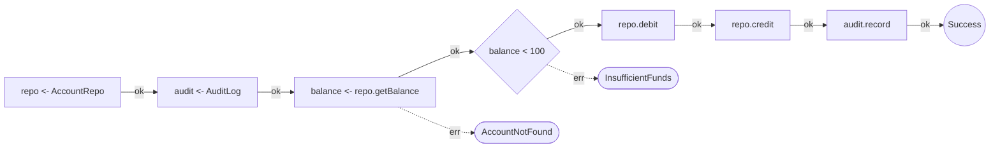
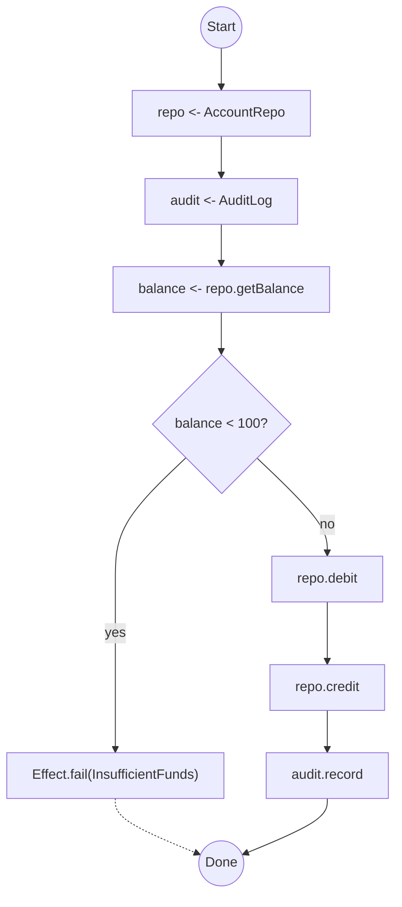

# effect-analyzer

Static analysis for [Effect](https://effect.website/) programs. Visualize service dependencies, error channels, concurrency, and control flow as Mermaid diagrams - without running your code.

> **[Documentation](https://jagreehal.github.io/effect-analyzer/)** · **[Getting Started](https://jagreehal.github.io/effect-analyzer/quick-start/)** · **[CLI Reference](https://jagreehal.github.io/effect-analyzer/reference/cli/)** · **[API Reference](https://jagreehal.github.io/effect-analyzer/reference/api/)**

## Why

Effect programs are powerful, but their structure - service dependencies, error topology, concurrency patterns - is hard to see in source. effect-analyzer parses your code with [ts-morph](https://ts-morph.com/) and the TypeScript type checker, then produces semantic diagrams and structured analysis. No runtime, no instrumentation.

Use it for **code review**, **onboarding**, **architecture docs**, and **CI** to catch regressions in program shape.

## Install

```bash
npm install -D effect-analyzer
```

`effect` (>=3.0.0) is a required peer dependency. `ts-morph` is bundled automatically.

## Quick Start

```bash
# Auto-select the best diagrams for a file
npx effect-analyze ./src/transfer.ts

# Railway diagram (linear happy path with error branches)
npx effect-analyze ./src/transfer.ts --format mermaid-railway

# Plain-English explanation of what a program does
npx effect-analyze ./src/transfer.ts --format explain

# Compare two versions
npx effect-analyze HEAD:src/transfer.ts src/transfer.ts --diff

# Audit an entire project
npx effect-analyze ./src --coverage-audit
```

## What You Get

Given an Effect program like this:

```ts
export const transfer = Effect.gen(function* () {
  const repo = yield* AccountRepo
  const audit = yield* AuditLog

  const balance = yield* repo.getBalance("from-account")

  if (balance < 100) {
    yield* Effect.fail(new InsufficientFundsError(balance, 100))
  }

  yield* repo.debit("from-account", 100)
  yield* repo.credit("to-account", 100)
  yield* audit.record("transfer-complete")
})
```

The analyzer produces a railway diagram showing the happy path with error branches:



Or a flowchart showing all control flow paths:



## Features

### 15+ Diagram Types

Auto-mode picks the most relevant views for your program, or choose explicitly:

| Format | Shows |
|--------|-------|
| `mermaid-railway` | Linear happy path with error branches |
| `mermaid` | Full flowchart with all control flow |
| `mermaid-services` | Service dependency map |
| `mermaid-errors` | Error propagation and handling |
| `mermaid-concurrency` | Parallel and race patterns |
| `mermaid-layers` | Layer composition graph |
| `mermaid-retry` | Retry and timeout strategies |
| `mermaid-timeline` | Step sequence over time |

[See all formats →](https://jagreehal.github.io/effect-analyzer/diagrams/all-formats/)

### Complexity Metrics

Six metrics calculated for every program: cyclomatic complexity, cognitive complexity, path count, nesting depth, parallel breadth, and decision points.

```bash
npx effect-analyze ./src/transfer.ts --format stats
```

[Learn more →](https://jagreehal.github.io/effect-analyzer/analysis/complexity/)

### Semantic Diff

Compare two versions of a program at the structural level - not text diffs, but changes in steps, services, and control flow:

```bash
npx effect-analyze HEAD:src/transfer.ts src/transfer.ts --diff
```

[Learn more →](https://jagreehal.github.io/effect-analyzer/project/diff/)

### Coverage Audit

Scan an entire project to understand Effect usage, identify complex programs, and track analysis quality:

```bash
npx effect-analyze ./src --coverage-audit
```

[Learn more →](https://jagreehal.github.io/effect-analyzer/project/coverage-audit/)

### Interactive HTML Viewer

Generate a self-contained HTML page with search, filtering, path explorer, complexity heatmap, and 6 color themes:

```ts
import { renderInteractiveHTML } from "effect-analyzer"

const html = renderInteractiveHTML(ir, { theme: "midnight" })
```

[Learn more →](https://jagreehal.github.io/effect-analyzer/reference/html-viewer/)

### Library API

Use the programmatic API to integrate analysis into your own tools:

```ts
import { analyze } from "effect-analyzer"
import { Effect } from "effect"

const ir = await Effect.runPromise(analyze("./src/transfer.ts").single())

console.log(ir.root.programName)    // "transfer"
console.log(ir.root.dependencies)    // [{ name: "AccountRepo", ... }, ...]
console.log(ir.root.errorTypes)      // ["InsufficientFundsError", "AccountNotFoundError"]
```

[Full API reference →](https://jagreehal.github.io/effect-analyzer/reference/api/)

## What It Detects

| Area | Patterns |
|------|----------|
| **Programs** | `Effect.gen`, pipe chains, `Effect.sync`, `Effect.async`, `Effect.promise` |
| **Services** | `Context.Tag` via `yield*`, service method calls |
| **Layers** | `Layer.mergeAll`, `Layer.effect`, `Layer.provide`, `Layer.succeed` |
| **Errors** | `catchTag`, `catchAll`, `tapError`, `retry`, `timeout` |
| **Concurrency** | `Effect.all`, `Effect.race`, `Effect.fork`, `Fiber.join` |
| **Resources** | `acquireRelease`, `ensuring`, `Effect.scoped` |
| **Streams** | `Stream.fromIterable`, `Stream.mapEffect`, `Stream.runCollect` |
| **Control flow** | `if/else`, `for..of`, `while`, `try/catch`, `switch` inside generators |
| **Schedules** | `Schedule.recurs`, `Schedule.exponential` |
| **Aliases** | `const E = Effect`, destructured imports, renamed imports |

## Requirements

- Node.js 22+
- TypeScript project with `effect` (>=3.0.0)

## Documentation

Full documentation is available at **[jagreehal.github.io/effect-analyzer](https://jagreehal.github.io/effect-analyzer/)**.

## License

MIT
