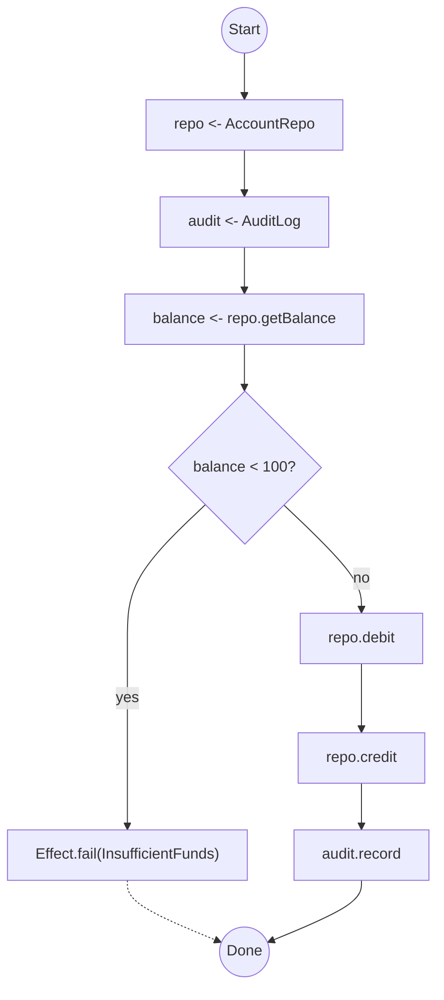

# effect-analyzer

Static analysis for [Effect](https://effect.website/) programs. Visualize service dependencies, error channels, concurrency, and control flow as Mermaid diagrams - without running your code.

> **[Documentation](https://jagreehal.github.io/effect-analyzer/)** · **[Getting Started](https://jagreehal.github.io/effect-analyzer/quick-start/)** · **[Playground](https://jagreehal.github.io/effect-analyzer/playground/)** · **[CLI Reference](https://jagreehal.github.io/effect-analyzer/reference/cli/)** · **[API Reference](https://jagreehal.github.io/effect-analyzer/reference/api/)**

## Why

Effect programs are powerful, but their structure - service dependencies, error topology, concurrency patterns - is hard to see in source. effect-analyzer parses your code with [ts-morph](https://ts-morph.com/) and the TypeScript type checker, then produces semantic diagrams and structured analysis. No runtime, no instrumentation.

Use it for **code review**, **onboarding**, **architecture docs**, and **CI** to catch regressions in program shape.

## Install

```bash
npm install -D effect-analyzer
```

Effect v4 is the only supported Effect release. `ts-morph` is bundled automatically.

## Quick Start

```bash
# Auto-select the best diagrams for a file
npx effect-analyze ./src/transfer.ts

# Railway diagram (linear happy path with error branches)
npx effect-analyze ./src/transfer.ts --format mermaid-railway

# Plain-English explanation of what a program does
npx effect-analyze ./src/transfer.ts --format explain

# Compare two versions
npx effect-analyze HEAD:src/transfer.ts src/transfer.ts --diff

# Audit an entire project
npx effect-analyze ./src --coverage-audit

# Concise CI audit with native quality gates
npx effect-analyze ./src --coverage-audit --quiet \
  --max-audit-failed-files 0 \
  --max-audit-suspicious-zeros 0 \
  --min-audit-source-resolution 98
```

## What You Get

Given an Effect program like this:

```ts
export const transfer = Effect.gen(function* () {
  const repo = yield* AccountRepo
  const audit = yield* AuditLog

  const balance = yield* repo.getBalance("from-account")

  if (balance < 100) {
    yield* Effect.fail(new InsufficientFundsError(balance, 100))
  }

  yield* repo.debit("from-account", 100)
  yield* repo.credit("to-account", 100)
  yield* audit.record("transfer-complete")
})
```

The analyzer produces a railway diagram showing the happy path with error branches:


Or a flowchart showing all control flow paths:



## Features

### 15+ Diagram Types

Auto-mode picks the most relevant views for your program, or choose explicitly:

| Format | Shows |
|--------|-------|
| `mermaid-railway` | Linear happy path with error branches |
| `mermaid` | Full flowchart with all control flow |
| `mermaid-services` | Service dependency map |
| `mermaid-errors` | Error propagation and handling |
| `mermaid-concurrency` | Parallel and race patterns |
| `mermaid-layers` | Layer composition graph |
| `mermaid-retry` | Retry and timeout strategies |
| `mermaid-timeline` | Step sequence over time |
| `mermaid-statechart` | State machine as a `stateDiagram-v2` |
| `svg-statechart` | Self-contained, XState-styled statechart SVG |
| `statechart-html` | Local visualizer page with SVG, coverage, and XState export |
| `xstate-config` | `createMachine()` config for the [Stately visualizer](https://stately.ai/viz) |

[See all formats →](https://jagreehal.github.io/effect-analyzer/diagrams/all-formats/)

### State Machines Without XState

Write deterministic state machines as ordinary TypeScript — a declarative
transition table, a `Match.when` transition function, or nested `Match.tags`
state/event dispatch — and render them as XState-style statecharts. Guards,
named actions (`entry` / `exit` / transition `actions`), invoked effects
(`invoke` with `onDone` / `onError`), explicit final states, hierarchical
states (dotted names like `'Playing.Paused'` nest in the diagrams and exported
config), and automatic transitions (`always`, `'after 500ms'`) are all
modeled. Much of XState's modeling value with no extra runtime: execution and
effects stay in your Effect code. See the full convention guide in the
[State Machines](https://jagreehal.github.io/effect-analyzer/reference/state-machines/)
docs.

```bash
# Machine-only files: use a statechart format (skips the Effect IR path)
npx effect-analyze ./workflow.ts --format mermaid-statechart

# A local visualizer page (diagram + coverage + paste-ready config).
# With no -o it writes workflow.statechart.html next to the input
npx effect-analyze ./workflow.ts --format statechart-html

# An XState createMachine() config — paste into stately.ai/viz for the real
# interactive visualizer, generated straight from your Effect code
npx effect-analyze ./workflow.ts --format xstate-config

# Files that also contain Effect programs: default view runs Effect analysis,
# then appends any detected statecharts
npx effect-analyze ./workflow.ts
```

These shapes are recognized:

```ts
// A) declarative transition table
const transitions = {
  Triage: {
    RefundRequested: { target: 'Refund', guard: 'canRefund' },
    AnswerRequested: 'Answered',
  },
  Refund: { Resolved: 'Answered' },
  Answered: {},
} as const;

// B) Match.when transition function
const transition = (state: State, event: Event): State =>
  Match.value([state._tag, event._tag] as const).pipe(
    Match.when(['Draft', 'Submit'], () => ({ _tag: 'Review' as const })),
    Match.orElse(() => state),
  );

// C) nested Match.tags with state tags outside and event tags inside
const transitionWithTags = (state: State, event: Event): State =>
  Match.value(state).pipe(
    Match.tags({
      Draft: () =>
        Match.value(event).pipe(
          Match.tags({
            Submit: () => ({ _tag: 'Review' as const }),
          }),
        ),
      Review: () => state,
    }),
  );
```

Initial state is read from an `@initial <State>` annotation or an
`initial`/`initialState` declaration. Table leaves can be strings,
`{ target, guard }`, `{ to }`, or arrays of guarded targets. A handler that can
return more than one state becomes a guarded (multi-target) transition.

#### Completeness checking (Schema-aware)

When the State/Event types are a tagged union or a `Schema`-derived type, the
analyzer reads the **declared alphabet** and checks the machine against it —
turning the statechart from a drawing into a verified machine:

```bash
npx effect-analyze ./workflow.ts --format statechart-coverage
```

```
# State machine coverage

1 machine, 2 warnings.

## checkoutTransition (alphabet: schema)
Coverage: 33% (2/6 reachable state×event pairs handled)
- ⚠ Unhandled events: `Cancel`        # declared, but no state handles it
- ⚠ Unreachable states: `Cancelled`   # declared, but nothing transitions to it
```

It reports **unhandled events**, **unreachable states**, and **undeclared
symbols** (transitions that drifted from the types). The command **exits
non-zero when any warning is found**, so it works as a CI gate. The
`mermaid-statechart` and `svg-statechart` outputs are annotated with the same
findings (orphaned states highlighted, unhandled events noted).

Run it over a whole directory for a summary table, set a coverage floor, or emit
JSON for dashboards:

```bash
npx effect-analyze ./src --format statechart-coverage              # all machines, summary table
npx effect-analyze ./src --format statechart-coverage --min-coverage 60   # fail under 60%
npx effect-analyze ./src --format statechart-coverage --coverage-json     # { machines, summary }
```

Guarded (conditional) transitions are captured with their condition and shown
on every renderer (`Event [guard]` in diagrams, `{ target, guard }` in the
XState config). State/Event alphabets may be tagged unions, `Schema`-derived
types, `Schema.TaggedClass`/`Schema.TaggedRequest` unions, or plain
string-literal unions (`'a' | 'b'`).

Plain single-level `Match.tags` dispatch is intentionally ignored unless there
is a nested state/event shape, because ordinary variant handling does not have
the source-state dimension required for a statechart.

> **Not yet supported:** hierarchical (nested) and parallel states. There is no
> standard Effect encoding for them, so detection is deferred until a convention
> is settled (dotted tags like `'Active.Running'` are the likely path and render
> safely as flat states today).

### Complexity Metrics

Six metrics calculated for every program: cyclomatic complexity, cognitive complexity, path count, nesting depth, parallel breadth, and decision points.

```bash
npx effect-analyze ./src/transfer.ts --format stats
```

[Learn more →](https://jagreehal.github.io/effect-analyzer/analysis/complexity/)

### Semantic Diff

Compare two versions of a program at the structural level - not text diffs, but changes in steps, services, and control flow:

```bash
npx effect-analyze HEAD:src/transfer.ts src/transfer.ts --diff
```

[Learn more →](https://jagreehal.github.io/effect-analyzer/project/diff/)

### Coverage Audit

Scan an entire project to understand Effect usage, identify complex programs, and track analysis quality:

```bash
npx effect-analyze ./src --coverage-audit
```

The audit reports three named dimensions with explicit denominators: Effect
adoption across discovered files, analysis success across relevant files, and
IR source resolution across analyzed nodes. `--quiet` emits one summary line;
native audit policy flags return exit code 1 when a threshold fails.

[Learn more →](https://jagreehal.github.io/effect-analyzer/project/coverage-audit/)

### Interactive HTML Viewer

Generate a self-contained HTML page with search, filtering, path explorer, complexity heatmap, and 6 color themes:

```ts
import { renderInteractiveHTML } from "effect-analyzer/diagram"

const html = renderInteractiveHTML(ir, { theme: "midnight" })
```

[Learn more →](https://jagreehal.github.io/effect-analyzer/reference/html-viewer/)

### Library API

Use the programmatic API to integrate analysis into your own tools:

```ts
import { analyze } from "effect-analyzer/analysis"
import { Effect } from "effect"

const ir = await Effect.runPromise(analyze("./src/transfer.ts").single())

console.log(ir.root.programName)    // "transfer"
console.log(ir.root.dependencies)    // [{ name: "AccountRepo", ... }, ...]
console.log(ir.root.errorTypes)      // ["InsufficientFundsError", "AccountNotFoundError"]
```

The root package intentionally exposes only the canonical workflow:
`analysis`, diagram fidelity, Effect/OpenTelemetry trace adapters, and the
runtime-overlay renderer. Expert functionality is grouped under
`effect-analyzer/analysis`, `effect-analyzer/diagram`,
`effect-analyzer/rules`, and `effect-analyzer/migration`.

### Diagram fidelity and runtime traces

```ts
import {
  analysis,
  computeDiagramFidelity,
  renderMermaidWithRuntimeTrace,
  traceFromOpenTelemetry,
} from "effect-analyzer"
import { Effect } from "effect"

const ir = await Effect.runPromise(analysis.file("./src/transfer.ts").single())
const fidelity = computeDiagramFidelity(ir)

if (!fidelity.exact) {
  throw new Error("The static diagram is not exact")
}

const trace = traceFromOpenTelemetry(exportedSpans)
const overlay = renderMermaidWithRuntimeTrace(ir, trace)
```

Use `--assert-diagram-fidelity` in CI to reject unresolved, opaque, dynamic-span,
or ambiguous-span nodes.

[Full API reference →](https://jagreehal.github.io/effect-analyzer/reference/api/)

## What It Detects

| Area | Patterns |
|------|----------|
| **Programs** | `Effect.gen`, pipe chains, `Effect.sync`, `Effect.callback`, `Effect.promise` |
| **Services** | `Context.Service` via `yield*`, service method calls |
| **Layers** | `Layer.mergeAll`, `Layer.effect`, `Layer.provide`, `Layer.succeed` |
| **Errors** | `catchTag`, `catch`, `tapError`, `retry`, `timeout` |
| **Concurrency** | `Effect.all`, `Effect.race`, `Effect.fork`, `Fiber.join` |
| **Resources** | `acquireRelease`, `ensuring`, `Effect.scoped` |
| **Streams** | `Stream.fromIterable`, `Stream.mapEffect`, `Stream.runCollect` |
| **Control flow** | `if/else`, `for..of`, `while`, `try/catch`, `switch` inside generators |
| **Schedules** | `Schedule.recurs`, `Schedule.exponential` |
| **Aliases** | `const E = Effect`, destructured imports, renamed imports |

## Requirements

- Node.js 22+
- TypeScript project with Effect v4

## Documentation

Full documentation is available at **[jagreehal.github.io/effect-analyzer](https://jagreehal.github.io/effect-analyzer/)**.

## License

MIT
