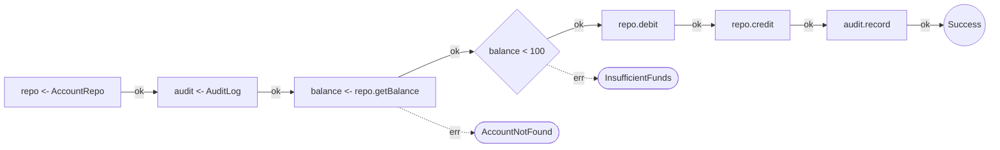
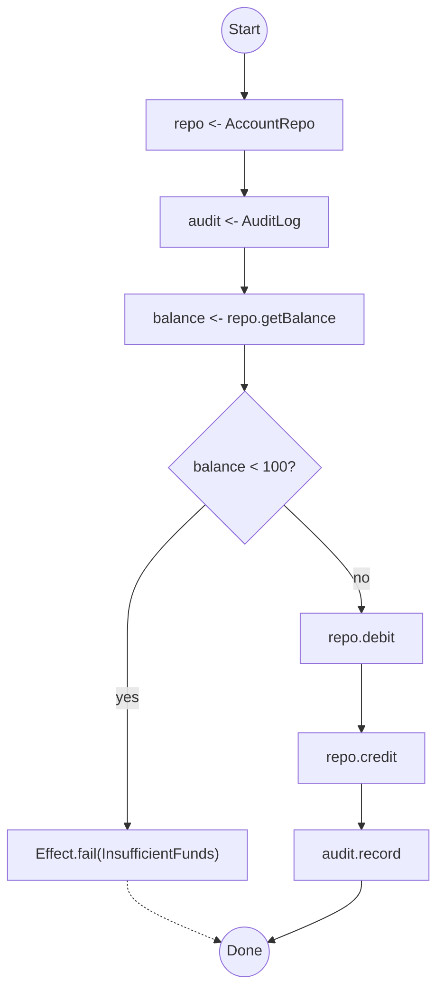

# effect-analyzer

Static analysis for [Effect](https://effect.website/) programs. It reads the shape of a program (services, error channel, retries, concurrency), reports when that shape changes, and draws it as Mermaid diagrams. Your code never runs.

> **[Documentation](https://jagreehal.github.io/effect-analyzer/)** · **[Getting Started](https://jagreehal.github.io/effect-analyzer/quick-start/)** · **[Playground](https://jagreehal.github.io/effect-analyzer/playground/)** · **[CLI Reference](https://jagreehal.github.io/effect-analyzer/reference/cli/)** · **[API Reference](https://jagreehal.github.io/effect-analyzer/reference/api/)**

## Why

An agent edits an Effect program and widens its error channel from a tagged error to `Error`. TypeScript compiles it, `oxlint` passes, and the PR reads as a small change. The error channel is a property of the whole program, so a check that looks at one expression at a time has nothing to complain about.

effect-analyzer parses your source with [ts-morph](https://ts-morph.com/) and the TypeScript type checker, builds a typed IR of every program it finds, and compares that IR against the version you approved last. Your agent consumes the JSON and the prioritized backlog. You read the diagram before merging.

## Install

```bash
npm install -D effect-analyzer
```

Effect v4 is the only supported Effect release. `ts-morph` is bundled automatically.
The official `@effect/tsgo` bridge is also installed as a direct dependency;
projects that enable it must use native TypeScript 7.

## Quick Start

```bash
# Auto-select the best diagrams for a file
npx effect-analyze ./src/transfer.ts

# Railway diagram (linear happy path with error branches)
npx effect-analyze ./src/transfer.ts --format mermaid-railway

# Plain-English explanation of what a program does
npx effect-analyze ./src/transfer.ts --format explain

# Compare two versions
npx effect-analyze HEAD:src/transfer.ts src/transfer.ts --diff

# Audit an entire project
npx effect-analyze ./src --coverage-audit

# Concise CI audit with native quality gates
npx effect-analyze ./src --coverage-audit --quiet \
  --max-audit-failed-files 0 \
  --max-audit-suspicious-zeros 0 \
  --min-audit-source-resolution 98
```

## Guardrails for Coding Agents

Three commands cover the generate-check loop: one gives the agent a backlog to work
from, one blocks new lint findings at the gate, and one puts the shape change in front
of a reviewer. The full walkthrough is in
[Guardrails for Coding Agents](https://jagreehal.github.io/effect-analyzer/agent-guardrails/).

### 1. Hand the agent a prioritized backlog

```bash
npx effect-analyze ./src --agent-report
```

The report merges lint findings, error channel analysis, service health, performance
anti-patterns, and coupling into one P0-P3 list. Each entry carries a file and line, a
suggestion, and an effort estimate, so an agent picks up the top item and works down
instead of guessing at priorities. Add `--improve` to apply the fixes the analyzer makes
on its own, or `--improve-dry-run` to read them first.

### 2. Gate the build on new findings

Record a baseline on `main`:

```bash
npx effect-analyze ./src --lint-source -o .cache/effect-baseline.json
```

Then check every branch against it:

```bash
npx effect-analyze ./src --lint-source --baseline .cache/effect-baseline.json --fail-on-new
```

The analyzer fingerprints each finding, so moving code between files does not trip the
gate. It exits `1` when a finding appears that your baseline does not contain, and your
agent can read that failure and regenerate against it. Findings your team fixes drop out
of the report, so the baseline shrinks as the codebase improves.

### 3. Show the reviewer what moved

```bash
npx effect-analyze HEAD:src/transfer.ts src/transfer.ts --diff
```

```
# Effect Program Diff: sendMoney → sendMoney

| Metric | Count |
|--------|-------|
| Added | 6 |
| Renamed | 1 |
| Unchanged | 7 |
| Structural changes | 2 |

+ **FraudScreening** (added)
+ **fraud.screen** (added)

## Structural Changes
- + pipe block added
- + retry block added
```

`--diff` reports and always exits `0`. Pipe it into a PR comment for a human, or into
an agent that needs to know what its last edit did. Use `--format json` for machine
consumption, `--format mermaid` for a diagram, and `--regression` to flag removed
programs. For gating, reach for `--fail-on-new` above, `--assert-diagram-fidelity`,
or the [audit policy flags](#coverage-audit).

### In GitHub Actions

```yaml
- run: npx effect-analyze ./src --lint-source --baseline .cache/effect-baseline.json --fail-on-new
- run: npx effect-analyze ./src --coverage-audit --quiet --max-audit-failed-files 0
- if: always()
  run: npx effect-analyze "origin/main:src/transfer.ts" src/transfer.ts --diff >> "$GITHUB_STEP_SUMMARY"
```

## What You Get

Given an Effect program like this:

```ts
export const transfer = Effect.gen(function* () {
  const repo = yield* AccountRepo
  const audit = yield* AuditLog

  const balance = yield* repo.getBalance("from-account")

  if (balance < 100) {
    yield* Effect.fail(new InsufficientFundsError(balance, 100))
  }

  yield* repo.debit("from-account", 100)
  yield* repo.credit("to-account", 100)
  yield* audit.record("transfer-complete")
})
```

The analyzer produces a railway diagram showing the happy path with error branches:


```mermaid
flowchart LR
  A["repo <- AccountRepo"] -->|ok| B["audit <- AuditLog"]
  B -->|ok| C["balance <- repo.getBalance"]
  C -->|ok| D{"balance < 100"}
  D -->|ok| E["repo.debit"]
  E -->|ok| F["repo.credit"]
  F -->|ok| G["audit.record"]
  G -->|ok| Done((Success))
  C -.->|err| Err1([AccountNotFound])
  D -.->|err| Err2([InsufficientFunds])
```

Or a flowchart showing all control flow paths:


```mermaid
flowchart TB
  start((Start))
  n2["repo <- AccountRepo"]
  n3["audit <- AuditLog"]
  n4["balance <- repo.getBalance"]
  decision{"balance < 100?"}
  n7["Effect.fail(InsufficientFunds)"]
  n8["repo.debit"]
  n9["repo.credit"]
  n10["audit.record"]
  end_node((Done))

  start --> n2 --> n3 --> n4 --> decision
  decision -->|yes| n7
  decision -->|no| n8
  n7 -.-> end_node
  n8 --> n9 --> n10 --> end_node
```

## Features

### 15+ Diagram Types

Auto-mode picks the most relevant views for your program, or choose explicitly:

| Format | Shows |
|--------|-------|
| `mermaid-railway` | Linear happy path with error branches |
| `mermaid` | Full flowchart with all control flow |
| `mermaid-services` | Service dependency map |
| `mermaid-errors` | Error propagation and handling |
| `mermaid-concurrency` | Parallel and race patterns |
| `mermaid-layers` | Layer composition graph |
| `mermaid-retry` | Retry and timeout strategies |
| `mermaid-timeline` | Step sequence over time |
| `mermaid-statechart` | State machine as a `stateDiagram-v2` |
| `svg-statechart` | Self-contained, XState-styled statechart SVG |
| `statechart-html` | Local visualizer page with SVG, coverage, and XState export |
| `xstate-config` | `createMachine()` config for the [Stately visualizer](https://stately.ai/viz) |

[See all formats →](https://jagreehal.github.io/effect-analyzer/diagrams/all-formats/)

### State Machines → XState

Machines written with [`@typeonce/effect-machine`](https://github.com/typeonce-dev/effect-machine)
— the schema-first `Machine` API proposed in
[Effect PR #6429](https://github.com/Effect-TS/effect/pull/6429) — are read
statically and rendered as XState-style statecharts. Nested and parallel state
trees, final states, entry/exit actions, invoked children, and eventless
(`always`) transitions all carry through. Nothing is executed: the analyzer only
reads your source. See the full guide in the
[State Machines](https://jagreehal.github.io/effect-analyzer/reference/state-machines/)
docs.

```bash
# Machine-only files: use a statechart format (skips the Effect IR path)
npx effect-analyze ./workflow.ts --format mermaid-statechart

# A local visualizer page (diagram + coverage + paste-ready config).
# With no -o it writes workflow.statechart.html next to the input
npx effect-analyze ./workflow.ts --format statechart-html

# An XState createMachine() config — paste into stately.ai/viz for the real
# interactive visualizer, generated straight from your Effect code
npx effect-analyze ./workflow.ts --format xstate-config

# Files that also contain Effect programs: default view runs Effect analysis,
# then appends any detected statecharts
npx effect-analyze ./workflow.ts
```

The recognized shape is `Machine.make({...}).handle({...})`:

```ts
const CheckoutStates = Machine.states({
  Idle: {},
  Paying: CheckoutState.cases.Paying,
  Paid: { type: 'final' },
  Failed: {},
});

const CheckoutEvents = Machine.events(
  Schema.TaggedUnion({ Pay: { amount: Schema.Number }, Cancel: {} }),
);

export const CheckoutMachine = Machine.make({
  states: CheckoutStates.states,
  events: CheckoutEvents,
  initial: (to) => to.Idle(),
}).handle({
  Idle: {
    on: {
      Pay: (to) =>
        to.full.Paying().resolve(({ event, target }) => target.from({ amount: event.amount })),
    },
  },
  Paying: {
    entry: logCharge,
    invoke: (from) =>
      from
        .effect('charge-card', ({ state }) => chargeCard(state.amount))
        .onDone((to) => to.full.Paid())
        .onFailure((to) => to.full.Failed()),
    on: { Cancel: (to) => to.full.Failed() },
  },
});
```

Both API generations are read: the `Machine.states` / `Machine.events`
descriptors above (effect-machine >= 0.6) and the 0.5-era `Machine.defineStates`,
`events: [Event]` array, `({ target }) => target.full.X(new X())` handlers and
`Machine.invoke({...})`. A definition stored in a `const` and implemented by more
than one `.handle({...})` yields one machine per implementation.

A nested state tree becomes dotted paths (`workspace.document.Clean`) that nest
in the diagrams and the exported config, and a `type: 'parallel'` node enters
every region. Targets are read from the `full`, `local` and `branch` builders;
`to.branches({ name: { target } })` contributes the branch name as the guard
label, and an invoke's `.onDone` / `.onFailure` become completion transitions.
XState `MachineJSON` (from Stately or any tool that emits it) can be ingested
too, and runs through the same renderers and coverage engine.

#### Completeness checking

The state tree and the `events:` descriptor are the machine's **declared
alphabet**,
so the analyzer can check the machine against it — turning the statechart from a
drawing into a verified machine:

```bash
npx effect-analyze ./workflow.ts --format statechart-coverage
```

```
# State machine coverage

1 machine, 2 warnings.

## OrderMachine (alphabet: config)
Coverage: 33% (2/6 reachable state×event pairs handled)
- ⚠ Unhandled events: `Abandon`       # declared, but no state handles it
- ⚠ Unreachable states: `Cancelled`   # declared, but nothing transitions to it
```

It reports **unhandled events**, **unreachable states**, and **dead-end
states**. The command **exits non-zero when any warning is found**, so it works
as a CI gate. The `mermaid-statechart` and `svg-statechart` outputs are
annotated with the same findings (orphaned states highlighted, unhandled events
noted).

Run it over a whole directory for a summary table, set a coverage floor, or emit
JSON for dashboards:

```bash
npx effect-analyze ./src --format statechart-coverage              # all machines, summary table
npx effect-analyze ./src --format statechart-coverage --min-coverage 60   # fail under 60%
npx effect-analyze ./src --format statechart-coverage --coverage-json     # { machines, summary }
```

### Complexity Metrics

Six metrics calculated for every program: cyclomatic complexity, cognitive complexity, path count, nesting depth, parallel breadth, and decision points.

```bash
npx effect-analyze ./src/transfer.ts --format stats
```

[Learn more →](https://jagreehal.github.io/effect-analyzer/analysis/complexity/)

### Semantic Diff

Compare two versions of a program at the structural level - not text diffs, but changes in steps, services, and control flow:

```bash
npx effect-analyze HEAD:src/transfer.ts src/transfer.ts --diff
```

[Learn more →](https://jagreehal.github.io/effect-analyzer/project/diff/)

### Coverage Audit

Scan an entire project to understand Effect usage, identify complex programs, and track analysis quality:

```bash
npx effect-analyze ./src --coverage-audit
```

The audit reports three named dimensions with explicit denominators: Effect
adoption across discovered files, analysis success across relevant files, and
IR source resolution across analyzed nodes. `--quiet` emits one summary line;
native audit policy flags return exit code 1 when a threshold fails.

[Learn more →](https://jagreehal.github.io/effect-analyzer/project/coverage-audit/)

### Source Linting + Official Effect Diagnostics

Run effect-analyzer's deterministic AST checks and merge the official,
type-aware Effect diagnostics from `@effect/tsgo` in one report:

```bash
npx effect-analyze ./src --lint-source --tsgo=./tsconfig.json
```

`@effect/tsgo` is a production dependency of effect-analyzer, so no separate
bridge install is needed. It selects the native compiler artifact for the
target project's installed TypeScript version; use TypeScript 7 or newer.
Configure upstream Effect rules in the `plugins` section of the target
`tsconfig.json`. Bare `--tsgo` uses `tsconfig.json`.

[Source-linter guide →](https://jagreehal.github.io/effect-analyzer/project/source-linter/)

### Interactive HTML Viewer

Generate a self-contained HTML page with search, filtering, path explorer, complexity heatmap, and 6 color themes:

```ts
import { renderInteractiveHTML } from "effect-analyzer/diagram"

const html = renderInteractiveHTML(ir, { theme: "midnight" })
```

[Learn more →](https://jagreehal.github.io/effect-analyzer/reference/html-viewer/)

### Library API

Use the programmatic API to integrate analysis into your own tools:

```ts
import { analyze } from "effect-analyzer/analysis"
import { Effect } from "effect"

const ir = await Effect.runPromise(analyze("./src/transfer.ts").single)

console.log(ir.root.programName)    // "transfer"
console.log(ir.root.dependencies)    // [{ name: "AccountRepo", ... }, ...]
console.log(ir.root.errorTypes)      // ["InsufficientFundsError", "AccountNotFoundError"]
```

The root package intentionally exposes only the canonical workflow:
`analysis`, diagram fidelity, Effect/OpenTelemetry trace adapters, and the
runtime-overlay renderer. Expert functionality is grouped under
`effect-analyzer/analysis`, `effect-analyzer/diagram`,
`effect-analyzer/rules`, and `effect-analyzer/migration`.

### Diagram fidelity and runtime traces

```ts
import {
  analysis,
  computeDiagramFidelity,
  renderMermaidWithRuntimeTrace,
  traceFromOpenTelemetry,
} from "effect-analyzer"
import { Effect } from "effect"

const ir = await Effect.runPromise(analysis.file("./src/transfer.ts").single)
const fidelity = computeDiagramFidelity(ir)

if (!fidelity.exact) {
  throw new Error("The static diagram is not exact")
}

const trace = traceFromOpenTelemetry(exportedSpans)
const overlay = renderMermaidWithRuntimeTrace(ir, trace)
```

Use `--assert-diagram-fidelity` in CI to reject unresolved, opaque, dynamic-span,
or ambiguous-span nodes.

[Full API reference →](https://jagreehal.github.io/effect-analyzer/reference/api/)

## What It Detects

| Area | Patterns |
|------|----------|
| **Programs** | `Effect.gen`, pipe chains, `Effect.sync`, `Effect.callback`, `Effect.promise` |
| **Services** | `Context.Service` via `yield*`, service method calls |
| **Layers** | `Layer.mergeAll`, `Layer.effect`, `Layer.provide`, `Layer.succeed` |
| **Errors** | `catchTag`, `catch`, `tapError`, `retry`, `timeout` |
| **Concurrency** | `Effect.all`, `Effect.race`, `Effect.fork`, `Fiber.join` |
| **Resources** | `acquireRelease`, `ensuring`, `Effect.scoped` |
| **Streams** | `Stream.fromIterable`, `Stream.mapEffect`, `Stream.runCollect` |
| **Control flow** | `if/else`, `for..of`, `while`, `try/catch`, `switch` inside generators |
| **Schedules** | `Schedule.recurs`, `Schedule.exponential` |
| **Aliases** | `const E = Effect`, destructured imports, renamed imports |

## Mutation Testing

Line coverage says a line ran, not that a test would notice if it changed.
Mutation testing changes the code on purpose and reports which edits no test
objected to.

```bash
pnpm mutation              # full run
pnpm mutation:incremental  # only what changed since the last run
```

Runs happen in a Stryker **sandbox** — a copy of the project. Do not set
`inPlace: true`: that rewrites the real source files and restores them at the
end, so an interrupted run leaves the tree full of instrumentation and
`// @ts-nocheck`, taking any uncommitted edits with it.
`pnpm test:mutation-sandbox` is the regression test for that, and fails if a
run rewrites tracked source, fails to restore it, or leaves `stryker-setup-*.js`
behind.

**Why `tsconfigFile` names a file that does not exist.** Stryker's
`TSConfigPreprocessor` rewrites relative paths in the tsconfig when it copies
the project into the sandbox, and calls `ts.parseConfigFileTextToJson` to do it.
This package is on TypeScript 7, whose main entry point exports only
`{ version, versionMajorMinor }` — the classic JS compiler API moved to
`typescript/unstable/*` — so the preprocessor dies with:

```
TypeError: ts.parseConfigFileTextToJson is not a function
```

Pointing `tsconfigFile` at `.stryker-no-tsconfig.json`, which is deliberately
absent, makes Stryker skip the preprocessor. Nothing in a mutation run
type-checks, so there is nothing to lose. **Do not "fix" this to a real
tsconfig** — that reintroduces the crash. Remove it only when Stryker supports
the TypeScript 7 API, or if this package moves back to TypeScript 6.

## Requirements

- Node.js 22+
- Effect v4
- TypeScript 7+ when using `--tsgo`

## Documentation

Full documentation is available at **[jagreehal.github.io/effect-analyzer](https://jagreehal.github.io/effect-analyzer/)**.

## License

MIT
