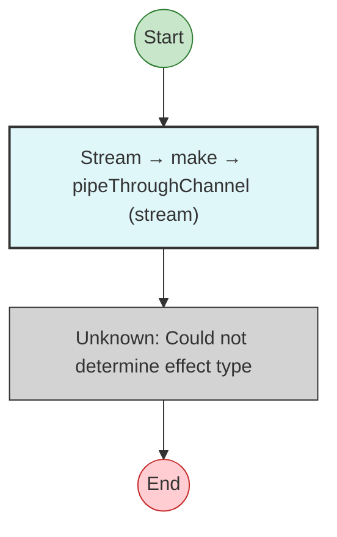

# Effect Analysis: channelProgram

## Metadata

- **File**: `/Users/jreehal/dev/node-examples/effect-analyzer/packages/effect-analyzer/src/__fixtures__/channel-patterns.ts`
- **Analyzed**: 2026-05-22T16:10:29.947Z
- **Source Type**: direct
- **TypeScript Version**: 6.0.2


## Effect Flow




## Statistics

- **Unknown Nodes**: 1


## Explanation

```
channelProgram (direct):
  1. Stream: make -> pipeThroughChannel
    (unknown: Could not determine effect type)

  Concurrency: sequential (no parallelism)
```

