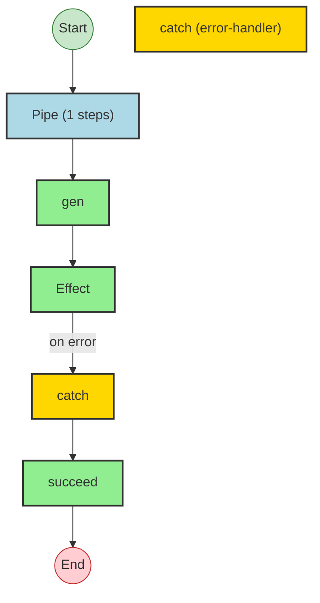
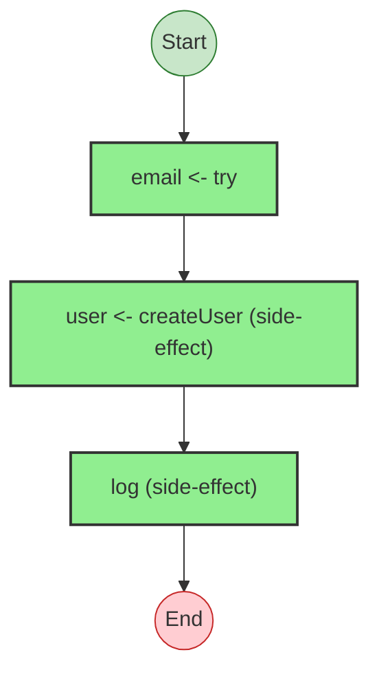
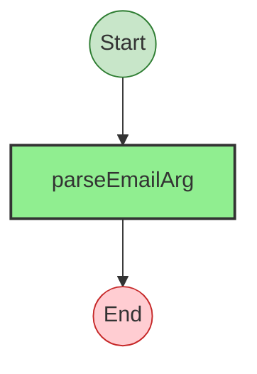
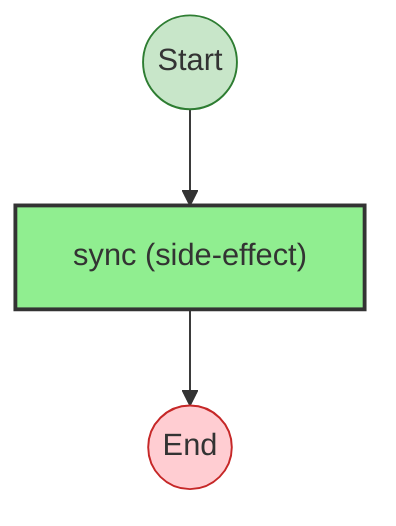
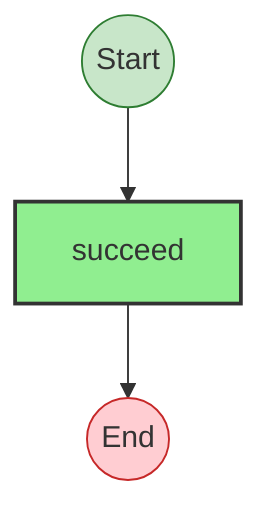

# Effect Analysis: cliMain

## Metadata

- **File**: `/Users/jreehal/dev/node-examples/effect-analyzer/packages/effect-analyzer/src/__fixtures__/cli-script.ts`
- **Analyzed**: 2026-05-22T16:10:30.041Z
- **Source Type**: pipe
- **TypeScript Version**: 6.0.2


## Effect Flow




## Statistics

- **Total Effects**: 3
- **Error Handlers**: 1


## Explanation

```
cliMain (pipe):
  1. Pipes gen through:
    Calls gen
    Catches all errors on:
      Calls Effect
      Handler:
        Calls succeed — constructor

  Error paths: Error
  Concurrency: sequential (no parallelism)
```


## Error Types

- `Error`


---

# Effect Analysis: cliMain

## Metadata

- **File**: `/Users/jreehal/dev/node-examples/effect-analyzer/packages/effect-analyzer/src/__fixtures__/cli-script.ts`
- **Analyzed**: 2026-05-22T16:10:30.043Z
- **Source Type**: generator
- **TypeScript Version**: 6.0.2


## Effect Flow




## Statistics

- **Total Effects**: 3


## Explanation

```
cliMain (generator):
  1. Yields email <- try
  2. Yields user <- createUser
  3. Calls log

  Error paths: Error
  Concurrency: sequential (no parallelism)
```


## Error Types

- `Error`


---

# Effect Analysis: email.try

## Metadata

- **File**: `/Users/jreehal/dev/node-examples/effect-analyzer/packages/effect-analyzer/src/__fixtures__/cli-script.ts`
- **Analyzed**: 2026-05-22T16:10:30.043Z
- **Source Type**: run
- **TypeScript Version**: 6.0.2


## Effect Flow




## Statistics

- **Total Effects**: 1


## Explanation

```
email.try (run):
  1. Calls parseEmailArg

  Concurrency: sequential (no parallelism)
```


---

# Effect Analysis: parseEmailArg

## Metadata

- **File**: `/Users/jreehal/dev/node-examples/effect-analyzer/packages/effect-analyzer/src/__fixtures__/cli-script.ts`
- **Analyzed**: 2026-05-22T16:10:30.044Z
- **Source Type**: direct
- **TypeScript Version**: 6.0.2


## Effect Flow




## Statistics

- **Total Effects**: 1


## Explanation

```
parseEmailArg (direct):
  1. Calls sync — constructor

  Concurrency: sequential (no parallelism)
```


---

# Effect Analysis: createUser

## Metadata

- **File**: `/Users/jreehal/dev/node-examples/effect-analyzer/packages/effect-analyzer/src/__fixtures__/cli-script.ts`
- **Analyzed**: 2026-05-22T16:10:30.045Z
- **Source Type**: direct
- **TypeScript Version**: 6.0.2


## Effect Flow




## Statistics

- **Total Effects**: 1


## Explanation

```
createUser (direct):
  1. Calls succeed — constructor

  Concurrency: sequential (no parallelism)
```

