# Effect Analysis: conditionalWhenProgram

## Metadata

- **File**: `/Users/jreehal/dev/node-examples/effect-analyzer/packages/effect-analyzer/src/__fixtures__/complex-composition.ts`
- **Analyzed**: 2026-05-22T16:10:30.127Z
- **Source Type**: generator
- **TypeScript Version**: 6.0.2


## Effect Flow

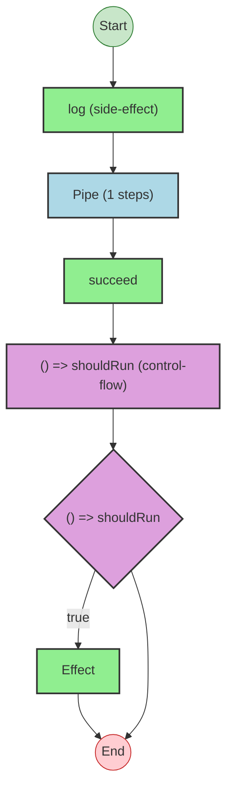


## Statistics

- **Total Effects**: 3
- **Conditionals**: 1


## Explanation

```
conditionalWhenProgram (generator):
  1. Calls log
  2. result = Pipes succeed through:
    Calls succeed — constructor
    If () => shouldRun:
      Calls Effect

  Concurrency: sequential (no parallelism)
```


---

# Effect Analysis: conditionalUnlessProgram

## Metadata

- **File**: `/Users/jreehal/dev/node-examples/effect-analyzer/packages/effect-analyzer/src/__fixtures__/complex-composition.ts`
- **Analyzed**: 2026-05-22T16:10:30.130Z
- **Source Type**: generator
- **TypeScript Version**: 6.0.2


## Effect Flow

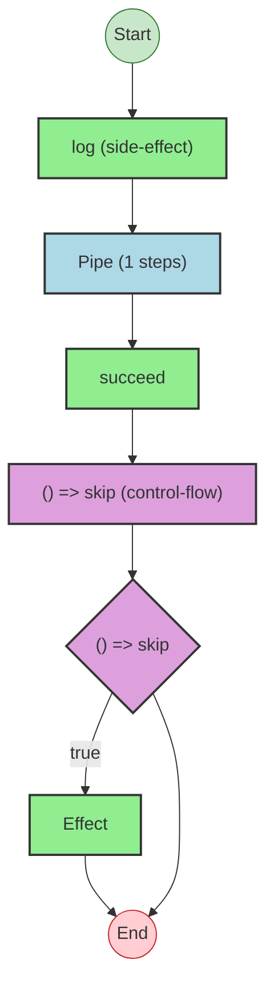


## Statistics

- **Total Effects**: 3
- **Conditionals**: 1


## Explanation

```
conditionalUnlessProgram (generator):
  1. Calls log
  2. result = Pipes succeed through:
    Calls succeed — constructor
    If () => skip:
      Calls Effect

  Concurrency: sequential (no parallelism)
```


---

# Effect Analysis: complexConditionalProgram

## Metadata

- **File**: `/Users/jreehal/dev/node-examples/effect-analyzer/packages/effect-analyzer/src/__fixtures__/complex-composition.ts`
- **Analyzed**: 2026-05-22T16:10:30.134Z
- **Source Type**: generator
- **TypeScript Version**: 6.0.2


## Effect Flow

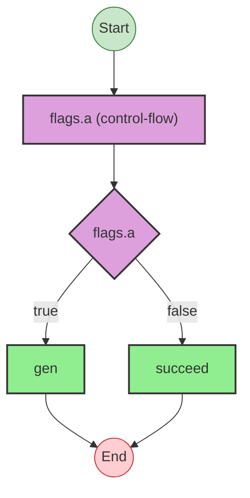


## Statistics

- **Total Effects**: 2
- **Conditionals**: 1


## Explanation

```
complexConditionalProgram (generator):
  1. resultA = If flags.a:
    Calls gen
  2. Else:
    Calls succeed — constructor

  Concurrency: sequential (no parallelism)
```


---

# Effect Analysis: resultA.onTrue

## Metadata

- **File**: `/Users/jreehal/dev/node-examples/effect-analyzer/packages/effect-analyzer/src/__fixtures__/complex-composition.ts`
- **Analyzed**: 2026-05-22T16:10:30.136Z
- **Source Type**: generator
- **TypeScript Version**: 6.0.2


## Effect Flow

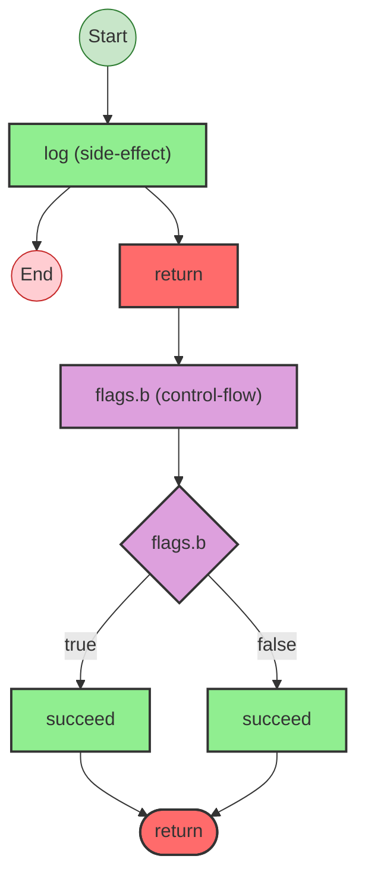


## Statistics

- **Total Effects**: 3
- **Conditionals**: 1


## Explanation

```
resultA.onTrue (generator):
  1. Calls log
  2. Returns:
    If flags.b:
      Calls succeed — constructor
    Else:
      Calls succeed — constructor

  Concurrency: sequential (no parallelism)
```


---

# Effect Analysis: recursiveProgram

## Metadata

- **File**: `/Users/jreehal/dev/node-examples/effect-analyzer/packages/effect-analyzer/src/__fixtures__/complex-composition.ts`
- **Analyzed**: 2026-05-22T16:10:30.138Z
- **Source Type**: generator
- **TypeScript Version**: 6.0.2


## Effect Flow

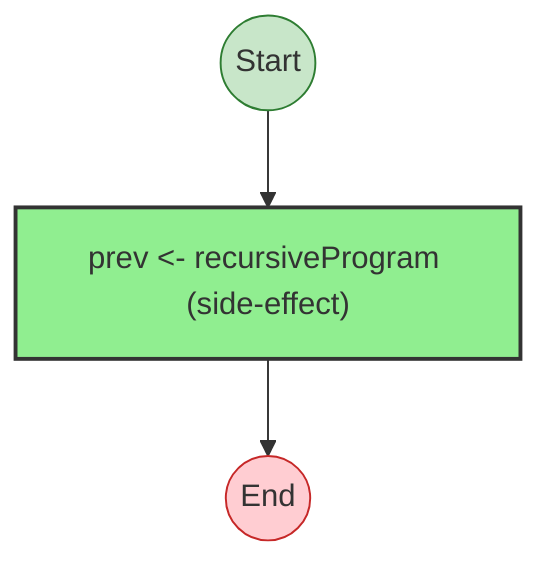


## Statistics

- **Total Effects**: 1


## Explanation

```
recursiveProgram (generator):
  1. Yields prev <- recursiveProgram

  Concurrency: sequential (no parallelism)
```


---

# Effect Analysis: repeatProgram

## Metadata

- **File**: `/Users/jreehal/dev/node-examples/effect-analyzer/packages/effect-analyzer/src/__fixtures__/complex-composition.ts`
- **Analyzed**: 2026-05-22T16:10:30.145Z
- **Source Type**: generator
- **TypeScript Version**: 6.0.2


## Effect Flow

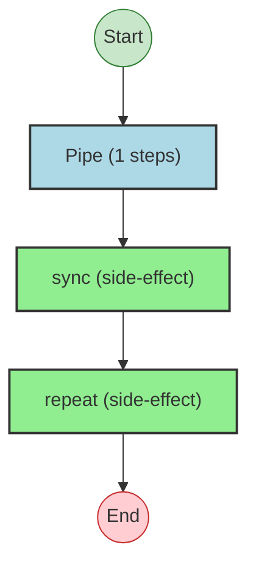


## Statistics

- **Total Effects**: 2


## Explanation

```
repeatProgram (generator):
  1. result = Pipes sync through:
    Calls sync — constructor
    Calls repeat

  Error paths: E
  Concurrency: sequential (no parallelism)
```


## Error Types

- `E`


---

# Effect Analysis: concurrentForEachProgram

## Metadata

- **File**: `/Users/jreehal/dev/node-examples/effect-analyzer/packages/effect-analyzer/src/__fixtures__/complex-composition.ts`
- **Analyzed**: 2026-05-22T16:10:30.152Z
- **Source Type**: generator
- **TypeScript Version**: 6.0.2


## Effect Flow

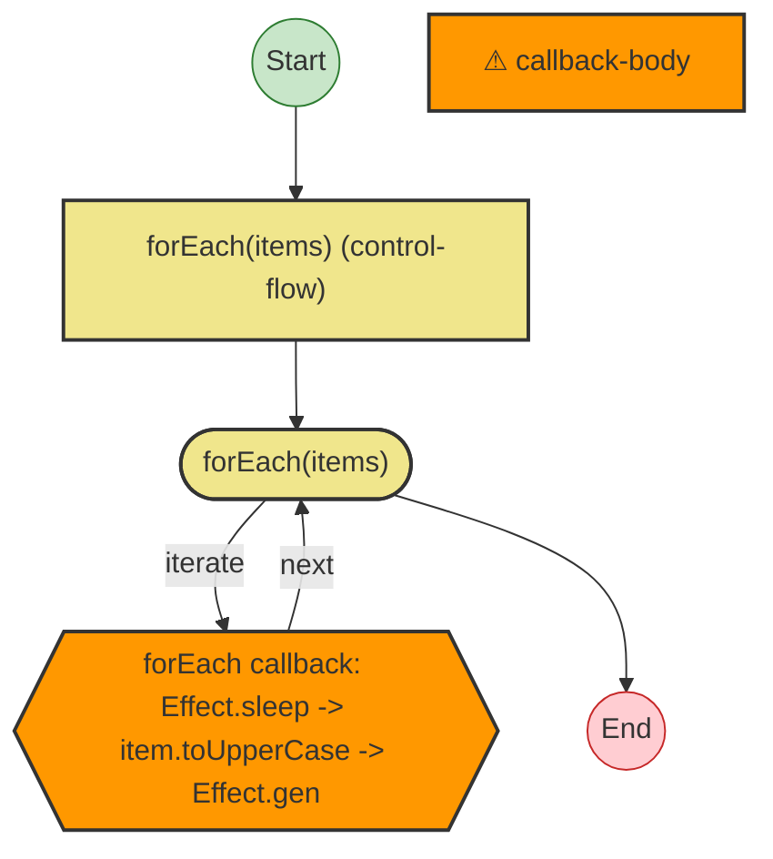


## Statistics

- **Loops**: 1


## Explanation

```
concurrentForEachProgram (generator):
  1. results = Iterates (forEach) over items:
    forEach callback: Effect.sleep -> item.toUpperCase -> Effect…
    Callback:
      Calls sleep — callback-call
      Calls item.toUpperCase — callback-call
      Calls gen — callback-call

  Concurrency: sequential (no parallelism)
```


---

# Effect Analysis: results

## Metadata

- **File**: `/Users/jreehal/dev/node-examples/effect-analyzer/packages/effect-analyzer/src/__fixtures__/complex-composition.ts`
- **Analyzed**: 2026-05-22T16:10:30.153Z
- **Source Type**: generator
- **TypeScript Version**: 6.0.2


## Effect Flow

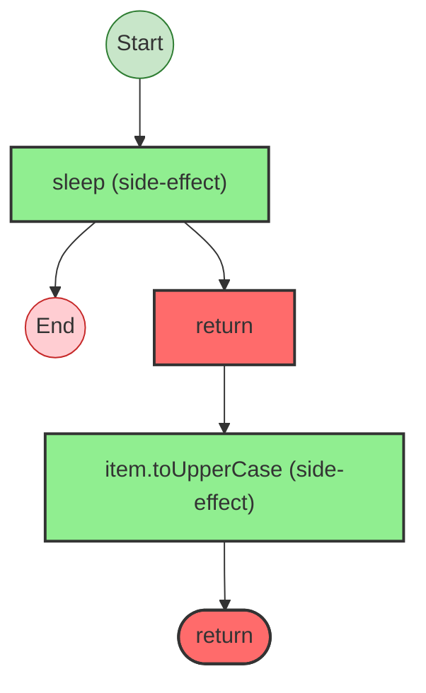


## Statistics

- **Total Effects**: 2


## Explanation

```
results (generator):
  1. Calls sleep
  2. Returns:
    Calls item.toUpperCase

  Concurrency: sequential (no parallelism)
```


---

# Effect Analysis: chainedErrorHandlerProgram

## Metadata

- **File**: `/Users/jreehal/dev/node-examples/effect-analyzer/packages/effect-analyzer/src/__fixtures__/complex-composition.ts`
- **Analyzed**: 2026-05-22T16:10:30.162Z
- **Source Type**: generator
- **TypeScript Version**: 6.0.2


## Effect Flow

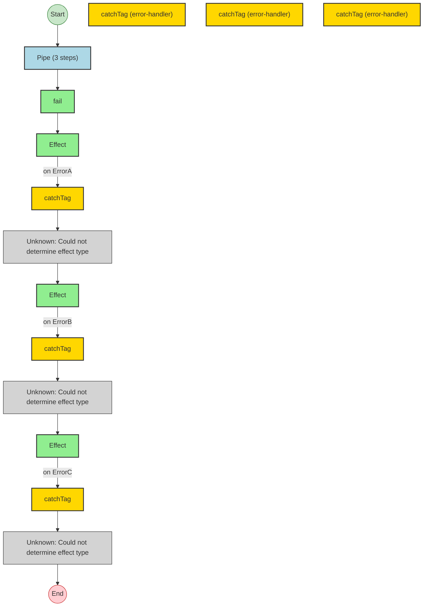


## Statistics

- **Total Effects**: 4
- **Error Handlers**: 3
- **Unknown Nodes**: 3


## Explanation

```
chainedErrorHandlerProgram (generator):
  1. result = Pipes fail through:
    Calls fail — constructor
    Catches tag "ErrorA" on:
      Calls Effect
      Handler:
        (unknown: Could not determine effect type)
    Catches tag "ErrorB" on:
      Calls Effect
      Handler:
        (unknown: Could not determine effect type)
    Catches tag "ErrorC" on:
      Calls Effect
      Handler:
        (unknown: Could not determine effect type)

  Error paths: { _tag: "ErrorA"; }
  Concurrency: sequential (no parallelism)
```


## Error Types

- `{ _tag: "ErrorA"; }`


---

# Effect Analysis: catchCauseProgram

## Metadata

- **File**: `/Users/jreehal/dev/node-examples/effect-analyzer/packages/effect-analyzer/src/__fixtures__/complex-composition.ts`
- **Analyzed**: 2026-05-22T16:10:30.166Z
- **Source Type**: generator
- **TypeScript Version**: 6.0.2


## Effect Flow

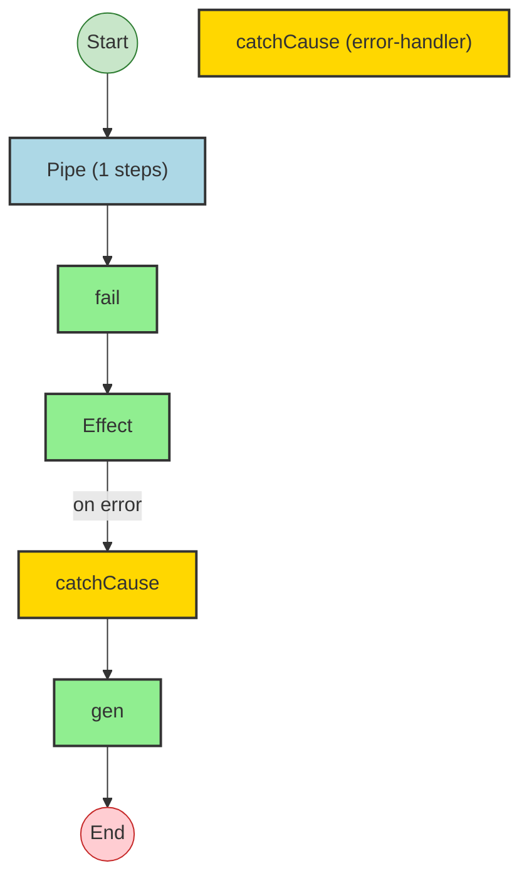


## Statistics

- **Total Effects**: 3
- **Error Handlers**: 1


## Explanation

```
catchCauseProgram (generator):
  1. result = Pipes fail through:
    Calls fail — constructor
    Handles errors (catchCause):
      Calls Effect
      Handler:
        Calls gen

  Error paths: string
  Concurrency: sequential (no parallelism)
```


## Error Types

- `string`


---

# Effect Analysis: result

## Metadata

- **File**: `/Users/jreehal/dev/node-examples/effect-analyzer/packages/effect-analyzer/src/__fixtures__/complex-composition.ts`
- **Analyzed**: 2026-05-22T16:10:30.167Z
- **Source Type**: generator
- **TypeScript Version**: 6.0.2


## Effect Flow

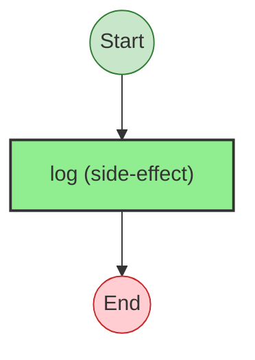


## Statistics

- **Total Effects**: 1


## Explanation

```
result (generator):
  1. Calls log

  Concurrency: sequential (no parallelism)
```


---

# Effect Analysis: tapErrorProgram

## Metadata

- **File**: `/Users/jreehal/dev/node-examples/effect-analyzer/packages/effect-analyzer/src/__fixtures__/complex-composition.ts`
- **Analyzed**: 2026-05-22T16:10:30.171Z
- **Source Type**: generator
- **TypeScript Version**: 6.0.2


## Effect Flow

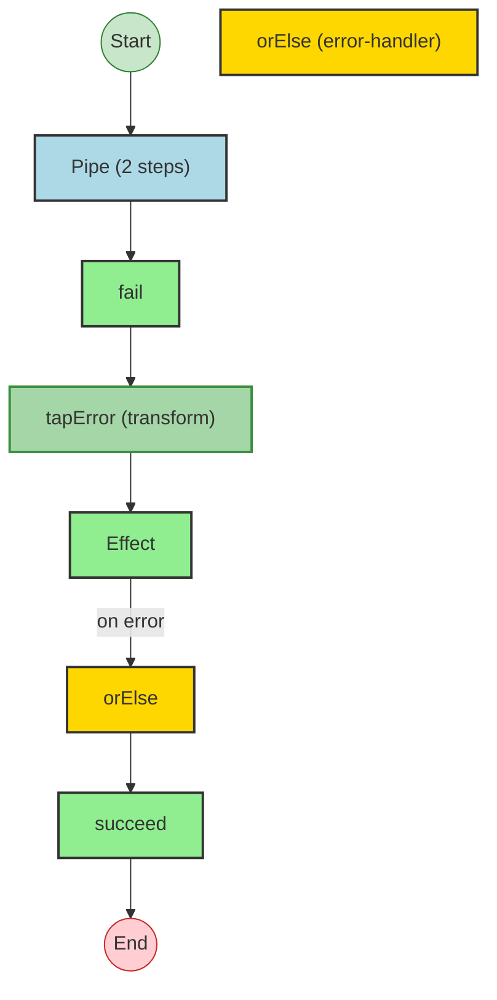


## Statistics

- **Total Effects**: 4
- **Error Handlers**: 1


## Explanation

```
tapErrorProgram (generator):
  1. result = Pipes fail through:
    Calls fail — constructor
    Transforms via tapError
    Falls back (orElse) on error:
      Calls Effect
      Handler:
        Calls succeed — constructor

  Error paths: string
  Concurrency: sequential (no parallelism)
```


## Error Types

- `string`


---

# Effect Analysis: orElseChainProgram

## Metadata

- **File**: `/Users/jreehal/dev/node-examples/effect-analyzer/packages/effect-analyzer/src/__fixtures__/complex-composition.ts`
- **Analyzed**: 2026-05-22T16:10:30.174Z
- **Source Type**: generator
- **TypeScript Version**: 6.0.2


## Effect Flow

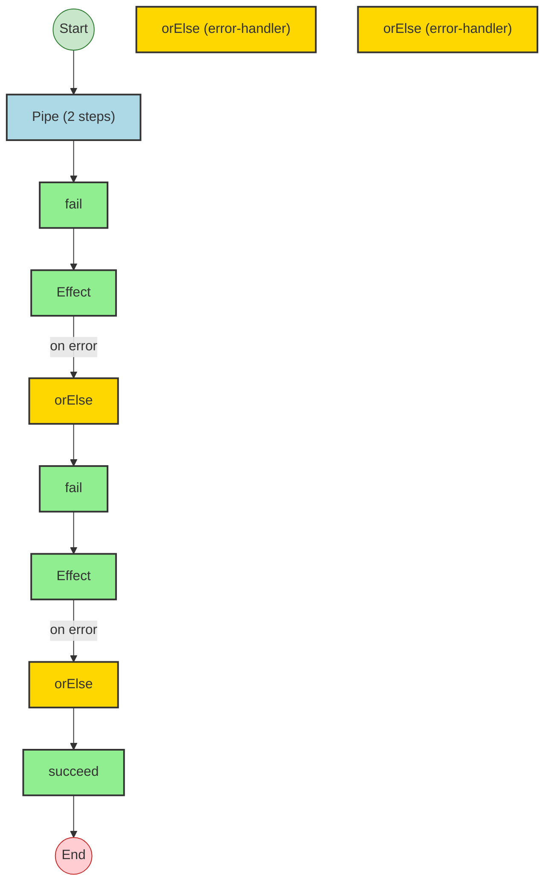


## Statistics

- **Total Effects**: 5
- **Error Handlers**: 2


## Explanation

```
orElseChainProgram (generator):
  1. result = Pipes fail through:
    Calls fail — constructor
    Falls back (orElse) on error:
      Calls Effect
      Handler:
        Calls fail — constructor
    Falls back (orElse) on error:
      Calls Effect
      Handler:
        Calls succeed — constructor

  Error paths: string
  Concurrency: sequential (no parallelism)
```


## Error Types

- `string`


---

# Effect Analysis: mixedParallelSequentialProgram

## Metadata

- **File**: `/Users/jreehal/dev/node-examples/effect-analyzer/packages/effect-analyzer/src/__fixtures__/complex-composition.ts`
- **Analyzed**: 2026-05-22T16:10:30.186Z
- **Source Type**: generator
- **TypeScript Version**: 6.0.2


## Effect Flow

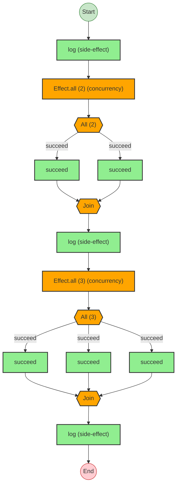


## Statistics

- **Total Effects**: 8
- **Parallel Operations**: 2


## Explanation

```
mixedParallelSequentialProgram (generator):
  1. Calls log
  2. [result1, result2] = Runs 2 effects in sequential:
    Calls succeed — constructor
    Calls succeed — constructor
  3. Calls log
  4. [result3, result4, result5] = Runs 3 effects in sequential:
    Calls succeed — constructor
    Calls succeed — constructor
    Calls succeed — constructor
  5. Calls log

  Concurrency: uses parallelism / racing
```


---

# Effect Analysis: raceWithFallbackProgram

## Metadata

- **File**: `/Users/jreehal/dev/node-examples/effect-analyzer/packages/effect-analyzer/src/__fixtures__/complex-composition.ts`
- **Analyzed**: 2026-05-22T16:10:30.194Z
- **Source Type**: generator
- **TypeScript Version**: 6.0.2


## Effect Flow

```mermaid
flowchart TB

  %% Program: raceWithFallbackProgram

  start((Start))
  end_node((End))

  n2["Pipe (1 steps)"]
  n3["Effect.race (2 racing) (concurrency)"]
  race_fork_4{{{"Race (2)"}}}
  race_join_4{{{"Winner"}}}
  n5["fast"]
  n6["slow"]
  n7["orElse (error-handler)"]
  n8["Effect"]
  err_handler_9["orElse"]
  n10["succeed"]
  n11["Pipe (1 steps)"]
  n12["sleep (side-effect)"]
  n13["as (transform)"]
  n14["sleep (side-effect)"]
  n15["as (transform)"]
  n16["Pipe (1 steps)"]
  n17["sleep (side-effect)"]
  n18["as (transform)"]
  n19["sleep (side-effect)"]
  n20["as (transform)"]

  %% Edges
  n3 --> race_fork_4
  race_fork_4 -->|fast| n5
  n5 --> race_join_4
  race_fork_4 -->|slow| n6
  n6 --> race_join_4
  n8 -->|on error| err_handler_9
  err_handler_9 --> n10
  race_join_4 --> n8
  n2 --> n3
  n12 --> n13
  n11 --> n12
  n10 --> n11
  n13 --> n14
  n14 --> n15
  n17 --> n18
  n16 --> n17
  n15 --> n16
  n18 --> n19
  n19 --> n20
  start --> n2
  n20 --> end_node

  %% Styles
  classDef startStyle fill:#c8e6c9,stroke:#2e7d32
  classDef endStyle fill:#ffcdd2,stroke:#c62828
  classDef effectStyle fill:#90EE90,stroke:#333,stroke-width:2px
  classDef pipeStyle fill:#ADD8E6,stroke:#333,stroke-width:2px
  classDef raceStyle fill:#FF6347,stroke:#333,stroke-width:2px
  classDef errorHandlerStyle fill:#FFD700,stroke:#333,stroke-width:2px
  classDef transformStyle fill:#A5D6A7,stroke:#388E3C,stroke-width:2px
  class start startStyle
  class end_node endStyle
  class n2 pipeStyle
  class n3 raceStyle
  class race_fork_4 raceStyle
  class race_join_4 raceStyle
  class n5 effectStyle
  class n6 effectStyle
  class n7 errorHandlerStyle
  class n8 effectStyle
  class err_handler_9 errorHandlerStyle
  class n10 effectStyle
  class n11 pipeStyle
  class n12 effectStyle
  class n13 transformStyle
  class n14 effectStyle
  class n15 transformStyle
  class n16 pipeStyle
  class n17 effectStyle
  class n18 transformStyle
  class n19 effectStyle
  class n20 transformStyle
```


## Statistics

- **Total Effects**: 12
- **Race Operations**: 1
- **Error Handlers**: 1


## Explanation

```
raceWithFallbackProgram (generator):
  1. winner = Pipes Effect.race(2 effects) through:
    Races 2 effects:
      Calls fast
      Calls slow
    Falls back (orElse) on error:
      Calls Effect
      Handler:
        Calls succeed — constructor
  2. Pipes sleep through:
    Calls sleep
    Transforms via as
  3. Calls sleep
  4. Transforms via as
  5. Pipes sleep through:
    Calls sleep
    Transforms via as
  6. Calls sleep
  7. Transforms via as

  Concurrency: uses parallelism / racing
```


---

# Effect Analysis: optionToEffectProgram

## Metadata

- **File**: `/Users/jreehal/dev/node-examples/effect-analyzer/packages/effect-analyzer/src/__fixtures__/complex-composition.ts`
- **Analyzed**: 2026-05-22T16:10:30.196Z
- **Source Type**: generator
- **TypeScript Version**: 6.0.2


## Effect Flow

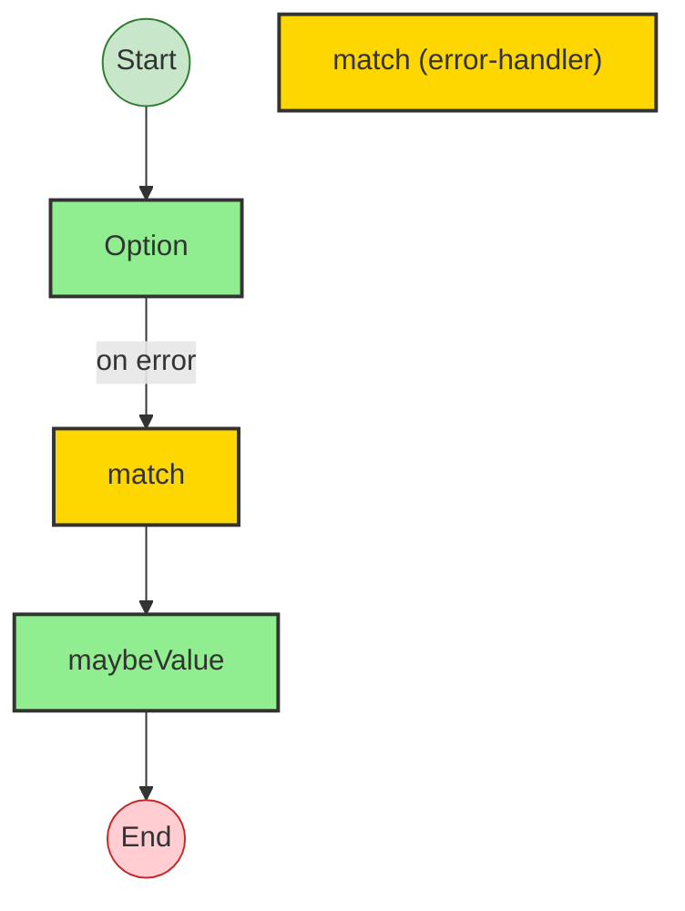


## Statistics

- **Total Effects**: 2
- **Error Handlers**: 1


## Explanation

```
optionToEffectProgram (generator):
  1. value = Handles errors (match):
    Calls Option
    Handler:
      Calls maybeValue

  Concurrency: sequential (no parallelism)
```


---

# Effect Analysis: eitherToEffectProgram

## Metadata

- **File**: `/Users/jreehal/dev/node-examples/effect-analyzer/packages/effect-analyzer/src/__fixtures__/complex-composition.ts`
- **Analyzed**: 2026-05-22T16:10:30.200Z
- **Source Type**: generator
- **TypeScript Version**: 6.0.2


## Effect Flow

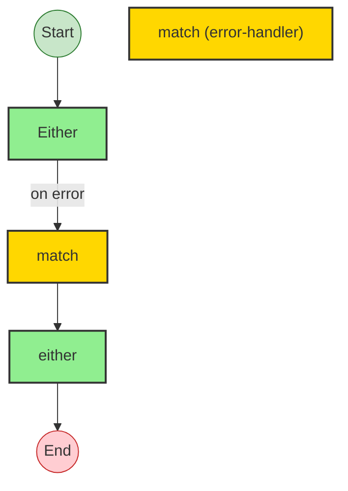


## Statistics

- **Total Effects**: 2
- **Error Handlers**: 1


## Explanation

```
eitherToEffectProgram (generator):
  1. value = Handles errors (match):
    Calls Either
    Handler:
      Calls either

  Concurrency: sequential (no parallelism)
```


---

# Effect Analysis: optionWithinEffectProgram

## Metadata

- **File**: `/Users/jreehal/dev/node-examples/effect-analyzer/packages/effect-analyzer/src/__fixtures__/complex-composition.ts`
- **Analyzed**: 2026-05-22T16:10:30.202Z
- **Source Type**: generator
- **TypeScript Version**: 6.0.2


## Effect Flow

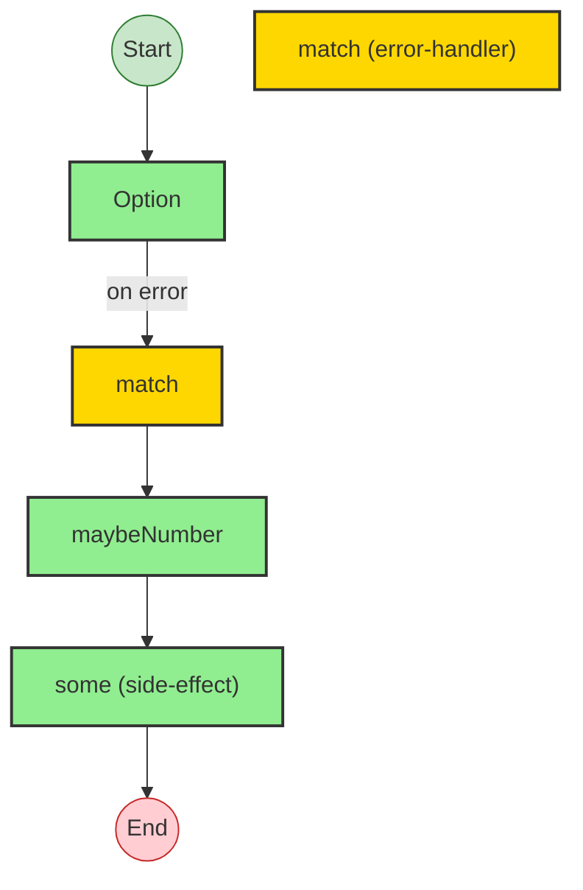


## Statistics

- **Total Effects**: 3
- **Error Handlers**: 1


## Explanation

```
optionWithinEffectProgram (generator):
  1. result = Handles errors (match):
    Calls Option
    Handler:
      Calls maybeNumber
  2. Calls some — option

  Concurrency: sequential (no parallelism)
```


---

# Effect Analysis: arrayOperationsProgram

## Metadata

- **File**: `/Users/jreehal/dev/node-examples/effect-analyzer/packages/effect-analyzer/src/__fixtures__/complex-composition.ts`
- **Analyzed**: 2026-05-22T16:10:30.205Z
- **Source Type**: generator
- **TypeScript Version**: 6.0.2


## Effect Flow

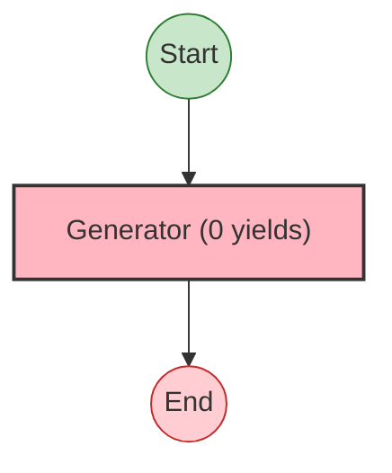


## Statistics

- No operations found


## Explanation

```
arrayOperationsProgram (generator):


  Concurrency: sequential (no parallelism)
```


---

# Effect Analysis: conditionalIfProgram

## Metadata

- **File**: `/Users/jreehal/dev/node-examples/effect-analyzer/packages/effect-analyzer/src/__fixtures__/complex-composition.ts`
- **Analyzed**: 2026-05-22T16:10:30.206Z
- **Source Type**: direct
- **TypeScript Version**: 6.0.2


## Effect Flow

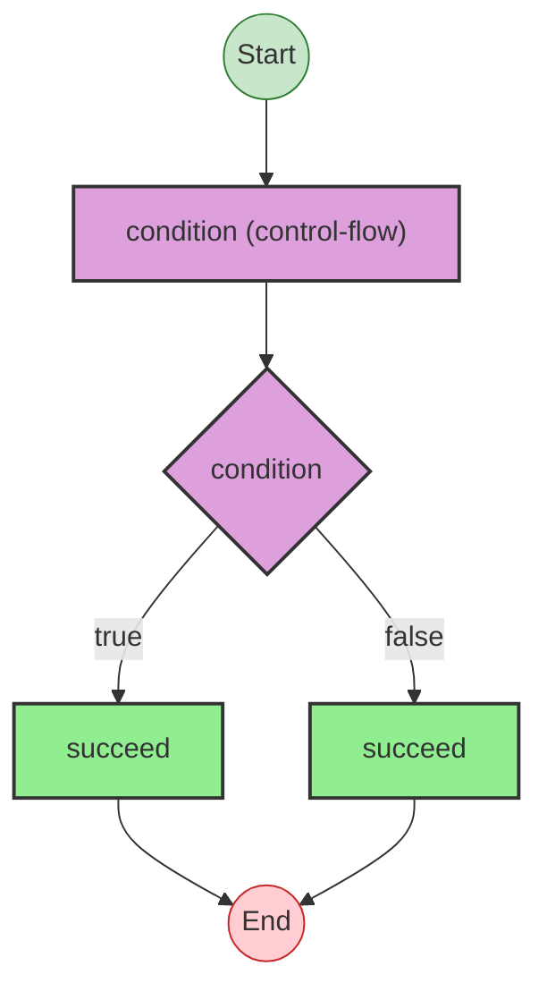


## Statistics

- **Total Effects**: 2
- **Conditionals**: 1


## Explanation

```
conditionalIfProgram (direct):
  1. If condition:
    Calls succeed — constructor
  2. Else:
    Calls succeed — constructor

  Concurrency: sequential (no parallelism)
```


---

# Effect Analysis: loopProgram

## Metadata

- **File**: `/Users/jreehal/dev/node-examples/effect-analyzer/packages/effect-analyzer/src/__fixtures__/complex-composition.ts`
- **Analyzed**: 2026-05-22T16:10:30.209Z
- **Source Type**: direct
- **TypeScript Version**: 6.0.2


## Effect Flow

```mermaid
flowchart TB

  %% Program: loopProgram

  start((Start))
  end_node((End))

  n1["loop(0) (control-flow)"]
  loop_2(["loop(0)"])
  n3["Unknown: Could not determine effect type"]

  %% Edges
  n1 --> loop_2
  loop_2 -->|iterate| n3
  n3 -->|next| loop_2
  start --> n1
  loop_2 --> end_node

  %% Styles
  classDef startStyle fill:#c8e6c9,stroke:#2e7d32
  classDef endStyle fill:#ffcdd2,stroke:#c62828
  classDef loopStyle fill:#F0E68C,stroke:#333,stroke-width:2px
  classDef unknownStyle fill:#D3D3D3,stroke:#333,stroke-width:1px
  class start startStyle
  class end_node endStyle
  class n1 loopStyle
  class loop_2 loopStyle
  class n3 unknownStyle
```


## Statistics

- **Loops**: 1
- **Unknown Nodes**: 1


## Explanation

```
loopProgram (direct):
  1. Iterates (loop) over 0:
    (unknown: Could not determine effect type)

  Concurrency: sequential (no parallelism)
```

