# Effect Analysis: serviceProgram

## Metadata

- **File**: `/Users/jreehal/dev/node-examples/effect-analyzer/packages/effect-analyzer/src/__fixtures__/context-services.ts`
- **Analyzed**: 2026-05-22T16:10:30.296Z
- **Source Type**: generator
- **TypeScript Version**: 6.0.2


## Effect Flow

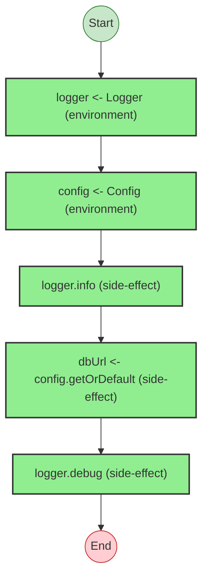


## Statistics

- **Total Effects**: 5


## Explanation

```
serviceProgram (generator):
  1. Yields logger <- Logger
  2. Yields config <- Config
  3. Calls logger.info
  4. Yields dbUrl <- config.getOrDefault
  5. Calls logger.debug

  Concurrency: sequential (no parallelism)
```


---

# Effect Analysis: databaseProgram

## Metadata

- **File**: `/Users/jreehal/dev/node-examples/effect-analyzer/packages/effect-analyzer/src/__fixtures__/context-services.ts`
- **Analyzed**: 2026-05-22T16:10:30.301Z
- **Source Type**: generator
- **TypeScript Version**: 6.0.2


## Effect Flow

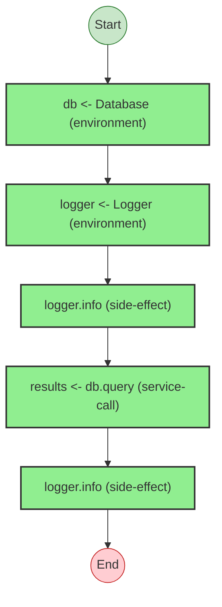


## Statistics

- **Total Effects**: 5


## Explanation

```
databaseProgram (generator):
  1. Yields db <- Database
  2. Yields logger <- Logger
  3. Calls logger.info
  4. Yields results <- db.query
  5. Calls logger.info

  Services required: Database
  Error paths: DatabaseError
  Concurrency: sequential (no parallelism)
```


## Dependencies

- `Database`


## Error Types

- `DatabaseError`


---

# Effect Analysis: nestedServiceProgram

## Metadata

- **File**: `/Users/jreehal/dev/node-examples/effect-analyzer/packages/effect-analyzer/src/__fixtures__/context-services.ts`
- **Analyzed**: 2026-05-22T16:10:30.305Z
- **Source Type**: generator
- **TypeScript Version**: 6.0.2


## Effect Flow

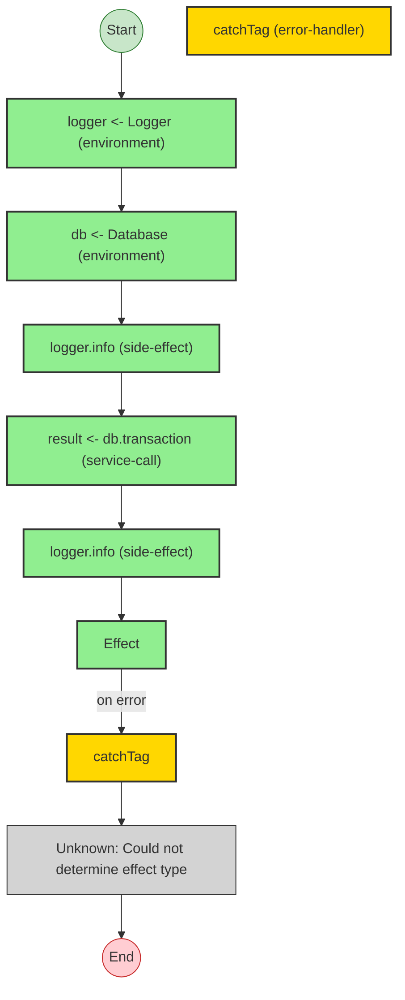


## Statistics

- **Total Effects**: 6
- **Error Handlers**: 1
- **Unknown Nodes**: 1


## Explanation

```
nestedServiceProgram (generator):
  1. Yields logger <- Logger
  2. Yields db <- Database
  3. Calls logger.info
  4. Yields result <- db.transaction
  5. Calls logger.info

  Services required: Database
  Error paths: DatabaseError
  Concurrency: sequential (no parallelism)
```


## Dependencies

- `Database`


## Error Types

- `DatabaseError`


---

# Effect Analysis: result

## Metadata

- **File**: `/Users/jreehal/dev/node-examples/effect-analyzer/packages/effect-analyzer/src/__fixtures__/context-services.ts`
- **Analyzed**: 2026-05-22T16:10:30.306Z
- **Source Type**: generator
- **TypeScript Version**: 6.0.2


## Effect Flow

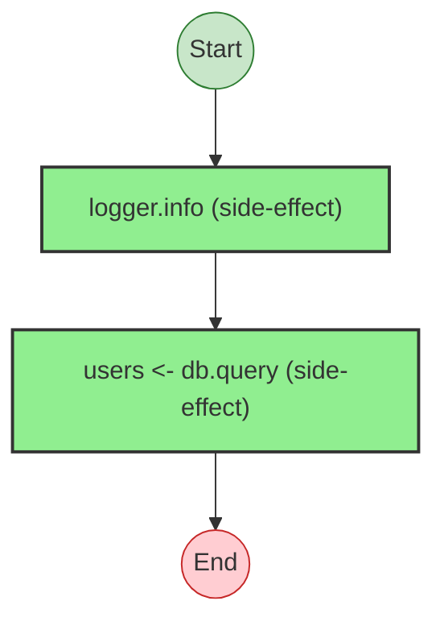


## Statistics

- **Total Effects**: 2


## Explanation

```
result (generator):
  1. Calls logger.info
  2. Yields users <- db.query

  Error paths: DatabaseError
  Concurrency: sequential (no parallelism)
```


## Error Types

- `DatabaseError`


---

# Effect Analysis: nestedServiceProgram

## Metadata

- **File**: `/Users/jreehal/dev/node-examples/effect-analyzer/packages/effect-analyzer/src/__fixtures__/context-services.ts`
- **Analyzed**: 2026-05-22T16:10:30.311Z
- **Source Type**: generator
- **TypeScript Version**: 6.0.2


## Effect Flow

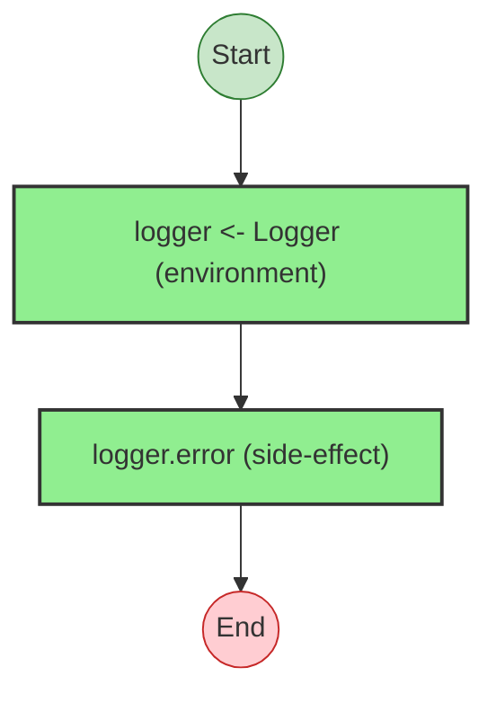


## Statistics

- **Total Effects**: 2


## Explanation

```
nestedServiceProgram (generator):
  1. Yields logger <- Logger
  2. Calls logger.error

  Concurrency: sequential (no parallelism)
```


---

# Effect Analysis: ConfigLive

## Metadata

- **File**: `/Users/jreehal/dev/node-examples/effect-analyzer/packages/effect-analyzer/src/__fixtures__/context-services.ts`
- **Analyzed**: 2026-05-22T16:10:30.317Z
- **Source Type**: generator
- **TypeScript Version**: 6.0.2


## Effect Flow

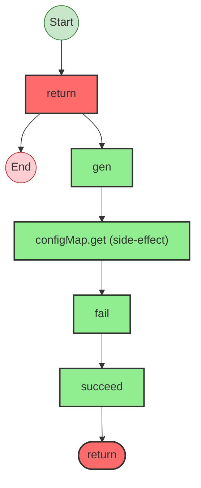


## Statistics

- **Total Effects**: 5


## Explanation

```
ConfigLive (generator):
  1. Returns:
    Calls gen
    Calls configMap.get
    Calls fail — constructor
    Calls succeed — constructor

  Error paths: ConfigError
  Concurrency: sequential (no parallelism)
```


## Error Types

- `ConfigError`


---

# Effect Analysis: ConfigLive.get

## Metadata

- **File**: `/Users/jreehal/dev/node-examples/effect-analyzer/packages/effect-analyzer/src/__fixtures__/context-services.ts`
- **Analyzed**: 2026-05-22T16:10:30.318Z
- **Source Type**: generator
- **TypeScript Version**: 6.0.2


## Effect Flow

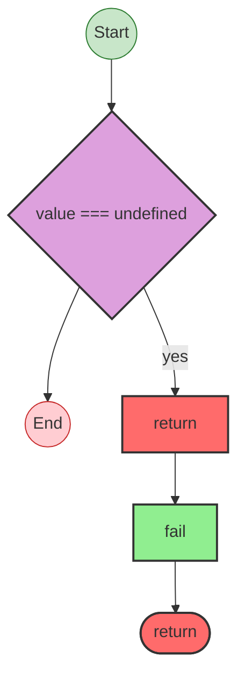


## Statistics

- **Total Effects**: 1


## Explanation

```
ConfigLive.get (generator):
  1. If value === undefined:
    Returns:
      Calls fail — constructor

  Error paths: ConfigError
  Concurrency: sequential (no parallelism)
```


## Error Types

- `ConfigError`


---

# Effect Analysis: DatabaseLive

## Metadata

- **File**: `/Users/jreehal/dev/node-examples/effect-analyzer/packages/effect-analyzer/src/__fixtures__/context-services.ts`
- **Analyzed**: 2026-05-22T16:10:30.324Z
- **Source Type**: generator
- **TypeScript Version**: 6.0.2


## Effect Flow

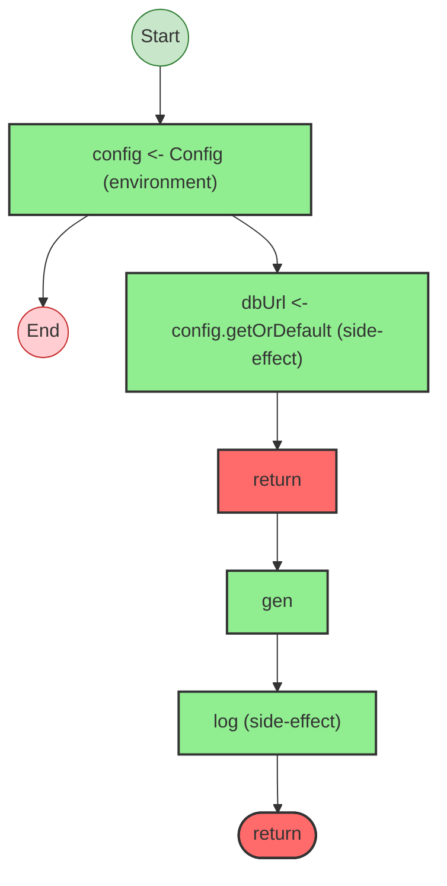


## Statistics

- **Total Effects**: 7


## Explanation

```
DatabaseLive (generator):
  1. Yields config <- Config
  2. Yields dbUrl <- config.getOrDefault
  3. Returns:
    Calls gen
    Calls log

  Concurrency: sequential (no parallelism)
```


---

# Effect Analysis: DatabaseLive.query

## Metadata

- **File**: `/Users/jreehal/dev/node-examples/effect-analyzer/packages/effect-analyzer/src/__fixtures__/context-services.ts`
- **Analyzed**: 2026-05-22T16:10:30.325Z
- **Source Type**: generator
- **TypeScript Version**: 6.0.2


## Effect Flow

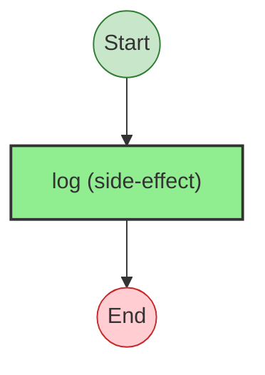


## Statistics

- **Total Effects**: 1


## Explanation

```
DatabaseLive.query (generator):
  1. Calls log

  Concurrency: sequential (no parallelism)
```


---

# Effect Analysis: DatabaseLive.transaction

## Metadata

- **File**: `/Users/jreehal/dev/node-examples/effect-analyzer/packages/effect-analyzer/src/__fixtures__/context-services.ts`
- **Analyzed**: 2026-05-22T16:10:30.326Z
- **Source Type**: generator
- **TypeScript Version**: 6.0.2


## Effect Flow

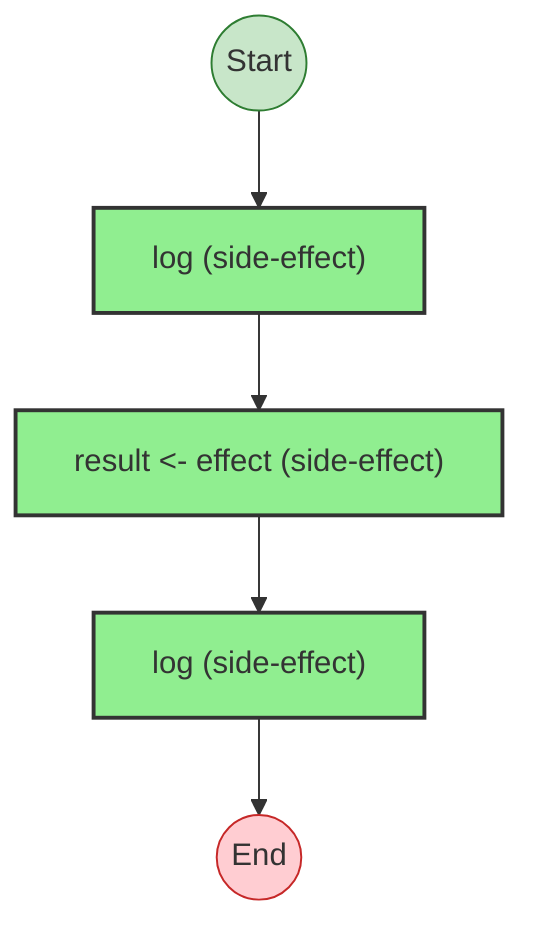


## Statistics

- **Total Effects**: 3


## Explanation

```
DatabaseLive.transaction (generator):
  1. Calls log
  2. Yields result <- effect
  3. Calls log

  Concurrency: sequential (no parallelism)
```


---

# Effect Analysis: programWithFreshLayer

## Metadata

- **File**: `/Users/jreehal/dev/node-examples/effect-analyzer/packages/effect-analyzer/src/__fixtures__/context-services.ts`
- **Analyzed**: 2026-05-22T16:10:30.332Z
- **Source Type**: generator
- **TypeScript Version**: 6.0.2


## Effect Flow

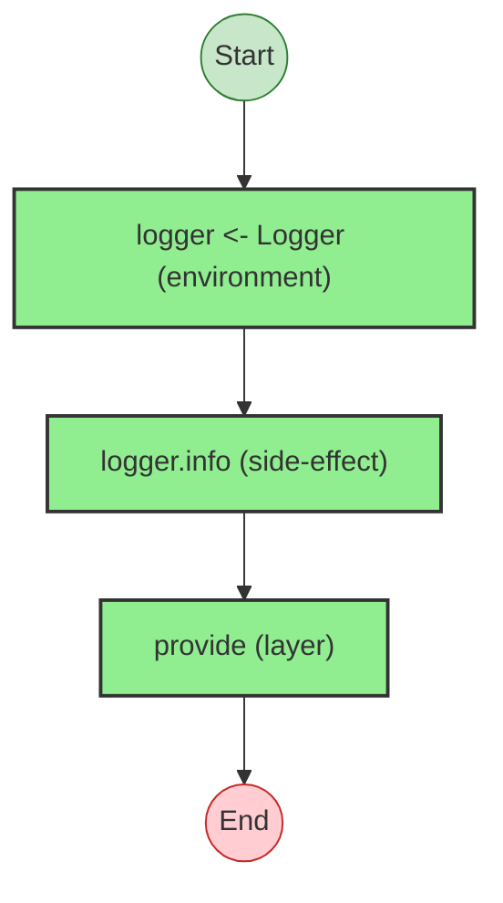


## Statistics

- **Total Effects**: 3


## Explanation

```
programWithFreshLayer (generator):
  1. Yields logger <- Logger
  2. Calls logger.info

  Error paths: E
  Concurrency: sequential (no parallelism)
```


## Error Types

- `E`


---

# Effect Analysis: LoggerLive

## Metadata

- **File**: `/Users/jreehal/dev/node-examples/effect-analyzer/packages/effect-analyzer/src/__fixtures__/context-services.ts`
- **Analyzed**: 2026-05-22T16:10:30.333Z
- **Source Type**: direct
- **TypeScript Version**: 6.0.2


## Effect Flow

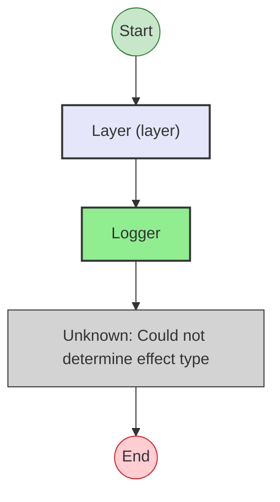


## Statistics

- **Total Effects**: 1
- **Unknown Nodes**: 1


## Explanation

```
LoggerLive (direct):
  1. Provides layer providing Logger:
    Calls Logger
    (unknown: Could not determine effect type)

  Concurrency: sequential (no parallelism)
```


---

# Effect Analysis: AppLayer

## Metadata

- **File**: `/Users/jreehal/dev/node-examples/effect-analyzer/packages/effect-analyzer/src/__fixtures__/context-services.ts`
- **Analyzed**: 2026-05-22T16:10:30.337Z
- **Source Type**: direct
- **TypeScript Version**: 6.0.2


## Effect Flow

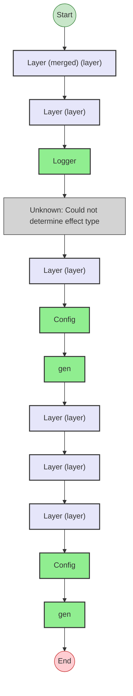


## Statistics

- **Total Effects**: 5
- **Unknown Nodes**: 1


## Explanation

```
AppLayer (direct):
  1. Provides layer (requires ConfigLive):
    Provides layer providing Logger:
      Calls Logger
      (unknown: Could not determine effect type)
    Provides layer providing Config:
      Calls Config
      Calls gen
    Provides layer providing ConfigLive (requires ConfigLive):
      Provides layer (requires ConfigLive):
        Provides layer providing Config:
          Calls Config
          Calls gen

  Concurrency: sequential (no parallelism)
```


---

# Effect Analysis: programWithLayer

## Metadata

- **File**: `/Users/jreehal/dev/node-examples/effect-analyzer/packages/effect-analyzer/src/__fixtures__/context-services.ts`
- **Analyzed**: 2026-05-22T16:10:30.338Z
- **Source Type**: direct
- **TypeScript Version**: 6.0.2


## Effect Flow

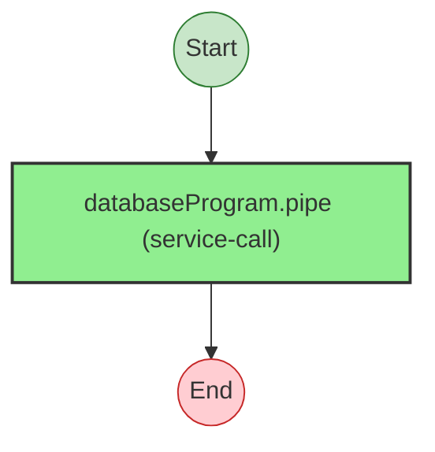


## Statistics

- **Total Effects**: 1


## Explanation

```
programWithLayer (direct):
  1. Calls Effect.pipe — service-call

  Error paths: DatabaseError
  Concurrency: sequential (no parallelism)
```


## Error Types

- `DatabaseError`


---

# Effect Analysis: programWithMergedLayers

## Metadata

- **File**: `/Users/jreehal/dev/node-examples/effect-analyzer/packages/effect-analyzer/src/__fixtures__/context-services.ts`
- **Analyzed**: 2026-05-22T16:10:30.340Z
- **Source Type**: direct
- **TypeScript Version**: 6.0.2


## Effect Flow

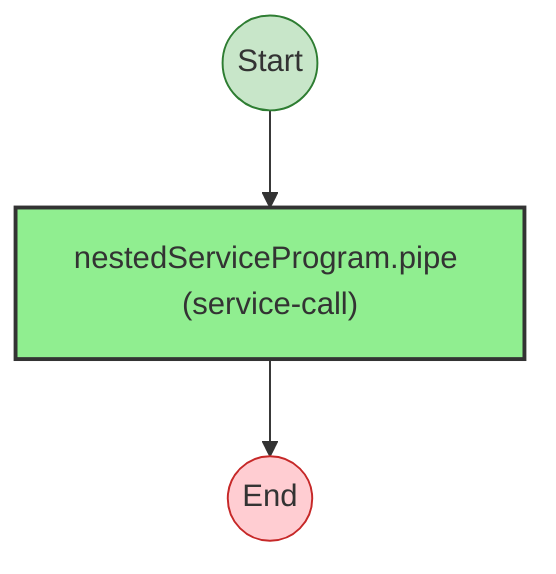


## Statistics

- **Total Effects**: 1


## Explanation

```
programWithMergedLayers (direct):
  1. Calls Effect.pipe — service-call

  Concurrency: sequential (no parallelism)
```


---

# Effect Analysis: Database

## Metadata

- **File**: `/Users/jreehal/dev/node-examples/effect-analyzer/packages/effect-analyzer/src/__fixtures__/context-services.ts`
- **Analyzed**: 2026-05-22T16:10:30.340Z
- **Source Type**: class
- **TypeScript Version**: 6.0.2


## Effect Flow

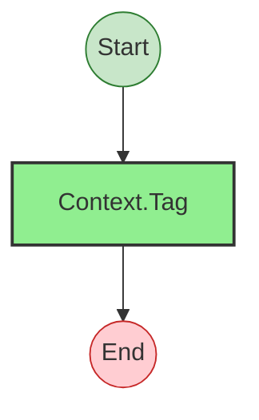


## Statistics

- **Total Effects**: 1


## Explanation

```
Database (class):
  1. Calls Context.Tag — service-tag

  Concurrency: sequential (no parallelism)
```


---

# Effect Analysis: Config

## Metadata

- **File**: `/Users/jreehal/dev/node-examples/effect-analyzer/packages/effect-analyzer/src/__fixtures__/context-services.ts`
- **Analyzed**: 2026-05-22T16:10:30.341Z
- **Source Type**: class
- **TypeScript Version**: 6.0.2


## Effect Flow


## Statistics

- **Total Effects**: 1


## Explanation

```
Config (class):
  1. Calls Context.Tag — service-tag

  Concurrency: sequential (no parallelism)
```


---

# Effect Analysis: Logger

## Metadata

- **File**: `/Users/jreehal/dev/node-examples/effect-analyzer/packages/effect-analyzer/src/__fixtures__/context-services.ts`
- **Analyzed**: 2026-05-22T16:10:30.341Z
- **Source Type**: class
- **TypeScript Version**: 6.0.2


## Effect Flow


## Statistics

- **Total Effects**: 1


## Explanation

```
Logger (class):
  1. Calls Context.Tag — service-tag

  Concurrency: sequential (no parallelism)
```

