# Effect Analysis: ifElseProgram

## Metadata

- **File**: `/Users/jreehal/dev/node-examples/effect-analyzer/packages/effect-analyzer/src/__fixtures__/control-flow-gen.ts`
- **Analyzed**: 2026-05-22T16:10:30.674Z
- **Source Type**: generator
- **TypeScript Version**: 6.0.2


## Effect Flow

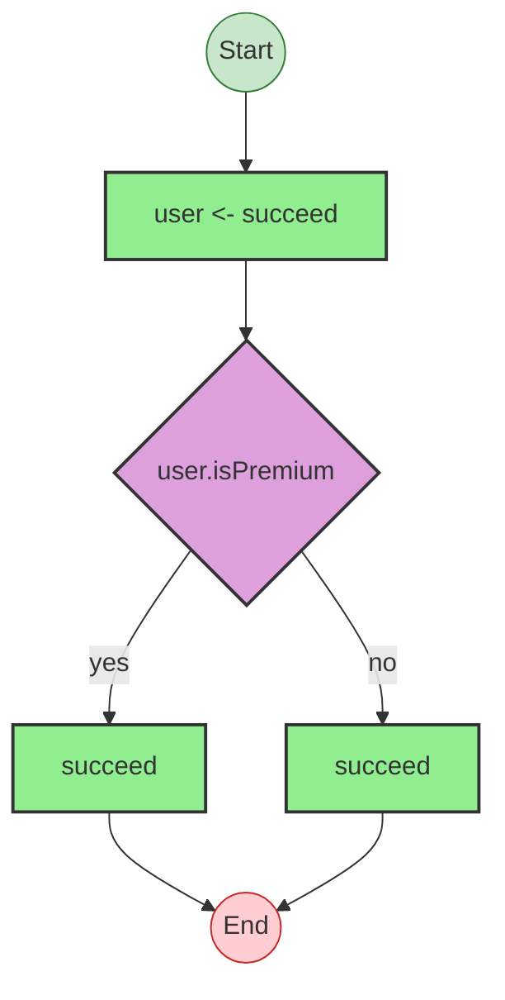


## Statistics

- **Total Effects**: 3


## Explanation

```
ifElseProgram (generator):
  1. Yields user <- succeed
  2. If user.isPremium:
    Calls succeed — constructor
  3. Else:
    Calls succeed — constructor

  Concurrency: sequential (no parallelism)
```


---

# Effect Analysis: switchProgram

## Metadata

- **File**: `/Users/jreehal/dev/node-examples/effect-analyzer/packages/effect-analyzer/src/__fixtures__/control-flow-gen.ts`
- **Analyzed**: 2026-05-22T16:10:30.676Z
- **Source Type**: generator
- **TypeScript Version**: 6.0.2


## Effect Flow

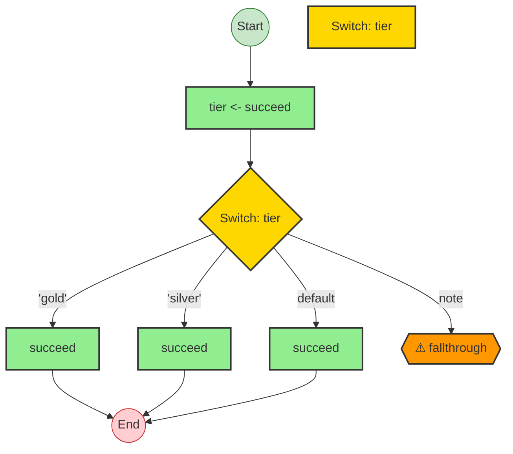


## Statistics

- **Total Effects**: 4


## Explanation

```
switchProgram (generator):
  1. Yields tier <- succeed
  2. Switch on tier:
    Case 'gold':
      Calls succeed — constructor
    Case 'silver':
      Calls succeed — constructor
    Case default:
      Calls succeed — constructor

  Concurrency: sequential (no parallelism)
```


---

# Effect Analysis: forOfProgram

## Metadata

- **File**: `/Users/jreehal/dev/node-examples/effect-analyzer/packages/effect-analyzer/src/__fixtures__/control-flow-gen.ts`
- **Analyzed**: 2026-05-22T16:10:30.677Z
- **Source Type**: generator
- **TypeScript Version**: 6.0.2


## Effect Flow

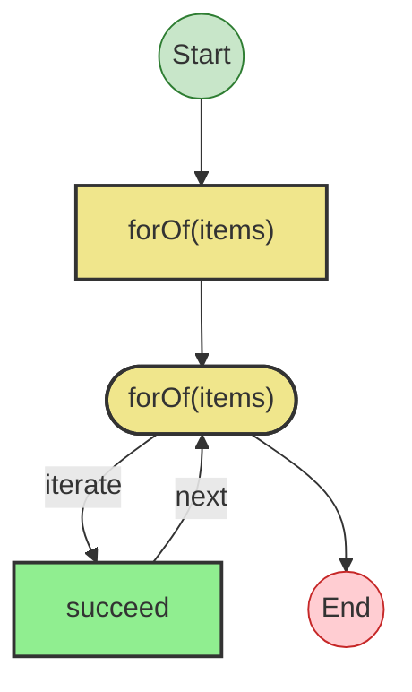


## Statistics

- **Total Effects**: 1
- **Loops**: 1


## Explanation

```
forOfProgram (generator):
  1. Iterates (forOf) over items:
    Calls succeed — constructor

  Concurrency: sequential (no parallelism)
```


---

# Effect Analysis: whileProgram

## Metadata

- **File**: `/Users/jreehal/dev/node-examples/effect-analyzer/packages/effect-analyzer/src/__fixtures__/control-flow-gen.ts`
- **Analyzed**: 2026-05-22T16:10:30.678Z
- **Source Type**: generator
- **TypeScript Version**: 6.0.2


## Effect Flow

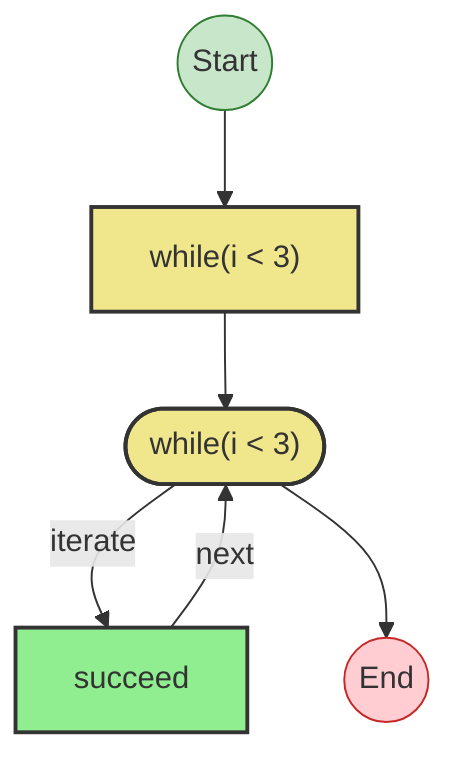


## Statistics

- **Total Effects**: 1
- **Loops**: 1


## Explanation

```
whileProgram (generator):
  1. Iterates (while) over i < 3:
    Calls succeed — constructor

  Concurrency: sequential (no parallelism)
```


---

# Effect Analysis: tryCatchProgram

## Metadata

- **File**: `/Users/jreehal/dev/node-examples/effect-analyzer/packages/effect-analyzer/src/__fixtures__/control-flow-gen.ts`
- **Analyzed**: 2026-05-22T16:10:30.679Z
- **Source Type**: generator
- **TypeScript Version**: 6.0.2


## Effect Flow

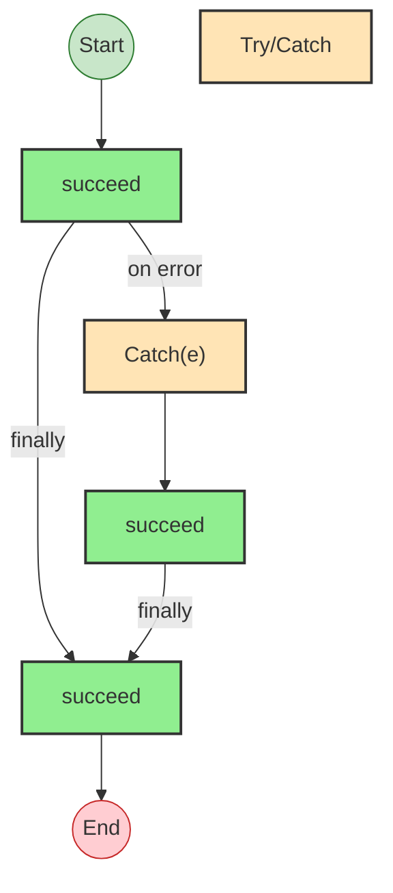


## Statistics

- **Total Effects**: 3


## Explanation

```
tryCatchProgram (generator):
  1. Try:
    Calls succeed — constructor
  2. Catch:
    Calls succeed — constructor
  3. Finally:
    Calls succeed — constructor

  Concurrency: sequential (no parallelism)
```


---

# Effect Analysis: returnYieldProgram

## Metadata

- **File**: `/Users/jreehal/dev/node-examples/effect-analyzer/packages/effect-analyzer/src/__fixtures__/control-flow-gen.ts`
- **Analyzed**: 2026-05-22T16:10:30.681Z
- **Source Type**: generator
- **TypeScript Version**: 6.0.2


## Effect Flow

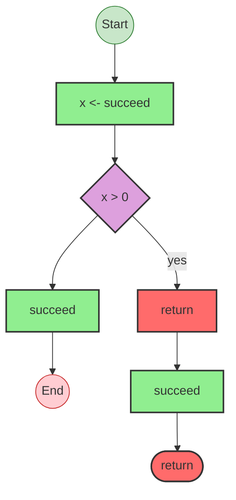


## Statistics

- **Total Effects**: 3


## Explanation

```
returnYieldProgram (generator):
  1. Yields x <- succeed
  2. If x > 0:
    Returns:
      Calls succeed — constructor
  3. Calls succeed — constructor

  Concurrency: sequential (no parallelism)
```


---

# Effect Analysis: nestedProgram

## Metadata

- **File**: `/Users/jreehal/dev/node-examples/effect-analyzer/packages/effect-analyzer/src/__fixtures__/control-flow-gen.ts`
- **Analyzed**: 2026-05-22T16:10:30.682Z
- **Source Type**: generator
- **TypeScript Version**: 6.0.2


## Effect Flow

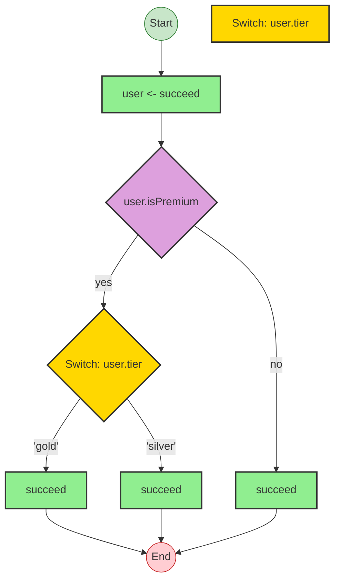


## Statistics

- **Total Effects**: 4


## Explanation

```
nestedProgram (generator):
  1. Yields user <- succeed
  2. If user.isPremium:
    Switch on user.tier:
      Case 'gold':
        Calls succeed — constructor
      Case 'silver':
        Calls succeed — constructor
  3. Else:
    Calls succeed — constructor

  Concurrency: sequential (no parallelism)
```


---

# Effect Analysis: ternaryProgram

## Metadata

- **File**: `/Users/jreehal/dev/node-examples/effect-analyzer/packages/effect-analyzer/src/__fixtures__/control-flow-gen.ts`
- **Analyzed**: 2026-05-22T16:10:30.684Z
- **Source Type**: generator
- **TypeScript Version**: 6.0.2


## Effect Flow

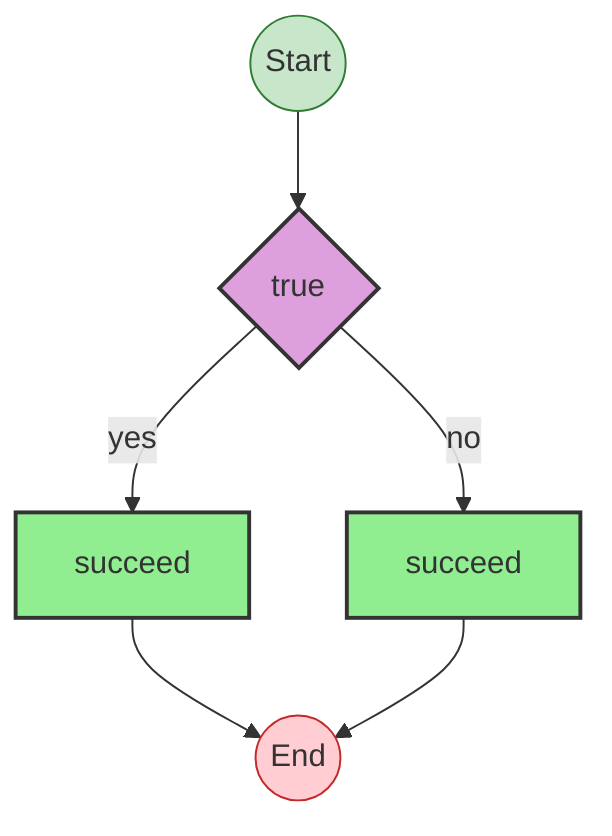


## Statistics

- **Total Effects**: 2


## Explanation

```
ternaryProgram (generator):
  1. result = If isPremium:
    Calls succeed — constructor
  2. Else:
    Calls succeed — constructor

  Concurrency: sequential (no parallelism)
```


---

# Effect Analysis: shortCircuitProgram

## Metadata

- **File**: `/Users/jreehal/dev/node-examples/effect-analyzer/packages/effect-analyzer/src/__fixtures__/control-flow-gen.ts`
- **Analyzed**: 2026-05-22T16:10:30.685Z
- **Source Type**: generator
- **TypeScript Version**: 6.0.2


## Effect Flow

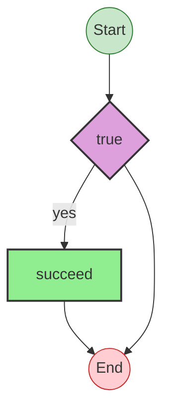


## Statistics

- **Total Effects**: 1


## Explanation

```
shortCircuitProgram (generator):
  1. y = If x:
    Calls succeed — constructor

  Concurrency: sequential (no parallelism)
```


---

# Effect Analysis: nestedFunctionProgram

## Metadata

- **File**: `/Users/jreehal/dev/node-examples/effect-analyzer/packages/effect-analyzer/src/__fixtures__/control-flow-gen.ts`
- **Analyzed**: 2026-05-22T16:10:30.685Z
- **Source Type**: generator
- **TypeScript Version**: 6.0.2


## Effect Flow

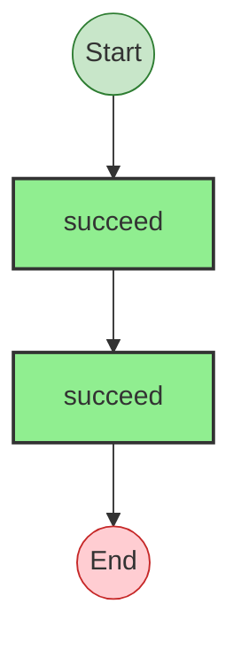


## Statistics

- **Total Effects**: 2


## Explanation

```
nestedFunctionProgram (generator):
  1. Calls succeed — constructor
  2. Calls succeed — constructor

  Concurrency: sequential (no parallelism)
```


---

# Effect Analysis: fn

## Metadata

- **File**: `/Users/jreehal/dev/node-examples/effect-analyzer/packages/effect-analyzer/src/__fixtures__/control-flow-gen.ts`
- **Analyzed**: 2026-05-22T16:10:30.686Z
- **Source Type**: generator
- **TypeScript Version**: 6.0.2


## Effect Flow

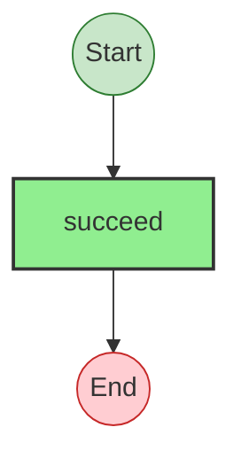


## Statistics

- **Total Effects**: 1


## Explanation

```
fn (generator):
  1. Calls succeed — constructor

  Concurrency: sequential (no parallelism)
```


---

# Effect Analysis: fallthroughProgram

## Metadata

- **File**: `/Users/jreehal/dev/node-examples/effect-analyzer/packages/effect-analyzer/src/__fixtures__/control-flow-gen.ts`
- **Analyzed**: 2026-05-22T16:10:30.687Z
- **Source Type**: generator
- **TypeScript Version**: 6.0.2


## Effect Flow

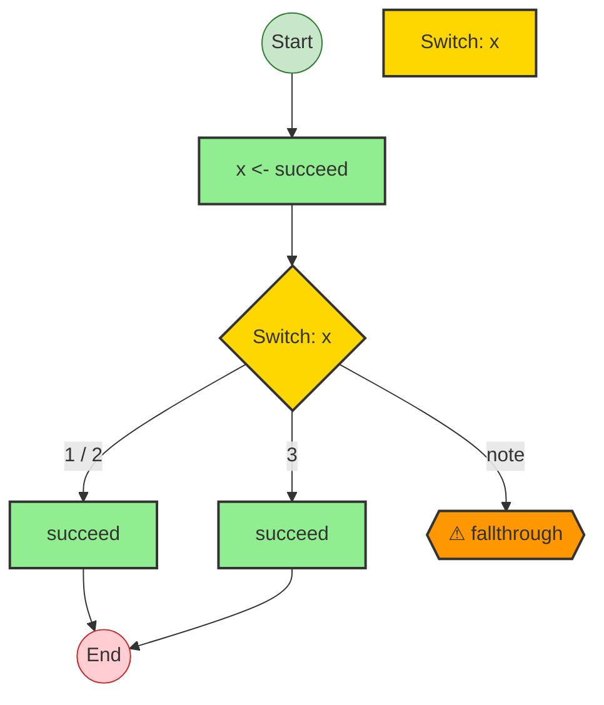


## Statistics

- **Total Effects**: 3


## Explanation

```
fallthroughProgram (generator):
  1. Yields x <- succeed
  2. Switch on x:
    Case 1, 2:
      Calls succeed — constructor
    Case 3:
      Calls succeed — constructor

  Concurrency: sequential (no parallelism)
```


---

# Effect Analysis: tryFinallyReturnProgram

## Metadata

- **File**: `/Users/jreehal/dev/node-examples/effect-analyzer/packages/effect-analyzer/src/__fixtures__/control-flow-gen.ts`
- **Analyzed**: 2026-05-22T16:10:30.688Z
- **Source Type**: generator
- **TypeScript Version**: 6.0.2


## Effect Flow

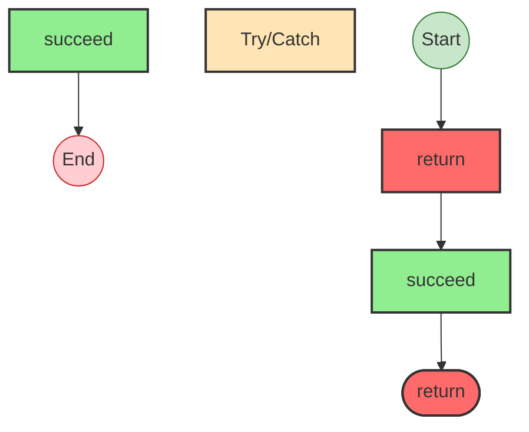


## Statistics

- **Total Effects**: 2


## Explanation

```
tryFinallyReturnProgram (generator):
  1. Try:
    Returns:
      Calls succeed — constructor
  2. Finally:
    Calls succeed — constructor

  Concurrency: sequential (no parallelism)
```


---

# Effect Analysis: doWhileProgram

## Metadata

- **File**: `/Users/jreehal/dev/node-examples/effect-analyzer/packages/effect-analyzer/src/__fixtures__/control-flow-gen.ts`
- **Analyzed**: 2026-05-22T16:10:30.689Z
- **Source Type**: generator
- **TypeScript Version**: 6.0.2


## Effect Flow

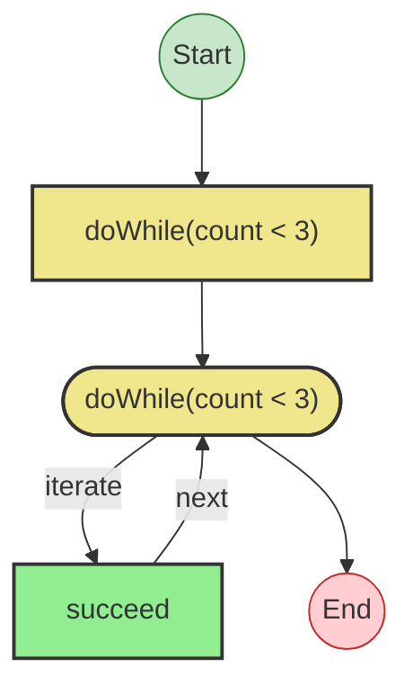


## Statistics

- **Total Effects**: 1
- **Loops**: 1


## Explanation

```
doWhileProgram (generator):
  1. Iterates (doWhile) over count < 3:
    Calls succeed — constructor

  Concurrency: sequential (no parallelism)
```

