# Effect Analysis: deeplyNested

## Metadata

- **File**: `/Users/jreehal/dev/node-examples/effect-analyzer/packages/effect-analyzer/src/__fixtures__/control-flow-kitchen-sink.ts`
- **Analyzed**: 2026-05-22T16:10:30.870Z
- **Source Type**: generator
- **TypeScript Version**: 6.0.2


## Effect Flow

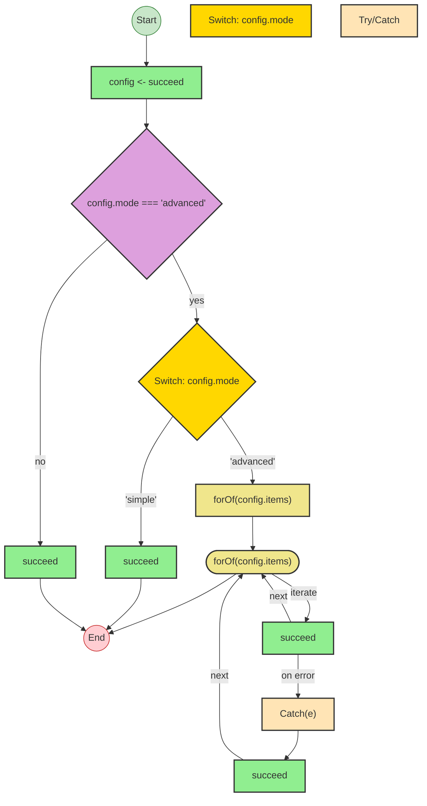


## Statistics

- **Total Effects**: 5
- **Loops**: 1


## Explanation

```
deeplyNested (generator):
  1. Yields config <- succeed
  2. If config.mode === 'advanced':
    Switch on config.mode:
      Case 'advanced':
        Iterates (forOf) over config.items:
          Try:
            Calls succeed — constructor
          Catch:
            Calls succeed — constructor
      Case 'simple':
        Calls succeed — constructor
  3. Else:
    Calls succeed — constructor

  Concurrency: sequential (no parallelism)
```


---

# Effect Analysis: nestedTernary

## Metadata

- **File**: `/Users/jreehal/dev/node-examples/effect-analyzer/packages/effect-analyzer/src/__fixtures__/control-flow-kitchen-sink.ts`
- **Analyzed**: 2026-05-22T16:10:30.874Z
- **Source Type**: generator
- **TypeScript Version**: 6.0.2


## Effect Flow

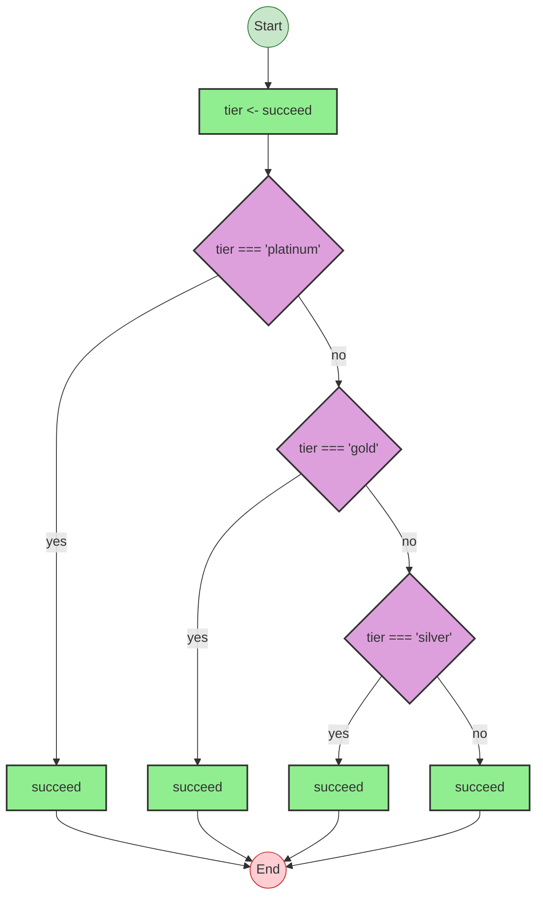


## Statistics

- **Total Effects**: 5


## Explanation

```
nestedTernary (generator):
  1. Yields tier <- succeed
  2. discount = If tier === 'platinum':
    Calls succeed — constructor
  3. Else:
    If tier === 'gold':
      Calls succeed — constructor
    Else:
      If tier === 'silver':
        Calls succeed — constructor
      Else:
        Calls succeed — constructor

  Concurrency: sequential (no parallelism)
```


---

# Effect Analysis: chainedShortCircuit

## Metadata

- **File**: `/Users/jreehal/dev/node-examples/effect-analyzer/packages/effect-analyzer/src/__fixtures__/control-flow-kitchen-sink.ts`
- **Analyzed**: 2026-05-22T16:10:30.878Z
- **Source Type**: generator
- **TypeScript Version**: 6.0.2


## Effect Flow

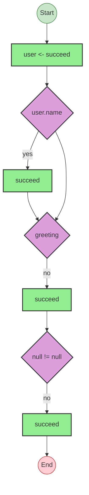


## Statistics

- **Total Effects**: 4


## Explanation

```
chainedShortCircuit (generator):
  1. Yields user <- succeed
  2. greeting = If user.name:
    Calls succeed — constructor
  3. fallback = If greeting:
  4. Else:
    Calls succeed — constructor
  5. result = If cached != null:
  6. Else:
    Calls succeed — constructor

  Concurrency: sequential (no parallelism)
```


---

# Effect Analysis: allLoopTypes

## Metadata

- **File**: `/Users/jreehal/dev/node-examples/effect-analyzer/packages/effect-analyzer/src/__fixtures__/control-flow-kitchen-sink.ts`
- **Analyzed**: 2026-05-22T16:10:30.882Z
- **Source Type**: generator
- **TypeScript Version**: 6.0.2


## Effect Flow

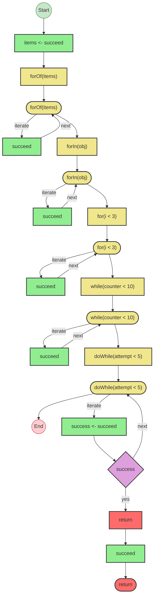


## Statistics

- **Total Effects**: 7
- **Loops**: 5


## Explanation

```
allLoopTypes (generator):
  1. Yields items <- succeed
  2. Iterates (forOf) over items:
    Calls succeed — constructor
  3. Iterates (forIn) over obj:
    Calls succeed — constructor
  4. Iterates (for) over i < 3:
    Calls succeed — constructor
  5. Iterates (while) over counter < 10:
    Calls succeed — constructor
  6. Iterates (doWhile) over attempt < 5:
    Yields success <- succeed
    If success:
      Returns:
        Calls succeed — constructor

  Concurrency: sequential (no parallelism)
```


---

# Effect Analysis: tryCatchOnly

## Metadata

- **File**: `/Users/jreehal/dev/node-examples/effect-analyzer/packages/effect-analyzer/src/__fixtures__/control-flow-kitchen-sink.ts`
- **Analyzed**: 2026-05-22T16:10:30.884Z
- **Source Type**: generator
- **TypeScript Version**: 6.0.2


## Effect Flow

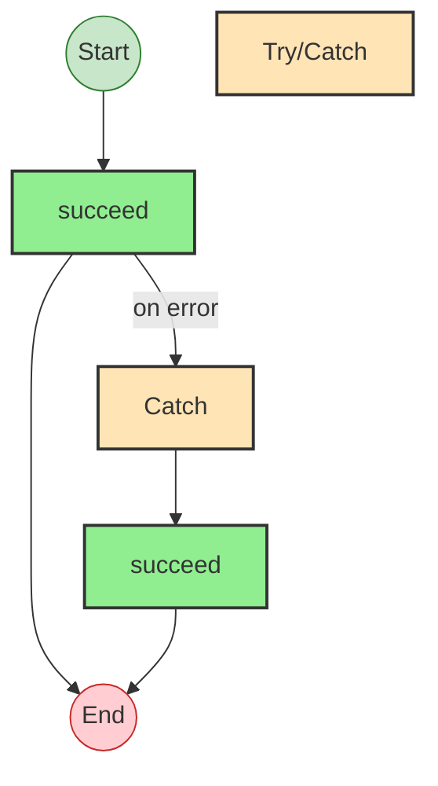


## Statistics

- **Total Effects**: 2


## Explanation

```
tryCatchOnly (generator):
  1. Try:
    Calls succeed — constructor
  2. Catch:
    Calls succeed — constructor

  Concurrency: sequential (no parallelism)
```


---

# Effect Analysis: tryFinallyOnly

## Metadata

- **File**: `/Users/jreehal/dev/node-examples/effect-analyzer/packages/effect-analyzer/src/__fixtures__/control-flow-kitchen-sink.ts`
- **Analyzed**: 2026-05-22T16:10:30.888Z
- **Source Type**: generator
- **TypeScript Version**: 6.0.2


## Effect Flow

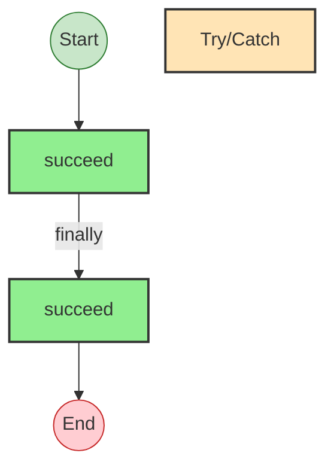


## Statistics

- **Total Effects**: 2


## Explanation

```
tryFinallyOnly (generator):
  1. Try:
    Calls succeed — constructor
  2. Finally:
    Calls succeed — constructor

  Concurrency: sequential (no parallelism)
```


---

# Effect Analysis: tryReturnFinally

## Metadata

- **File**: `/Users/jreehal/dev/node-examples/effect-analyzer/packages/effect-analyzer/src/__fixtures__/control-flow-kitchen-sink.ts`
- **Analyzed**: 2026-05-22T16:10:30.891Z
- **Source Type**: generator
- **TypeScript Version**: 6.0.2


## Effect Flow

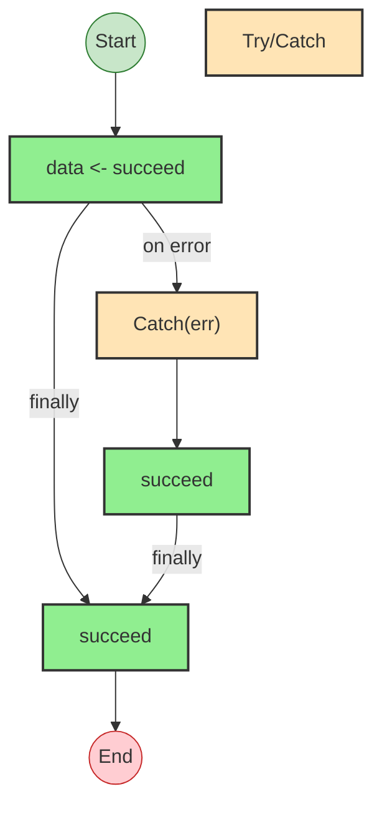


## Statistics

- **Total Effects**: 3


## Explanation

```
tryReturnFinally (generator):
  1. Try:
    Yields data <- succeed
  2. Catch:
    Calls succeed — constructor
  3. Finally:
    Calls succeed — constructor

  Concurrency: sequential (no parallelism)
```


---

# Effect Analysis: nestedTryCatch

## Metadata

- **File**: `/Users/jreehal/dev/node-examples/effect-analyzer/packages/effect-analyzer/src/__fixtures__/control-flow-kitchen-sink.ts`
- **Analyzed**: 2026-05-22T16:10:30.893Z
- **Source Type**: generator
- **TypeScript Version**: 6.0.2


## Effect Flow

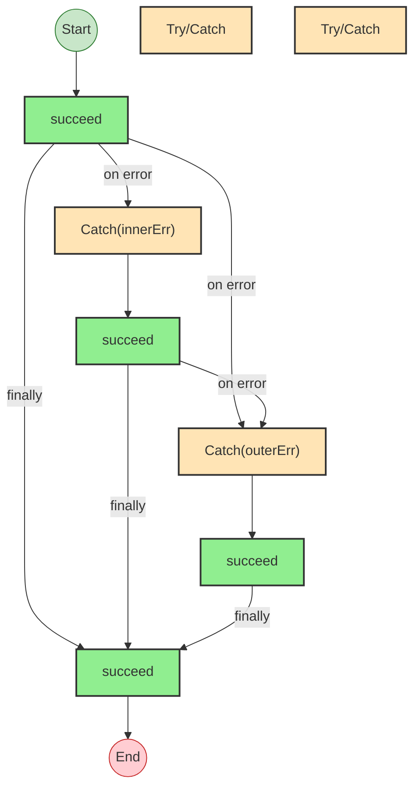


## Statistics

- **Total Effects**: 4


## Explanation

```
nestedTryCatch (generator):
  1. Try:
    Try:
      Calls succeed — constructor
    Catch:
      Calls succeed — constructor
  2. Catch:
    Calls succeed — constructor
  3. Finally:
    Calls succeed — constructor

  Concurrency: sequential (no parallelism)
```


---

# Effect Analysis: tryCatchRethrow

## Metadata

- **File**: `/Users/jreehal/dev/node-examples/effect-analyzer/packages/effect-analyzer/src/__fixtures__/control-flow-kitchen-sink.ts`
- **Analyzed**: 2026-05-22T16:10:30.895Z
- **Source Type**: generator
- **TypeScript Version**: 6.0.2


## Effect Flow

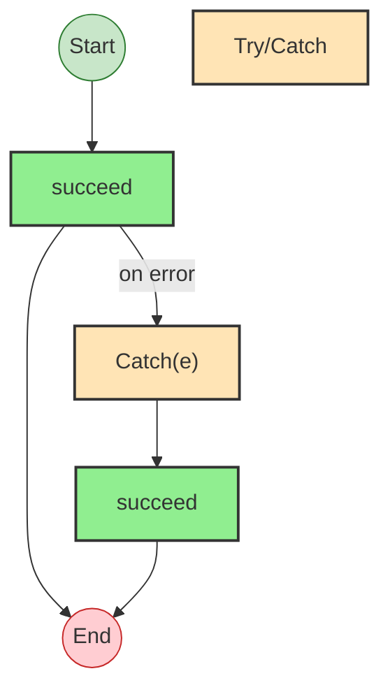


## Statistics

- **Total Effects**: 2


## Explanation

```
tryCatchRethrow (generator):
  1. Try:
    Calls succeed — constructor
  2. Catch:
    Calls succeed — constructor

  Concurrency: sequential (no parallelism)
```


---

# Effect Analysis: switchMixedTerminators

## Metadata

- **File**: `/Users/jreehal/dev/node-examples/effect-analyzer/packages/effect-analyzer/src/__fixtures__/control-flow-kitchen-sink.ts`
- **Analyzed**: 2026-05-22T16:10:30.897Z
- **Source Type**: generator
- **TypeScript Version**: 6.0.2


## Effect Flow

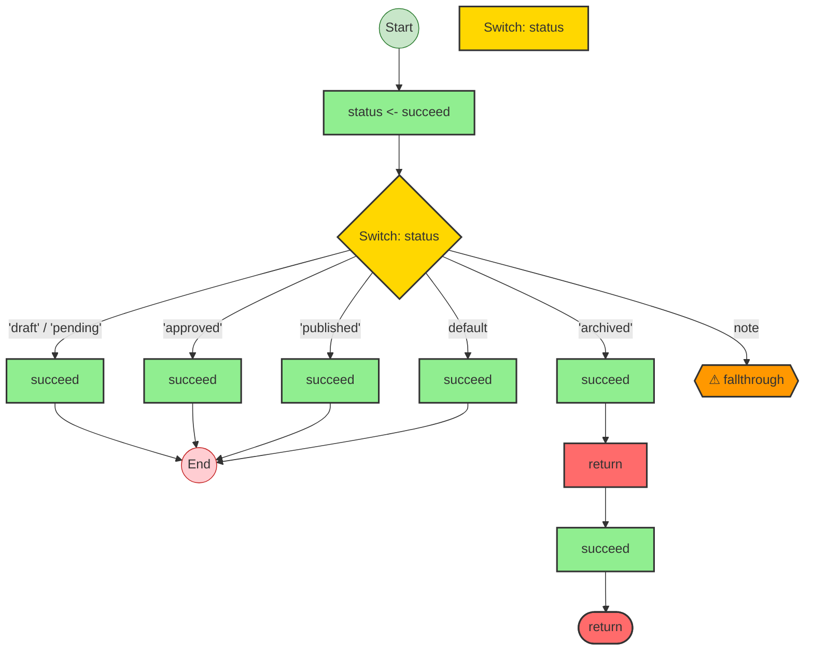


## Statistics

- **Total Effects**: 7


## Explanation

```
switchMixedTerminators (generator):
  1. Yields status <- succeed
  2. Switch on status:
    Case 'draft', 'pending':
      Calls succeed — constructor
    Case 'approved':
      Calls succeed — constructor
    Case 'published':
      Calls succeed — constructor
    Case 'archived':
      Calls succeed — constructor
      Returns:
        Calls succeed — constructor
    Case default:
      Calls succeed — constructor

  Concurrency: sequential (no parallelism)
```


---

# Effect Analysis: switchAllReturns

## Metadata

- **File**: `/Users/jreehal/dev/node-examples/effect-analyzer/packages/effect-analyzer/src/__fixtures__/control-flow-kitchen-sink.ts`
- **Analyzed**: 2026-05-22T16:10:30.900Z
- **Source Type**: generator
- **TypeScript Version**: 6.0.2


## Effect Flow

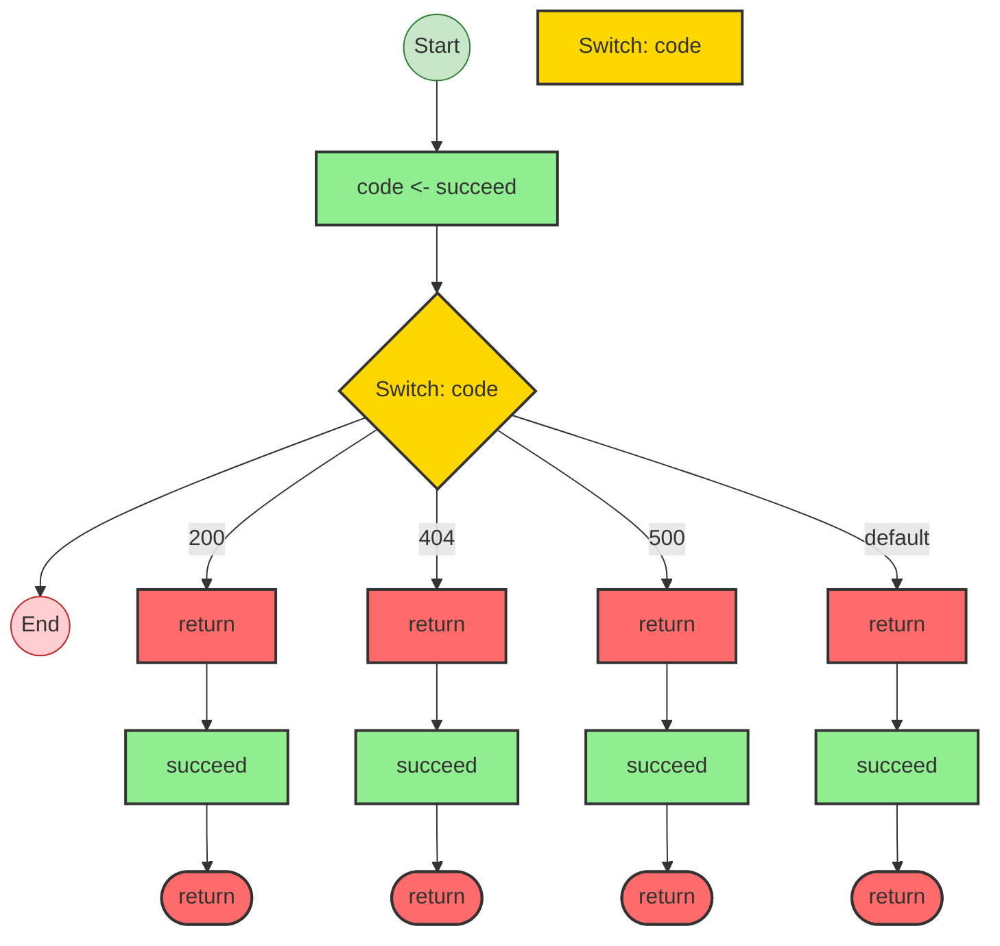


## Statistics

- **Total Effects**: 5


## Explanation

```
switchAllReturns (generator):
  1. Yields code <- succeed
  2. Switch on code:
    Case 200:
      Returns:
        Calls succeed — constructor
    Case 404:
      Returns:
        Calls succeed — constructor
    Case 500:
      Returns:
        Calls succeed — constructor
    Case default:
      Returns:
        Calls succeed — constructor

  Concurrency: sequential (no parallelism)
```


---

# Effect Analysis: returnFromNestedIf

## Metadata

- **File**: `/Users/jreehal/dev/node-examples/effect-analyzer/packages/effect-analyzer/src/__fixtures__/control-flow-kitchen-sink.ts`
- **Analyzed**: 2026-05-22T16:10:30.903Z
- **Source Type**: generator
- **TypeScript Version**: 6.0.2


## Effect Flow

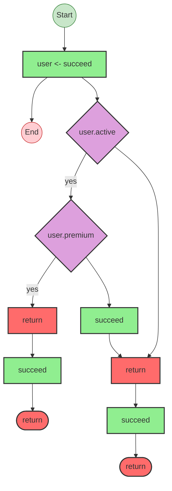


## Statistics

- **Total Effects**: 4


## Explanation

```
returnFromNestedIf (generator):
  1. Yields user <- succeed
  2. If user.active:
    If user.premium:
      Returns:
        Calls succeed — constructor
    Calls succeed — constructor
  3. Returns:
    Calls succeed — constructor

  Concurrency: sequential (no parallelism)
```


---

# Effect Analysis: throwWithYieldValue

## Metadata

- **File**: `/Users/jreehal/dev/node-examples/effect-analyzer/packages/effect-analyzer/src/__fixtures__/control-flow-kitchen-sink.ts`
- **Analyzed**: 2026-05-22T16:10:30.906Z
- **Source Type**: generator
- **TypeScript Version**: 6.0.2


## Effect Flow

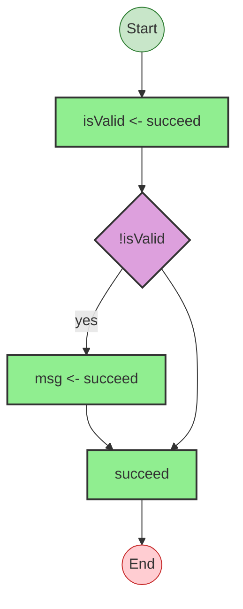


## Statistics

- **Total Effects**: 3


## Explanation

```
throwWithYieldValue (generator):
  1. Yields isValid <- succeed
  2. If !isValid:
    Yields msg <- succeed
  3. Calls succeed — constructor

  Concurrency: sequential (no parallelism)
```


---

# Effect Analysis: guardClauses

## Metadata

- **File**: `/Users/jreehal/dev/node-examples/effect-analyzer/packages/effect-analyzer/src/__fixtures__/control-flow-kitchen-sink.ts`
- **Analyzed**: 2026-05-22T16:10:30.909Z
- **Source Type**: generator
- **TypeScript Version**: 6.0.2


## Effect Flow

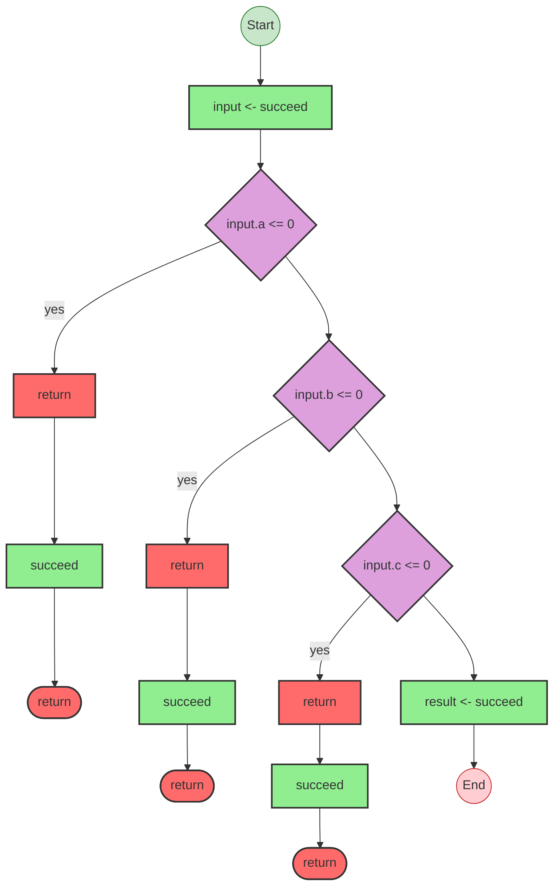


## Statistics

- **Total Effects**: 5


## Explanation

```
guardClauses (generator):
  1. Yields input <- succeed
  2. If input.a <= 0:
    Returns:
      Calls succeed — constructor
  3. If input.b <= 0:
    Returns:
      Calls succeed — constructor
  4. If input.c <= 0:
    Returns:
      Calls succeed — constructor
  5. Yields result <- succeed

  Concurrency: sequential (no parallelism)
```


---

# Effect Analysis: yieldsInUnusualPositions

## Metadata

- **File**: `/Users/jreehal/dev/node-examples/effect-analyzer/packages/effect-analyzer/src/__fixtures__/control-flow-kitchen-sink.ts`
- **Analyzed**: 2026-05-22T16:10:30.913Z
- **Source Type**: generator
- **TypeScript Version**: 6.0.2


## Effect Flow

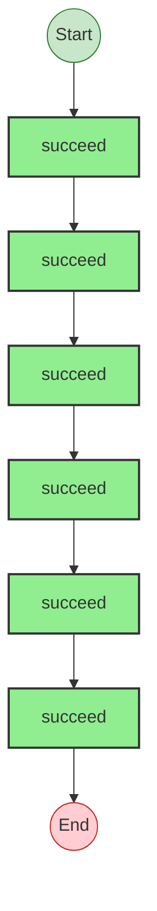


## Statistics

- **Total Effects**: 6


## Explanation

```
yieldsInUnusualPositions (generator):
  1. formatted = succeed — constructor
  2. Calls succeed — constructor
  3. arr = succeed — constructor
  4. Calls succeed — constructor
  5. obj = succeed — constructor
  6. msg = succeed — constructor

  Concurrency: sequential (no parallelism)
```


---

# Effect Analysis: expressionUnwrapping

## Metadata

- **File**: `/Users/jreehal/dev/node-examples/effect-analyzer/packages/effect-analyzer/src/__fixtures__/control-flow-kitchen-sink.ts`
- **Analyzed**: 2026-05-22T16:10:30.917Z
- **Source Type**: generator
- **TypeScript Version**: 6.0.2


## Effect Flow

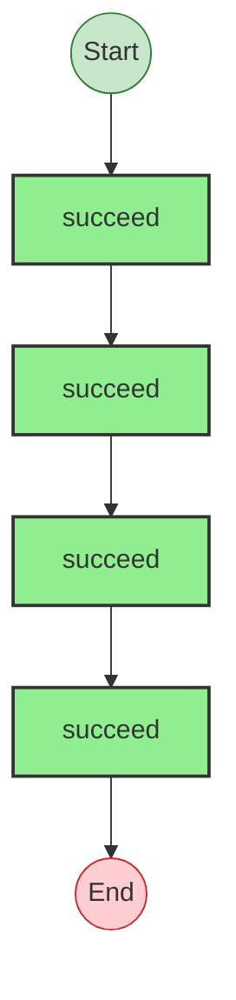


## Statistics

- **Total Effects**: 4


## Explanation

```
expressionUnwrapping (generator):
  1. typed = succeed — constructor
  2. nonNull = succeed — constructor
  3. parens = succeed — constructor
  4. sat = succeed — constructor

  Concurrency: sequential (no parallelism)
```


---

# Effect Analysis: nestedFunctionBoundary

## Metadata

- **File**: `/Users/jreehal/dev/node-examples/effect-analyzer/packages/effect-analyzer/src/__fixtures__/control-flow-kitchen-sink.ts`
- **Analyzed**: 2026-05-22T16:10:30.919Z
- **Source Type**: generator
- **TypeScript Version**: 6.0.2


## Effect Flow

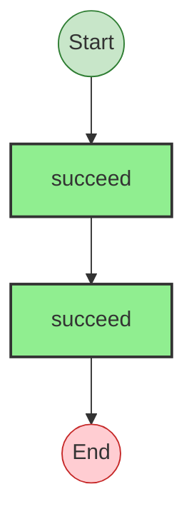


## Statistics

- **Total Effects**: 2


## Explanation

```
nestedFunctionBoundary (generator):
  1. Calls succeed — constructor
  2. Calls succeed — constructor

  Concurrency: sequential (no parallelism)
```


---

# Effect Analysis: makeHelper

## Metadata

- **File**: `/Users/jreehal/dev/node-examples/effect-analyzer/packages/effect-analyzer/src/__fixtures__/control-flow-kitchen-sink.ts`
- **Analyzed**: 2026-05-22T16:10:30.921Z
- **Source Type**: generator
- **TypeScript Version**: 6.0.2


## Effect Flow

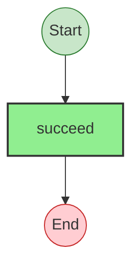


## Statistics

- **Total Effects**: 1


## Explanation

```
makeHelper (generator):
  1. Calls succeed — constructor

  Concurrency: sequential (no parallelism)
```


---

# Effect Analysis: program-19

## Metadata

- **File**: `/Users/jreehal/dev/node-examples/effect-analyzer/packages/effect-analyzer/src/__fixtures__/control-flow-kitchen-sink.ts`
- **Analyzed**: 2026-05-22T16:10:30.922Z
- **Source Type**: generator
- **TypeScript Version**: 6.0.2


## Effect Flow


## Statistics

- **Total Effects**: 1


## Explanation

```
program-19 (generator):
  1. Calls succeed — constructor

  Concurrency: sequential (no parallelism)
```


---

# Effect Analysis: ifElseChain

## Metadata

- **File**: `/Users/jreehal/dev/node-examples/effect-analyzer/packages/effect-analyzer/src/__fixtures__/control-flow-kitchen-sink.ts`
- **Analyzed**: 2026-05-22T16:10:30.925Z
- **Source Type**: generator
- **TypeScript Version**: 6.0.2


## Effect Flow

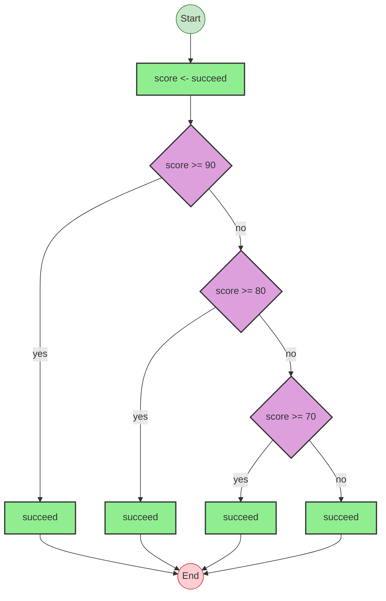


## Statistics

- **Total Effects**: 5


## Explanation

```
ifElseChain (generator):
  1. Yields score <- succeed
  2. If score >= 90:
    Calls succeed — constructor
  3. Else:
    If score >= 80:
      Calls succeed — constructor
    Else:
      If score >= 70:
        Calls succeed — constructor
      Else:
        Calls succeed — constructor

  Concurrency: sequential (no parallelism)
```


---

# Effect Analysis: labeledBreak

## Metadata

- **File**: `/Users/jreehal/dev/node-examples/effect-analyzer/packages/effect-analyzer/src/__fixtures__/control-flow-kitchen-sink.ts`
- **Analyzed**: 2026-05-22T16:10:30.927Z
- **Source Type**: generator
- **TypeScript Version**: 6.0.2


## Effect Flow

```mermaid
flowchart TB

  %% Program: labeledBreak

  start((Start))
  end_node((End))

  n2["succeed"]
  n3["shouldSkip <- succeed"]
  decision_5{"shouldSkip"}
  n6["succeed"]
  n7["succeed"]
  n8["succeed"]

  %% Edges
  n2 --> n3
  decision_5 -->|yes| n6
  n3 --> decision_5
  n6 --> n7
  decision_5 --> n7
  n7 --> n8
  start --> n2
  n8 --> end_node

  %% Styles
  classDef startStyle fill:#c8e6c9,stroke:#2e7d32
  classDef endStyle fill:#ffcdd2,stroke:#c62828
  classDef effectStyle fill:#90EE90,stroke:#333,stroke-width:2px
  classDef decisionStyle fill:#DDA0DD,stroke:#333,stroke-width:2px
  class start startStyle
  class end_node endStyle
  class n2 effectStyle
  class n3 effectStyle
  class decision_5 decisionStyle
  class n6 effectStyle
  class n7 effectStyle
  class n8 effectStyle
```


## Statistics

- **Total Effects**: 5


## Explanation

```
labeledBreak (generator):
  1. Calls succeed — constructor
  2. Yields shouldSkip <- succeed
  3. If shouldSkip:
    Calls succeed — constructor
  4. Calls succeed — constructor
  5. Calls succeed — constructor

  Concurrency: sequential (no parallelism)
```


---

# Effect Analysis: forOfHeaderYield

## Metadata

- **File**: `/Users/jreehal/dev/node-examples/effect-analyzer/packages/effect-analyzer/src/__fixtures__/control-flow-kitchen-sink.ts`
- **Analyzed**: 2026-05-22T16:10:30.930Z
- **Source Type**: generator
- **TypeScript Version**: 6.0.2


## Effect Flow

```mermaid
flowchart TB

  %% Program: forOfHeaderYield

  start((Start))
  end_node((End))

  n2["forOf(yield* Effect.succeed(('x', 'y', 'z')))"]
  loop_3(["forOf(yield* Effect.succeed(('x', 'y', 'z')))"])
  n4["succeed"]

  %% Edges
  n2 --> loop_3
  loop_3 -->|iterate| n4
  n4 -->|next| loop_3
  start --> n2
  loop_3 --> end_node

  %% Styles
  classDef startStyle fill:#c8e6c9,stroke:#2e7d32
  classDef endStyle fill:#ffcdd2,stroke:#c62828
  classDef effectStyle fill:#90EE90,stroke:#333,stroke-width:2px
  classDef loopStyle fill:#F0E68C,stroke:#333,stroke-width:2px
  class start startStyle
  class end_node endStyle
  class n2 loopStyle
  class loop_3 loopStyle
  class n4 effectStyle
```


## Statistics

- **Total Effects**: 2
- **Loops**: 1


## Explanation

```
forOfHeaderYield (generator):
  1. Iterates (forOf) over yield* Effect.succeed(['x', 'y', 'z']):
    Calls succeed — constructor

  Concurrency: sequential (no parallelism)
```


---

# Effect Analysis: whileComplexCondition

## Metadata

- **File**: `/Users/jreehal/dev/node-examples/effect-analyzer/packages/effect-analyzer/src/__fixtures__/control-flow-kitchen-sink.ts`
- **Analyzed**: 2026-05-22T16:10:30.932Z
- **Source Type**: generator
- **TypeScript Version**: 6.0.2


## Effect Flow

```mermaid
flowchart TB

  %% Program: whileComplexCondition

  start((Start))
  end_node((End))

  n2["shouldContinue <- succeed"]
  n3["while(shouldContinue)"]
  loop_4(["while(shouldContinue)"])
  n6["succeed"]
  n7["succeed"]

  %% Edges
  n3 --> loop_4
  n6 --> n7
  loop_4 -->|iterate| n6
  n7 -->|next| loop_4
  n2 --> n3
  start --> n2
  loop_4 --> end_node

  %% Styles
  classDef startStyle fill:#c8e6c9,stroke:#2e7d32
  classDef endStyle fill:#ffcdd2,stroke:#c62828
  classDef effectStyle fill:#90EE90,stroke:#333,stroke-width:2px
  classDef loopStyle fill:#F0E68C,stroke:#333,stroke-width:2px
  class start startStyle
  class end_node endStyle
  class n2 effectStyle
  class n3 loopStyle
  class loop_4 loopStyle
  class n6 effectStyle
  class n7 effectStyle
```


## Statistics

- **Total Effects**: 3
- **Loops**: 1


## Explanation

```
whileComplexCondition (generator):
  1. Yields shouldContinue <- succeed
  2. Iterates (while) over shouldContinue:
    Calls succeed — constructor
    Calls succeed — constructor

  Concurrency: sequential (no parallelism)
```


---

# Effect Analysis: switchInsideLoop

## Metadata

- **File**: `/Users/jreehal/dev/node-examples/effect-analyzer/packages/effect-analyzer/src/__fixtures__/control-flow-kitchen-sink.ts`
- **Analyzed**: 2026-05-22T16:10:30.937Z
- **Source Type**: generator
- **TypeScript Version**: 6.0.2


## Effect Flow

```mermaid
flowchart TB

  %% Program: switchInsideLoop

  start((Start))
  end_node((End))

  n2["commands <- succeed"]
  n3["forOf(commands)"]
  loop_4(["forOf(commands)"])
  n6["Switch: cmd"]
  switch_7{"Switch: cmd"}
  n8["succeed"]
  n9["succeed"]
  n10["succeed"]
  n11["return"]
  term_12(["return"])
  n13["succeed"]
  n14["succeed"]
  switchWarn_15{{"⚠ fallthrough"}}
  n16["succeed"]

  %% Edges
  n3 --> loop_4
  switch_7 -->|'add'| n8
  switch_7 -->|'remove'| n9
  n11 --> n13
  n13 --> term_12
  n10 --> n11
  switch_7 -->|'quit'| n10
  switch_7 -->|default| n14
  switch_7 -->|note| switchWarn_15
  n8 --> n16
  n9 --> n16
  n14 --> n16
  loop_4 -->|iterate| switch_7
  n16 -->|next| loop_4
  n2 --> n3
  start --> n2
  loop_4 --> end_node

  %% Styles
  classDef startStyle fill:#c8e6c9,stroke:#2e7d32
  classDef endStyle fill:#ffcdd2,stroke:#c62828
  classDef effectStyle fill:#90EE90,stroke:#333,stroke-width:2px
  classDef loopStyle fill:#F0E68C,stroke:#333,stroke-width:2px
  classDef switchStyle fill:#FFD700,stroke:#333,stroke-width:2px
  classDef terminalStyle fill:#FF6B6B,stroke:#333,stroke-width:2px
  classDef opaqueStyle fill:#FF9800,stroke:#333,stroke-width:2px
  class start startStyle
  class end_node endStyle
  class n2 effectStyle
  class n3 loopStyle
  class loop_4 loopStyle
  class n6 switchStyle
  class switch_7 switchStyle
  class n8 effectStyle
  class n9 effectStyle
  class n10 effectStyle
  class n11 terminalStyle
  class term_12 terminalStyle
  class n13 effectStyle
  class n14 effectStyle
  class switchWarn_15 opaqueStyle
  class n16 effectStyle
```


## Statistics

- **Total Effects**: 7
- **Loops**: 1


## Explanation

```
switchInsideLoop (generator):
  1. Yields commands <- succeed
  2. Iterates (forOf) over commands:
    Switch on cmd:
      Case 'add':
        Calls succeed — constructor
      Case 'remove':
        Calls succeed — constructor
      Case 'quit':
        Calls succeed — constructor
        Returns:
          Calls succeed — constructor
      Case default:
        Calls succeed — constructor
    Calls succeed — constructor

  Concurrency: sequential (no parallelism)
```


---

# Effect Analysis: checkoutWorkflow

## Metadata

- **File**: `/Users/jreehal/dev/node-examples/effect-analyzer/packages/effect-analyzer/src/__fixtures__/control-flow-kitchen-sink.ts`
- **Analyzed**: 2026-05-22T16:10:30.953Z
- **Source Type**: generator
- **TypeScript Version**: 6.0.2


## Effect Flow

```mermaid
flowchart TB

  %% Program: checkoutWorkflow

  start((Start))
  end_node((End))

  n2["cart <- succeed"]
  decision_4{"cart.items.length === 0"}
  n5["return"]
  term_6(["return"])
  n7["succeed"]
  n8["Effect.all (2) (concurrency)"]
  parallel_fork_9{{"All (2)"}}
  parallel_join_9{{"Join"}}
  n10["succeed"]
  n11["succeed"]
  decision_13{"!inventory.available"}
  n14["return"]
  term_15(["return"])
  n16["succeed"]
  decision_18{"user.premium"}
  n19["succeed"]
  n20["succeed"]
  n21["Try/Catch"]
  n22["payment <- succeed"]
  n23["Effect.all (3) (concurrency)"]
  parallel_fork_24{{"All (3)"}}
  parallel_join_24{{"Join"}}
  n25["succeed"]
  n26["succeed"]
  n27["succeed"]
  n28["return"]
  term_29(["return"])
  n30["succeed"]
  catch_31["Catch(paymentErr)"]
  n32["succeed"]
  n33["return"]
  term_34(["return"])
  n35["succeed"]
  n36["succeed"]

  %% Edges
  n5 --> n7
  n7 --> term_6
  decision_4 -->|yes| n5
  n2 --> decision_4
  n8 --> parallel_fork_9
  parallel_fork_9 -->|succeed| n10
  n10 --> parallel_join_9
  parallel_fork_9 -->|succeed| n11
  n11 --> parallel_join_9
  decision_4 --> n8
  n14 --> n16
  n16 --> term_15
  decision_13 -->|yes| n14
  parallel_join_9 --> decision_13
  decision_18 -->|yes| n19
  decision_18 -->|no| n20
  decision_13 --> decision_18
  n23 --> parallel_fork_24
  parallel_fork_24 -->|succeed| n25
  n25 --> parallel_join_24
  parallel_fork_24 -->|succeed| n26
  n26 --> parallel_join_24
  parallel_fork_24 -->|succeed| n27
  n27 --> parallel_join_24
  n22 --> n23
  n28 --> n30
  n30 --> term_29
  parallel_join_24 --> n28
  n33 --> n35
  n35 --> term_34
  n32 --> n33
  catch_31 --> n32
  n19 --> n22
  n20 --> n22
  start --> n2
  n36 --> end_node

  %% Styles
  classDef startStyle fill:#c8e6c9,stroke:#2e7d32
  classDef endStyle fill:#ffcdd2,stroke:#c62828
  classDef effectStyle fill:#90EE90,stroke:#333,stroke-width:2px
  classDef parallelStyle fill:#FFA500,stroke:#333,stroke-width:2px
  classDef decisionStyle fill:#DDA0DD,stroke:#333,stroke-width:2px
  classDef tryCatchStyle fill:#FFE4B5,stroke:#333,stroke-width:2px
  classDef terminalStyle fill:#FF6B6B,stroke:#333,stroke-width:2px
  class start startStyle
  class end_node endStyle
  class n2 effectStyle
  class decision_4 decisionStyle
  class n5 terminalStyle
  class term_6 terminalStyle
  class n7 effectStyle
  class n8 parallelStyle
  class parallel_fork_9 parallelStyle
  class parallel_join_9 parallelStyle
  class n10 effectStyle
  class n11 effectStyle
  class decision_13 decisionStyle
  class n14 terminalStyle
  class term_15 terminalStyle
  class n16 effectStyle
  class decision_18 decisionStyle
  class n19 effectStyle
  class n20 effectStyle
  class n21 tryCatchStyle
  class n22 effectStyle
  class n23 parallelStyle
  class parallel_fork_24 parallelStyle
  class parallel_join_24 parallelStyle
  class n25 effectStyle
  class n26 effectStyle
  class n27 effectStyle
  class n28 terminalStyle
  class term_29 terminalStyle
  class n30 effectStyle
  class catch_31 tryCatchStyle
  class n32 effectStyle
  class n33 terminalStyle
  class term_34 terminalStyle
  class n35 effectStyle
  class n36 effectStyle
```


## Statistics

- **Total Effects**: 15
- **Parallel Operations**: 2


## Explanation

```
checkoutWorkflow (generator):
  1. Yields cart <- succeed
  2. If cart.items.length === 0:
    Returns:
      Calls succeed — constructor
  3. [user, inventory] = Runs 2 effects in sequential:
    Calls succeed — constructor
    Calls succeed — constructor
  4. If !inventory.available:
    Returns:
      Calls succeed — constructor
  5. price = If user.premium:
    Calls succeed — constructor
  6. Else:
    Calls succeed — constructor
  7. Try:
    Yields payment <- succeed
    Runs 3 effects in sequential:
      Calls succeed — constructor
      Calls succeed — constructor
      Calls succeed — constructor
    Returns:
      Calls succeed — constructor
  8. Catch:
    Calls succeed — constructor
    Returns:
      Calls succeed — constructor
  9. Finally:
    Calls succeed — constructor

  Concurrency: uses parallelism / racing
```


---

# Effect Analysis: dataPipeline

## Metadata

- **File**: `/Users/jreehal/dev/node-examples/effect-analyzer/packages/effect-analyzer/src/__fixtures__/control-flow-kitchen-sink.ts`
- **Analyzed**: 2026-05-22T16:10:30.959Z
- **Source Type**: generator
- **TypeScript Version**: 6.0.2


## Effect Flow

```mermaid
flowchart TB

  %% Program: dataPipeline

  start((Start))
  end_node((End))

  n2["rawData <- succeed"]
  n3["forOf(rawData)"]
  loop_4(["forOf(rawData)"])
  n5["Try/Catch"]
  decision_7{"record.value === null"}
  n8["succeed"]
  n9["transformed <- succeed"]
  catch_10["Catch(recordErr)"]
  n11["succeed"]
  decision_13{"results.length === 0"}
  n14["return"]
  term_15(["return"])
  n16["succeed"]
  n17["return"]
  term_18(["return"])
  n19["succeed"]

  %% Edges
  n3 --> loop_4
  decision_7 -->|yes| n8
  n8 --> n9
  decision_7 --> n9
  n9 -->|on error| catch_10
  catch_10 --> n11
  loop_4 -->|iterate| decision_7
  n9 -->|next| loop_4
  n11 -->|next| loop_4
  n2 --> n3
  n14 --> n16
  n16 --> term_15
  decision_13 -->|yes| n14
  loop_4 --> decision_13
  n17 --> n19
  n19 --> term_18
  decision_13 --> n17
  start --> n2
  n2 --> end_node

  %% Styles
  classDef startStyle fill:#c8e6c9,stroke:#2e7d32
  classDef endStyle fill:#ffcdd2,stroke:#c62828
  classDef effectStyle fill:#90EE90,stroke:#333,stroke-width:2px
  classDef loopStyle fill:#F0E68C,stroke:#333,stroke-width:2px
  classDef decisionStyle fill:#DDA0DD,stroke:#333,stroke-width:2px
  classDef tryCatchStyle fill:#FFE4B5,stroke:#333,stroke-width:2px
  classDef terminalStyle fill:#FF6B6B,stroke:#333,stroke-width:2px
  class start startStyle
  class end_node endStyle
  class n2 effectStyle
  class n3 loopStyle
  class loop_4 loopStyle
  class n5 tryCatchStyle
  class decision_7 decisionStyle
  class n8 effectStyle
  class n9 effectStyle
  class catch_10 tryCatchStyle
  class n11 effectStyle
  class decision_13 decisionStyle
  class n14 terminalStyle
  class term_15 terminalStyle
  class n16 effectStyle
  class n17 terminalStyle
  class term_18 terminalStyle
  class n19 effectStyle
```


## Statistics

- **Total Effects**: 6
- **Loops**: 1


## Explanation

```
dataPipeline (generator):
  1. Yields rawData <- succeed
  2. Iterates (forOf) over rawData:
    Try:
      If record.value === null:
        Calls succeed — constructor
      Yields transformed <- succeed
    Catch:
      Calls succeed — constructor
  3. If results.length === 0:
    Returns:
      Calls succeed — constructor
  4. Returns:
    Calls succeed — constructor

  Concurrency: sequential (no parallelism)
```


---

# Effect Analysis: stateMachine

## Metadata

- **File**: `/Users/jreehal/dev/node-examples/effect-analyzer/packages/effect-analyzer/src/__fixtures__/control-flow-kitchen-sink.ts`
- **Analyzed**: 2026-05-22T16:10:30.964Z
- **Source Type**: generator
- **TypeScript Version**: 6.0.2


## Effect Flow

```mermaid
flowchart TB

  %% Program: stateMachine

  start((Start))
  end_node((End))

  n2["state <- succeed"]
  n3["while(state !== 'done' && iterations < 10)"]
  loop_4(["while(state !== 'done' && iterations < 10)"])
  n5["Switch: state"]
  switch_6{"Switch: state"}
  n7["succeed"]
  n8["shouldPause <- succeed"]
  decision_10{"shouldPause"}
  n11["succeed"]
  n12["succeed"]
  n13["succeed"]
  n14["succeed"]
  n15["succeed"]
  switchWarn_16{{"⚠ fallthrough"}}
  n17["return"]
  term_18(["return"])
  n19["succeed"]

  %% Edges
  n3 --> loop_4
  switch_6 -->|'idle'| n7
  decision_10 -->|yes| n11
  decision_10 -->|no| n12
  n8 --> decision_10
  switch_6 -->|'active'| n8
  switch_6 -->|'paused'| n13
  switch_6 -->|'error'| n14
  switch_6 -->|default| n15
  switch_6 -->|note| switchWarn_16
  loop_4 -->|iterate| switch_6
  n7 -->|next| loop_4
  n11 -->|next| loop_4
  n12 -->|next| loop_4
  n13 -->|next| loop_4
  n14 -->|next| loop_4
  n15 -->|next| loop_4
  n2 --> n3
  n17 --> n19
  n19 --> term_18
  loop_4 --> n17
  start --> n2
  n2 --> end_node

  %% Styles
  classDef startStyle fill:#c8e6c9,stroke:#2e7d32
  classDef endStyle fill:#ffcdd2,stroke:#c62828
  classDef effectStyle fill:#90EE90,stroke:#333,stroke-width:2px
  classDef loopStyle fill:#F0E68C,stroke:#333,stroke-width:2px
  classDef decisionStyle fill:#DDA0DD,stroke:#333,stroke-width:2px
  classDef switchStyle fill:#FFD700,stroke:#333,stroke-width:2px
  classDef terminalStyle fill:#FF6B6B,stroke:#333,stroke-width:2px
  classDef opaqueStyle fill:#FF9800,stroke:#333,stroke-width:2px
  class start startStyle
  class end_node endStyle
  class n2 effectStyle
  class n3 loopStyle
  class loop_4 loopStyle
  class n5 switchStyle
  class switch_6 switchStyle
  class n7 effectStyle
  class n8 effectStyle
  class decision_10 decisionStyle
  class n11 effectStyle
  class n12 effectStyle
  class n13 effectStyle
  class n14 effectStyle
  class n15 effectStyle
  class switchWarn_16 opaqueStyle
  class n17 terminalStyle
  class term_18 terminalStyle
  class n19 effectStyle
```


## Statistics

- **Total Effects**: 9
- **Loops**: 1


## Explanation

```
stateMachine (generator):
  1. Yields state <- succeed
  2. Iterates (while) over state !== 'done' && iterations < 10:
    Switch on state:
      Case 'idle':
        Calls succeed — constructor
      Case 'active':
        Yields shouldPause <- succeed
        If shouldPause:
          Calls succeed — constructor
        Else:
          Calls succeed — constructor
      Case 'paused':
        Calls succeed — constructor
      Case 'error':
        Calls succeed — constructor
      Case default:
        Calls succeed — constructor
  3. Returns:
    Calls succeed — constructor

  Concurrency: sequential (no parallelism)
```


---

# Effect Analysis: mixedExpressionBranching

## Metadata

- **File**: `/Users/jreehal/dev/node-examples/effect-analyzer/packages/effect-analyzer/src/__fixtures__/control-flow-kitchen-sink.ts`
- **Analyzed**: 2026-05-22T16:10:30.967Z
- **Source Type**: generator
- **TypeScript Version**: 6.0.2


## Effect Flow

```mermaid
flowchart TB

  %% Program: mixedExpressionBranching

  start((Start))
  end_node((End))

  n2["user <- succeed"]
  decision_4{"user.active"}
  decision_6{"user.name != null"}
  n7["succeed"]
  n8["succeed"]

  %% Edges
  decision_6 -->|no| n7
  decision_4 -->|yes| decision_6
  decision_4 -->|no| n8
  n2 --> decision_4
  start --> n2
  n7 --> end_node
  n8 --> end_node

  %% Styles
  classDef startStyle fill:#c8e6c9,stroke:#2e7d32
  classDef endStyle fill:#ffcdd2,stroke:#c62828
  classDef effectStyle fill:#90EE90,stroke:#333,stroke-width:2px
  classDef decisionStyle fill:#DDA0DD,stroke:#333,stroke-width:2px
  class start startStyle
  class end_node endStyle
  class n2 effectStyle
  class decision_4 decisionStyle
  class decision_6 decisionStyle
  class n7 effectStyle
  class n8 effectStyle
```


## Statistics

- **Total Effects**: 3


## Explanation

```
mixedExpressionBranching (generator):
  1. Yields user <- succeed
  2. display = If user.active:
    If user.name != null:
    Else:
      Calls succeed — constructor
  3. Else:
    Calls succeed — constructor

  Concurrency: sequential (no parallelism)
```


---

# Effect Analysis: racePattern

## Metadata

- **File**: `/Users/jreehal/dev/node-examples/effect-analyzer/packages/effect-analyzer/src/__fixtures__/control-flow-kitchen-sink.ts`
- **Analyzed**: 2026-05-22T16:10:30.969Z
- **Source Type**: generator
- **TypeScript Version**: 6.0.2


## Effect Flow

```mermaid
flowchart TB

  %% Program: racePattern

  start((Start))
  end_node((End))

  n2["Effect.race (2 racing) (concurrency)"]
  race_fork_3{{{"Race (2)"}}}
  race_join_3{{{"Winner"}}}
  n4["succeed"]
  n5["succeed"]

  %% Edges
  n2 --> race_fork_3
  race_fork_3 -->|succeed| n4
  n4 --> race_join_3
  race_fork_3 -->|succeed| n5
  n5 --> race_join_3
  start --> n2
  race_join_3 --> end_node

  %% Styles
  classDef startStyle fill:#c8e6c9,stroke:#2e7d32
  classDef endStyle fill:#ffcdd2,stroke:#c62828
  classDef effectStyle fill:#90EE90,stroke:#333,stroke-width:2px
  classDef raceStyle fill:#FF6347,stroke:#333,stroke-width:2px
  class start startStyle
  class end_node endStyle
  class n2 raceStyle
  class race_fork_3 raceStyle
  class race_join_3 raceStyle
  class n4 effectStyle
  class n5 effectStyle
```


## Statistics

- **Total Effects**: 2
- **Race Operations**: 1


## Explanation

```
racePattern (generator):
  1. result = Races 2 effects:
    Calls succeed — constructor
    Calls succeed — constructor

  Concurrency: uses parallelism / racing
```


---

# Effect Analysis: forOfEarlyExit

## Metadata

- **File**: `/Users/jreehal/dev/node-examples/effect-analyzer/packages/effect-analyzer/src/__fixtures__/control-flow-kitchen-sink.ts`
- **Analyzed**: 2026-05-22T16:10:30.973Z
- **Source Type**: generator
- **TypeScript Version**: 6.0.2


## Effect Flow

```mermaid
flowchart TB

  %% Program: forOfEarlyExit

  start((Start))
  end_node((End))

  n2["items <- succeed"]
  n3["forOf(items)"]
  loop_4(["forOf(items)"])
  decision_7{"item === 3"}
  n8["succeed"]
  n9["succeed"]
  n10["succeed"]

  %% Edges
  n3 --> loop_4
  decision_7 -->|yes| n8
  n8 --> n9
  decision_7 --> n9
  loop_4 -->|iterate| decision_7
  n9 -->|next| loop_4
  n2 --> n3
  loop_4 --> n10
  start --> n2
  n10 --> end_node

  %% Styles
  classDef startStyle fill:#c8e6c9,stroke:#2e7d32
  classDef endStyle fill:#ffcdd2,stroke:#c62828
  classDef effectStyle fill:#90EE90,stroke:#333,stroke-width:2px
  classDef loopStyle fill:#F0E68C,stroke:#333,stroke-width:2px
  classDef decisionStyle fill:#DDA0DD,stroke:#333,stroke-width:2px
  class start startStyle
  class end_node endStyle
  class n2 effectStyle
  class n3 loopStyle
  class loop_4 loopStyle
  class decision_7 decisionStyle
  class n8 effectStyle
  class n9 effectStyle
  class n10 effectStyle
```


## Statistics

- **Total Effects**: 4
- **Loops**: 1


## Explanation

```
forOfEarlyExit (generator):
  1. Yields items <- succeed
  2. Iterates (forOf) over items:
    If item === 3:
      Calls succeed — constructor
    Calls succeed — constructor
  3. Calls succeed — constructor

  Concurrency: sequential (no parallelism)
```


---

# Effect Analysis: whileWithContinue

## Metadata

- **File**: `/Users/jreehal/dev/node-examples/effect-analyzer/packages/effect-analyzer/src/__fixtures__/control-flow-kitchen-sink.ts`
- **Analyzed**: 2026-05-22T16:10:30.975Z
- **Source Type**: generator
- **TypeScript Version**: 6.0.2


## Effect Flow

```mermaid
flowchart TB

  %% Program: whileWithContinue

  start((Start))
  end_node((End))

  n2["while(i < 5)"]
  loop_3(["while(i < 5)"])
  n4["succeed"]

  %% Edges
  n2 --> loop_3
  loop_3 -->|iterate| n4
  n4 -->|next| loop_3
  start --> n2
  loop_3 --> end_node

  %% Styles
  classDef startStyle fill:#c8e6c9,stroke:#2e7d32
  classDef endStyle fill:#ffcdd2,stroke:#c62828
  classDef effectStyle fill:#90EE90,stroke:#333,stroke-width:2px
  classDef loopStyle fill:#F0E68C,stroke:#333,stroke-width:2px
  class start startStyle
  class end_node endStyle
  class n2 loopStyle
  class loop_3 loopStyle
  class n4 effectStyle
```


## Statistics

- **Total Effects**: 1
- **Loops**: 1


## Explanation

```
whileWithContinue (generator):
  1. Iterates (while) over i < 5:
    Calls succeed — constructor

  Concurrency: sequential (no parallelism)
```


---

# Effect Analysis: conditionalParallel

## Metadata

- **File**: `/Users/jreehal/dev/node-examples/effect-analyzer/packages/effect-analyzer/src/__fixtures__/control-flow-kitchen-sink.ts`
- **Analyzed**: 2026-05-22T16:10:30.980Z
- **Source Type**: generator
- **TypeScript Version**: 6.0.2


## Effect Flow

```mermaid
flowchart TB

  %% Program: conditionalParallel

  start((Start))
  end_node((End))

  n2["request <- succeed"]
  decision_4{"request.type === 'batch'"}
  n5["Effect.all (0) (concurrency)"]
  parallel_fork_6{{"All (0)"}}
  parallel_join_6{{"Join"}}
  n7["result <- succeed"]

  %% Edges
  n5 --> parallel_fork_6
  decision_4 -->|yes| n5
  decision_4 -->|no| n7
  n2 --> decision_4
  start --> n2
  parallel_join_6 --> end_node
  n7 --> end_node

  %% Styles
  classDef startStyle fill:#c8e6c9,stroke:#2e7d32
  classDef endStyle fill:#ffcdd2,stroke:#c62828
  classDef effectStyle fill:#90EE90,stroke:#333,stroke-width:2px
  classDef parallelStyle fill:#FFA500,stroke:#333,stroke-width:2px
  classDef decisionStyle fill:#DDA0DD,stroke:#333,stroke-width:2px
  class start startStyle
  class end_node endStyle
  class n2 effectStyle
  class decision_4 decisionStyle
  class n5 parallelStyle
  class parallel_fork_6 parallelStyle
  class parallel_join_6 parallelStyle
  class n7 effectStyle
```


## Statistics

- **Total Effects**: 2
- **Parallel Operations**: 1


## Explanation

```
conditionalParallel (generator):
  1. Yields request <- succeed
  2. If request.type === 'batch':
    Runs 0 effects in sequential:
  3. Else:
    Yields result <- succeed

  Concurrency: uses parallelism / racing
```


---

# Effect Analysis: tripleNestedTry

## Metadata

- **File**: `/Users/jreehal/dev/node-examples/effect-analyzer/packages/effect-analyzer/src/__fixtures__/control-flow-kitchen-sink.ts`
- **Analyzed**: 2026-05-22T16:10:30.983Z
- **Source Type**: generator
- **TypeScript Version**: 6.0.2


## Effect Flow

```mermaid
flowchart TB

  %% Program: tripleNestedTry

  start((Start))
  end_node((End))

  n2["Try/Catch"]
  n3["Try/Catch"]
  n4["Try/Catch"]
  n5["succeed"]
  catch_6["Catch(e1)"]
  n7["succeed"]
  catch_8["Catch(e2)"]
  n9["succeed"]
  n10["succeed"]
  catch_11["Catch(e3)"]
  n12["succeed"]
  n13["succeed"]

  %% Edges
  n5 -->|on error| catch_6
  catch_6 --> n7
  n5 -->|on error| catch_8
  n7 -->|on error| catch_8
  catch_8 --> n9
  n5 -->|finally| n10
  n7 -->|finally| n10
  n9 -->|finally| n10
  n10 -->|on error| catch_11
  catch_11 --> n12
  n10 -->|finally| n13
  n12 -->|finally| n13
  start --> n5
  n13 --> end_node

  %% Styles
  classDef startStyle fill:#c8e6c9,stroke:#2e7d32
  classDef endStyle fill:#ffcdd2,stroke:#c62828
  classDef effectStyle fill:#90EE90,stroke:#333,stroke-width:2px
  classDef tryCatchStyle fill:#FFE4B5,stroke:#333,stroke-width:2px
  class start startStyle
  class end_node endStyle
  class n2 tryCatchStyle
  class n3 tryCatchStyle
  class n4 tryCatchStyle
  class n5 effectStyle
  class catch_6 tryCatchStyle
  class n7 effectStyle
  class catch_8 tryCatchStyle
  class n9 effectStyle
  class n10 effectStyle
  class catch_11 tryCatchStyle
  class n12 effectStyle
  class n13 effectStyle
```


## Statistics

- **Total Effects**: 6


## Explanation

```
tripleNestedTry (generator):
  1. Try:
    Try:
      Try:
        Calls succeed — constructor
      Catch:
        Calls succeed — constructor
    Catch:
      Calls succeed — constructor
    Finally:
      Calls succeed — constructor
  2. Catch:
    Calls succeed — constructor
  3. Finally:
    Calls succeed — constructor

  Concurrency: sequential (no parallelism)
```


---

# Effect Analysis: forLoopHeaderYields

## Metadata

- **File**: `/Users/jreehal/dev/node-examples/effect-analyzer/packages/effect-analyzer/src/__fixtures__/control-flow-kitchen-sink.ts`
- **Analyzed**: 2026-05-22T16:10:30.986Z
- **Source Type**: generator
- **TypeScript Version**: 6.0.2


## Effect Flow

```mermaid
flowchart TB

  %% Program: forLoopHeaderYields

  start((Start))
  end_node((End))

  n2["max <- succeed"]
  n3["for(i < max)"]
  loop_4(["for(i < max)"])
  n5["succeed"]

  %% Edges
  n3 --> loop_4
  loop_4 -->|iterate| n5
  n5 -->|next| loop_4
  n2 --> n3
  start --> n2
  loop_4 --> end_node

  %% Styles
  classDef startStyle fill:#c8e6c9,stroke:#2e7d32
  classDef endStyle fill:#ffcdd2,stroke:#c62828
  classDef effectStyle fill:#90EE90,stroke:#333,stroke-width:2px
  classDef loopStyle fill:#F0E68C,stroke:#333,stroke-width:2px
  class start startStyle
  class end_node endStyle
  class n2 effectStyle
  class n3 loopStyle
  class loop_4 loopStyle
  class n5 effectStyle
```


## Statistics

- **Total Effects**: 2
- **Loops**: 1


## Explanation

```
forLoopHeaderYields (generator):
  1. Yields max <- succeed
  2. Iterates (for) over i < max:
    Calls succeed — constructor

  Concurrency: sequential (no parallelism)
```


---

# Effect Analysis: complexReturns

## Metadata

- **File**: `/Users/jreehal/dev/node-examples/effect-analyzer/packages/effect-analyzer/src/__fixtures__/control-flow-kitchen-sink.ts`
- **Analyzed**: 2026-05-22T16:10:30.989Z
- **Source Type**: generator
- **TypeScript Version**: 6.0.2


## Effect Flow

```mermaid
flowchart TB

  %% Program: complexReturns

  start((Start))
  end_node((End))

  n2["mode <- succeed"]
  decision_4{"mode === 'simple'"}
  n5["return"]
  term_6(["return"])
  n7["succeed"]
  n8["x <- succeed"]
  n9["return"]
  term_10(["return"])
  decision_12{"x"}
  n13["succeed"]
  n14["succeed"]

  %% Edges
  n5 --> n7
  n7 --> term_6
  decision_4 -->|yes| n5
  n2 --> decision_4
  decision_4 --> n8
  decision_12 -->|yes| n13
  decision_12 -->|no| n14
  n9 --> decision_12
  n13 --> term_10
  n14 --> term_10
  n8 --> n9
  start --> n2
  n2 --> end_node

  %% Styles
  classDef startStyle fill:#c8e6c9,stroke:#2e7d32
  classDef endStyle fill:#ffcdd2,stroke:#c62828
  classDef effectStyle fill:#90EE90,stroke:#333,stroke-width:2px
  classDef decisionStyle fill:#DDA0DD,stroke:#333,stroke-width:2px
  classDef terminalStyle fill:#FF6B6B,stroke:#333,stroke-width:2px
  class start startStyle
  class end_node endStyle
  class n2 effectStyle
  class decision_4 decisionStyle
  class n5 terminalStyle
  class term_6 terminalStyle
  class n7 effectStyle
  class n8 effectStyle
  class n9 terminalStyle
  class term_10 terminalStyle
  class decision_12 decisionStyle
  class n13 effectStyle
  class n14 effectStyle
```


## Statistics

- **Total Effects**: 5


## Explanation

```
complexReturns (generator):
  1. Yields mode <- succeed
  2. If mode === 'simple':
    Returns:
      Calls succeed — constructor
  3. Yields x <- succeed
  4. Returns:
    If x:
      Calls succeed — constructor
    Else:
      Calls succeed — constructor

  Concurrency: sequential (no parallelism)
```


---

# Effect Analysis: doWhileRetry

## Metadata

- **File**: `/Users/jreehal/dev/node-examples/effect-analyzer/packages/effect-analyzer/src/__fixtures__/control-flow-kitchen-sink.ts`
- **Analyzed**: 2026-05-22T16:10:30.992Z
- **Source Type**: generator
- **TypeScript Version**: 6.0.2


## Effect Flow

```mermaid
flowchart TB

  %% Program: doWhileRetry

  start((Start))
  end_node((End))

  n2["doWhile(!success && attempts < 3)"]
  loop_3(["doWhile(!success && attempts < 3)"])
  n4["Try/Catch"]
  n5["succeed"]
  catch_6["Catch(retryErr)"]
  n7["succeed"]
  n8["return"]
  term_9(["return"])
  n10["succeed"]

  %% Edges
  n2 --> loop_3
  n5 -->|on error| catch_6
  catch_6 --> n7
  loop_3 -->|iterate| n5
  n5 -->|next| loop_3
  n7 -->|next| loop_3
  n8 --> n10
  n10 --> term_9
  loop_3 --> n8
  start --> n2
  n2 --> end_node

  %% Styles
  classDef startStyle fill:#c8e6c9,stroke:#2e7d32
  classDef endStyle fill:#ffcdd2,stroke:#c62828
  classDef effectStyle fill:#90EE90,stroke:#333,stroke-width:2px
  classDef loopStyle fill:#F0E68C,stroke:#333,stroke-width:2px
  classDef tryCatchStyle fill:#FFE4B5,stroke:#333,stroke-width:2px
  classDef terminalStyle fill:#FF6B6B,stroke:#333,stroke-width:2px
  class start startStyle
  class end_node endStyle
  class n2 loopStyle
  class loop_3 loopStyle
  class n4 tryCatchStyle
  class n5 effectStyle
  class catch_6 tryCatchStyle
  class n7 effectStyle
  class n8 terminalStyle
  class term_9 terminalStyle
  class n10 effectStyle
```


## Statistics

- **Total Effects**: 3
- **Loops**: 1


## Explanation

```
doWhileRetry (generator):
  1. Iterates (doWhile) over !success && attempts < 3:
    Try:
      Calls succeed — constructor
    Catch:
      Calls succeed — constructor
  2. Returns:
    Calls succeed — constructor

  Concurrency: sequential (no parallelism)
```


---

# Effect Analysis: switchWithBlocks

## Metadata

- **File**: `/Users/jreehal/dev/node-examples/effect-analyzer/packages/effect-analyzer/src/__fixtures__/control-flow-kitchen-sink.ts`
- **Analyzed**: 2026-05-22T16:10:30.996Z
- **Source Type**: generator
- **TypeScript Version**: 6.0.2


## Effect Flow

```mermaid
flowchart TB

  %% Program: switchWithBlocks

  start((Start))
  end_node((End))

  n2["action <- succeed"]
  n3["Switch: action"]
  switch_4{"Switch: action"}
  n5["id <- succeed"]
  n6["succeed"]
  n7["existing <- succeed"]
  decision_9{"existing.version > 0"}
  n10["succeed"]
  n11["succeed"]
  n12["Try/Catch"]
  n13["succeed"]
  catch_14["Catch(delErr)"]
  n15["succeed"]
  n16["succeed"]
  switchWarn_17{{"⚠ fallthrough"}}

  %% Edges
  n5 --> n6
  switch_4 -->|'create'| n5
  decision_9 -->|yes| n10
  decision_9 -->|no| n11
  n7 --> decision_9
  switch_4 -->|'update'| n7
  n13 -->|on error| catch_14
  catch_14 --> n15
  switch_4 -->|'delete'| n13
  switch_4 -->|default| n16
  switch_4 -->|note| switchWarn_17
  n2 --> switch_4
  start --> n2
  n6 --> end_node
  n10 --> end_node
  n11 --> end_node
  n13 --> end_node
  n15 --> end_node
  n16 --> end_node

  %% Styles
  classDef startStyle fill:#c8e6c9,stroke:#2e7d32
  classDef endStyle fill:#ffcdd2,stroke:#c62828
  classDef effectStyle fill:#90EE90,stroke:#333,stroke-width:2px
  classDef decisionStyle fill:#DDA0DD,stroke:#333,stroke-width:2px
  classDef switchStyle fill:#FFD700,stroke:#333,stroke-width:2px
  classDef tryCatchStyle fill:#FFE4B5,stroke:#333,stroke-width:2px
  classDef opaqueStyle fill:#FF9800,stroke:#333,stroke-width:2px
  class start startStyle
  class end_node endStyle
  class n2 effectStyle
  class n3 switchStyle
  class switch_4 switchStyle
  class n5 effectStyle
  class n6 effectStyle
  class n7 effectStyle
  class decision_9 decisionStyle
  class n10 effectStyle
  class n11 effectStyle
  class n12 tryCatchStyle
  class n13 effectStyle
  class catch_14 tryCatchStyle
  class n15 effectStyle
  class n16 effectStyle
  class switchWarn_17 opaqueStyle
```


## Statistics

- **Total Effects**: 9


## Explanation

```
switchWithBlocks (generator):
  1. Yields action <- succeed
  2. Switch on action:
    Case 'create':
      Yields id <- succeed
      Calls succeed — constructor
    Case 'update':
      Yields existing <- succeed
      If existing.version > 0:
        Calls succeed — constructor
      Else:
        Calls succeed — constructor
    Case 'delete':
      Try:
        Calls succeed — constructor
      Catch:
        Calls succeed — constructor
    Case default:
      Calls succeed — constructor

  Concurrency: sequential (no parallelism)
```


---

# Effect Analysis: maxNestingDepth

## Metadata

- **File**: `/Users/jreehal/dev/node-examples/effect-analyzer/packages/effect-analyzer/src/__fixtures__/control-flow-kitchen-sink.ts`
- **Analyzed**: 2026-05-22T16:10:31.000Z
- **Source Type**: generator
- **TypeScript Version**: 6.0.2


## Effect Flow

```mermaid
flowchart TB

  %% Program: maxNestingDepth

  start((Start))
  end_node((End))

  n2["Try/Catch"]
  n3["mode <- succeed"]
  n4["Switch: mode"]
  switch_5{"Switch: mode"}
  n6["items <- succeed"]
  n7["forOf(items)"]
  loop_8(["forOf(items)"])
  decision_10{"item % 2 === 0"}
  n11["succeed"]
  n12["succeed"]
  n13["succeed"]
  switchWarn_14{{"⚠ fallthrough"}}
  catch_15["Catch(err)"]
  n16["succeed"]
  n17["succeed"]

  %% Edges
  n7 --> loop_8
  decision_10 -->|yes| n11
  decision_10 -->|no| n12
  loop_8 -->|iterate| decision_10
  n11 -->|next| loop_8
  n12 -->|next| loop_8
  n6 --> n7
  switch_5 -->|'batch'| n6
  switch_5 -->|default| n13
  switch_5 -->|note| switchWarn_14
  n3 --> switch_5
  loop_8 -->|on error| catch_15
  n13 -->|on error| catch_15
  catch_15 --> n16
  loop_8 -->|finally| n17
  n13 -->|finally| n17
  n16 -->|finally| n17
  start --> n3
  n17 --> end_node

  %% Styles
  classDef startStyle fill:#c8e6c9,stroke:#2e7d32
  classDef endStyle fill:#ffcdd2,stroke:#c62828
  classDef effectStyle fill:#90EE90,stroke:#333,stroke-width:2px
  classDef loopStyle fill:#F0E68C,stroke:#333,stroke-width:2px
  classDef decisionStyle fill:#DDA0DD,stroke:#333,stroke-width:2px
  classDef switchStyle fill:#FFD700,stroke:#333,stroke-width:2px
  classDef tryCatchStyle fill:#FFE4B5,stroke:#333,stroke-width:2px
  classDef opaqueStyle fill:#FF9800,stroke:#333,stroke-width:2px
  class start startStyle
  class end_node endStyle
  class n2 tryCatchStyle
  class n3 effectStyle
  class n4 switchStyle
  class switch_5 switchStyle
  class n6 effectStyle
  class n7 loopStyle
  class loop_8 loopStyle
  class decision_10 decisionStyle
  class n11 effectStyle
  class n12 effectStyle
  class n13 effectStyle
  class switchWarn_14 opaqueStyle
  class catch_15 tryCatchStyle
  class n16 effectStyle
  class n17 effectStyle
```


## Statistics

- **Total Effects**: 7
- **Loops**: 1


## Explanation

```
maxNestingDepth (generator):
  1. Try:
    Yields mode <- succeed
    Switch on mode:
      Case 'batch':
        Yields items <- succeed
        Iterates (forOf) over items:
          If item % 2 === 0:
            Calls succeed — constructor
          Else:
            Calls succeed — constructor
      Case default:
        Calls succeed — constructor
  2. Catch:
    Calls succeed — constructor
  3. Finally:
    Calls succeed — constructor

  Concurrency: sequential (no parallelism)
```


---

# Effect Analysis: emptyBranches

## Metadata

- **File**: `/Users/jreehal/dev/node-examples/effect-analyzer/packages/effect-analyzer/src/__fixtures__/control-flow-kitchen-sink.ts`
- **Analyzed**: 2026-05-22T16:10:31.003Z
- **Source Type**: generator
- **TypeScript Version**: 6.0.2


## Effect Flow

```mermaid
flowchart TB

  %% Program: emptyBranches

  start((Start))
  end_node((End))

  n2["flag <- succeed"]
  decision_4{"flag"}
  n5["succeed"]
  decision_7{"!flag"}
  n8["succeed"]

  %% Edges
  decision_4 -->|yes| n5
  n2 --> decision_4
  decision_7 -->|no| n8
  n5 --> decision_7
  decision_4 --> decision_7
  start --> n2
  n8 --> end_node

  %% Styles
  classDef startStyle fill:#c8e6c9,stroke:#2e7d32
  classDef endStyle fill:#ffcdd2,stroke:#c62828
  classDef effectStyle fill:#90EE90,stroke:#333,stroke-width:2px
  classDef decisionStyle fill:#DDA0DD,stroke:#333,stroke-width:2px
  class start startStyle
  class end_node endStyle
  class n2 effectStyle
  class decision_4 decisionStyle
  class n5 effectStyle
  class decision_7 decisionStyle
  class n8 effectStyle
```


## Statistics

- **Total Effects**: 3


## Explanation

```
emptyBranches (generator):
  1. Yields flag <- succeed
  2. If flag:
    Calls succeed — constructor
  3. If !flag:
  4. Else:
    Calls succeed — constructor

  Concurrency: sequential (no parallelism)
```

