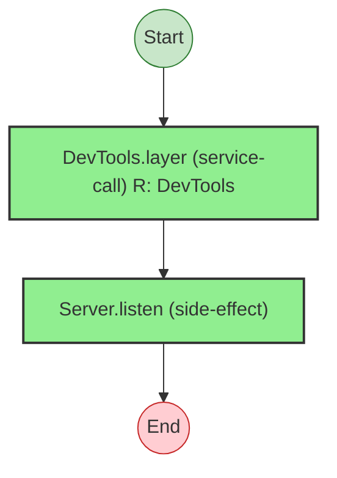

# Effect Analysis: devProgram

## Metadata

- **File**: `/Users/jreehal/dev/node-examples/effect-analyzer/packages/effect-analyzer/src/__fixtures__/devtools-pattern.ts`
- **Analyzed**: 2026-05-22T16:10:31.072Z
- **Source Type**: generator
- **TypeScript Version**: 6.0.2


## Effect Flow




## Statistics

- **Total Effects**: 2


## Explanation

```
devProgram (generator):
  1. Calls DevTools.layer — service-call
  2. Calls Server.listen — devtools

  Services required: DevTools, Server.listen
  Concurrency: sequential (no parallelism)
```


## Dependencies

- `DevTools`: DevTools
- `Server.listen`

