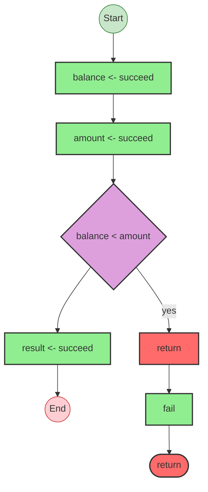

# Effect Analysis: earlyReturnFail

## Metadata

- **File**: `/Users/jreehal/dev/node-examples/effect-analyzer/packages/effect-analyzer/src/__fixtures__/early-return-fail.ts`
- **Analyzed**: 2026-05-22T16:10:31.822Z
- **Source Type**: generator
- **TypeScript Version**: 6.0.2


## Effect Flow




## Statistics

- **Total Effects**: 4


## Explanation

```
earlyReturnFail (generator):
  1. Yields balance <- succeed
  2. Yields amount <- succeed
  3. If balance < amount:
    Returns:
      Calls fail — constructor
  4. Yields result <- succeed

  Error paths: InsufficientFundsError
  Concurrency: sequential (no parallelism)
```


## Error Types

- `InsufficientFundsError`

