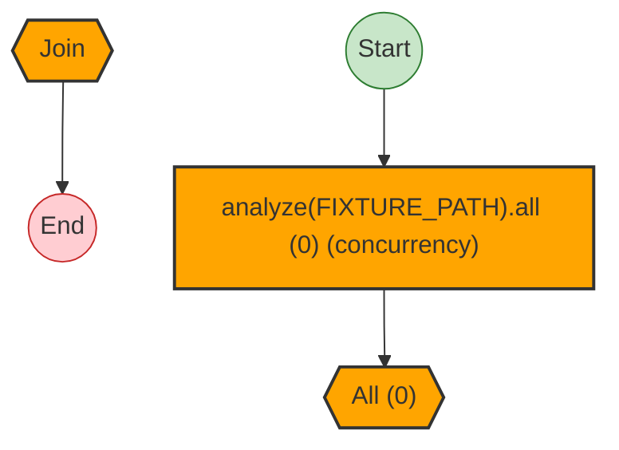
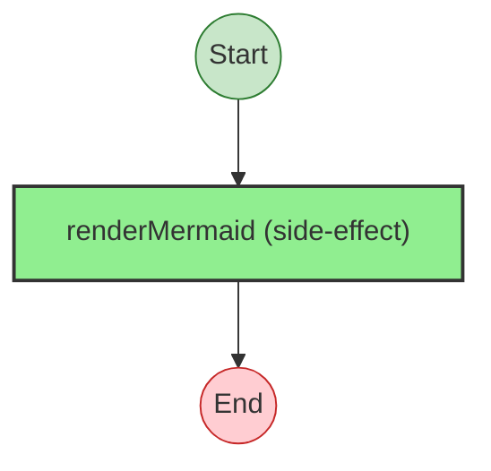

# Effect Analysis: results

## Metadata

- **File**: `/Users/jreehal/dev/node-examples/effect-analyzer/packages/effect-analyzer/src/__fixtures__/early-return-fail.test.ts`
- **Analyzed**: 2026-05-22T16:10:31.748Z
- **Source Type**: run
- **TypeScript Version**: 6.0.2


## Effect Flow




## Statistics

- **Parallel Operations**: 1


## Explanation

```
results (run):
  1. Runs 0 effects in sequential:

  Concurrency: uses parallelism / racing
```


---

# Effect Analysis: mermaid

## Metadata

- **File**: `/Users/jreehal/dev/node-examples/effect-analyzer/packages/effect-analyzer/src/__fixtures__/early-return-fail.test.ts`
- **Analyzed**: 2026-05-22T16:10:31.751Z
- **Source Type**: run
- **TypeScript Version**: 6.0.2


## Effect Flow




## Statistics

- **Total Effects**: 1


## Explanation

```
mermaid (run):
  1. Calls renderMermaid

  Concurrency: sequential (no parallelism)
```

