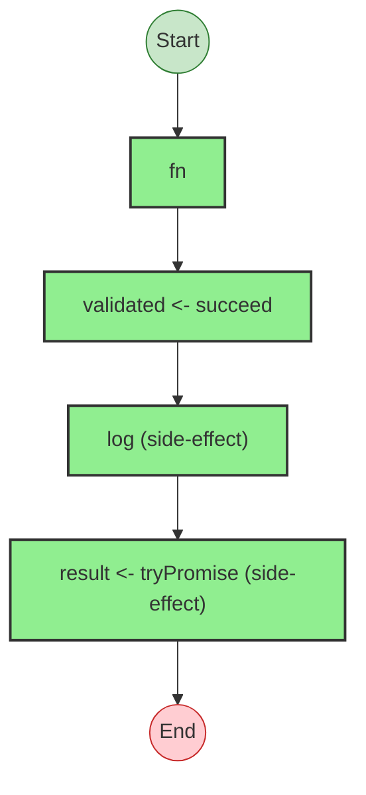
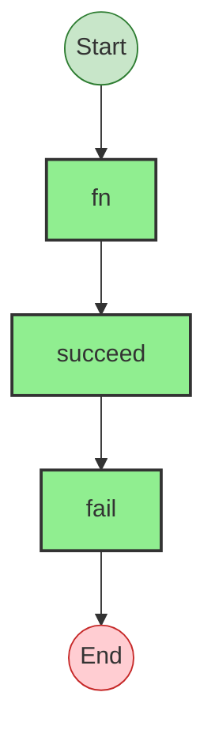

# Effect Analysis: processOrder

## Metadata

- **File**: `/Users/jreehal/dev/node-examples/effect-analyzer/packages/effect-analyzer/src/__fixtures__/effect-fn-toplevel.ts`
- **Analyzed**: 2026-05-22T16:10:31.900Z
- **Source Type**: direct
- **TypeScript Version**: 6.0.2


## Effect Flow




## Statistics

- **Total Effects**: 4


## Explanation

```
processOrder (direct):
  1. Yields validated <- succeed
  2. Calls log
  3. Yields result <- tryPromise

  Error paths: UnknownException
  Concurrency: sequential (no parallelism)
```


## Error Types

- `UnknownException`


---

# Effect Analysis: fetchUser

## Metadata

- **File**: `/Users/jreehal/dev/node-examples/effect-analyzer/packages/effect-analyzer/src/__fixtures__/effect-fn-toplevel.ts`
- **Analyzed**: 2026-05-22T16:10:31.902Z
- **Source Type**: direct
- **TypeScript Version**: 6.0.2


## Effect Flow




## Statistics

- **Total Effects**: 3


## Explanation

```
fetchUser (direct):
  1. Calls succeed — constructor
  2. Calls fail — constructor

  Error paths: string
  Concurrency: sequential (no parallelism)
```


## Error Types

- `string`

