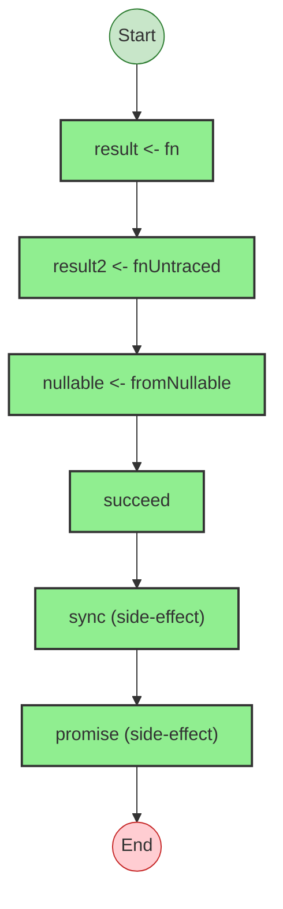

# Effect Analysis: program

## Metadata

- **File**: `/Users/jreehal/dev/node-examples/effect-analyzer/packages/effect-analyzer/src/__fixtures__/effect-fn.ts`
- **Analyzed**: 2026-05-22T16:10:31.977Z
- **Source Type**: generator
- **TypeScript Version**: 6.0.2


## Effect Flow




## Statistics

- **Total Effects**: 6


## Explanation

```
program (generator):
  1. Yields nullable <- fromNullable
  2. Calls succeed — constructor
  3. Calls sync — constructor
  4. Calls promise — constructor

  Error paths: NoSuchElementException, any
  Concurrency: sequential (no parallelism)
```


## Error Types

- `NoSuchElementException`
- `any`

